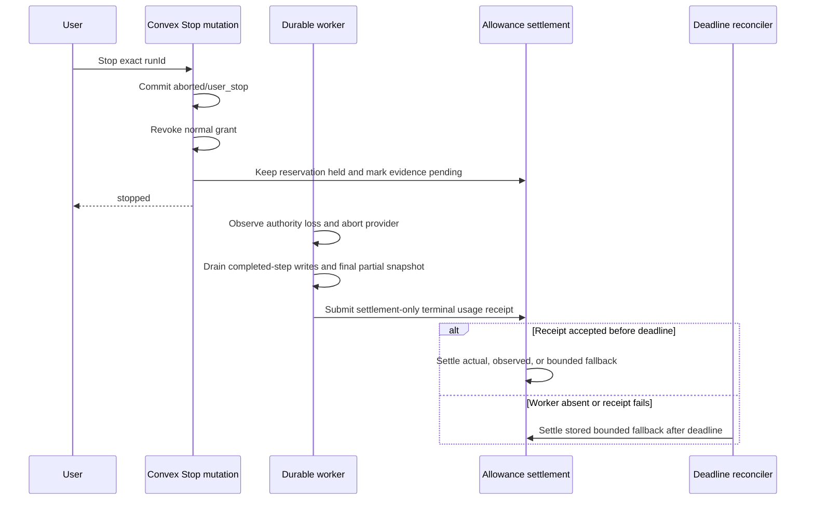

# Cancellation-aware platform usage settlement

> **Status:** Approved implementation plan
> **Date:** 2026-08-28
> **Scope:** Platform-funded durable chat turns only
> **Required architecture update:** Amend
> [ADR-0021](../adr/0021-platform-usage-allowance.md) before changing runtime
> behavior.

## 1. Executive implementation decision

Keep worst-case reservations for admission control, but stop treating an
unknown cancellation as proof that the entire reservation was consumed.

For a user Stop or supersession:

1. Mark the run visibly terminal immediately and revoke its normal worker
   authority exactly as today.
2. Keep its allowance reservation held for a bounded cancellation-evidence
   window instead of settling it in the Stop transaction.
3. Let the same worker secret authorize one narrowly scoped terminal-usage
   receipt through a separate, short-lived settlement-only digest.
4. Settle from provider-reported usage when available, completed-step usage
   otherwise, then a deterministic input-plus-partial-output fallback.
5. If the worker never reports, finalize the same fallback from durable facts
   after the evidence deadline.

The visible run remains `aborted` throughout. This is an accounting lifecycle
change, not a new user-facing run state.

## 2. Goals

1. A first-step Stop with no provider usage must no longer consume the full
   output reservation.
2. A Stop must still charge work the provider almost certainly billed:
   estimated input, completed-step usage, and persisted partial output.
3. Provider-reported usage must remain authoritative whenever it arrives before
   the evidence deadline.
4. Title generation must settle independently from answer generation.
5. Stop must continue to revoke all normal post-terminal worker writes.
6. Every reservation must converge to `settled` or `released`, including worker
   loss, deployment races, and deleted run records.
7. The bucket invariant and append-only ledger must remain exact and
   idempotent.
8. Completed turns, approval pauses, BYOK turns, and anonymous turns must retain
   their current behavior.

## 3. Non-goals

- Do not add a visible `stopping` or accounting-pending state.
- Do not move generation into Trigger.dev, Temporal, a queue, or another job
  system.
- Do not introduce provider invoice ingestion or delayed webhook billing.
- Do not add a tokenizer dependency solely for this change. Use one documented,
  centralized fallback estimator until exact provider usage is available.
- Do not redesign purchased overages, plans, abuse counters, or BYOK billing.
- Do not let late usage mutate a finalized charge. First finalization remains
  authoritative; conflicting late evidence is logged and ignored.
- Do not weaken grant revocation, lifecycle status guards, signed reservation
  proofs, or immutable pricing snapshots.

## 4. Existing behavior and root cause

### Current accounting behavior

`settleUsageForTerminalRun` currently follows this final branch:

- release if `workStartedAt` is absent;
- release an immediate provider error with no accepted checkpoint;
- otherwise charge `reservation.reservedCredits` with
  `estimated_after_unknown_usage`.

That branch is in
[`convex/usageAllowance.ts`](../../convex/usageAllowance.ts), and is explicitly
documented in ADR-0021's provider-boundary table.

The reservation deliberately includes a large output ceiling. It is appropriate
for concurrent admission control, but it is not evidence of final spend.

### Why Stop reaches the maximum-estimate branch

1. `stopGenerationRunForChat` commits `aborted/user_stop` immediately.
2. `applyLifecycleVerdict` settles the reservation in that same transaction.
3. The user's Stop carries no usage evidence by design.
4. The Stop also revokes the normal execution grant.
5. The worker subsequently observes authority loss, aborts the provider, and
   reaches AI SDK `onAbort` too late to amend the already-final settlement.
6. AI SDK `onAbort` exposes only previously finished steps. A first-step abort
   can therefore have no provider usage even when the prompt was dispatched.

### Independent title race

Title generation starts alongside answer generation and shares the execution
abort signal. Today, an unknown title result is charged at the entire title
estimate. The implementation must distinguish:

- title not requested or not started;
- title attempt started but no final usage arrived;
- title completed with route-aware usage;
- title route returned 404 and the primary-route fallback started.

## 5. Primary-source references

Use these as design evidence, not code to copy wholesale.

### Trigger.dev: visible cancellation before execution finality

- [`cancelRun`](https://github.com/triggerdotdev/trigger.dev/blob/9d3fedd7c5be1d3b89189da9f20e4d75136629be/internal-packages/run-engine/src/engine/systems/runAttemptSystem.ts#L1340-L1523)
  marks the task run canceled immediately while an executing snapshot becomes
  `PENDING_CANCEL` and the worker is notified.
- Its
  [cancellation test](https://github.com/triggerdotdev/trigger.dev/blob/9d3fedd7c5be1d3b89189da9f20e4d75136629be/internal-packages/run-engine/src/engine/tests/cancelling.test.ts#L399-L432)
  proves the UI-visible status can be terminal while execution awaits worker
  acknowledgement.
- Its
  [heartbeat timeout test](https://github.com/triggerdotdev/trigger.dev/blob/9d3fedd7c5be1d3b89189da9f20e4d75136629be/internal-packages/run-engine/src/engine/tests/heartbeats.test.ts#L472-L487)
  provides the missing-worker convergence pattern.

Trigger.dev meters owned compute duration, not provider tokens. Reuse its
cancellation acknowledgement shape, not its billing formula.

### LiteLLM: reserve maximum, reconcile cancellation to incurred cost

- [`reserve_budget_for_request`](https://github.com/BerriAI/litellm/blob/ca0b951a430171d4dce86679a8a1cfc86bf0c3c9/litellm/proxy/spend_tracking/budget_reservation.py#L153-L271)
  reserves a maximum request cost before dispatch.
- [`release_budget_reservation_on_cancel`](https://github.com/BerriAI/litellm/blob/ca0b951a430171d4dce86679a8a1cfc86bf0c3c9/litellm/proxy/spend_tracking/budget_reservation.py#L300-L330)
  reconciles a pre-output cancellation to input cost rather than zero or the
  maximum output reservation.
- Its
  [cancellation tests](https://github.com/BerriAI/litellm/blob/ca0b951a430171d4dce86679a8a1cfc86bf0c3c9/tests/test_litellm/proxy/test_budget_reservation.py#L2269-L2475)
  pin input-cost settlement before a delivered chunk and leave accounting open
  when output has been delivered and the normal cost callback may still arrive.

This is the closest reserve-then-settle reference for this change.

### LibreChat: partial-output fallback

LibreChat's
[abort middleware](https://github.com/danny-avila/LibreChat/blob/6d499ba3ce17f906a7762429c61018f230ecd64e/api/server/middleware/abortMiddleware.js#L126-L173)
uses collected provider usage when available and otherwise charges known prompt
tokens plus a token count of the partial response.

This supports a bounded persisted-output fallback, but its fallback does not
fully cover hidden reasoning or parallel side operations. Keep provider and
completed-step usage above it in the evidence order.

### Temporal: cooperative cancellation acknowledgement

Temporal documents that activity cancellation is delivered cooperatively
through heartbeats or an abort signal and may be delayed when the worker does
not heartbeat. See its
[TypeScript activity cancellation guidance](https://github.com/temporalio/documentation/blob/f086fb956d120f4c622276ef9d76c24a339c1c88/docs/develop/typescript/activities/timeouts.mdx#L88-L113).

This corroborates the need for a deadline-backed acknowledgement path.

### AI SDK 7: abort evidence boundary

AI SDK 7.0.73 defines `onAbort.steps` as
[previously finished steps only](https://github.com/vercel/ai/blob/eceb32a9ad5dabd4b76f1fcb284eeebf25aed192/packages/ai/src/generate-text/stream-text.ts#L278-L291).
Do not design around unavailable first-step provider usage.

## 6. Approach decision

This is billing and authorization work, so treat it as high risk.

### Option A: keep charging the full reservation

Rejected. It is safe for platform spend but incorrectly converts a worst-case
admission ceiling into final user spend.

### Option B: settle an input floor immediately in the Stop mutation

Rejected as the final architecture. It is simpler, but it permanently discards
completed-step usage, partial output, and title usage that the live worker can
still report moments later. The existing first-settlement-wins guard prevents a
later correction without creating a second financial mutation path.

### Option C: terminalize immediately, finalize accounting after evidence or a deadline

Chosen. It preserves immediate Stop UX and grant revocation while creating one
bounded, idempotent opportunity for worker evidence. The reservation remains
held, so concurrent admission stays fail-closed during the short uncertainty
window.

## 7. Required invariants

1. **Reservation is not spend.** `estimatedCredits` and `reservedCredits` remain
   admission facts only.
2. **Visible terminality is immediate.** User Stop still commits
   `aborted/user_stop` in its current mutation.
3. **Normal authority ends at Stop.** Snapshot, tool, heartbeat, approval, and
   lifecycle writes remain impossible after Stop.
4. **Settlement authority is capability-limited.** The stopped worker may only
   submit one terminal usage receipt for its exact run and reservation.
5. **Evidence order is deterministic.** Authoritative usage always beats
   estimates; estimates never get added on top of the same observed component.
6. **Fallbacks are capped.** Locally estimated cancellation cost never exceeds
   the original reservation. Provider-reported actual usage may still exceed it,
   preserving ADR-0021's honest-overrun behavior.
7. **Title is independent.** A title component is charged only from actual usage
   or explicit evidence that its provider attempt started.
8. **Deadline is final.** The first receipt or reaper settlement wins. Later
   conflicting evidence cannot rebill.
9. **Ledger remains append-only.** Exactly one `settle` or `release` event exists
   per reservation; no cancellation-specific mutable correction path is added.
10. **Bucket invariant always holds.** After every mutation:
    `available = granted - spent - reserved`.
11. **Legacy rows remain readable.** New schema fields are optional; old
    `estimated_after_unknown_usage` settlements remain valid historical facts.
12. **No secret exposure.** Store only digests, never bearer grants, API keys,
    prompts, message text, or title text in accounting logs.

## 8. Target lifecycle



The user-facing run never returns to an active state. Accounting pending is
represented only on the reservation.

## 9. Settlement policy

Apply evidence in this order for the primary generation:

| Evidence                                                             | Primary settlement                                                                          |
| -------------------------------------------------------------------- | ------------------------------------------------------------------------------------------- |
| Provider work definitely never began                                 | Release primary and any unstarted title component                                           |
| Authoritative aggregate usage                                        | Price aggregate usage at the pinned primary route                                           |
| Completed-step usage                                                 | Price the aggregate of completed steps; do not also add the run's duplicate per-step totals |
| Provider attempt began, no completed step, no persisted output       | Price `estimatedInputTokens` only                                                           |
| Provider attempt began and persisted partial assistant output exists | Price `estimatedInputTokens` plus estimated partial output tokens                           |
| Deadline expires with a missing run                                  | Use fallback facts copied onto the reservation before terminal cleanup                      |

Title settlement is separate:

| Title evidence                           | Title settlement                                                                              |
| ---------------------------------------- | --------------------------------------------------------------------------------------------- |
| No title requested or no attempt started | Zero                                                                                          |
| Route-aware actual usage                 | Price actual usage at the matching pinned title or primary route                              |
| Attempt started but usage is unknown     | Price `titleEstimatedInputTokens` at the attempted pinned route                               |
| Unknown or unpinned route identity       | Log and use the reserved title route's input floor, capped by the title reservation component |

Additional rules:

- `provider_error` before accepted provider work retains ADR-0021's current
  release behavior. Do not turn an immediate 400/401/429 into an input charge
  without evidence that the provider accepted billable work.
- `request_aborted` initiated by the worker carries evidence in its existing
  terminal write and can settle atomically. It does not require a pending
  window unless another actor already terminalized the run.
- `user_stop` and `superseded` use the pending-evidence window when the provider
  may have started.
- `lease_expired` has no live worker to acknowledge it. Settle immediately from
  durable completed-step and partial-output facts using the same fallback
  policy.
- `completed` and `awaiting_approval` keep their existing aggregate-usage path.
- BYOK and anonymous turns continue to have no reservation and structurally
  no-op.

## 10. Partial-output estimator

Create one pure, documented estimator shared by the live receipt and reaper.
It must:

1. Count assistant-generated text and reasoning characters.
2. Count assistant-generated tool-call names and serialized tool arguments.
3. Exclude tool results and user-provided content, which are not model output.
4. Use the repository's existing `chars / 4` heuristic and a small documented
   structural overhead rather than introducing a tokenizer dependency.
5. Normalize to a non-negative safe integer.
6. Cap estimated output tokens at the reservation's
   `estimatedOutputTokens`.
7. Store the terminal estimate on the reservation when Stop wins so message or
   run deletion cannot erase the fallback.
8. Let a later worker receipt replace the stored estimate with a larger final
   partial snapshot estimate, but never add both estimates together.

Extract the shared character/token constants from
[`lib/usage/platform-usage-estimate.ts`](../../lib/usage/platform-usage-estimate.ts)
instead of creating a second approximation vocabulary.

## 11. Data model and types

All new production fields are optional for expand/contract compatibility.

### `usageReservations`

Add:

| Field                                    | Purpose                                                                        |
| ---------------------------------------- | ------------------------------------------------------------------------------ |
| `titleEstimatedInputTokens?: number`     | Input-only title floor pinned at reservation time                              |
| `terminalPendingAt?: number`             | Audit timestamp for deferred terminal accounting                               |
| `settlementDeadlineAt?: number`          | Deadline after which the reaper owns finalization                              |
| `terminalEstimatedOutputTokens?: number` | Durable partial-output fallback captured when terminality wins                 |
| `settlementGrantDigest?: string`         | Digest of the existing worker secret, valid only for terminal usage submission |
| `settlementGrantExpiresAt?: number`      | Hard authorization deadline equal to the evidence deadline                     |
| `providerMayHaveStarted?: boolean`       | Durable fallback discriminator copied before run cleanup                       |
| `titleSettlementBasis?: string`          | Auditable `actual`, `input_floor`, or `not_run` title basis                    |

Keep reservation `status: "reserved"` while evidence is pending. This accurately
keeps the amount in `bucket.reservedCredits` and avoids adding a fourth balance
state.

Add an index suitable for bounded deadline reconciliation:

```text
usageReservations.by_status_settlement_deadline = [status, settlementDeadlineAt]
```

Convex indexes missing optional fields as `undefined`. Deadline scans must
explicitly exclude them with the repository's established
`.gt("settlementDeadlineAt", undefined)` pattern before applying the upper
bound.

### Settlement basis

Retain existing literals for historical documents and add precise new primary
bases:

- `estimated_input_floor`
- `estimated_input_with_partial_output`

`observed_partial` remains reserved for provider-reported completed-step usage,
not locally counted text. `estimated_after_unknown_usage` remains readable for
legacy rows but must not be written for new `user_stop` or `superseded`
settlements.

Persist the title basis separately to avoid a combinatorial top-level enum such
as actual-primary-plus-title-input-floor.

### Reservation authorization payload

`titleEstimatedInputTokens` changes an HMAC-covered public mutation payload.
Update all of these together:

- `convex/lib/usageValidators.ts`
- `convex/domain/usage_accounting.ts`
- `convex/lib/usageReservationAuthorization.ts`
- `lib/model-route-resolver.ts`
- signed proof tests and fingerprint tests

Use a versioned proof/fingerprint expansion. The first Convex deployment must
accept both the existing payload and the new optional field before the Next
server starts sending it. Do not create a deployment window where an old server
cannot call the newly deployed mutation or a new server cannot call the old
one.

### Title input estimate

Move title prompt-shape constants needed for estimation into a pure module with
no AI SDK dependency. Both
[`lib/chat-title.ts`](../../lib/chat-title.ts) and the platform estimator must
consume that source of truth. Include clipped user text, fixed instructions,
prompt tags, and documented message overhead in the input estimate.

## 12. Settlement-only worker authorization

The current Stop path clears `generationRuns.grantDigest`, and that security
behavior must remain.

When a Stop or supersession wins while a platform reservation still needs
evidence:

1. Copy the current run's grant digest to
   `usageReservations.settlementGrantDigest` in the same Convex transaction.
2. Set a bounded `settlementGrantExpiresAt` derived from the existing execution
   budget and settlement reserve. It must equal `settlementDeadlineAt`, so the
   worker remains authorized for the complete evidence window. Do not introduce
   an unrelated long TTL.
3. Clear the normal run grant as today.
4. Add one worker-wire operation, for example `finalizeTerminalUsage`, that
   authenticates the bearer token against the reservation's settlement digest.
5. Require exact run-to-reservation linkage, terminal run status, an allowed
   terminal reason, `status === "reserved"`, and a live evidence deadline.
6. Allow this operation to settle or release allowance only. It must not patch
   messages, runs, chats, tools, approvals, leases, or grants.
7. Clear the settlement digest and grant-expiry field when settlement or
   release finalizes. Retain pending/deadline timestamps as audit facts.
8. Reject wrong-run, wrong-reservation, expired, already-finalized, malformed,
   and replayed submissions without changing balances.

The endpoint may receive the same raw worker secret already held by the worker;
only its digest is persisted. Route the new operation explicitly rather than
widening the authority of existing worker operations.

## 13. Terminal usage evidence contract

Define a discriminated, grant-authorized payload. Avoid ambiguous objects where
missing numeric fields silently mean multiple things.

Suggested domain shape:

```ts
type PrimaryTerminalUsageEvidence =
  | { kind: "not-started" }
  | {
      kind: "actual"
      inputTokens?: number
      outputTokens?: number
    }
  | {
      kind: "completed-steps"
      inputTokens?: number
      outputTokens?: number
      partialOutputTokens?: number
    }
  | {
      kind: "started-without-usage"
      partialOutputTokens?: number
    }

type TitleTerminalUsageEvidence =
  | { kind: "not-run" }
  | {
      kind: "actual"
      routeId: string
      pricingRole: "title" | "primary"
      inputTokens?: number
      outputTokens?: number
    }
  | {
      kind: "started-without-usage"
      routeId: string
      pricingRole: "title" | "primary"
    }
```

Validate every token count as a non-negative safe integer. Ignore `totalTokens`
for pricing because the pinned model distinguishes input and output rates.

The settlement helper must accept one normalized domain structure from both the
live worker receipt and the reaper. Do not maintain two subtly different
billing decision trees.

## 14. Runtime evidence collection

### Primary answer

Update AI SDK `onAbort` to consume its `{ steps }` argument.

1. Aggregate usage from finished steps once.
2. Continue draining `stepWritePromises`; the receipt is a recovery channel if
   one of those writes did not land, not an additional charge.
3. Flush the latest durable assistant snapshot before estimating partial
   output.
4. Classify a zero-step abort as `started-without-usage`, unless the runtime can
   prove the provider call never started.
5. Submit terminal evidence with the normal aborted terminal write.
6. If that write reports `settled-elsewhere`, attempt the settlement-only
   terminal usage operation. That operation safely no-ops unless a matching
   Stop/supersession left accounting pending.

Do not infer zero usage from an empty `steps` array.

### Title

Track the title attempt independently in request-local state:

1. `not-run` initially.
2. Record route id and pricing role immediately before each concrete
   `generateText` attempt.
3. Replace that state with route-aware actual usage when the attempt completes.
4. If the initial title route returns 404 and fallback begins, update the state
   to the primary fallback route before dispatch.
5. On abort, report actual usage if completed, otherwise
   `started-without-usage` for the last attempted pinned route.

Avoid a temporal-dead-zone dependency between the answer stream's `onAbort`
closure and the later-created `titleTask`. Create a small request-local evidence
tracker before constructing `streamText`, then let both answer and title paths
update it.

### Durable runtime

Extend terminal write facts through the existing layers rather than creating a
parallel runtime:

- `app/api/chat/chat-turn-runtime.ts`
- `app/api/chat/durable-turn-runtime.ts`
- `convex/http.ts`
- `convex/chatRuntimeWorker.ts`
- shared handlers in `convex/chatRuntime.ts`

The worker should try the receipt once through the existing bounded settlement
write machinery. The deadline reconciler is the retry/failure backstop; do not
create an unbounded request tail.

## 15. Convex transaction changes

### User Stop and supersession

Refactor the lifecycle accounting hook so terminal state and allowance
finalization are no longer unconditionally coupled for cancellation-like
transitions.

- Default behavior remains immediate settlement.
- `user_stop` and a live-worker `superseded` transition request
  `defer-terminal-usage` when provider work may have started.
- Release immediately only when provider work structurally could not have
  begun, such as an unattached reservation or a queued run that never crossed
  the execution boundary. `workStartedAt` is best-effort and its absence alone
  is not sufficient for an executing run.
- If the reservation was already settled, such as an approval pause, do
  nothing.
- The same transaction that marks the run terminal must seed the reservation's
  pending timestamp, deadline, settlement digest, `providerMayHaveStarted`, and
  stored partial-output fallback.
- The transaction must continue denying approvals and terminalizing active tool
  invocations exactly as today.

Do not make user-callable Stop accept usage fields.

### Worker terminal write

Extend `markGenerationRunAborted` with normalized terminal usage evidence.

- If the worker still owns an active run, terminalize and settle atomically.
- If Stop already won, normal grant authorization remains rejected; the runtime
  follows with `finalizeTerminalUsage` using settlement-only authorization.
- Duplicate abort/envelope terminal signals remain benign and cannot produce a
  second ledger entry.

### Deadline reconciler

Add a bounded pass over due pending reservations.

1. Query `reserved` rows with a defined `settlementDeadlineAt <= now`.
2. Re-read reservation and linked run inside the mutation.
3. Settle through the same normalized helper used by the worker receipt.
4. Use stored input, partial-output, and title-start facts when the run or
   message disappeared.
5. Clear settlement-only authorization.
6. Emit one structured timeout event.

Run it on a second-level cadence compatible with the existing durable-run
reaper. A due reservation must converge within at most two cron intervals under
normal operation. Keep the existing 30-minute stale-reservation reconciler as
the final deployment/crash net for unattached and legacy rows.

## 16. Ordered implementation phases

### Phase 1: ADR and pure accounting policy

1. Amend ADR-0021:
   - distinguish admission reservation from cancellation settlement;
   - document visible terminality versus accounting finality;
   - replace the full-estimate unknown Stop row in the boundary table;
   - document settlement-only authorization and deadline finality;
   - document title input-floor handling.
2. Add pure terminal evidence types and settlement calculation helpers.
3. Add partial-output and title-input estimators.
4. Add focused pure tests before wiring mutations.

No behavior should change in this phase.

### Phase 2: Expand schema and signed reservation payload

1. Add optional reservation fields and the deadline index.
2. Add new settlement-basis validators while preserving legacy literals.
3. Add `titleEstimatedInputTokens` to the estimate, fingerprint, proof, and
   reservation record.
4. Implement dual-version authorization acceptance for rollout safety.
5. Update schema, fingerprint, tampering, replay, and authorization tests.

Do not switch Stop to deferred settlement yet.

### Phase 3: Settlement-only worker operation

1. Add explicit worker-wire routing and validators.
2. Implement constant-time settlement-digest verification.
3. Implement exact run/reservation/deadline/status linkage checks.
4. Call the shared pure settlement decision and existing ledger mutation
   primitives.
5. Add rejection, replay, expiry, and wrong-run tests.

The operation remains dormant until a reservation is marked pending.

### Phase 4: Runtime evidence collection

1. Consume AI SDK `onAbort.steps`.
2. Add the request-local primary/title evidence tracker.
3. Extend aborted terminal facts through the existing durable runtime.
4. On `settled-elsewhere`, attempt settlement-only finalization.
5. Verify step-write draining still precedes terminal usage calculation.
6. Verify title fallback route identity remains pinned correctly.

### Phase 5: Switch cancellation paths and add deadline reconciliation

1. Change user Stop and live-worker supersession to mark accounting pending.
2. Preserve immediate run/message/chat terminal state and normal grant
   revocation.
3. Seed stored fallback facts transactionally.
4. Add the bounded due-settlement reconciler and cron.
5. Update the stale reconciler so legacy rows keep legacy behavior while new
   pending rows use the new deadline path.

### Phase 6: Observability, integration tests, and cleanup

1. Add structured events listed below.
2. Replace tests that pin full-estimate Stop charging with the approved policy.
3. Run cross-layer race tests.
4. After the old Next version is no longer active, remove legacy proof
   acceptance only if rollback no longer needs it.
5. Keep legacy schema literals readable indefinitely unless a separately
   approved cleanup proves production compatibility.

## 17. Test plan

### Pure accounting tests

- exact aggregate usage beats all estimates;
- completed-step usage is not double-counted with persisted run totals;
- first-step unknown usage charges input only;
- persisted text/reasoning adds bounded output tokens;
- tool call arguments count, tool results do not;
- fallback output is capped by estimated output;
- total fallback credits are capped by reserved credits;
- provider-reported actual may exceed reservation;
- title `not-run` charges zero;
- title actual usage uses the concrete pinned route;
- title started-without-usage charges input only;
- unpinned title identity logs and falls back to the pinned title input floor;
- malformed and negative token counts are rejected.

### Convex allowance tests

- Stop before work starts releases immediately;
- Stop after work starts commits `aborted/user_stop` while reservation remains
  held and pending;
- pending reservation continues blocking concurrent overspend;
- worker receipt settles actual usage and releases unused reservation;
- first-step receipt settles `estimated_input_floor`, not
  `estimated_after_unknown_usage`;
- partial-output receipt settles
  `estimated_input_with_partial_output`;
- deadline reaper produces the same result as the equivalent live receipt;
- missing run/message still settles from copied reservation facts;
- duplicate receipt and receipt/reaper races create exactly one ledger entry;
- late conflicting evidence is logged and cannot rebill;
- balance invariant holds after every case;
- approval-pause reservation is already settled and Stop does not reopen it;
- BYOK and anonymous Stop remain accounting no-ops.

### Authorization tests

- Stop clears normal grant authority;
- the old worker secret cannot write snapshots, tools, approvals, heartbeats, or
  lifecycle state after Stop;
- the same secret can authorize only the exact pending terminal usage receipt;
- settlement authority cannot target another run or reservation;
- expired settlement authority is rejected;
- settled/released reservations reject replay;
- no raw grant or prompt appears in logs;
- new signed reservation field is covered by tamper tests;
- old and new proof versions work only during the documented expansion window.

### Runtime tests

- `onAbort` with zero finished steps submits started-without-usage, never zero
  actual usage;
- `onAbort` aggregates finished-step usage once;
- pending step writes drain before receipt submission;
- a user Stop that wins before worker abort follows
  terminal-write-rejected -> settlement-only receipt;
- receipt failure still allows response shutdown and later reaper convergence;
- title not requested, title actual, title canceled, and title fallback route
  each produce the correct evidence shape;
- envelope abort plus stream abort remains idempotent;
- completed, failed, approval, reload, and worker-loss paths retain existing
  terminal receipts.

### Existing focused suites to update/run

- `convex/domain/usage_accounting.test.ts`
- `convex/lib/usageReservationAuthorization.test.ts`
- `lib/usage/platform-usage-estimate.test.ts` or the existing billable pricing
  suite that owns these assertions
- `convex/usageAllowance.test.ts`
- `convex/chatRuntime.test.ts`
- `app/api/chat/durable-turn-runtime.test.ts`
- `app/api/chat/chat-turn-runtime.test.ts`
- worker HTTP routing/authentication tests

## 18. Observability

Add concise structured events without message content or secrets:

- `usage_terminal_settlement_pending`
  - run id, reservation id, terminal reason, deadline, stored fallback token
    counts;
- `usage_terminal_evidence_accepted`
  - primary basis, title basis, final credits, evidence latency;
- `usage_terminal_evidence_rejected`
  - safe reason enum only;
- `usage_terminal_evidence_timed_out`
  - fallback bases and final credits;
- `usage_terminal_late_evidence_ignored`
  - stored basis versus incoming evidence kind;
- `usage_terminal_fallback_capped`
  - uncapped versus reserved credits, with no prompt/output content.

Operational checks after deployment:

1. New `user_stop` rows stop writing `estimated_after_unknown_usage`.
2. Pending reservations drain by their deadlines.
3. Receipt rejection rates remain near zero outside deliberate race tests.
4. No increase appears in post-Stop normal worker writes or repeated 401 storms.
5. Bucket fold/audit checks remain clean.

## 19. Rollout and rollback

### Expand

1. Deploy optional schema fields, new validators, dual proof acceptance, dormant
   settlement operation, and deadline reconciler.
2. Confirm old callers still reserve and settle normally.
3. Deploy the Next worker that sends the new proof field and terminal evidence.
4. Confirm receipt observability before enabling deferred Stop settlement.

### Activate

Switch Stop/supersession to pending settlement only after both the settlement
operation and deadline reaper are live. Never deploy a state that can create
pending reservations without a compatible finalizer.

### Contract

Remove old proof acceptance only after the old server build cannot return and
all rollback procedures target a compatible build. Keep legacy document fields
and settlement literals readable.

### Rollback

Rollback in reverse behavior order:

1. Stop creating new pending settlements while leaving the receipt endpoint and
   deadline reconciler active.
2. Wait for or explicitly reconcile existing pending rows.
3. Roll back runtime evidence plumbing if necessary.
4. Do not remove schema fields, the receipt handler, or deadline reconciliation
   while pending rows exist.

Rolling directly back to code that knows only the 30-minute full-estimate stale
fallback would overcharge pending cancellations and is not an acceptable
rollback.

## 20. Validation commands

Run the smallest suites while iterating, then the repository's standard
verification because this touches billing and authorization:

```bash
bun run test -- convex/domain/usage_accounting.test.ts
bun run test -- convex/lib/usageReservationAuthorization.test.ts
bun run test -- convex/usageAllowance.test.ts
bun run test -- convex/chatRuntime.test.ts
bun run test -- app/api/chat/durable-turn-runtime.test.ts
bun run test -- app/api/chat/chat-turn-runtime.test.ts
bun run typecheck
bun run lint
bun run test
bun run build:next
git diff --check
```

Never run `bun run build`; in this repository it deploys production Convex.

No browser QA is required unless implementation unexpectedly changes visible
presentation. The intended visual impact is none.

## 21. Expected file map

| Area                      | Expected files                                                                          |
| ------------------------- | --------------------------------------------------------------------------------------- |
| Architecture              | `docs/adr/0021-platform-usage-allowance.md`                                             |
| Accounting types/math     | `convex/domain/usage_accounting.ts`, tests                                              |
| Validators/schema         | `convex/lib/usageValidators.ts`, `convex/schema.ts`                                     |
| Reservation proof         | `convex/lib/usageReservationAuthorization.ts`, tests                                    |
| Estimation                | `lib/usage/platform-usage-estimate.ts`, new pure partial/title estimator modules, tests |
| Reservation/settlement    | `convex/usageAllowance.ts`, tests                                                       |
| Lifecycle transaction     | `convex/chatRuntime.ts`, tests                                                          |
| Worker authorization      | `convex/chatRuntimeWorker.ts`, `convex/http.ts`, worker endpoint tests                  |
| Runtime evidence          | `app/api/chat/chat-turn-runtime.ts`, `app/api/chat/durable-turn-runtime.ts`, tests      |
| Title attempt tracking    | `lib/chat-title.ts`, title tests                                                        |
| Scheduling                | `convex/crons.ts`                                                                       |
| Route reservation payload | `lib/model-route-resolver.ts`, tests                                                    |

Extend existing owners. Do not create a second allowance service, cancellation
runtime, or ledger.

## 22. Definition of success

The implementation is complete only when all of the following are true:

### User and product behavior

- Pressing Stop still produces the existing immediate aborted presentation.
- No new spinner, status copy, settings row, or accounting-pending UI appears.
- A first-step Stop with no output charges an input floor rather than the full
  reservation.
- A Stop after partial output charges completed usage or a bounded estimate of
  the partial output.
- Title charges reflect actual usage, an explicit started input floor, or zero
  when not run.

### Accounting correctness

- Worst-case output remains reserved before provider execution.
- Every new cancellation settlement records an explainable primary and title
  basis.
- New `user_stop` and `superseded` rows never use
  `estimated_after_unknown_usage`.
- Actual provider usage remains authoritative and may honestly exceed the
  reservation.
- Locally estimated fallback never exceeds the reservation.
- Exactly one settle/release ledger event exists per reservation.
- Materialized bucket balances equal their ledger fold.

### Security and durability

- Normal worker authority is revoked in the Stop transaction.
- Settlement-only authority can perform no operation except exact-run terminal
  usage finalization.
- A crashed worker cannot strand a reservation beyond its deadline plus two
  normal reconciliation intervals.
- Receipt/reaper, Stop/abort, envelope/onAbort, and duplicate-delivery races are
  idempotent.
- Rolling deploy and rollback compatibility are proven by tests.

### Regression safety

- Completed, failed, approval-paused, lease-expired, BYOK, and anonymous paths
  retain their intended behavior.
- Existing durable content preservation and Stop convergence tests remain
  green.
- Focused tests, typecheck, lint, full tests, `build:next`, and
  `git diff --check` pass.

When these conditions hold, the original review feedback is fully resolved at
the root cause: reservation remains conservative for admission, while stopped
turns settle from the best available evidence instead of the maximum possible
output.
