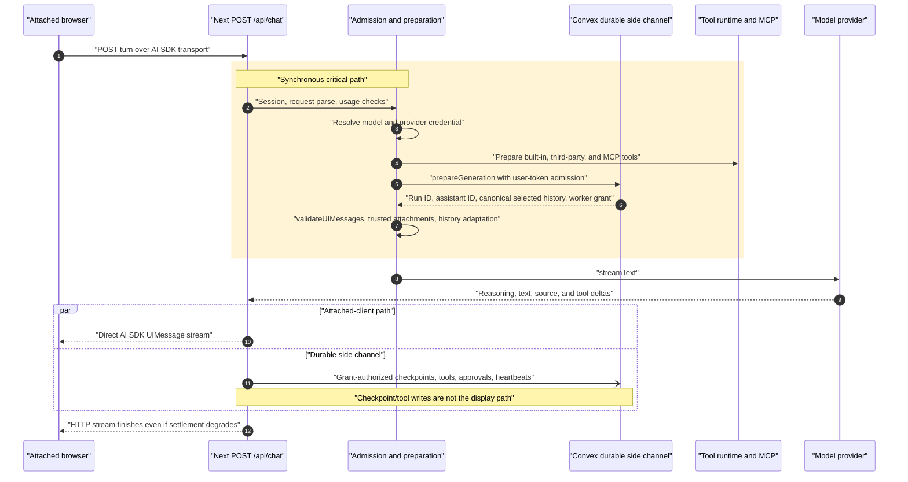
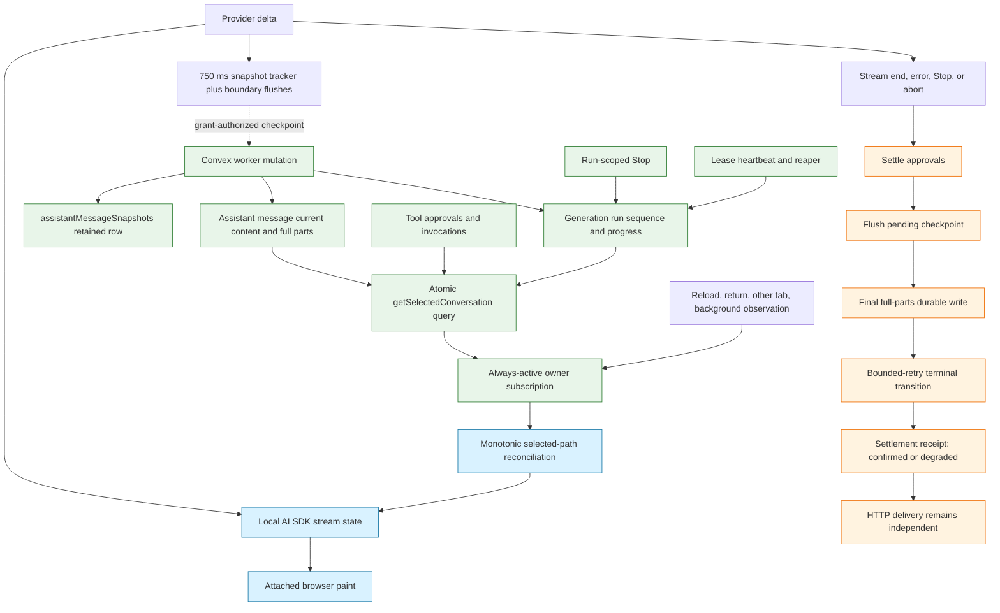
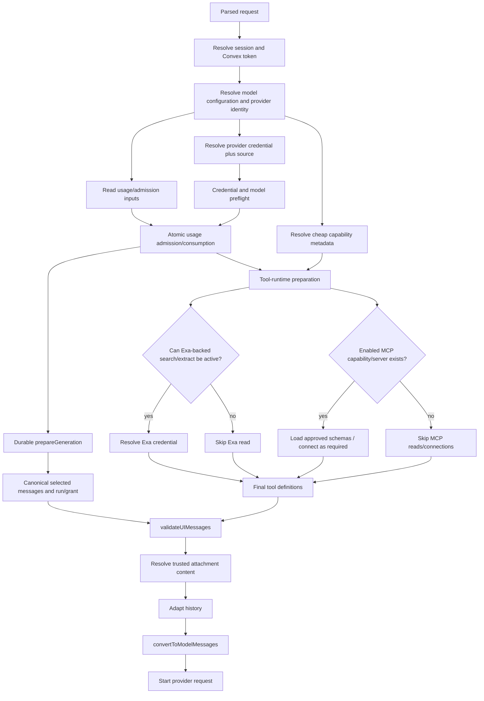

# Chat Responsiveness and Performance Implementation Plan

## 0. Document status

| Field           | Value                                                                                                                   |
| --------------- | ----------------------------------------------------------------------------------------------------------------------- |
| Status          | **Proposed**                                                                                                            |
| Reviewed commit | `d942ac9f23c844aef700332c5234581ee5ef1fb4`                                                                              |
| Review date     | 2026-07-22                                                                                                              |
| Attribution     | Codex planning agent, based on source inspection at the reviewed commit and the supplied independent benchmark findings |
| Scope           | AI chat responsiveness and performance; no implementation is authorized by this document alone                          |

Revised 2026-07-22 after an independent staff review at the same reviewed SHA: rollout-substrate corrections (correction 5 and section 9.2), PR 4 cache-status and SDK pinning-test fixes, PR 5/PR 7 accuracy scoping, and AGENTS.md ceremony reconciliation in PR 6.

This is a planning artifact. It does **not** approve application changes, schema changes, new dependencies, rollout, or removal of a feature flag. Each phase still requires normal review and, where this plan names an approval gate, explicit approval before implementation.

### Evidence vocabulary

- **Measured — independent micro-benchmark:** a number supplied with the refined findings. It is preserved here, but the underlying script, machine profile, warm-up policy, and raw samples are not present at the reviewed commit.
- **Source-inspected:** behavior verified in repository source or the installed dependency source at the reviewed commit.
- **Historical intent:** an ADR, gameplan, incident, or merged pull request. Historical text does not override current source.
- **Inferred:** a performance or operational consequence that follows from source structure but is not production telemetry.
- **Telemetry required:** a decision that must remain open until production-like measurement exists.

### Reviewed dependency versions

The declared ranges are in [`package.json` lines 30–90](https://github.com/darknightdesigner/not-a-wrapper/blob/d942ac9f23c844aef700332c5234581ee5ef1fb4/package.json#L30-L90); the resolved versions are from `bun.lock` at the reviewed commit.

| Package          |   Declared |  Resolved | Lock evidence                                                                                                                           |
| ---------------- | ---------: | --------: | --------------------------------------------------------------------------------------------------------------------------------------- |
| `ai`             |  `^7.0.22` |  `7.0.22` | [`bun.lock` line 852](https://github.com/darknightdesigner/not-a-wrapper/blob/d942ac9f23c844aef700332c5234581ee5ef1fb4/bun.lock#L852)   |
| `@ai-sdk/react`  |  `^4.0.23` |  `4.0.23` | [`bun.lock` line 116](https://github.com/darknightdesigner/not-a-wrapper/blob/d942ac9f23c844aef700332c5234581ee5ef1fb4/bun.lock#L116)   |
| `convex`         |  `^1.42.1` |  `1.42.1` | [`bun.lock` line 986](https://github.com/darknightdesigner/not-a-wrapper/blob/d942ac9f23c844aef700332c5234581ee5ef1fb4/bun.lock#L986)   |
| `react`          |  `^19.2.7` |  `19.2.7` | [`bun.lock` line 1754](https://github.com/darknightdesigner/not-a-wrapper/blob/d942ac9f23c844aef700332c5234581ee5ef1fb4/bun.lock#L1754) |
| `react-dom`      |  `^19.2.7` |  `19.2.7` | [`bun.lock` line 1758](https://github.com/darknightdesigner/not-a-wrapper/blob/d942ac9f23c844aef700332c5234581ee5ef1fb4/bun.lock#L1758) |
| `next`           | `^16.2.10` | `16.2.10` | [`bun.lock` line 1640](https://github.com/darknightdesigner/not-a-wrapper/blob/d942ac9f23c844aef700332c5234581ee5ef1fb4/bun.lock#L1640) |
| `shiki`          |   `^4.3.1` |   `4.3.1` | [`bun.lock` line 1868](https://github.com/darknightdesigner/not-a-wrapper/blob/d942ac9f23c844aef700332c5234581ee5ef1fb4/bun.lock#L1868) |
| `react-markdown` |  `^10.1.0` |  `10.1.0` | [`bun.lock` line 1764](https://github.com/darknightdesigner/not-a-wrapper/blob/d942ac9f23c844aef700332c5234581ee5ef1fb4/bun.lock#L1764) |
| `unified`        |  `^11.0.5` |  `11.0.5` | [`bun.lock` line 2030](https://github.com/darknightdesigner/not-a-wrapper/blob/d942ac9f23c844aef700332c5234581ee5ef1fb4/bun.lock#L2030) |
| `remark-parse`   |  `^11.0.0` |  `11.0.0` | [`bun.lock` line 1802](https://github.com/darknightdesigner/not-a-wrapper/blob/d942ac9f23c844aef700332c5234581ee5ef1fb4/bun.lock#L1802) |
| `remark-gfm`     |   `^4.0.1` |   `4.0.1` | [`bun.lock` line 1798](https://github.com/darknightdesigner/not-a-wrapper/blob/d942ac9f23c844aef700332c5234581ee5ef1fb4/bun.lock#L1798) |
| `remark-math`    |   `^6.0.0` |   `6.0.0` | [`bun.lock` line 1800](https://github.com/darknightdesigner/not-a-wrapper/blob/d942ac9f23c844aef700332c5234581ee5ef1fb4/bun.lock#L1800) |

### Related repository records

- Repository guidance: [`AGENTS.md` lines 9–58](https://github.com/darknightdesigner/not-a-wrapper/blob/d942ac9f23c844aef700332c5234581ee5ef1fb4/AGENTS.md#L9-L58), [lines 62–96](https://github.com/darknightdesigner/not-a-wrapper/blob/d942ac9f23c844aef700332c5234581ee5ef1fb4/AGENTS.md#L62-L96), and [lines 100–132](https://github.com/darknightdesigner/not-a-wrapper/blob/d942ac9f23c844aef700332c5234581ee5ef1fb4/AGENTS.md#L100-L132).
- Architecture terminology and ownership: [`CONTEXT.md` lines 25–71](https://github.com/darknightdesigner/not-a-wrapper/blob/d942ac9f23c844aef700332c5234581ee5ef1fb4/CONTEXT.md#L25-L71) and [lines 93–115](https://github.com/darknightdesigner/not-a-wrapper/blob/d942ac9f23c844aef700332c5234581ee5ef1fb4/CONTEXT.md#L93-L115).
- Current follow-ups: [`TODO.md` lines 3–22](https://github.com/darknightdesigner/not-a-wrapper/blob/d942ac9f23c844aef700332c5234581ee5ef1fb4/TODO.md#L3-L22); durable presentation rollout and automatic context management remain separate work.
- Selected-path authority: [ADR-0001](https://github.com/darknightdesigner/not-a-wrapper/blob/d942ac9f23c844aef700332c5234581ee5ef1fb4/docs/adr/0001-client-renders-server-selected-path.md).
- Bounded sidebar: [ADR-0005](https://github.com/darknightdesigner/not-a-wrapper/blob/d942ac9f23c844aef700332c5234581ee5ef1fb4/docs/adr/0005-bounded-chat-list-window.md).
- Request-scoped direct stream: [ADR-0006](https://github.com/darknightdesigner/not-a-wrapper/blob/d942ac9f23c844aef700332c5234581ee5ef1fb4/docs/adr/0006-chat-turn-runtime.md).
- No snapshot replay surface: [ADR-0008](https://github.com/darknightdesigner/not-a-wrapper/blob/d942ac9f23c844aef700332c5234581ee5ef1fb4/docs/adr/0008-no-stream-resume-read-surface.md).
- Durable runtime and HTTP trust boundary: [ADR-0009](https://github.com/darknightdesigner/not-a-wrapper/blob/d942ac9f23c844aef700332c5234581ee5ef1fb4/docs/adr/0009-durable-turn-runtime.md) and [ADR-0010](https://github.com/darknightdesigner/not-a-wrapper/blob/d942ac9f23c844aef700332c5234581ee5ef1fb4/docs/adr/0010-http-trust-boundary-hardening.md).
- Grant, settlement, and delivery independence: [ADR-0011](https://github.com/darknightdesigner/not-a-wrapper/blob/d942ac9f23c844aef700332c5234581ee5ef1fb4/docs/adr/0011-durable-turn-settlement.md).
- Atomic first turn and detachable streams: [ADR-0012](https://github.com/darknightdesigner/not-a-wrapper/blob/d942ac9f23c844aef700332c5234581ee5ef1fb4/docs/adr/0012-atomic-first-turn-creation.md) and [ADR-0013](https://github.com/darknightdesigner/not-a-wrapper/blob/d942ac9f23c844aef700332c5234581ee5ef1fb4/docs/adr/0013-back-navigation-detaches-the-stream.md).
- Durable-turn source of truth: [extension gameplan](https://github.com/darknightdesigner/not-a-wrapper/blob/d942ac9f23c844aef700332c5234581ee5ef1fb4/docs/gameplans/extend-the-existing-convex-native-durable-turn-architecture.md), [implementation notes](https://github.com/darknightdesigner/not-a-wrapper/blob/d942ac9f23c844aef700332c5234581ee5ef1fb4/docs/gameplans/durable-turn-implementation-notes-2026-07-19.md), and [2026-07-14 incident](https://github.com/darknightdesigner/not-a-wrapper/blob/d942ac9f23c844aef700332c5234581ee5ef1fb4/docs/chat-turn-token-expiry-orphaned-run-incident-2026-07-14.md).
- Historical pull requests: [#86](https://github.com/darknightdesigner/not-a-wrapper/pull/86), [#111](https://github.com/darknightdesigner/not-a-wrapper/pull/111), [#121](https://github.com/darknightdesigner/not-a-wrapper/pull/121), [#122](https://github.com/darknightdesigner/not-a-wrapper/pull/122), [#123](https://github.com/darknightdesigner/not-a-wrapper/pull/123), and [#124](https://github.com/darknightdesigner/not-a-wrapper/pull/124). Their final merge commits are ancestors of the reviewed SHA; current source, not PR prose, is authoritative.

### Current-branch corrections to the supplied findings

1. **The bounded sidebar is already default-on.** `ENABLE_PAGINATED_SIDEBAR` now falls back to `true` and the exact string `"false"` restores the legacy full-list path ([`lib/flags.ts` lines 11–26](https://github.com/darknightdesigner/not-a-wrapper/blob/d942ac9f23c844aef700332c5234581ee5ef1fb4/lib/flags.ts#L11-L26)). PR 9 therefore verifies the soak and decides whether to retire the flag; it does not plan initial activation.
2. **Run-scoped Stop is no longer deferred.** PR #123 landed exact-run Stop, leases, reaping, atomic selected-conversation projection, approval-continuation guards, and settlement hardening. This plan treats all of them as protected invariants, not work to redesign.
3. **Snapshot rows are not a recovery read surface.** At this SHA, production source reads `assistantMessageSnapshots` only for a regeneration-existence probe and chat-owned deletion; recovery reads the assistant message document. That makes eliminating routine retained rows a viable preferred design after the probe is replaced, while preserving the final full-parts write itself.
4. **The repository comments that forbid reference memoization (“The AI SDK mutates part objects in place during streaming without changing array/object references”, `lib/chat-messages/assistant-turn.ts` lines 13–15; similar wording at `lib/chat-messages/turn-row.ts` lines 85–88) are contradicted at the message seam by the installed SDK.** `@ai-sdk/react@4.0.23` deep-clones the replaced active message while array slicing preserves prior message references. PR 4 must pin that dependency behavior — including that part objects inside committed settled messages are not later mutated in place — before changing the repository comments or introducing a settled-only cache.
5. **No experiment, cohort, or runtime feature-flag infrastructure exists at this SHA.** `lib/flags.ts` contains exactly two build-time-inlined `NEXT_PUBLIC_` env booleans; PostHog is used for analytics capture only (no feature-flag APIs are called anywhere), and a repo-wide search finds no experiment/cohort/variant machinery. Build-time env flags cannot express percentage cohorts, remote weight adjustment, or a no-deploy emergency override. PR 0 therefore owns selecting and documenting the flag/cohort seam before any phase’s rollout language can be executed, and section 9.2’s default progression is flag-off → staging → flag-on with monitored rollback; percentage-cohort experiments are reserved for PR 2 and used elsewhere only where the selected seam actually supports them.

### Source-inspection coverage

The following current-source areas were inspected directly at the reviewed SHA; links identify the line ranges carrying the performance or correctness implications used by this plan.

| Area                              | Reviewed source and material finding                                                                                                                                                                                                                                                                                                                                                                                                                                                                                                                                                                                                                                                                                                                                                                                                                                                                                                                                                                                                                                                                                                                                                                                                                                                                                                                                                                                                                                                                                                                                                                                                                                                                                                                                                                                                                                                                                                                                                                                                                                                                                                                                                                                                                                                                                                             |
| --------------------------------- | ------------------------------------------------------------------------------------------------------------------------------------------------------------------------------------------------------------------------------------------------------------------------------------------------------------------------------------------------------------------------------------------------------------------------------------------------------------------------------------------------------------------------------------------------------------------------------------------------------------------------------------------------------------------------------------------------------------------------------------------------------------------------------------------------------------------------------------------------------------------------------------------------------------------------------------------------------------------------------------------------------------------------------------------------------------------------------------------------------------------------------------------------------------------------------------------------------------------------------------------------------------------------------------------------------------------------------------------------------------------------------------------------------------------------------------------------------------------------------------------------------------------------------------------------------------------------------------------------------------------------------------------------------------------------------------------------------------------------------------------------------------------------------------------------------------------------------------------------------------------------------------------------------------------------------------------------------------------------------------------------------------------------------------------------------------------------------------------------------------------------------------------------------------------------------------------------------------------------------------------------------------------------------------------------------------------------------------------------ |
| Server request/stream             | [`app/api/chat/route.ts` 61–205](https://github.com/darknightdesigner/not-a-wrapper/blob/d942ac9f23c844aef700332c5234581ee5ef1fb4/app/api/chat/route.ts#L61-L205) (session, parse, serial usage flow); [`chat-turn-runtime.ts` 410–596](https://github.com/darknightdesigner/not-a-wrapper/blob/d942ac9f23c844aef700332c5234581ee5ef1fb4/app/api/chat/chat-turn-runtime.ts#L410-L596) and [1052–1127](https://github.com/darknightdesigner/not-a-wrapper/blob/d942ac9f23c844aef700332c5234581ee5ef1fb4/app/api/chat/chat-turn-runtime.ts#L1052-L1127) (credential/tools/durable prepare and direct `streamText`); [`durable-turn-runtime.ts` 584–658](https://github.com/darknightdesigner/not-a-wrapper/blob/d942ac9f23c844aef700332c5234581ee5ef1fb4/app/api/chat/durable-turn-runtime.ts#L584-L658) and [1495–1584](https://github.com/darknightdesigner/not-a-wrapper/blob/d942ac9f23c844aef700332c5234581ee5ef1fb4/app/api/chat/durable-turn-runtime.ts#L1495-L1584) (checkpoint cadence and settlement order); [`outcome-sinks.ts` 18–79](https://github.com/darknightdesigner/not-a-wrapper/blob/d942ac9f23c844aef700332c5234581ee5ef1fb4/app/api/chat/outcome-sinks.ts#L18-L79) (accepted lossy fire-and-forget audit sink).                                                                                                                                                                                                                                                                                                                                                                                                                                                                                                                                                                                                                                                                                                                                                                                                                                                                                                                                                                                                                                                                                                             |
| Admission/tools                   | [`execution-budget.ts` 1–138](https://github.com/darknightdesigner/not-a-wrapper/blob/d942ac9f23c844aef700332c5234581ee5ef1fb4/lib/chat-turn/execution-budget.ts#L1-L138) (deadline ordering); [`runtime.ts` 311–523](https://github.com/darknightdesigner/not-a-wrapper/blob/d942ac9f23c844aef700332c5234581ee5ef1fb4/lib/tools/runtime.ts#L311-L523) (unconditional Exa lookup before conditional tools and MCP load); [`policy.ts` 240–249](https://github.com/darknightdesigner/not-a-wrapper/blob/d942ac9f23c844aef700332c5234581ee5ef1fb4/lib/tools/policy.ts#L240-L249) (request policy dependency); [`load-tools.ts` 234–340](https://github.com/darknightdesigner/not-a-wrapper/blob/d942ac9f23c844aef700332c5234581ee5ef1fb4/lib/mcp/load-tools.ts#L234-L340) (three initial reads and connection lifecycle); [`user-keys.ts` 22–100](https://github.com/darknightdesigner/not-a-wrapper/blob/d942ac9f23c844aef700332c5234581ee5ef1fb4/lib/user-keys.ts#L22-L100) and [166–183](https://github.com/darknightdesigner/not-a-wrapper/blob/d942ac9f23c844aef700332c5234581ee5ef1fb4/lib/user-keys.ts#L166-L183) (duplicate provider and tool-key paths); [`lib/api.ts` 16–67](https://github.com/darknightdesigner/not-a-wrapper/blob/d942ac9f23c844aef700332c5234581ee5ef1fb4/lib/api.ts#L16-L67) (legacy client rate-limit/guest identity surface).                                                                                                                                                                                                                                                                                                                                                                                                                                                                                                                                                                                                                                                                                                                                                                                                                                                                                                                                                                                     |
| Client stream/orchestration       | [`use-chat-core.ts` 244–290](https://github.com/darknightdesigner/not-a-wrapper/blob/d942ac9f23c844aef700332c5234581ee5ef1fb4/app/components/chat/use-chat-core.ts#L244-L290) and [610–665](https://github.com/darknightdesigner/not-a-wrapper/blob/d942ac9f23c844aef700332c5234581ee5ef1fb4/app/components/chat/use-chat-core.ts#L610-L665) (detachable `Chat`, no throttle, still-active durable projection); [`use-detachable-chat-stream.ts` 129–235](https://github.com/darknightdesigner/not-a-wrapper/blob/d942ac9f23c844aef700332c5234581ee5ef1fb4/app/components/chat/use-detachable-chat-stream.ts#L129-L235) (WeakMap lifecycle/watchdog); [`use-generation-presentation-controller.ts` 72–319](https://github.com/darknightdesigner/not-a-wrapper/blob/d942ac9f23c844aef700332c5234581ee5ef1fb4/app/components/chat/use-generation-presentation-controller.ts#L72-L319) (local/deferred/exact-run Stop); [`chat.tsx` 130–500](https://github.com/darknightdesigner/not-a-wrapper/blob/d942ac9f23c844aef700332c5234581ee5ef1fb4/app/components/chat/chat.tsx#L130-L500) (Chat/Conversation/Composer ownership); [`conversation.tsx` 133–260](https://github.com/darknightdesigner/not-a-wrapper/blob/d942ac9f23c844aef700332c5234581ee5ef1fb4/app/components/chat/conversation.tsx#L133-L260), [`message.tsx` 1–98](https://github.com/darknightdesigner/not-a-wrapper/blob/d942ac9f23c844aef700332c5234581ee5ef1fb4/app/components/chat/message.tsx#L1-L98), [`message-assistant.tsx` 80–260](https://github.com/darknightdesigner/not-a-wrapper/blob/d942ac9f23c844aef700332c5234581ee5ef1fb4/app/components/chat/message-assistant.tsx#L80-L260), and [`use-activity-panel.ts` 200–300](https://github.com/darknightdesigner/not-a-wrapper/blob/d942ac9f23c844aef700332c5234581ee5ef1fb4/app/components/chat/use-activity-panel.ts#L200-L300) (row memo and duplicate view/phase work); [`thread-scroll.tsx` 75–265](https://github.com/darknightdesigner/not-a-wrapper/blob/d942ac9f23c844aef700332c5234581ee5ef1fb4/app/components/chat/thread-scroll.tsx#L75-L265) (scroll/pinning constraints); [`composer.tsx` 194–520](https://github.com/darknightdesigner/not-a-wrapper/blob/d942ac9f23c844aef700332c5234581ee5ef1fb4/app/components/chat-input/composer.tsx#L194-L520) (forwardRef, state, callbacks, imperative handle). |
| Rendering/derivation              | [`components/ui/message.tsx` 25–103](https://github.com/darknightdesigner/not-a-wrapper/blob/d942ac9f23c844aef700332c5234581ee5ef1fb4/components/ui/message.tsx#L25-L103), [`markdown.tsx` 56–294](https://github.com/darknightdesigner/not-a-wrapper/blob/d942ac9f23c844aef700332c5234581ee5ef1fb4/components/ui/markdown.tsx#L56-L294), [`code-block.tsx` 24–165](https://github.com/darknightdesigner/not-a-wrapper/blob/d942ac9f23c844aef700332c5234581ee5ef1fb4/components/ui/code-block.tsx#L24-L165), [`assistant-turn.ts` 12–24](https://github.com/darknightdesigner/not-a-wrapper/blob/d942ac9f23c844aef700332c5234581ee5ef1fb4/lib/chat-messages/assistant-turn.ts#L12-L24) and [181–249](https://github.com/darknightdesigner/not-a-wrapper/blob/d942ac9f23c844aef700332c5234581ee5ef1fb4/lib/chat-messages/assistant-turn.ts#L181-L249), [`turn-row.ts` 84–123](https://github.com/darknightdesigner/not-a-wrapper/blob/d942ac9f23c844aef700332c5234581ee5ef1fb4/lib/chat-messages/turn-row.ts#L84-L123), and [`parts.ts` 59–115](https://github.com/darknightdesigner/not-a-wrapper/blob/d942ac9f23c844aef700332c5234581ee5ef1fb4/lib/chat-messages/parts.ts#L59-L115).                                                                                                                                                                                                                                                                                                                                                                                                                                                                                                                                                                                                                                                                                                                                                                                                                                                                                                                                                                                                                                                                                                                                                            |
| Client persistence/reconciliation | [`messages/provider.tsx` 81–176](https://github.com/darknightdesigner/not-a-wrapper/blob/d942ac9f23c844aef700332c5234581ee5ef1fb4/lib/chat-store/messages/provider.tsx#L81-L176) (always-active atomic subscription and full mapping); [`selected-path.ts` 39–152](https://github.com/darknightdesigner/not-a-wrapper/blob/d942ac9f23c844aef700332c5234581ee5ef1fb4/lib/chat-store/turns/selected-path.ts#L39-L152) (monotonic adoption); [`chats/provider.tsx` 185–275](https://github.com/darknightdesigner/not-a-wrapper/blob/d942ac9f23c844aef700332c5234581ee5ef1fb4/lib/chat-store/chats/provider.tsx#L185-L275) and [621–652](https://github.com/darknightdesigner/not-a-wrapper/blob/d942ac9f23c844aef700332c5234581ee5ef1fb4/lib/chat-store/chats/provider.tsx#L621-L652) (bounded sidebar/default path); [`sidebar-chat-status.ts` 68–170](https://github.com/darknightdesigner/not-a-wrapper/blob/d942ac9f23c844aef700332c5234581ee5ef1fb4/lib/chat-store/status/sidebar-chat-status.ts#L68-L170) (local/durable status precedence).                                                                                                                                                                                                                                                                                                                                                                                                                                                                                                                                                                                                                                                                                                                                                                                                                                                                                                                                                                                                                                                                                                                                                                                                                                                                                                  |
| Convex projection/branching       | [`schema.ts` 139–263](https://github.com/darknightdesigner/not-a-wrapper/blob/d942ac9f23c844aef700332c5234581ee5ef1fb4/convex/schema.ts#L139-L263) (message/run/snapshot fields and indexes); [`messages.ts` 38–101](https://github.com/darknightdesigner/not-a-wrapper/blob/d942ac9f23c844aef700332c5234581ee5ef1fb4/convex/messages.ts#L38-L101) and [191–308](https://github.com/darknightdesigner/not-a-wrapper/blob/d942ac9f23c844aef700332c5234581ee5ef1fb4/convex/messages.ts#L191-L308) (full collect, branch decoration, atomic projection); [`message_branches.ts` 69–267](https://github.com/darknightdesigner/not-a-wrapper/blob/d942ac9f23c844aef700332c5234581ee5ef1fb4/convex/domain/message_branches.ts#L69-L267) (repeated context); [`message_branch_writes.ts` 116–189](https://github.com/darknightdesigner/not-a-wrapper/blob/d942ac9f23c844aef700332c5234581ee5ef1fb4/convex/domain/message_branch_writes.ts#L116-L189) and [239–359](https://github.com/darknightdesigner/not-a-wrapper/blob/d942ac9f23c844aef700332c5234581ee5ef1fb4/convex/domain/message_branch_writes.ts#L239-L359) (planned arrays and validation/repair); [`message_visibility.ts` 75–148](https://github.com/darknightdesigner/not-a-wrapper/blob/d942ac9f23c844aef700332c5234581ee5ef1fb4/convex/domain/message_visibility.ts#L75-L148) (terminal stubs/model history).                                                                                                                                                                                                                                                                                                                                                                                                                                                                                                                                                                                                                                                                                                                                                                                                                                                                                                                                                                           |
| Convex runtime/security/liveness  | [`chatRuntime.ts` 454–462](https://github.com/darknightdesigner/not-a-wrapper/blob/d942ac9f23c844aef700332c5234581ee5ef1fb4/convex/chatRuntime.ts#L454-L462), [1328–1580](https://github.com/darknightdesigner/not-a-wrapper/blob/d942ac9f23c844aef700332c5234581ee5ef1fb4/convex/chatRuntime.ts#L1328-L1580), and [1610–1692](https://github.com/darknightdesigner/not-a-wrapper/blob/d942ac9f23c844aef700332c5234581ee5ef1fb4/convex/chatRuntime.ts#L1610-L1692) (snapshot probe, prepare, retained write); [`chatRuntimeWorker.ts` 17–122](https://github.com/darknightdesigner/not-a-wrapper/blob/d942ac9f23c844aef700332c5234581ee5ef1fb4/convex/chatRuntimeWorker.ts#L17-L122) (grant-authorized wire); [`http.ts` 19–103](https://github.com/darknightdesigner/not-a-wrapper/blob/d942ac9f23c844aef700332c5234581ee5ef1fb4/convex/http.ts#L19-L103) (secret hashing/dispatch); [`generation_run_lifecycle.ts` 62–72](https://github.com/darknightdesigner/not-a-wrapper/blob/d942ac9f23c844aef700332c5234581ee5ef1fb4/convex/domain/generation_run_lifecycle.ts#L62-L72) (snapshot-existence fact); [`generation_run_liveness.ts` 4–102](https://github.com/darknightdesigner/not-a-wrapper/blob/d942ac9f23c844aef700332c5234581ee5ef1fb4/convex/domain/generation_run_liveness.ts#L4-L102) (writability/lease rules).                                                                                                                                                                                                                                                                                                                                                                                                                                                                                                                                                                                                                                                                                                                                                                                                                                                                                                                                                                                                                    |
| Deletion/cleanup                  | [`chat_owned_deletion.ts` 94–167](https://github.com/darknightdesigner/not-a-wrapper/blob/d942ac9f23c844aef700332c5234581ee5ef1fb4/convex/domain/chat_owned_deletion.ts#L94-L167) and [242–268](https://github.com/darknightdesigner/not-a-wrapper/blob/d942ac9f23c844aef700332c5234581ee5ef1fb4/convex/domain/chat_owned_deletion.ts#L242-L268) (bounded graph collection and leaf deletion, including snapshot rows). No separate post-settlement snapshot cleanup module exists at this SHA.                                                                                                                                                                                                                                                                                                                                                                                                                                                                                                                                                                                                                                                                                                                                                                                                                                                                                                                                                                                                                                                                                                                                                                                                                                                                                                                                                                                                                                                                                                                                                                                                                                                                                                                                                                                                                                                  |

## 1. Executive decision

Keep the existing boundary:

- The initiating browser displays the response from the direct AI SDK HTTP stream.
- Convex remains the durable side channel for canonical messages, runs, branch state, checkpoints, approvals, Stop, leases, reaping, background observation, and recovery.
- The selected-conversation subscription remains active and atomic while local output streams. Its updates are reconciled monotonically; they are not the attached token transport.
- Settlement remains delivery-independent: a delivered answer is not erased because terminal persistence, observability, or later cleanup fails.

The principal costs are independent and should be changed independently:

1. Repeated full branch-context construction in Convex projection and branch-write planning.
2. One React message notification per AI SDK message update because `useChat` has no throttle.
3. Full growing-code Shiki highlighting on each code delta.
4. Repeated assistant-turn derivation for settled history, including duplicate Activity-panel work.
5. Full accumulated-Markdown parsing on each text update.
6. Duplicate cumulative snapshot payload and retained-row amplification.
7. Serial, duplicated, and unconditional work before `streamText` starts.
8. Detached bindings retained until completion/watchdog, without an enumerable cap.
9. Unbounded selected-conversation reads whose production relevance is not yet measured.

### Ordered recommendation

| Order | Phase                                            | Reason for position                                                                                                              |
| ----: | ------------------------------------------------ | -------------------------------------------------------------------------------------------------------------------------------- |
|     0 | PR 0 — evidence and instrumentation              | Makes later wins attributable, supplies rollback signals, and owns the flag/cohort seam decision; no production behavior change.                                                 |
|     1 | PR 1 — single-pass branch context                | Largest source-verified backend algorithmic defect; semantics can be proven by equivalence tests. First production optimization. |
|     2 | PR 2 — AI SDK throttle experiment                | Small isolated control point; must not be confounded by render refactors.                                                        |
|     3 | PR 3 — streaming code rendering                  | Removes the most extreme measured per-delta renderer cost while preserving settled output.                                       |
|     4 | PR 4 — settled derivation cache                  | Becomes safe only after pinning installed SDK reference behavior; removes historical duplicate work without a component rewrite. |
|     5 | PR 5 — incremental Markdown experiment           | More parser-boundary risk than PRs 2–4; requires adversarial final-DOM proof and a Streamdown comparison.                        |
|     6 | PR 6 — snapshot simplification and async cleanup | Durable-data change follows instrumentation and consumer audit; must preserve settlement ordering.                               |
|     7 | PR 7 — pre-stream admission optimization         | Concurrency and partial-failure risk require spans first and controlled sub-PRs.                                                 |
|     8 | PR 8 — detached-stream resource policy           | Separate lifecycle experiment; durable and guest semantics differ.                                                               |
|     9 | PR 9 — long-history bounds, telemetry-gated      | Optional. Select a data model only if real chat-length/read/byte telemetry justifies it.                                         |

Out of scope: routing attached tokens through Convex; Convex-only streaming; Redis; wholesale `@convex-dev/agent` adoption; replacing grants, leases, reapers, Stop, approvals, supersession, or settlement; broad component-tree rewrites; generic virtualization; and context-window summarization from `TODO.md`.

## 2. Current architecture

### 2.1 Attached-client request and direct stream

`POST /api/chat` is a thin adapter around `ChatTurnRuntime`; the runtime prepares model, credential, tools, durable state, validated history, attachments, and model messages before it invokes `streamText` ([`route.ts` lines 61–205](https://github.com/darknightdesigner/not-a-wrapper/blob/d942ac9f23c844aef700332c5234581ee5ef1fb4/app/api/chat/route.ts#L61-L205), [`chat-turn-runtime.ts` lines 410–596](https://github.com/darknightdesigner/not-a-wrapper/blob/d942ac9f23c844aef700332c5234581ee5ef1fb4/app/api/chat/chat-turn-runtime.ts#L410-L596)). The response uses the standalone AI SDK converter and response helper, preserving the v7 project pattern.



Legend: solid request arrows are awaited critical-path operations; the open arrow to Convex represents asynchronous/background checkpoint work; the browser-facing stream is the attached-client path.

### 2.2 Durable checkpoints, settlement, and reactive projection

The durable runtime builds cumulative text and parts, throttles routine snapshots at approximately 750 ms, performs boundary/final flushes, and settles approvals before final full-parts persistence and terminal transition ([`durable-turn-runtime.ts` lines 584–658](https://github.com/darknightdesigner/not-a-wrapper/blob/d942ac9f23c844aef700332c5234581ee5ef1fb4/app/api/chat/durable-turn-runtime.ts#L584-L658), [ADR-0011](https://github.com/darknightdesigner/not-a-wrapper/blob/d942ac9f23c844aef700332c5234581ee5ef1fb4/docs/adr/0011-durable-turn-settlement.md)). Convex currently stores each accepted cumulative snapshot row and copies the same current content/parts into the assistant message before advancing `lastSnapshotSequence` ([`chatRuntime.ts` lines 1635–1690](https://github.com/darknightdesigner/not-a-wrapper/blob/d942ac9f23c844aef700332c5234581ee5ef1fb4/convex/chatRuntime.ts#L1635-L1690)).



The selected-conversation query deliberately reads message and run state in one transaction and redacts run linkage and pending approvals from non-owners ([`convex/messages.ts` lines 191–308](https://github.com/darknightdesigner/not-a-wrapper/blob/d942ac9f23c844aef700332c5234581ee5ef1fb4/convex/messages.ts#L191-L308)). The client subscription stays active for authenticated durable chats ([`messages/provider.tsx` lines 81–108](https://github.com/darknightdesigner/not-a-wrapper/blob/d942ac9f23c844aef700332c5234581ee5ef1fb4/lib/chat-store/messages/provider.tsx#L81-L108)); local reconciliation rejects lagging nonterminal snapshots that would truncate newer local output ([`selected-path.ts` lines 39–74](https://github.com/darknightdesigner/not-a-wrapper/blob/d942ac9f23c844aef700332c5234581ee5ef1fb4/lib/chat-store/turns/selected-path.ts#L39-L74)).

### 2.3 Current client rendering and detached ownership

- `useChat({ chat: detachableStream.chat })` has no throttle ([`use-chat-core.ts` lines 274–283](https://github.com/darknightdesigner/not-a-wrapper/blob/d942ac9f23c844aef700332c5234581ee5ef1fb4/app/components/chat/use-chat-core.ts#L274-L283)). Installed `@ai-sdk/react@4.0.23` passes `throttle` to the message callback even when a `Chat` instance is supplied.
- The Markdown splitter parses the entire accumulated string into mdast blocks whenever `children` changes ([`components/ui/markdown.tsx` lines 61–74](https://github.com/darknightdesigner/not-a-wrapper/blob/d942ac9f23c844aef700332c5234581ee5ef1fb4/components/ui/markdown.tsx#L61-L74), [lines 264–292](https://github.com/darknightdesigner/not-a-wrapper/blob/d942ac9f23c844aef700332c5234581ee5ef1fb4/components/ui/markdown.tsx#L264-L292)). Per-block render memoization already exists (`MemoizedMarkdownBlock` compares block content, lines 231–260), so unchanged prefix blocks skip re-rendering; the repeated cost is the full-string parse plus the tail block’s re-render.
- Each code change invokes Shiki over the complete block ([`components/ui/code-block.tsx` lines 105–165](https://github.com/darknightdesigner/not-a-wrapper/blob/d942ac9f23c844aef700332c5234581ee5ef1fb4/components/ui/code-block.tsx#L105-L165)).
- `Conversation` derives timestamp headers for the complete message list and derives each assistant view per render ([`conversation.tsx` lines 169–220](https://github.com/darknightdesigner/not-a-wrapper/blob/d942ac9f23c844aef700332c5234581ee5ef1fb4/app/components/chat/conversation.tsx#L169-L220)); the Activity-panel selector can derive the default/panel assistant again ([`use-activity-panel.ts` lines 234–270](https://github.com/darknightdesigner/not-a-wrapper/blob/d942ac9f23c844aef700332c5234581ee5ef1fb4/app/components/chat/use-activity-panel.ts#L234-L270)).
- Detached bindings remain live until completion or the execution-budget watchdog. Their lifecycle is stored in a non-enumerable `WeakMap`; there is no concurrent-binding count or LRU policy ([`use-detachable-chat-stream.ts` lines 129–235](https://github.com/darknightdesigner/not-a-wrapper/blob/d942ac9f23c844aef700332c5234581ee5ef1fb4/app/components/chat/use-detachable-chat-stream.ts#L129-L235)).

## 3. Performance evidence

### 3.1 Evidence table

| Finding                       | Evidence                                                                                                                                                                                                                                                                 | Class                                     | Interpretation                                                                                                                                                                                                                                                                                                                                                                                                 |
| ----------------------------- | ------------------------------------------------------------------------------------------------------------------------------------------------------------------------------------------------------------------------------------------------------------------------ | ----------------------------------------- | -------------------------------------------------------------------------------------------------------------------------------------------------------------------------------------------------------------------------------------------------------------------------------------------------------------------------------------------------------------------------------------------------------------- |
| Branch projection             | ~243 ms at 575 branched rows; ~1,020 ms at 1,150 rows. Shared-context equivalent ~0.8 ms and ~1.5 ms. Six fixtures plus 200 randomized trees were equivalent.                                                                                                            | Measured — independent micro-benchmark    | Strong algorithmic signal, not a production latency sample. Convert to repository-owned benchmark/property tests before changing behavior.                                                                                                                                                                                                                                                                     |
| Current branch implementation | `buildBranchContext` sorts/indexes, but each public helper reconstructs it; per-message decoration calls helpers that reconstruct it again.                                                                                                                              | Source-inspected                          | Confirms the benchmark’s suspected repeated-work mechanism ([`message_branches.ts` lines 69–168](https://github.com/darknightdesigner/not-a-wrapper/blob/d942ac9f23c844aef700332c5234581ee5ef1fb4/convex/domain/message_branches.ts#L69-L168), [lines 177–267](https://github.com/darknightdesigner/not-a-wrapper/blob/d942ac9f23c844aef700332c5234581ee5ef1fb4/convex/domain/message_branches.ts#L177-L267)). |
| Markdown splitter             | ~3.0 s cumulative CPU for ~12 KB at 50-character updates; ~10.8 s at 15-character updates; ~11–21 ms/update late in the latter run.                                                                                                                                      | Measured — independent micro-benchmark    | Supports incremental-tail parsing. Unchanged-block re-render is already memoized (`MemoizedMarkdownBlock`, content equality), so the recoverable cost is parser CPU; production effect depends on chunk rate, content shape, browser, and React scheduling.                                                                                                                                                                                                                                                                                         |
| Shiki                         | ~18.2 s cumulative highlight CPU for a streamed 400-line TypeScript block; ~45–90 ms/delta late; ~120 ms one settled 500-line highlight; ~429 ms highlighter initialization.                                                                                             | Measured — independent micro-benchmark    | Full-block work per delta is untenable for code-heavy streams. One settled highlight remains acceptable as the first target, subject to device telemetry.                                                                                                                                                                                                                                                      |
| SDK message update semantics  | Active replacement is `structuredClone(message)`; preceding/following entries are retained by array slice. Message subscription accepts a throttle.                                                                                                                      | Source-inspected installed dependency     | Negative finding against the repository’s in-place part-mutation comments (`assistant-turn.ts` lines 13–15, `turn-row.ts` lines 85–88). Settled message references can support a WeakMap cache at this pinned version; active messages still must not be cached.                                                                                                                                                                                                    |
| Snapshot cadence/payload      | Default routine interval is 750 ms; writer sends cumulative `textSnapshot` and `partsSnapshot`, inserts a retained row, patches the message, and advances the run. Boundary/final flushes already exist.                                                                 | Source-inspected                          | Keep cadence first; remove duplicate representation/retention before reducing recovery freshness.                                                                                                                                                                                                                                                                                                              |
| Admission work                | Usage check, BYOK-presence check, and increment are serial; the runtime fetches/decrypts the provider key again. Exa key resolution precedes the check for whether Exa-backed tools are needed. MCP performs three Convex reads before discovering zero enabled servers. | Source-inspected                          | Instrument, remove duplicates, add capability gates, consolidate usage atomically, then parallelize only independent nodes.                                                                                                                                                                                                                                                                                    |
| Long history                  | Selected-conversation reads all messages by chat order, then projects/decorates the selected path.                                                                                                                                                                       | Source-inspected                          | Backend work and response bytes can grow with the full chat. The workload distribution and actual Convex read cost are unknown.                                                                                                                                                                                                                                                                                |
| Detached streams              | Multiple detached `Chat` objects can consume simultaneously until completion/watchdog; no enumerable registry or cap exists.                                                                                                                                             | Source-inspected + inferred resource cost | Count and size first. Only authenticated durable bindings are safe candidates for local-consumption eviction.                                                                                                                                                                                                                                                                                                  |

### 3.2 Structured-clone negative finding

The installed distribution’s `ReactChatState.replaceMessage` creates a new messages array, deep-clones the replaced message, and retains untouched entries by reference (`node_modules/@ai-sdk/react/dist/index.js:187–203` in the reviewed install). `useChat` registers the messages callback with the passed throttle regardless of whether the caller supplied an existing `Chat` (`node_modules/@ai-sdk/react/dist/index.js:273–340`). The repository currently supplies an existing detachable `Chat` and omits `throttle`.

This observation is dependency-private behavior, not a stable public contract. PR 4 must add an upgrade-safety test that fails if settled references stop being retained, the active message stops being replaced, or part objects inside committed settled messages begin mutating in place (the specific claim the current repository comments make). The cache is an optimization only: cache misses must always derive a correct view.

### 3.3 Benchmark limitations

- The supplied micro-benchmarks have no checked-in script or raw result artifact at this SHA. CPU, runtime version, warm-up, sample count, garbage collection, and power state are unknown.
- The figures isolate algorithms. They do not include network delay, Convex scheduling, browser layout/paint, React concurrency, provider chunking, mobile thermal behavior, or production message shapes.
- The branch result has unusually large headroom and a clear source mechanism, so it is suitable as the first production optimization after repository reproduction.
- Markdown and Shiki results justify work elimination, but rollout decisions must use production-build browser traces on representative devices.
- No claim in this plan converts a micro-benchmark number into user-visible latency without the PR 0 marks and spans.

### 3.4 Recommendations validated against current source

| Finding                          | Current verdict                                                                                                                                                                    |
| -------------------------------- | ---------------------------------------------------------------------------------------------------------------------------------------------------------------------------------- |
| A. Single-pass branch projection | **Verified and prioritized.** Current helpers rebuild the same context repeatedly in both query decoration and mutation planning.                                                  |
| B. AI SDK message throttle       | **Verified.** Installed source supports throttling with an existing `Chat`; the app passes none.                                                                                   |
| C. Streaming Shiki cost          | **Verified mechanism.** The full code string is highlighted on every change.                                                                                                       |
| D. Full Markdown reparses        | **Verified mechanism, scope narrowed.** The full accumulated string is parsed on every change; unchanged-block re-render is already memoized, so PR 5’s recoverable cost is parser CPU.                                                                                                     |
| E. Settled derivation cache      | **Revised from repository comment.** Installed SDK behavior supports settled-only reference caching, guarded by a pinned test and status key.                                      |
| F. Snapshot payload/retention    | **Verified, with stronger source result.** Snapshot rows have no recovery reader; prefer stopping routine row insertion after replacing the one existence probe.                   |
| G. Admission path                | **Verified.** Duplicate provider-key reads, unconditional Exa lookup, three usage operations, MCP request-path reads, and dynamic imports are present.                             |
| H. Long-history bounds           | **Partly already implemented.** Sidebar bounding is default-on; selected conversation/model history/public/search requirements remain distinct and unbounded where source says so. |
| I. Detached accumulation         | **Verified.** No count/cap exists; existing watchdog bounds time, not concurrent retained memory/connections.                                                                      |

### 3.5 Assumptions requiring measurement

- The branch micro-benchmark’s algorithmic win will materially reduce Convex query/mutation duration for real branched chats; the source mechanism is verified, but production branch-size distribution is not.
- Message notification throttling will reduce commit/input cost more than it increases visible-update latency; no cohort is preferred before experiment results.
- Plain-while-growing code will improve code-heavy streams on target devices; settled large-block Shiki cost may still need later work.
- Incremental Markdown’s conservative fallback rate will be low enough on real assistant output to retain the synthetic CPU win.
- Removing duplicate checkpoint payload/retained rows will materially reduce bytes/storage without changing observed reload staleness.
- Duplicate-query removal, capability gates, and safe overlap—not provider latency—are a material share of request-to-provider-start p50/p95.
- Concurrent detached durable bindings occur often enough to justify enforcement after instrumentation.
- Selected-conversation breadth remains a material problem after PR 1; this is deliberately unproven.

### 3.6 Decisions deferred until telemetry exists

- Final AI SDK throttle value and cohort allocation.
- Whether the code-highlight inactivity delay remains 150 ms, changes, or is unnecessary once fence-close/settle behavior is measured.
- Local incremental Markdown versus an explicitly approved Streamdown migration.
- Any worker/chunking work for extremely large settled code/Markdown.
- Any checkpoint-cadence change, one-final-row retention, cleanup-state index, or hot/cold snapshot split.
- Which pre-stream operations merit concurrency or caching after duplicate/conditional work is removed.
- Authenticated-durable detached-binding cap/LRU value.
- Whether PR 9 proceeds and, if so, which bounded-history schema an ADR selects.

## 4. Invariants and non-goals

### 4.1 Global invariants

Every phase must preserve the applicable subset below and must name its proof in the phase’s tests and rollout gates.

1. Authenticated durable generations survive navigation, reload, or initiating-client disconnection.
2. The initiating browser displays low-latency direct provider output; live attached tokens do not pass through Convex first.
3. Partial output survives Stop, provider failure, worker loss, request loss, or degraded terminal persistence wherever the current durable contract promises it.
4. Stop is scoped to an exact run and cannot stop a newer run.
5. A stopped, superseded, expired, or reaped worker cannot continue mutating run/message state.
6. Tool approvals are durable and race-safe across tabs.
7. Approval continuation is one-shot and cannot resurrect a stopped, superseded, expired, or already-continued run.
8. Branch selection, editing, regeneration, and selected-path derivation remain server-authoritative.
9. Lagging durable snapshots never truncate newer local output.
10. Public and non-owner viewers receive neither internal run identifiers nor pending approval data.
11. BYOK keys, execution grants, access tokens, attachment content, prompts, model output, and full tool payloads are not exposed through logs or telemetry.
12. Observability, analytics, checkpoint retention, or cleanup failure cannot erase an answer already delivered over the HTTP stream.
13. Guest/local-only chats remain intentional: send-only, local persistence, no Convex durable-run assumption, and no silent eviction of their sole stream.
14. Message and selected-run state exposed to the owner remains atomically consistent through `getSelectedConversation`.
15. Final full-parts persistence occurs before terminal settlement; approvals settle before the final flush; terminal retries remain bounded and idempotent.
16. Usage admission, credential resolution, durable run creation, canonical-message validation, attachment trust, and tool preparation keep their dependency and authorization ordering.
17. Chat-owned deletion still owns all durable rows that exist at deletion time, including historical snapshot rows.
18. The current direct-stream/durable-side-channel split and guest/durable selecting runtime remain intact.

### 4.2 Explicit non-goals and deferred alternatives

- No attached-token routing through Convex and no Convex-only token stream.
- No Redis or other hot-state service.
- No wholesale migration to `@convex-dev/agent`, even though it is already installed.
- No replacement of grant, lease, reaper, Stop, approval, supersession, continuation, or settlement architecture.
- No full hot/cold snapshot architecture before simpler payload/retention work and production telemetry.
- No skipping the complete selected-conversation subscription while a local stream is attached.
- No generic message-list virtualization before backend query/read bounds are understood.
- No web worker as the first Markdown or Shiki fix.
- No `smoothStream` as a substitute for eliminating parser/highlighter/render work.
- No full stable-history/live-tail component split before throttle, settled caching, and duplicate-work removal are measured.
- No automatic context summarization, semantic search, or model-context policy redesign in this performance plan.

## 5. Target architecture

The target removes repeated work while keeping the same ownership boundary.

```mermaid
flowchart LR
    subgraph Request["Dependency-safe request preparation"]
      S["Session, model, provider identity"] --> K["Credential resolution"]
      S --> U["Usage inputs"]
      S --> CM["Cheap capability metadata"]
      K --> AD["Atomic usage admission"]
      U --> AD
      AD --> DP["Durable prepareGeneration"]
      AD --> TP["Conditional tool runtime preparation"]
      CM --> TP
      DP --> VM["Canonical messages"]
      TP --> TD["Tool definitions"]
      VM --> VAL["validateUIMessages"]
      TD --> VAL
      VAL --> AT["Trusted attachment resolution"]
      AT --> MH["Adapt history and convert model messages"]
      MH --> ST["streamText"]
    end

    ST --> DS["Direct UIMessage HTTP stream"]
    DS --> TH["0/32/50/100 ms message-notification cohort"]
    TH --> SC["Status-aware settled derivation cache"]
    SC --> MT["Incremental Markdown unstable-tail parser"]
    MT --> PC["Plain growing code"]
    PC --> HI["Debounced, fence-close, or settled Shiki"]

    ST -. "750 ms plus boundaries" .-> CP["Checkpoint message and run state"]
    CP --> AP["Always-active atomic selected-conversation projection"]
    AP --> DS
    CP -. "terminal rows only" .-> CL["Bounded async legacy snapshot cleanup"]

    BC["One branch context per immutable message-array version"] --> AP
    BC --> BW["Server-authoritative branch writer"]
```



### Target ownership rules

| Concern                               | Target owner                                                                           |
| ------------------------------------- | -------------------------------------------------------------------------------------- |
| First visible live text               | Direct AI SDK HTTP stream and attached `Chat`                                          |
| React notification frequency          | `useChat` throttle experiment configuration                                            |
| Settled assistant render derivation   | Status-aware WeakMap cache with safe miss path                                         |
| Markdown block stability              | Local append-only tail parser with conservative fallback                               |
| Code highlight timing                 | Block-level streaming state; plain growing code, Shiki on inactivity/closure/settle    |
| Branch path and descriptors           | One canonical `BranchContext` implementation inside Convex execution                   |
| Current durable partial/final content | Assistant message plus generation-run sequence/progress                                |
| Historical snapshot rows              | No new routine rows after PR 6; bounded asynchronous deletion of legacy rows           |
| Admission and provider start          | Explicit dependency graph with atomic usage admission and controlled parallel branches |
| Background/reentry state              | Atomic Convex selected-conversation subscription                                       |
| Detached local resource retention     | Enumerable registry; telemetry first; authenticated-durable-only LRU enforcement       |

## 6. Implementation phases

Each PR is independently deployable and reversible. “Likely files” are implementation guidance, not permission to change them. Tests listed under a phase are the narrow minimum; the cross-phase matrix in section 7 remains the release suite.

### PR 0 — Preserve evidence and add instrumentation

| Field                     | Plan                                                                                                                                                                                                                                                                                                                                                                                                                                                                                                                                                                                             |
| ------------------------- | ------------------------------------------------------------------------------------------------------------------------------------------------------------------------------------------------------------------------------------------------------------------------------------------------------------------------------------------------------------------------------------------------------------------------------------------------------------------------------------------------------------------------------------------------------------------------------------------------ |
| Objective                 | Reproduce the supplied findings in repository-owned harnesses, create attribution-quality client, server, and Convex measurements without changing production behavior, and select and document the repository flag-and-cohort seam that every later phase’s rollout depends on.                                                                                                                                                                                                                                                                                                                                                                                                                       |
| Current verified behavior | No branch/render performance benchmark files are checked in. Existing PostHog, structured logging, Vitest, and secret-scrubbing seams exist, but there are no end-to-end chat responsiveness marks or counters for Markdown parses, Shiki calls, selected-conversation breadth, or detached bindings. Vitest is configured but has no bench script/config; `app/components/chat/use-chat-core.ai-sdk-seam.test.tsx` already exists and should be extended rather than recreated; no experiment/cohort/runtime-flag infrastructure exists anywhere in the repository (see correction 5).                                                                                                                                                                                                                                                                                            |
| Proposed behavior         | Same user-visible behavior; instrumentation is sampled, content-free, and off or low-rate by default. Deterministic mock streams drive repeatable browser and unit benchmarks.                                                                                                                                                                                                                                                                                                                                                                                                                   |
| Likely files              | New `benchmarks/chat-performance/branch-projection.bench.ts`, `benchmarks/chat-performance/render-stream.bench.tsx`, `benchmarks/chat-performance/fixtures.ts`; new `lib/observability/chat-performance.ts`; `app/api/chat/route.ts`; `app/api/chat/chat-turn-runtime.ts`; `app/api/chat/durable-turn-runtime.ts`; `app/components/chat/use-chat-core.ts`; `components/ui/markdown.tsx`; `components/ui/code-block.tsx`; `lib/chat-store/messages/provider.tsx`; `app/components/chat/use-detachable-chat-stream.ts`; focused tests and an operator measurement note under `docs/measurements/`. |
| Data/schema changes       | None. Do not persist prompt text, generated text, tool payloads, attachment metadata, keys, grants, tokens, or message/run IDs in performance events.                                                                                                                                                                                                                                                                                                                                                                                                                                            |
| Dependencies              | Existing Vitest, React Profiler/browser Performance APIs, PostHog, and structured logs only. No package changes; Vitest bench config/scripts must be added, and any CI job addition requires the explicit approval AGENTS.md mandates for CI changes.                                                                                                                                                                                                                                                                                                                                                                                                                                                                                 |
| Invariant focus           | All global invariants; especially secret/PII protection, answer delivery independence, atomic subscription, and unchanged guest behavior.                                                                                                                                                                                                                                                                                                                                                                                                                                                        |
| Correctness risks         | Instrumentation can accidentally retain content, add hot-path allocations, change timing, or create cardinality explosions. Deterministic mocks can overfit unrealistic chunk shapes.                                                                                                                                                                                                                                                                                                                                                                                                            |
| Performance hypothesis    | This PR should have statistically negligible overhead at the chosen sample rate; its value is measurement quality, not a speedup.                                                                                                                                                                                                                                                                                                                                                                                                                                                                |
| Feature flag              | `NEXT_PUBLIC_CHAT_PERF_INSTRUMENTATION` plus a server-side sample-rate env var. Both are build/deploy-time settings — changing them requires a redeploy; do not claim a live toggle. Default off outside designated measurement deployments.                                                                                                                                                                                                                                                                                                                                                                                                                                                          |
| Rollout                   | Local/CI harness → staging at 100% diagnostic sampling → production at a low content-free sample (start 5%, reduce if overhead is measurable).                                                                                                                                                                                                                                                                                                                                                                                                                                                   |
| Rollback                  | Disable both client and server flags. Benchmark files remain as non-production assets.                                                                                                                                                                                                                                                                                                                                                                                                                                                                                                           |
| Explicitly out of scope   | Throttling, branch algorithm changes, parser/highlighter changes, snapshot storage changes, admission reordering, and detached eviction.                                                                                                                                                                                                                                                                                                                                                                                                                                                         |

#### Detailed implementation steps

1. Add a deterministic provider/stream fixture that emits:
   - text at exactly 10, 30, and 100 chunks/second;
   - interleaved reasoning, text, sources, static/dynamic tool parts, approval requests, continuation, partial error, and Stop;
   - fixed 8–15 KB mixed Markdown and 250–500-line code payloads;
   - a monotonic chunk sequence so missing, duplicated, or reordered visible updates fail loudly.
2. Create the branch benchmark with deterministic 575-row and 1,150-row branched trees, the six supplied fixture classes reconstructed as named fixtures, and at least 200 seeded randomized trees. Run legacy and shared-context candidates in the same process after warm-up. Record runtime/OS/CPU, Bun/Node version, warm-up count, sample count, median, p95, and output hash.
3. Create a production-build browser harness that records content-free marks:
   - `chat_send_intent`, `optimistic_message_painted`, `request_dispatched`, `provider_start`, `first_chunk_received`, `first_visible_text`, `stream_terminal`, `durable_settlement_receipt`;
   - React commit count/duration around `Chat`, `Conversation`, the live assistant row, Activity panel, and Composer;
   - event-loop long tasks and Interaction to Next Paint/event-timing data when supported;
   - parse/highlight call counts and durations, but never source strings or highlighted HTML.
4. Add server spans around session/request parsing, model/provider identity, credential resolution, usage read/admission/consume, durable prepare, tool preparation split by built-in/Exa/MCP, UI-message validation, attachments, history adaptation, model conversion, and `streamText` invocation.
5. Add counters/histograms for checkpoint attempts/accepted/stale/failed, serialized request bytes by field class, final flush, settlement receipt, and terminal degradation. Count only sizes and enums.
6. Capture selected-conversation executions through available Convex metrics and client response instrumentation: message documents observed, selected messages returned, serialized response bytes, client mapping duration, and query duration. Do not add application writes from a Convex query merely to measure the query.
7. Add detached-binding gauges: attached count, detached count, durable/guest class, age bucket, approximate retained bytes, completion/watchdog/eviction outcome. Approximate bytes from numeric lengths during existing walks or sampled serialization; never emit content.
8. Extend the secret-scrubbing test corpus with execution-grant, WorkOS token, provider key, MCP authorization header, attachment URL, prompt/output-like fields, and tool input/output examples. Event schemas should reject unknown string payload fields.
9. Write a measurement runbook with production-build commands, CPU-throttle setting, viewport, cache state, and trace export naming. Raw traces containing text stay local and are not attached to public issues.
10. Select and document the repository flag/cohort seam (section 11 bucketing question): build-time `NEXT_PUBLIC_`/server env flags with documented redeploy-to-change semantics, PostHog feature flags, or a Convex-backed config document. Record exactly which rollout capabilities the chosen seam provides (kill-switch latency, cohort assignment, weight adjustment); later phases’ flag and rollout rows are constrained to those capabilities.

#### Metrics and acceptance criteria

- Reproduce the direction and output equivalence of the branch, Markdown, and Shiki findings. Exact historical numbers need not match an unknown machine.
- Measurement overhead is below noise in A/B local traces and introduces no >50 ms long task of its own. If that cannot be shown, reduce sampling or move work off the hot path before rollout.
- Every emitted event passes a schema allow-list; a test proves prompt/output/tool/key/grant/token fields are rejected or scrubbed.
- Marks can be correlated within one request using a random request-scoped correlation value, without logging a chat/message/run ID.
- No production behavior, network ordering, settlement receipt, or query return shape changes.

#### Automated tests

- Seed reproducibility and legacy/candidate output-hash equivalence for benchmarks.
- Fake-clock deterministic stream tests for exact chunk order and terminal conditions.
- Instrumentation-disabled zero-call tests and instrumentation-enabled schema/scrubber tests.
- Server-span tests asserting failure paths close spans and never attach exception payloads containing secrets/content.

#### Manual/browser validation

- Production build, desktop and mobile viewport, normal and 4× CPU slowdown.
- Confirm marks in a success, Stop, approval/continuation, partial error, reload, and navigation flow.
- Inspect network events and logs for content/key/token leakage.
- Compare an instrumentation-off and instrumentation-on trace before enabling production sampling.

### PR 1 — Single-pass branch context

| Field                     | Plan                                                                                                                                                                                                                                                                                                                     |
| ------------------------- | ------------------------------------------------------------------------------------------------------------------------------------------------------------------------------------------------------------------------------------------------------------------------------------------------------------------------ |
| Objective                 | Build one canonical branch context per immutable message-array version and use it for selected path, effective parents, siblings, descriptors, next indexes, and normalization.                                                                                                                                          |
| Current verified behavior | `BranchContext` and `buildBranchContext` are private. Exported helpers rebuild/sort repeatedly; `getBranchInfoForMessage` rebuilds through both parent and sibling helpers. Query decoration invokes it per selected message. Branch-write planning also calls rebuilding helpers across normalization/selection passes. |
| Proposed behavior         | A reusable immutable `BranchContext` is constructed once per query input and once per mutation planning array version. Context-aware primitives are canonical; compatibility wrappers construct a context and delegate temporarily. No second branch algorithm exists.                                                   |
| Likely files              | `convex/domain/message_branches.ts`; `convex/domain/message_branch_writes.ts`; `convex/messages.ts`; `convex/chatRuntime.ts`; `convex/domain/message_branch_writes.test.ts`; `convex/messages.test.ts`; new `convex/domain/message_branches.property.test.ts`; PR 0 branch benchmark.                                    |
| Data/schema changes       | None. No stored branch fields or branch semantics change.                                                                                                                                                                                                                                                                |
| Dependencies              | PR 0 benchmark/property fixtures. No dependency additions.                                                                                                                                                                                                                                                               |
| Invariant focus           | Server-authoritative selection/edit/regeneration; legacy rows missing explicit branch metadata; atomic first turn; selected-path token; post-write validation/repair; public visibility.                                                                                                                                 |
| Correctness risks         | Reusing a context after a planned array changes; changing legacy implicit-parent semantics; sorting/tie-break drift; exposing mutable maps; allowing wrappers and context APIs to diverge.                                                                                                                               |
| Performance hypothesis    | Replacing repeated sort/index work with one O(n log n) build plus O(n) traversal/decoration reduces the 1,150-row benchmark from ~1 s to single-digit milliseconds.                                                                                                                                                      |
| Feature flag              | Server-side `CHAT_SINGLE_PASS_BRANCH_CONTEXT`; default off for staging shadow comparison, then on. Keep wrappers for rollback during the soak.                                                                                                                                                                           |
| Rollout                   | Tests/benchmark → shadow dual-compute in a non-reactive internal harness → staged enable per section 9.2. Do not dual-apply mutations; compare planned patches before enabling the candidate writer.                                                                                                                                   |
| Rollback                  | Flip consumers to compatibility wrappers/legacy implementation while retaining the new tests. Remove the legacy body only after a full soak and flag retirement.                                                                                                                                                         |
| Explicitly out of scope   | Bounded-history schema, branch materialization, client branch derivation, message virtualization, and any change to selected-path ownership.                                                                                                                                                                             |

#### API and context lifecycle

Prefer one exported factory and context-bound operations:

```ts
type BranchContext = Readonly<{
  sortedMessages: readonly ChatMessage[]
  effectiveParentById: ReadonlyMap<Id<"messages">, Id<"messages"> | undefined>
  childrenByParentAndRole: ReadonlyMap<string, readonly ChatMessage[]>
}>

createBranchContext(messages)
getSelectedPathMessages(context)
getEffectiveParentId(context, message)
getSiblingMessages(context, parentId, role)
getNextBranchIndex(context, parentId, role)
getBranchInfoForMessage(context, message)
getSelectedPathBranchNormalizationPatches(context, options)
```

Public array-based helpers may remain for one release, but each must be a one-line adapter that calls the same context primitive. They are migration aids, not an alternate implementation.

#### Detailed implementation steps

1. Make the context factory the only place that sorts messages, computes legacy effective parents, groups children, orders siblings, and builds ID lookup maps. Freeze the public shape at the type boundary; do not expose mutation methods.
2. Preserve exact current sort order: `orderId`, `createdAt`, stringified `_id`; sibling order additionally respects `branchIndex` with missing indexes last.
3. Replace `withBranchMetadata` in `convex/messages.ts` with one context build, selected-path traversal, visibility normalization, and descriptor decoration from that same context.
4. Use the same context for model-history selection in `chatRuntime.ts`; do not alter validation or persistence ordering.
5. Refactor branch-write planning around **array versions**:
   - build once for the loaded array;
   - produce a planned immutable array/patch set;
   - rebuild exactly once when normalization or a simulated insertion creates a new logical version;
   - never reuse a context after any branch field in its source array changes;
   - retain the deliberate reload → normalize → reachability assert → repair pass in `finish()`.
6. Compute missing branch indexes for a sibling group in one pass rather than rebuilding after each sibling patch. The result must match the current sequential assignment exactly.
7. Add a temporary test-only legacy adapter copied from the pre-change code. Property tests call both implementations; production exports call only the canonical new implementation.
8. Shadow read-only projection for a sampled cohort, compare a stable serialization of selected IDs, parent IDs, branch indexes, selected flags, sibling order, and descriptors, then discard the shadow result. Run the shadow in a separate non-reactive internal query or an operator harness, not inside the hot reactive `getSelectedConversation` path: a sampled shadow inside a reactive query re-runs on every invalidation and adds CPU exactly where this phase is removing it.
9. After full rollout, remove the legacy test implementation only if permanent fixtures fully encode its accepted behavior; keep array-wrapper compatibility until all internal consumers use contexts.

#### Metrics and acceptance criteria

- Exact output equivalence over named fixtures and at least 200 seeded randomized trees, including malformed cycles, duplicate/missing selection flags, explicit root siblings, missing parent metadata, mixed roles, tied order values, and legacy linear rows.
- 1,150-row benchmark under approximately **5 ms p95** in the repository benchmark environment after warm-up; 575-row result reported alongside it.
- Sampled shadow mismatch count is zero before mutation consumers are enabled.
- Selected-conversation query duration and documents/bytes do not regress at 10, 100, and 500 messages.
- No change to branch-write patch set, touched-message `updatedAt` behavior, selected-path token acceptance, or public-view result.

#### Automated tests

- Property/equivalence tests for all context operations, not only final selected IDs.
- Existing message-branch writer tests for select/edit/regenerate/first turn/post-write repair.
- Query tests for owner/public/non-owner redaction and legacy rows.
- Benchmark gate reported in CI or a dedicated non-blocking performance job; make the 5 ms p95 release gate blocking in the controlled benchmark environment, not on noisy shared runners.

#### Manual/browser validation

- Create several user-edit and assistant-regeneration branches, switch siblings, reload, edit a deep historical prompt, regenerate a prior answer, and send from the selected leaf.
- Verify branch controls, model history, public share, and multiple tabs show identical selected paths.
- Exercise one legacy fixture loaded without explicit parent/index/selected fields.

### PR 2 — AI SDK throttle experiment

| Field                     | Plan                                                                                                                                                                                                                                        |
| ------------------------- | ------------------------------------------------------------------------------------------------------------------------------------------------------------------------------------------------------------------------------------------- |
| Objective                 | Measure and select a message-notification throttle that materially reduces React work without unacceptable first-visible-text or approval/tool latency.                                                                                     |
| Current verified behavior | `useChat({ chat: detachableStream.chat })` subscribes with no throttle. Installed `@ai-sdk/react@4.0.23` applies `throttle` to the messages callback even with the supplied `Chat`; status/error subscriptions remain separate.             |
| Proposed behavior         | Independently assign stable cohorts of 0, 32, 50, and 100 ms and pass the value to `useChat`. No other rendering optimization lands in this PR.                                                                                             |
| Likely files              | New `lib/chat-performance/message-throttle.ts`; `app/components/chat/use-chat-core.ts`; existing `app/components/chat/use-chat-core.ai-sdk-seam.test.tsx` (extend — it already exists at this SHA); `app/components/chat/use-chat-core.test.tsx`; PR 0 telemetry module and measurement note. |
| Data/schema changes       | None. Store only cohort label and aggregate metrics.                                                                                                                                                                                        |
| Dependencies              | PR 0 client marks/Profiler harness; installed SDK behavior test.                                                                                                                                                                            |
| Invariant focus           | First visible direct output; complete ordered message parts; approvals and one-shot continuation; terminal status; Stop; local/durable reconciliation; guest behavior.                                                                      |
| Correctness risks         | A trailing update could be lost on finish/unmount; approval UI may be delayed; cohort assignment may churn; high throttle may make text visibly bursty; SDK upgrade may alter semantics.                                                    |
| Performance hypothesis    | 32–100 ms notification batching reduces message notifications and React commits roughly in proportion to provider chunk frequency, with first-visible-text delay bounded near the chosen interval. The best value is unknown.               |
| Feature flag              | `NEXT_PUBLIC_CHAT_MESSAGE_THROTTLE_EXPERIMENT`; variants `control`, `32`, `50`, `100`. The emergency path forces `0`; on a build-time seam that is a redeploy, not a live toggle — document its expected latency before rollout.                                                                                                                    |
| Rollout                   | A/A validation → 5% balanced experiment → 25% → 50%; select or reject a value before 100%. Control remains present through decision.                                                                                                        |
| Rollback                  | Force all assignments to `0`; no migration or cache cleanup required.                                                                                                                                                                       |
| Explicitly out of scope   | Markdown, Shiki, assistant cache, Composer memoization, snapshot cadence, `smoothStream`, and component-tree changes.                                                                                                                       |

#### Configuration and cohorting

1. Resolve one stable variant per browser profile/experiment version. Use the existing authenticated/anonymous analytics identity only as an input to local deterministic bucketing; never emit the raw input in a performance event. Persist only `{experimentVersion, variant}` locally so a reload does not switch behavior.
2. If no stable identity is available at first render, start in control and assign for the next turn; do not change throttle during an active subscription.
3. Allocation weights are only as adjustable as the PR 0 seam allows; with build-time env flags, changing weights or forcing control requires a redeploy, and the experiment design must accept that. `100 ms` is a stress comparator, not a presumed winner; `50 ms` has no privileged status.
4. Pass the resolved number directly to `useChat({ chat: detachableStream.chat, throttle: throttleMs })`. Do not wrap the AI SDK stream or alter provider chunking.

| Cohort         | Throttle | Role                                                   |
| -------------- | -------: | ------------------------------------------------------ |
| `control`      |     0 ms | Current notification behavior and attribution baseline |
| `throttle-32`  |    32 ms | Low-latency candidate                                  |
| `throttle-50`  |    50 ms | Midpoint candidate, not a presumed winner              |
| `throttle-100` |   100 ms | Stress comparison for responsiveness and burstiness    |

#### Metrics and acceptance criteria

- Per turn/cohort: raw message callback opportunities if observable at the Chat seam, delivered message notifications, React commits and total duration, first-chunk-to-visible-text, input event delay/INP, long-task count/duration, approval-visible latency, tool-state-visible latency, terminal-visible latency, missing/duplicate part count, and Stop convergence.
- A candidate must materially reduce delivered message notifications and React commits versus control. “Materially” is set from PR 0 variance before rollout; do not invent a percentage now.
- p95 first-chunk-to-visible-text must not exceed the configured interval plus the PR 0 control’s measurement/render allowance. Any unexplained excess is a rollback.
- No lost final message update, approval request, tool result, source part, error, or terminal status across deterministic streams.
- Composer keypress responsiveness and long tasks improve or remain neutral; a smoother visual cadence alone is insufficient.

#### Automated tests

- Installed-SDK seam test proving an existing `Chat` receives the throttle and status/error subscriptions remain immediate.
- Fake-timer tests at 0/32/50/100 ms for first update, coalesced middle updates, final trailing update, unmount/remount, Stop, error, approval, and continuation.
- Cohort stability/versioning tests and emergency-control override.
- Stream fixture asserts final UIMessage deep equality with control for every variant.

#### Manual/browser validation

- Compare side-by-side production builds at all four variants under 10/30/100 chunks per second and 4× CPU slowdown.
- Type continuously in Composer during a code-heavy and mixed-tool response.
- Approve/deny from current tab and another tab; Stop during reasoning, text, and tool execution.
- Navigate away/back and reload during a durable run; repeat for a guest chat.

### PR 3 — Streaming code rendering

| Field                     | Plan                                                                                                                                                                                                                                                                                |
| ------------------------- | ----------------------------------------------------------------------------------------------------------------------------------------------------------------------------------------------------------------------------------------------------------------------------------- |
| Objective                 | Eliminate full-block Shiki work on each growing-code delta while preserving the settled code-block experience.                                                                                                                                                                      |
| Current verified behavior | `CodeBlockCode` calls `codeToHtml` for the complete code string whenever `code`, language, or theme changes. The Markdown/message boundary does not carry streaming/block stability into the code renderer.                                                                         |
| Proposed behavior         | Render escaped plain code while the terminal block is actively growing; highlight after a short inactivity debounce, when its fence closes/becomes stable, or when the message settles. A later delta immediately returns that block to plain mode until stable again.              |
| Likely files              | `app/components/chat/message-assistant.tsx`; `components/ui/message.tsx`; `components/ui/markdown.tsx`; `components/ui/code-block.tsx`; new `lib/markdown/fence-state.ts`; `components/ui/markdown.test.tsx`; new `components/ui/code-block.test.tsx`; visual fixtures/screenshots. |
| Data/schema changes       | None.                                                                                                                                                                                                                                                                               |
| Dependencies              | PR 0 Shiki counters and deterministic code streams. Independent of PR 2’s selected result.                                                                                                                                                                                          |
| Invariant focus           | Exact visible text, copy output, code language label, sticky header, theme switching, unknown-language fallback, links/tables/KaTeX outside code, Stop/error partial output.                                                                                                        |
| Correctness risks         | Stale highlighted HTML after a new delta; incorrectly classifying a fence as closed; XSS from the plain path; theme changes not re-highlighting; unsupported language exceptions; debounce firing after unmount.                                                                    |
| Performance hypothesis    | Shiki calls during one continuously growing fenced block fall from O(chunks) to O(stability boundaries), eliminating the measured 45–90 ms late-delta work.                                                                                                                         |
| Feature flag              | `NEXT_PUBLIC_STREAMING_CODE_RENDER_MODE=legacy                                                                                                                                                                                                                                      | plain-while-growing`; default legacy until visual/correctness checks pass. Debounce is a separately named constant/config for measurement, not a public product setting. |
| Rollout                   | Test/visual baseline → 5% → 25% → 50% → 100%, monitoring highlight counts, duration, long tasks, and rendering errors.                                                                                                                                                              |
| Rollback                  | Switch render mode to `legacy`; no persisted state changes.                                                                                                                                                                                                                         |
| Explicitly out of scope   | Web workers, chunked Shiki, changing syntax themes, loading a new highlighter, Markdown-tail parsing, or solving extremely large settled blocks.                                                                                                                                    |

#### Detailed implementation steps

1. Thread `AssistantTurnRenderStatus`/message-live state from `Conversation` through `MessageAssistant` → `MessageContent` → `Markdown` without changing how status is derived.
2. Change the Markdown block model from bare strings to stable records carrying text, identity, source offsets, and `stability: stable | growing`. For this PR, all completed earlier blocks are stable; only a terminal ambiguous block can be growing.
3. Add a fence-state helper that recognizes CommonMark backtick and tilde fences, variable delimiter lengths, indentation, incomplete info strings, and a closing fence at least as long as its opener. A closed terminal fence becomes stable immediately; an unclosed terminal fence remains growing.
4. `CodeBlockCode` behavior:
   - growing: render the current code as React text inside `<code>` (escaped by React), preserving wrapper, header, label, copy button, scrolling, and typography;
   - inactivity: after a measured short delay (initial experimental value 150 ms), highlight the latest captured code if still current;
   - new delta: cancel pending work, invalidate stale async completion by generation token, and return to plain code;
   - stable/settled: highlight once for the current `(code, normalizedLanguage, theme)` tuple;
   - unmount: clear timers and ignore late promises.
5. Normalize language before Shiki: empty, `plain`, `plaintext`, `text`, `txt`, or unsupported IDs use `text`; map only explicit tested aliases. Query loaded/supported languages rather than using exception handling as normal control flow.
6. Keep current light/dark themes, sanitized HTML insertion path, copy semantics (raw code, never highlighted HTML), sticky header, language label, and error fallback.
7. Count Shiki initialization separately from highlight duration. Do not eagerly initialize on page load without evidence that it improves first settled highlight more than it harms startup.

#### Metrics and acceptance criteria

- **No full-block highlight for every incoming delta.** A 400-line continuously streamed fence should produce plain renders during growth and at most boundary/debounce/settle highlights.
- Exact copied code and final rendered text match legacy for supported, plaintext, missing, and unknown language IDs.
- No unsanitized HTML path is introduced; `<script>`-like code displays as text.
- Long-task count and Shiki cumulative duration materially decrease on 250–500-line fixtures; set the release percentage from PR 0 variance.
- Theme switch, fence close, Stop, error, and final settle all produce the correct highlighted or safe fallback state.

#### Automated tests

- Fake-timer call-count tests for growing, idle, re-growth, fence close, settle, theme change, unmount, and out-of-order highlighter promise completion.
- Fence-state adversarial fixtures: nested backticks, tildes, longer inner sequences, incomplete fences, indentation, and prose after a closed fence.
- Language normalization and unknown-language fallback tests.
- XSS/escaping, copy-text, sticky-header structure, and theme snapshot tests.

#### Manual/browser validation

- Stream 250- and 500-line TypeScript, JSON, shell, plaintext, and unknown-language blocks at all three chunk rates.
- Switch theme mid-stream and after settle; copy during growth and after highlight.
- Validate code inside mixed Markdown with tables, links, math, and multiple fences on desktop/mobile and 4× CPU slowdown.
- Profile highlighter initialization and one settled 500-line block. Record a future worker/chunking issue only if settled p95 remains harmful.

### PR 4 — Settled derivation caching and duplicate-work removal

| Field                     | Plan                                                                                                                                                                                                                                                                                                                                                                                                                        |
| ------------------------- | --------------------------------------------------------------------------------------------------------------------------------------------------------------------------------------------------------------------------------------------------------------------------------------------------------------------------------------------------------------------------------------------------------------------------- |
| Objective                 | Reuse expensive assistant-turn derivations for settled messages and remove measured duplicate historical work without caching live mutable state.                                                                                                                                                                                                                                                                           |
| Current verified behavior | `Conversation` derives every assistant view on every render; `useActivityPanel` may derive the default/panel message again. Repository comments prohibit reference memoization on the stated ground that AI SDK part objects mutate in place during streaming (`assistant-turn.ts` lines 13–15, `turn-row.ts` lines 85–88), but installed `@ai-sdk/react@4.0.23` replaces the active message with a deep clone and retains untouched settled message references. Timestamp headers also traverse the full list each render. `Composer` is a `forwardRef`, not memoized. |
| Proposed behavior         | A status-aware WeakMap caches only non-live derivations. Conversation and Activity panel share the accessor. Live `submitted`/`streaming` messages always derive fresh. Timestamp-header work reuses a stable prefix. Composer memoization is conditional on a prop/ref stability proof.                                                                                                                                    |
| Likely files              | `lib/chat-messages/assistant-turn.ts`; `lib/chat-messages/assistant-turn.test.ts`; `app/components/chat/conversation.tsx`; `app/components/chat/use-activity-panel.ts`; `lib/chat-messages/turn-row.ts`; timestamp-header helper/tests; optionally `app/components/chat-input/composer.tsx`, `app/components/chat/chat.tsx`, and Composer tests if the gate passes.                                                         |
| Data/schema changes       | None. WeakMap entries are process-local and garbage-collected with message objects.                                                                                                                                                                                                                                                                                                                                         |
| Dependencies              | Installed-SDK clone/reference test; PR 0 profiler. Prefer measuring after PR 3, but code is functionally independent.                                                                                                                                                                                                                                                                                                       |
| Invariant focus           | Correct reasoning/tool/source phase, durable terminal states, approval pause, metadata identity, server ID, branch swaps, Activity-panel target, imperative Composer actions.                                                                                                                                                                                                                                               |
| Correctness risks         | Stale view after status changes; cache hit for an SDK-mutated object after upgrade; unbounded inner status maps; Activity panel showing a different phase than the row; memoized Composer closing over stale callbacks or breaking `ref`.                                                                                                                                                                                   |
| Performance hypothesis    | Settled historical messages stop re-running text extraction, tool serialization, evidence/source parsing, and reasoning derivation during an unrelated live response; duplicate Activity-panel derivation becomes a cache hit.                                                                                                                                                                                              |
| Feature flag              | `NEXT_PUBLIC_SETTLED_ASSISTANT_VIEW_CACHE`; optional separate `NEXT_PUBLIC_MEMOIZED_COMPOSER` only if its gate passes.                                                                                                                                                                                                                                                                                                      |
| Rollout                   | SDK contract tests → profiler comparison → 5% → 25% → 50% → 100%. Composer, if justified, rolls separately.                                                                                                                                                                                                                                                                                                                 |
| Rollback                  | Disable cache accessor and call the pure derivation directly. WeakMap state needs no cleanup. Disable Composer memo independently.                                                                                                                                                                                                                                                                                          |
| Explicitly out of scope   | Caching `submitted`/`streaming` views, stable-history/live-tail tree split, changing phase semantics, or changing Activity-panel ownership.                                                                                                                                                                                                                                                                                 |

#### Cache design and invalidation

```ts
const settledAssistantTurnCache = new WeakMap<
  UIMessage,
  Map<AssistantTurnRenderStatus, AssistantTurnView>
>()
```

- Cache eligibility is a closed allow-list of settled/paused render statuses derived from the actual `AssistantTurnRenderStatus` union (`ChatStatus | DurableMessageStatus`): `ready`, `error`, `completed`, `aborted`, `failed`, and `awaiting_approval`. Derive the list from the union rather than hand-maintaining it, so a type change forces review.
- `submitted`, `streaming`, and any unknown future status bypass the cache.
- Status is part of the key because reasoning phase and durable presentation depend on it.
- A new message object is natural invalidation for parts/metadata changes. A status change selects a different entry.
- Cap the inner map to the finite known settled statuses; do not key by arbitrary strings.
- The accessor has no correctness dependency on a cache hit. SDK-upgrade uncertainty only reduces performance because the upgrade-safety test blocks unsafe releases.
- Preserve the call sites’ current status normalization when invoking the pure derivation (for example, historical turns derive as `ready`). The full `AssistantTurnRenderStatus` remains the cache key; do not silently broaden reasoning/phase semantics merely to populate the cache.

#### Detailed implementation steps

1. Add a test against the installed SDK seam that constructs at least two settled messages plus one active assistant response and proves:
   - each committed active update produces a new active response object;
   - settled prefix message references remain identical;
   - final/status updates do not mutate a cached settled object in place;
   - part objects inside committed settled messages are never later mutated in place (the specific claim the current repository comments make);
   - the test fails with a clear “review cache safety on AI SDK upgrade” message if semantics change.
2. Add `getAssistantTurnView(message, status)` beside the pure `deriveAssistantTurnView`; keep the pure function exported for tests and live use. Update the stale module/CONTEXT comments only after the test is green.
3. Use the accessor in `Conversation` and `useActivityPanel`. Ensure the default and panel paths pass the same effective status when they refer to the same turn so they share a cache hit rather than creating semantically different entries.
4. Preserve the existing `assistantTurnViewsEqual` render gate. Add stale-view tests for metadata replacement, durable status change, source/tool result arrival, branch selection, and selected message replacement.
5. Replace full timestamp-header recomputation with an incremental helper keyed by stable message identity/creation time and the current calendar bucket. Reuse headers for the unchanged prefix; recompute the changed suffix and invalidate at the next wall-clock boundary that can alter a label. Do not use only the changing `messages` array reference as a memo key.
6. Profile Composer commits after the previous changes. Memoize it only if all of these are proven:
   - `onTurn`, `onSuggestion`, `stop`, placeholder/label, and boolean props are referentially stable during message deltas;
   - the `forwardRef` imperative methods (`insertQuote`, prompt hydration/focus) always observe current state/callbacks;
   - Turn context and draft/auth stores still update the Composer independently;
   - a memo comparator can be a shallow semantic comparison, not a brittle omission list.
     If any item fails, stabilize the responsible parent callback first or defer memoization; do not add a comparator that hides changes.

#### Metrics and acceptance criteria

- Historical assistant derivation calls remain effectively flat while an unrelated live response receives 100 chunks/second. The only repeated derivation is the active row plus legitimately changing selected Activity content.
- Cache hit/miss counters are development/sampled metrics only; they contain no message content or IDs.
- No stale phase after `streaming → ready`, `awaiting_approval`, `aborted`, or `failed` transitions.
- No stale tool/source/reasoning presentation when a settled message object is replaced by Convex reconciliation.
- Timestamp-header duration is stable with history length during an append-only live turn, except for the small changed suffix.
- Composer memoization, if shipped, reduces its commits during streaming and passes every imperative-ref/draft/model/search/auth update test.

#### Automated tests

- Installed SDK reference/clone contract test pinned to `@ai-sdk/react@4.0.23` behavior.
- WeakMap eligibility/status/invalidation/GC-friendly shape tests.
- Row versus Activity-panel equality tests across all render statuses.
- Timestamp boundary and changed-prefix/suffix tests.
- Conditional Composer tests: prop stability instrumentation, ref methods after parent rerender, draft restore, model/search changes, Stop/send transition, auth lock, and suggestion changes.

#### Manual/browser validation

- Profile 10/100/500-message histories while the last turn streams mixed text/tools/reasoning.
- Open a historical Activity turn while a new turn streams; switch panel targets and branch siblings.
- Stop, approve/deny, reload, and receive a terminal server projection in another tab.
- If Composer memo ships, type/select model/toggle search/insert a quote/Stop during streaming and verify focus and draft persistence.

### PR 5 — Incremental Markdown experiment

| Field                     | Plan                                                                                                                                                                                                                                                                                                                                              |
| ------------------------- | ------------------------------------------------------------------------------------------------------------------------------------------------------------------------------------------------------------------------------------------------------------------------------------------------------------------------------------------------- |
| Objective                 | Avoid reparsing the stable Markdown prefix on append-only streaming while proving exact final rendering and explicitly comparing a local implementation with Streamdown.                                                                                                                                                                          |
| Current verified behavior | `parseMarkdownIntoBlocks` runs `unified().use(remarkParse).parse(markdown)` over the full accumulated string and slices top-level source blocks on every `children` change. Rendering includes custom GFM, breaks, math/KaTeX, code annotations and headers, link presentation, table copying/layout, and sticky behavior. Per-block render memoization already exists (`MemoizedMarkdownBlock` with content equality), so this phase’s recoverable cost is parser CPU and tail-block identity, not prefix re-render elimination.                        |
| Proposed behavior         | Cache source plus block decomposition. On append-only growth, retain stable block records/identities and reparse a conservative unstable suffix starting at the last one or two blocks, expanding to a safe boundary for ambiguous constructs. Full parse on non-append edits, uncertain boundary, parser/version change, or consistency failure. |
| Likely files              | `components/ui/markdown.tsx`; new `lib/markdown/incremental-blocks.ts`; `components/ui/markdown.test.tsx`; new adversarial fixtures and benchmark integration; optional isolated Streamdown spike files only after dependency approval.                                                                                                           |
| Data/schema changes       | None.                                                                                                                                                                                                                                                                                                                                             |
| Dependencies              | PR 0 parser counters/fixtures; PR 3 block stability model. Streamdown evaluation requires explicit dependency/spike approval and must not silently modify `package.json`.                                                                                                                                                                         |
| Invariant focus           | Exact final Markdown/DOM, incomplete-stream readability, links, tables/copy, code headers/sticky behavior, KaTeX, source safety, unknown code languages, Stop/error partial output.                                                                                                                                                               |
| Correctness risks         | A prior block changes meaning when appended text forms a setext heading, list, blockquote, table, link definition, fence, math, or HTML construct; stale block identity can suppress rendering; local and full parsers can diverge.                                                                                                               |
| Performance hypothesis    | Reparsing a bounded tail makes cumulative parser CPU grow near-linearly with streamed content rather than with content × update count, materially reducing the supplied ~3.0 s/~10.8 s totals.                                                                                                                                                    |
| Feature flag              | `NEXT_PUBLIC_INCREMENTAL_MARKDOWN`; variants `full`, `incremental`, and sampled `incremental-shadow-compare`. Streamdown never becomes a production variant until its separate decision gate passes.                                                                                                                                              |
| Rollout                   | Local equivalence → shadow compare with full parser on sampled turns → 5% → 25% → 50% → 100%, retaining full-parse fallback.                                                                                                                                                                                                                      |
| Rollback                  | Force `full`; cache is ephemeral. No persisted migration.                                                                                                                                                                                                                                                                                         |
| Explicitly out of scope   | Web workers, renderer redesign, removing custom plugins, changing Markdown semantics, or assuming Streamdown is superior.                                                                                                                                                                                                                         |

#### Local incremental-tail design

Store a render-local cache:

```ts
type ParsedMarkdownState = {
  source: string
  blocks: readonly {
    id: string
    text: string
    start: number
    end: number
    rootKind: string
  }[]
  parserVersion: string
}
```

1. If `nextSource` does not start with `previous.source`, perform a full parse.
2. For append-only input, begin rollback at the earlier of the last two top-level blocks. Expand backward until the preceding prefix ends at a conservative independent boundary.
3. Treat paragraphs adjacent to potential setext underlines, list/list-item continuations, blockquotes, tables, definitions, fenced/indented code, math, thematic breaks, and HTML-like constructs as unstable. If the classifier cannot prove a safe boundary, full parse.
4. Parse only `nextSource.slice(reparseStart)`, offset returned positions, and concatenate the untouched stable block records with new tail records.
5. Assert the concatenated block source slices reproduce the full source exactly, with no overlap/gap and monotonic offsets. Any disagreement falls back to full parse and increments a content-free fallback-reason counter.
6. Reuse existing block objects and IDs for the untouched prefix. Generate tail IDs from a render-local monotonic sequence, not content alone; duplicate blocks must not collide.
7. In `incremental-shadow-compare`, also full-parse a low-rate sample, compare block text/type/boundaries and normalized final DOM, emit only boolean/reason/timing, and display the full-parse result on mismatch.

#### Adversarial equivalence corpus

Every fixture is tested at final input and at every meaningful prefix/chunk boundary:

- incomplete/closed backtick and tilde fences, embedded longer delimiters, indented code;
- ATX and setext headings, paragraphs that become setext headings, thematic breaks;
- ordered/unordered/task/nested lists and lazy continuations;
- nested blockquotes and list/blockquote transitions;
- GFM tables before/after delimiter rows, escaped pipes, table-copy wrapper;
- inline/reference/autolinks, link definitions arriving after references, custom link presentation and parenthesis unwrapping;
- inline/display math and incomplete delimiters with KaTeX;
- HTML-like text, escaped characters, code annotations, soft/hard breaks;
- multiple adjacent blocks, empty input, CRLF, Unicode, very long unbroken text;
- non-append replacement representing branch adoption, Stop/error durable replacement, or edit.

The final gate compares normalized rendered DOM, accessible names, link attributes, copied table/code text, and KaTeX presence—not only mdast node counts.

#### Streamdown compatibility spike

Streamdown is an alternative, not the default decision. After explicit approval to evaluate a dependency:

1. Run it in an isolated spike against the same deterministic stream and final-DOM corpus.
2. Measure bundle delta, initialization, per-update CPU, React commits, long tasks, memory, and first/final paint against both current full parse and the local incremental candidate.
3. Build a compatibility matrix for custom remark/rehype plugins, `MarkdownLink`, code headers/copy/sticky behavior, table wrapper/copy, KaTeX, source rendering, styling/class names, and partial/incomplete syntax.
4. Reject migration if compatibility requires parallel renderers, duplicated plugin logic, material visual drift, larger regression surface, or a dependency/package change unsupported by a meaningful measured win.
5. Prefer Streamdown only if it meets all correctness gates, has a clear maintenance advantage, and materially beats or simplifies the local candidate. The decision requires a separate approval because it changes a dependency and renderer architecture.

Primary references: [Streamdown repository](https://github.com/vercel/streamdown) and [Streamdown memoization](https://streamdown.ai/docs/memoization).

#### Metrics and acceptance criteria

- Substantial parser CPU reduction on the supplied ~12 KB/15-character and 50-character update cases; set the exact percentage after PR 0 establishes repeatable variance.
- Final-DOM equivalence across the full adversarial corpus and all deterministic chunk boundaries.
- Stable prefix block IDs/React instances do not change during append-only tail growth (content-equality memoization already approximates this; the new requirement is identity stability without per-block string comparison).
- Fallback reasons and rate are observable; a high fallback rate is a no-go even if synthetic happy paths are fast.
- No regression in code-highlight policy, table copy/layout, links, KaTeX, or partial Stop/error display.

#### Automated tests

- Pure incremental/full block equivalence for every prefix of every fixture.
- Property/fuzz tests generating append sequences and non-append replacements.
- React render tests for stable block identity and final normalized DOM.
- Shadow mismatch behavior always renders the trusted full result.
- Performance harness reports parse count, bytes parsed, duration, and fallback reason.

#### Manual/browser validation

- Stream mixed 8–15 KB Markdown at 10/30/100 chunks per second, normal and 4× CPU slowdown.
- Verify links, tables, table copy, math, multiple code fences, Stop/error partials, theme changes, mobile horizontal overflow, and screen-reader structure.
- Compare local candidate and approved Streamdown spike with production CSS and the Activity panel open.

### PR 6 — Snapshot payload simplification and asynchronous cleanup

| Field                     | Plan                                                                                                                                                                                                                                                                                                                                                                                                                                                                             |
| ------------------------- | -------------------------------------------------------------------------------------------------------------------------------------------------------------------------------------------------------------------------------------------------------------------------------------------------------------------------------------------------------------------------------------------------------------------------------------------------------------------------------- |
| Objective                 | Reduce checkpoint network/storage amplification and retained rows without changing 750 ms freshness, current-message recovery, or settlement ordering.                                                                                                                                                                                                                                                                                                                           |
| Current verified behavior | Each accepted checkpoint carries full cumulative text and full cumulative parts, inserts an `assistantMessageSnapshots` row with both, patches the assistant message with both, and advances the run. `lastSnapshotSequence` already rejects stale writes. Production readers of snapshot rows are a regeneration-existence probe and chat-owned deletion; no recovery path reads them.                                                                                          |
| Proposed behavior         | Replace the existence probe with `generationRun.lastSnapshotSequence > 0`; for new turns, keep the same checkpoint mutation cadence/boundaries and atomic assistant-message/run patch but stop inserting routine retained snapshot rows and stop sending redundant text when it can be derived once from canonical parts. Keep the final full-parts durable write before terminal transition. Delete historical rows asynchronously in bounded, idempotent terminal-run batches. |
| Likely files              | `app/api/chat/durable-turn-runtime.ts`; durable runtime tests; `convex/chatRuntime.ts`; `convex/chatRuntimeWorker.ts`; `convex/http.ts` only if the worker payload changes; `convex/domain/generation_run_lifecycle.ts`; `convex/schema.ts` only for later contraction/optional cleanup metadata if evidence requires it; `convex/domain/chat_owned_deletion.ts`; `convex/crons.ts`; new internal cleanup module/tests; incident/ADR performance note.                           |
| Data/schema changes       | Preferred first step needs no additive index: existing `assistantMessageSnapshots.by_run_sequence` supports bounded per-run deletion and `generationRuns.by_status` supports terminal-run discovery. Keep legacy optional snapshot fields/table while production rows exist. Any later contraction requires production preflight.                                                                                                                                                |
| Dependencies              | PR 0 snapshot bytes/count/freshness metrics and a completed consumer audit. Must follow PR 1 so projection cost does not confound checkpoint measurements.                                                                                                                                                                                                                                                                                                                       |
| Invariant focus           | Partial-output durability, stale-sequence rejection, Stop/failure/worker-loss behavior, final full-parts-before-terminal ordering, delivery independence, grant guards, chat-owned deletion, degraded settlement.                                                                                                                                                                                                                                                                |
| Correctness risks         | Removing a hidden snapshot consumer; deriving text differently from current logic; cleaning a live run; cleanup coupling to terminal settlement; unbounded cron work; final checkpoint loss; production old rows violating a contracted schema.                                                                                                                                                                                                                                  |
| Performance hypothesis    | Request bytes fall by removing duplicate cumulative text; database writes/retained bytes fall materially by eliminating one ever-growing row per 750 ms while preserving the one current assistant-message projection.                                                                                                                                                                                                                                                           |
| Feature flag              | Server flag with stages `legacy-rows`, `parts-only-dual-observe`, `no-routine-rows`; cleanup has an independent internal enable/batch-size switch.                                                                                                                                                                                                                                                                                                                               |
| Rollout                   | Consumer audit → parts/text equivalence shadow → new-turn write change at 5/25/50/100% → observe reload/settlement → enable historical cleanup at very small batches → increase boundedly.                                                                                                                                                                                                                                                                                       |
| Rollback                  | Return new turns to legacy row insertion. Historical rows already deleted are intentionally non-recoverable audit artifacts, but current assistant messages/runs remain; do not begin deletion until consumer and rollback implications are approved.                                                                                                                                                                                                                            |
| Explicitly out of scope   | Cadence reduction, Convex token streaming, synchronous delete-all in settlement, hot/cold active snapshots, changing terminal receipt semantics, or deleting the snapshot table in the first PR.                                                                                                                                                                                                                                                                                 |

Ceremony note: AGENTS.md treats pre-launch schema/data-model changes as low-risk with a disposable dev database, so several stages below exceed repository policy. They are retained deliberately for one reason — deleting `assistantMessageSnapshots` rows is this plan’s only irreversible act. If the product is still pre-launch when this phase lands and the operator confirms dev data is disposable, the historical-cleanup stages (bounded cron sweep, migration cursor, rollback window) may be collapsed into a single supervised deletion; the probe replacement, write-path change, and settlement-ordering proofs are not optional in either mode.

#### Verified consumers and proposed storage contract

1. Produce a checked-in consumer inventory from `rg`, generated Convex API references, dashboard/manual queries, and any operator tooling. At this SHA the known production consumers are:
   - `gatherAssistantMessageFacts` existence probe;
   - chat-owned deletion graph collection;
   - tests/fixtures.
2. Replace the existence probe with the stable run fact `lastSnapshotSequence > 0`. Preserve the current lifecycle meaning “this regeneration emitted a durable checkpoint” and add equivalence tests for no checkpoint, routine checkpoint, final checkpoint, stale sequence, and legacy row/run combinations.
3. Define canonical checkpoint input as `partsSnapshot` plus sequence/order metadata. Derive `content` once in the Convex mutation using the same repository message-parts helper/semantics as current code. Verify first that the helper is importable into the Convex runtime (no Node-only dependencies); if it is not, port it behind an equivalence test rather than approximating its semantics. During a shadow stage compare supplied legacy text with derived text and reject/meter mismatches without logging either value.
4. Keep the mutation atomic:
   - validate run/grant/status/sequence;
   - patch assistant `content`, full `parts`, status, and `updatedAt`;
   - patch run `lastSnapshotSequence` and `lastProgressAt`;
   - return the same accepted/stale/lost verdict.
     The only removed operation is routine snapshot-row insertion.
5. Preserve the final settlement sequence: settle approvals → flush pending tracker state → perform one final full-parts checkpoint mutation → bounded-retry terminal transition → resolve receipt. “No retained row” must not be interpreted as “no final full-parts write.”

#### New-turn and final-snapshot policy

- **Routine new-turn checkpoint:** update assistant message and run only; no retained snapshot row.
- **Boundary checkpoint:** same current mutation at step/tool boundaries; no retained row.
- **Final checkpoint:** full canonical parts written to the assistant message and sequence/progress written to the run before terminal transition. Preferred policy is also no row because there is no recovery reader.
- **Optional one-final-row fallback:** revisit only if the consumer audit discovers a required forensic/recovery reader that cannot use the terminal assistant message. If approved, retain exactly one compact final row per run and asynchronously delete routine rows; do not retain both cumulative text and parts.
- **Cadence:** remain at 750 ms until production reload-staleness and byte telemetry after payload/row changes proves a different interval is warranted.

#### Historical cleanup, indexes, and retries

1. Add an internal cron/scheduled sweep that enumerates only terminal run statuses (`completed`, `aborted`, `failed`) in bounded pages using existing indexes.
2. For each selected run, delete at most `N` rows ordered by `by_run_sequence`; choose initial `N` from Convex mutation limits and PR 0 row-size telemetry, record it in config, and reschedule/continue when more remain.
3. Never clean `queued`, `running`, `streaming`, or `awaiting_approval` runs. Re-read terminal status transactionally in the deletion mutation.
4. Make absence success. Duplicate schedules, retries, a concurrently deleted chat, and partially cleaned runs are idempotent.
5. Run cleanup from cron/internal scheduling, not from the terminal mutation and not awaited by `settle()`. A cleanup/scheduling failure emits a bounded content-free error and retries on the next sweep; it cannot change the settlement receipt.
6. Historical migration uses the same sweep with a persisted or scheduler-carried pagination cursor. Start oldest terminal runs, record aggregate rows/bytes removed, and stop each invocation before Convex limits.
7. Keep chat-owned deletion’s snapshot cleanup until the table is proven empty and the write path has been off through a full rollback window. It remains correct if the async cleanup already removed rows.
8. Existing `by_run_sequence` is sufficient for bounded per-run deletion. Add a cleanup-state/index only if terminal-run discovery repeatedly rescans a material population after production measurement; do not add it speculatively.
9. Contract/remove legacy snapshot fields/table only in a later, separately approved schema change after production preflight proves zero incompatible rows and rollback no longer needs legacy writes.

#### Metrics and acceptance criteria

- Materially lower checkpoint request bytes, database bytes written, and retained rows per run. Set percentage gates from PR 0 distributions.
- Reload/background observation staleness is unchanged because assistant-message patches remain at 750 ms and boundaries.
- Stale sequence, lost grant, terminal guard, Stop, supersession, reaping, approval, and settlement tests are unchanged or strengthened.
- Final message full parts and terminal run status remain correctly ordered under final-checkpoint failure and terminal-write retry.
- Cleanup batch p95 duration/document count remains within Convex limits; zero cleanup failure can change a delivered response or settlement receipt.
- After migration, routine new runs retain zero snapshot rows under the preferred policy and historical row count trends monotonically down.

#### Automated tests

- Consumer-probe replacement equivalence and legacy compatibility.
- Parts-to-content derivation equivalence over text, reasoning, sources, tools, files, empty parts, and malformed/legacy values.
- Checkpoint mutation atomicity/stale-sequence/grant/run-status tests.
- Final-order tests with injected flush failure, terminal failure/retry, Stop, supersede, reaper, worker loss, and answer delivery.
- Cleanup tests for batch boundary, multiple pages, duplicate invocation, active-run refusal, chat deletion race, partial failure/retry, and no-row success.

#### Manual/browser validation

- Generate long text/code/tool turns; reload and navigate around checkpoint boundaries; compare staleness with legacy.
- Stop during reasoning/text/tool, disconnect Convex, and inject terminal degradation while preserving the direct answer.
- Inspect aggregate row/byte counts before and after new-turn rollout and historical cleanup; do not inspect/log content.

### PR 7 — Pre-stream admission optimization

This phase should be a sequence of small PRs. Instrumentation precedes reordering; each sub-PR has an independent rollback. Do not merge them into one broad `Promise.all` refactor.

| Field                     | Plan                                                                                                                                                                                                                                                                                                                                                                                                                 |
| ------------------------- | -------------------------------------------------------------------------------------------------------------------------------------------------------------------------------------------------------------------------------------------------------------------------------------------------------------------------------------------------------------------------------------------------------------------- |
| Objective                 | Reduce request-to-provider-start latency by removing duplicate reads, conditionally loading capabilities, consolidating usage admission, and overlapping only dependency-independent preparation.                                                                                                                                                                                                                    |
| Current verified behavior | Route usage flow serially calls `checkServerSideUsage` → `validateAndTrackUsage` (BYOK existence via `hasUserKey`) → `incrementServerSideUsage`, all in `app/api/chat/api.ts` over `api.usage.checkUsage`/`incrementUsage`. The runtime later re-reads and decrypts the provider key via `getEffectiveProviderApiKey`. Tool preparation resolves Exa unconditionally through the generic `getEffectiveToolKeyWithMode("exa", …)` (no Exa-specific resolver exists), loads MCP server/approval/user data before detecting no enabled server, and includes six cold dynamic imports in the tool-prep path. Durable prepare follows tool prepare serially; validation/attachments/history conversion then precede `streamText`. The legacy client pre-send surface (`lib/api.ts` `checkRateLimits` → `/api/rate-limits`, `getOrCreateGuestUserId`) is still actively called from `use-chat-operations.ts` and `use-chat-core.ts` — live code, not dead. |
| Proposed behavior         | One explicit dependency graph: session/model/provider first; credential, usage inputs, and cheap capability metadata in parallel; atomic usage admission; durable prepare and conditional tool preparation in controlled parallel branches; validation only after canonical messages/tools; attachments only after canonical references; adaptation/conversion; provider start.                                      |
| Likely files              | `app/api/chat/route.ts`; `app/api/chat/api.ts`; `app/api/chat/chat-turn-runtime.ts`; `lib/user-keys.ts`; `lib/api.ts` if obsolete client helpers are clarified; `lib/tools/runtime.ts`; `lib/tools/policy.ts`; `lib/mcp/load-tools.ts`; relevant model/provider modules; `convex/usage.ts`/rate-limit domain; `convex/mcpServers.ts`; focused runtime/tool/MCP/usage tests and PR 0 spans.                           |
| Data/schema changes       | Atomic usage consolidation may change Convex mutation/API shape but should not require a schema change. MCP manifest version/index changes are deferred until measured; any new index follows normal approval/preflight.                                                                                                                                                                                             |
| Dependencies              | PR 0 server spans and failure counters; PR 1 branch cost removal so durable-prepare measurements are interpretable.                                                                                                                                                                                                                                                                                                  |
| Invariant focus           | Auth/trust boundary, quota atomicity, BYOK secrecy/source, no run before known credential/quota, canonical-message/attachment ordering, grant creation, partial-failure settlement, MCP cleanup/SSRF/approval policy, no answer loss.                                                                                                                                                                                |
| Correctness risks         | Consuming quota without a runnable provider; creating an orphan run when tool prep fails; leaking/retaining MCP clients; changing missing-key errors; stale cached MCP approvals/schemas; dynamic import changes increasing bundle/cold start; guest/auth policy drift.                                                                                                                                              |
| Performance hypothesis    | Fewer Convex round trips and conditional skips reduce median preparation; controlled overlap reduces p95 when durable prepare and tool setup are both nontrivial. Exact gains must be decomposed by span.                                                                                                                                                                                                            |
| Feature flag              | One flag per sub-PR: `CHAT_CREDENTIAL_SINGLE_READ`, `CHAT_CONDITIONAL_EXA`, `CHAT_ATOMIC_USAGE_ADMISSION`, `CHAT_PARALLEL_PREPARE`, `CHAT_MCP_LAZY_PATH`, `CHAT_COLD_IMPORTS`. Never one all-or-nothing flag.                                                                                                                                                                                                        |
| Rollout                   | Each sub-PR: shadow/equivalence where possible → 5% → 25% → 50% → 100%, with rejected/orphaned/degraded-run gates.                                                                                                                                                                                                                                                                                                   |
| Rollback                  | Disable only the affected sub-PR. Controlled parallel prepare must retain the serial orchestrator until the soak completes.                                                                                                                                                                                                                                                                                          |
| Explicitly out of scope   | Creating durable runs before credential/quota success; attachment reads before canonical messages; broad `Promise.all`; changing provider/tool policy; persistent cross-user secret caches; replacing the request-scoped runtime.                                                                                                                                                                                    |

#### Required dependency graph



No arrow may be removed for latency. In particular: admission waits for a usable credential/model decision; validation waits for canonical messages and tool definitions; attachments wait for canonical message references; provider start waits for converted model messages.

The first fan-out (credential, usage inputs, cheap capability metadata) is read-only and owns no run, consumed quota, attachment, or open MCP client. Await its typed outcomes before admission. A credential or usage-input failure means no usage consumption and no durable/tool preparation; await/cancel the other reads where supported, discard their values, and return the existing scrubbed public error. Capability-metadata failure follows the current fail-closed policy or produces a deliberately minimal no-optional-tool capability set only if tests prove that is already accepted behavior; it may never broaden tools. Atomic admission failure likewise starts neither downstream branch. These are the complete partial-failure cleanup rules for this concurrency group because it has no mutable resource to compensate.

#### PR 7a — Remove duplicate provider-key reads

1. Make credential resolution return one typed fact: `{ provider, apiKey?, source?, hasUserCredential }`. Today’s duplicate sites are `hasUserKey` (admission, existence-only) and `getEffectiveProviderApiKey` (runtime, decrypting) in `lib/user-keys.ts`; delete the deprecated always-`null` `getUserKey` stub in passing.
2. Resolve/decrypt once after provider identity. Use the same fact for missing-key admission and model creation; never pass the key to client code, telemetry, error objects, or durable state.
3. Preserve platform-free-model behavior and the exact provider strategy/env-var source.
4. Keep authentication and model authorization separate from key lookup; a resolved key is not proof of user/chat ownership.
5. Tests compare authenticated BYOK, authenticated platform key, missing key, free model, guest allowed model, decrypt failure, and token failure with current status/code behavior.

**Gate:** provider-key Convex reads per admitted request drop from two to one with no missing-key/error or source-attribution drift.

#### PR 7b — Conditional Exa resolution

1. Derive capability facts before secret lookup: selected model’s built-in provider tools, request search toggle, content-extraction availability, policy constraints, and authenticated/BYOK mode.
2. Resolve Exa only when at least one Exa-backed search or extraction tool can survive capability policy. Do not resolve it merely because tool runtime exists.
3. Ensure built-in provider search does not pay for Exa, and content extraction still resolves Exa when search UI is off but extraction can be selected by a tool path.
4. Preserve request-local/platform tool budgets and tool naming governance.

**Gate:** zero Exa key reads when no Exa-backed tool can be exposed; identical final tool set and policy decisions for all enabled cases.

#### PR 7c — Consolidate usage admission atomically

1. Replace separate `checkUsage` query plus `incrementUsage` mutation with one Convex mutation that validates identity/tier/day and atomically admits-and-consumes exactly once.
2. Define idempotency using the request ID/turn identity so client retry cannot double-consume and concurrent turns cannot both pass a stale query. Preserve guest anonymous limits and authenticated tiers.
3. Decide failure semantics explicitly:
   - validation/missing credential happens before consumption;
   - if consumption succeeds and durable prepare later fails, usage remains a recorded admitted attempt unless the current product contract requires a compensating release;
   - if release is required, make it idempotent, request-scoped, and never decrement a different attempt.
4. Return one typed admission receipt consumed by runtime telemetry. Never log identity or prompt.

**Gate:** one atomic usage operation, no over-admission under concurrency, no double-consumption on retry, and unchanged user-facing limits/errors — verified against the still-live client pre-send surface (`lib/api.ts` `checkRateLimits` via `/api/rate-limits`, called from `use-chat-operations.ts`), which must be included in this sub-PR’s audit even if left behaviorally unchanged. Whether post-admission setup failures count requires product confirmation in section 11.

#### PR 7d — Controlled parallel durable/tool preparation

Start the two independent branches after atomic admission, but settle them explicitly rather than using an unstructured `Promise.all`:

```mermaid
stateDiagram-v2
    [*] --> BothPending
    BothPending --> BothReady: durable ready and tools ready
    BothPending --> DurableOnly: durable ready, tools failed
    BothPending --> ToolsOnly: tools ready, durable failed
    DurableOnly --> FailedRunSettled: call durable fail; await/record receipt
    ToolsOnly --> ToolsDisposed: close MCP/tool resources
    FailedRunSettled --> RequestFails
    ToolsDisposed --> RequestFails
    BothPending --> BothFailed: both fail
    BothFailed --> CleanupBestEffort
    CleanupBestEffort --> RequestFails
    BothReady --> Validate
    Validate --> Attachments
    Attachments --> ProviderStart
```



1. Construct task handles that expose cleanup only after their resource exists.
2. Await both outcomes (`allSettled` or equivalent typed coordinator), then branch:
   - durable succeeds/tool fails: invoke `durable.fail(error)` through existing settlement policy; no provider start;
   - tool succeeds/durable fails: dispose every MCP client/tool resource; no run exists or the durable branch owns its own failed cleanup;
   - both fail: perform both applicable cleanups, preserve the primary public error, record cleanup degradation separately;
   - both succeed: continue.
3. Provider deadline remains anchored to turn construction as current code requires; parallelization cannot consume the settlement reserve or reset deadlines.
4. Register final tool disposal in the same route teardown seam even after successful preparation.

**Gate:** lower durable+tool critical-path span without any increase in active/orphaned runs, leaked MCP clients, degraded settlements, or wrong public errors under injected failures.

#### PR 7e — MCP manifest/schema caching or lazy connection

1. First add a cheap server fact (or extend an already-required capability read) that can answer “no enabled MCP server” without loading approvals/user/decrypt context. A negative fact must quickly return the empty result.
2. Separate **manifest/schema discovery** from **execution connection** only if `@ai-sdk/mcp@2.0.10` supports a safe wrapper:
   - cache only normalized, non-secret schema/manifest data;
   - key by owner plus server config/version and approval version using a one-way internal key;
   - short TTL and explicit invalidation on enable/disable, URL/auth change, or approval change;
   - never cache decrypted headers, bearer tokens, clients, tool inputs/outputs, or request-scoped budget state;
   - retain SSRF/DNS-rebinding validation and pinned fetch at actual connection time.
3. If tool definitions require a live connection and a safe lazy wrapper cannot preserve schema/approval semantics, stop after the negative fast path and measured short-lived manifest cache. Do not fake tool schemas.
4. Preserve per-request client cleanup and circuit-breaker behavior.

**Gate:** no-enabled-server requests perform the minimum measured read set; enabled cases have identical tool schema/approval filtering and no cross-user/config staleness. Cache/lazy connection is optional if the negative fast path captures the benefit.

#### PR 7f — Cold-start dynamic-import cleanup

1. Use PR 0 cold/warm spans and bundle analysis to identify imports that actually dominate provider start.
2. Hoist a dynamic import to static only if it is used on nearly all chat requests and does not materially increase route bundle/init cost.
3. Move an import later/conditional only if its branch is truly optional and doing so does not change validation/tool definitions.
4. Keep server-only modules out of the client bundle and preserve test injection seams.

**Gate:** improved cold request-to-provider-start p50/p95 with neutral warm latency and acceptable bundle/init memory. No source-only intuition is sufficient.

#### Phase-level metrics and acceptance criteria

- Request-to-provider-start p50/p95 decreases, decomposed by sub-span and warm/cold class.
- Provider-start-to-first-chunk is reported separately so provider variance is not credited to admission work.
- No increase in rejected-after-consumption, active/orphaned/reaped, degraded-settlement, missing-key, tool-setup, MCP-leak, or approval failures.
- Credential/usage/MCP read counts match each sub-PR’s intended reduction.
- No secret or content in spans; only provider/capability enums, durations, outcome codes, and byte/count buckets.

#### Automated tests

- Dependency-order tests that fail if run creation precedes credential/quota, attachment load precedes canonical messages, or validation precedes tools.
- Usage concurrency/idempotency tests.
- Complete partial-failure matrix for credential, admission, durable prepare, Exa, MCP reads/connect/schema, validation, attachment, conversion, and cleanup.
- Cold/warm module-load seam tests where deterministic.
- Existing auth, tool policy, approval, grant, settlement, Stop, and public-error suites.

#### Manual/browser validation

- Cold and warm production requests for guest, authenticated platform key, BYOK, built-in search, Exa search/extraction, no MCP, one MCP, multiple MCP including timeout/failure, attachments, approval, and Stop.
- Verify missing key/quota errors create no run; post-admission injected setup failure produces the intended usage and failed-run facts.
- Inspect MCP connections/resources after navigation and request failure.

### PR 8 — Detached-stream resource policy

| Field                     | Plan                                                                                                                                                                                                                                                                                                                                                 |
| ------------------------- | ---------------------------------------------------------------------------------------------------------------------------------------------------------------------------------------------------------------------------------------------------------------------------------------------------------------------------------------------------- |
| Objective                 | Bound local memory/network consumption from rapid navigation without terminating authenticated durable server execution or changing guest/local-only semantics.                                                                                                                                                                                      |
| Current verified behavior | Each binding owns a `Chat` and frozen origin identity. Navigation detaches without aborting; a WeakMap tracks lifecycle, and a watchdog stops stale local streams. Multiple detached bindings are neither enumerated nor capped.                                                                                                                     |
| Proposed behavior         | Add an enumerable detached registry and telemetry. After an instrumentation-only period, enforce a configurable LRU/cap **only** for authenticated durable bindings: stop local response consumption for the least-recently-attached eligible binding while allowing its server durable run to continue. Never silently evict a guest/local binding. |
| Likely files              | `app/components/chat/use-detachable-chat-stream.ts`; `app/components/chat/use-detachable-chat-stream.test.tsx`; `app/components/chat/use-chat-core.ts`; run-presentation/Stop tests; PR 0 telemetry.                                                                                                                                                 |
| Data/schema changes       | None. The registry is browser-memory only.                                                                                                                                                                                                                                                                                                           |
| Dependencies              | PR 0 detached count/bytes metrics; current durable signal excluding request abort and current run-scoped Stop.                                                                                                                                                                                                                                       |
| Invariant focus           | Durable navigation survival; return-to-chat via Convex; exact-run Stop; guest stream is sole copy; detached callbacks retain origin identity; no auto-continuation/toasts from detached bindings.                                                                                                                                                    |
| Correctness risks         | Calling local `chat.stop()` could accidentally invoke durable Stop; evicted binding might still emit callbacks; return UI could freeze before Convex catches up; registry leaks; guest misclassification; LRU race during rapid Back/Forward.                                                                                                        |
| Performance hypothesis    | An authenticated-durable cap bounds local retained `Chat` objects, response readers, message arrays, and approximate bytes during navigation storms. Production cap value requires telemetry.                                                                                                                                                        |
| Feature flag              | `NEXT_PUBLIC_DETACHED_DURABLE_POLICY=observe                                                                                                                                                                                                                                                                                                         | enforce | off`plus a separately configured maximum.`observe` is first/default for the experiment. |
| Rollout                   | Observe at 100% sampled metrics → choose cap from distribution and recovery quality → enforce 5% → 25% → 50% → 100%.                                                                                                                                                                                                                                 |
| Rollback                  | Set policy to `observe` or `off`; existing bindings continue under watchdog. No server state changes.                                                                                                                                                                                                                                                |
| Explicitly out of scope   | Limiting guest streams by silent eviction, stopping server durable runs, reconnecting to the original HTTP stream, changing watchdog budget, or mixing with PR 2 throttle.                                                                                                                                                                           |

#### Detailed implementation steps

1. Freeze `persistenceMode`/`isAuthenticatedDurable` on binding creation beside `ownerChatId`; never infer eligibility from the currently mounted chat after navigation.
2. Retain the existing WeakMap for per-object lifecycle if useful, and add a small explicit registry containing only currently detached bindings. Remove entries on adoption, terminal finish/error, watchdog, explicit local stop, or disposal.
3. Track `detachedAt`, `lastAttachedAt`, durable/guest class, current status, and approximate retained bytes. Do not store message content in the registry beyond the `Chat` that already owns it.
4. Instrument-only first. Report distributions for concurrent detached count, duration, bytes, completion/watchdog, re-adoption, and navigation rate.
5. Choose `MAX_DETACHED_DURABLE_BINDINGS` from telemetry; no hard-coded number is approved by this plan. On a new detach above the configured cap:
   - select least-recently-attached binding that is authenticated durable and still consuming;
   - mark it locally evicted before calling `chat.stop()` so late callbacks are ignored/idempotent;
   - call only the AI SDK/local transport stop. Do **not** call `stopGenerationRun` and do not send a run-scoped user Stop intent;
   - remove its reader/registry entry and record aggregate outcome;
   - durable server execution continues because authenticated runtime execution excludes request-abort authority and Convex remains the recovery path.
6. If no eligible durable binding exists, exceed the cap and record it. Never evict a guest/local binding because it may be the only answer copy.
7. On return:
   - if an eligible binding still exists, adopt it as today;
   - if evicted, render current assistant/run state from the atomic Convex subscription, including live/paused/terminal presentation according to existing flags;
   - Stop uses the current server-projected exact run ID, not the evicted binding;
   - never synthesize an AI SDK continuation from snapshots.

#### Metrics and acceptance criteria

- Concurrent retained eligible bindings and approximate bytes are bounded after enforcement at the configured cap, except explicitly counted guest-only overflow.
- Evicting an authenticated durable binding does not abort/fail/reap a healthy server run merely because local consumption stopped.
- Return-to-chat converges monotonically from Convex and final full parts; no newer local content exists after eviction, so the existing reconciliation rule remains valid.
- Stop after return targets only the selected active run; a new run is not stopped by an old eviction.
- Guest/local behavior is byte-for-byte and lifecycle-equivalent to observe/off mode.

#### Automated tests

- Registry add/adopt/remove/watchdog/terminal idempotency and LRU ordering.
- Mixed durable/guest registry: only durable eligible; overflow when only guests remain.
- Assert eviction invokes local `Chat.stop` but never the durable Stop mutation.
- Rapid A→B→C→Back navigation, simultaneous generations, return after eviction, new run then old callback, Stop after return, approval pause, and terminal degradation.
- Approximate-byte counter has bounded overhead and does not expose content.

#### Manual/browser validation

- Generate in several authenticated chats, navigate rapidly, inspect active response connections/memory, return to each, and Stop the currently selected run.
- Repeat with multiple tabs and Convex connected/disconnected.
- Repeat with guest/local chats and verify no silent termination even above the durable cap.

### PR 9 — Long-history bounds, telemetry-gated

This PR is **not automatically required**. PR 1 may remove the dominant projection cost, and production histories may not justify a schema. Proceed only after the go/no-go gate.

| Field                     | Plan                                                                                                                                                                                                                                                                                                                                     |
| ------------------------- | ---------------------------------------------------------------------------------------------------------------------------------------------------------------------------------------------------------------------------------------------------------------------------------------------------------------------------------------- |
| Objective                 | Bound selected-conversation and related history costs only if production telemetry shows material latency/read/byte/client-mapping pressure after earlier phases.                                                                                                                                                                        |
| Current verified behavior | Selected-conversation and several message paths collect all chat messages/full parts before selecting/decorating. The sidebar window is already default-on and independently paginated. UI rendering, model history, public sharing, search, editing/regeneration, and branching have different completeness requirements.               |
| Proposed behavior         | First verify sidebar soak and remove obvious N+1/index defects. If go metrics trigger, write a separate ADR comparing parent traversal, materialized selected path, ordinals/versions, and bounded live tail + older pagination before choosing schema.                                                                                  |
| Likely files              | Telemetry in `convex/messages.ts`/client provider; `lib/chat-store/messages/provider.tsx`; `lib/chat-store/turns/selected-path.ts`; `lib/chat-store/chats/provider.tsx`; `lib/flags.ts`; possible future `convex/schema.ts`, `convex/messages.ts`, public/search/model-history queries, pagination UI and tests—only after ADR approval. |
| Data/schema changes       | None for telemetry/sidebar-soak/N+1 steps. A bounded selected-path design likely requires additive indexes or materialization, but no schema is selected here.                                                                                                                                                                           |
| Dependencies              | PR 0 workload telemetry and PR 1 single-pass projection at 100% soak; PR 6 byte metrics useful but not required.                                                                                                                                                                                                                         |
| Invariant focus           | Atomic selected message/run projection; full branch/edit/regeneration correctness; public redaction; model context completeness; lagging-snapshot monotonicity; pagination identity/order; legacy rows.                                                                                                                                  |
| Correctness risks         | Paginating a graph as if it were a flat list; separating messages from run atomically; hiding a branch target; truncating model history/public share/search; cursor invalidation after branch selection; old-page/live-tail duplication.                                                                                                 |
| Performance hypothesis    | If long histories are common, bounded documents/bytes can cap query/client work. If they are rare or PR 1 dominates, complexity has negative ROI.                                                                                                                                                                                        |
| Feature flag              | Existing `ENABLE_PAGINATED_SIDEBAR` remains rollback during soak. Any selected-tail design gets a separate opt-in flag and legacy query fallback.                                                                                                                                                                                        |
| Rollout                   | Telemetry only → go/no-go → ADR/prototype → shadow equivalence → 5% → 25% → 50% → 100%. If no-go, close the phase with evidence.                                                                                                                                                                                                         |
| Rollback                  | Keep legacy complete selected-conversation query and sidebar exact-`false` fallback through soak. Schema additions, if any, must be additive until rollback expires.                                                                                                                                                                     |
| Explicitly out of scope   | Generic DOM virtualization, automatic context summarization, one query satisfying every history consumer, or selecting a schema before workload evidence.                                                                                                                                                                                |

#### Go/no-go measurement

Collect distributions, segmented by authenticated/guest and active/settled but not content:

- total message rows per chat; selected-path rows; branch factor/depth; full-parts serialized bytes;
- documents read, query duration, response bytes, reactive execution count, and invalidation source for selected conversation;
- client mapping/reconciliation duration and React commit cost at 10/100/500 messages;
- model-context message/token count separately from UI history;
- public-share/search/edit/regeneration access frequency and target age.

Proceed to schema design only if a material share of real turns breaches an agreed query-duration, document, byte, or client-main-thread budget. PR 0 establishes baselines and product/operations set the threshold. If p95 remains acceptable after PR 1 and response bytes are modest, record **no-go** and do not build pagination.

#### Independent low-risk work

1. **Sidebar:** it is already default-on. Verify post-default soak, full-history search, project previews/directories, pinned rows, deep links, load-more, optimistic out-of-window semantics, and rollback. If stable, propose flag retirement separately; do not call this “activation.”
2. **N+1 audit:** use Convex query metrics and source inspection. The current selected-run projection performs two indexed run-scoped reads only after run validation; do not rewrite them without evidence. Fix only demonstrated repeated scans.
3. **Identity/index audit:** list every `.filter`, full collect followed by ID/client-ID lookup, and query explain/metrics result. Add an index only for a measured hot identity predicate with sufficient selectivity. Existing `messages.by_chat_order`, `by_chat_parent`, and snapshot `by_run_sequence` must be considered before adding another.

#### Candidate designs for the required ADR

| Candidate                              | Strengths                                                                                | Costs/risks                                                                                                                    | Evidence that favors it                                                                  |
| -------------------------------------- | ---------------------------------------------------------------------------------------- | ------------------------------------------------------------------------------------------------------------------------------ | ---------------------------------------------------------------------------------------- |
| Selected-leaf parent-pointer traversal | Natural branch graph; reads only selected ancestors if traversal can be indexed/bounded. | Convex query pattern may require repeated gets; ordering and legacy implicit parents; atomic run/tool projection still needed. | Deep branch trees, modest selected depth, many hidden siblings dominate reads.           |
| Materialized selected path             | Fast direct read and stable order.                                                       | Write amplification/invalidation on every selection/edit/regenerate; repair/migration complexity; source-of-truth duplication. | Reads vastly dominate writes and branch switches are rare; parent traversal p95 is poor. |
| Selected-path ordinals or version      | Supports ordered pagination and stale-cursor detection.                                  | Schema/index maintenance across branch changes; legacy backfill; transactional update breadth.                                 | Older-history pagination is frequent and stable cursor semantics are required.           |
| Bounded live tail plus older pages     | Matches rendering needs; keeps active atomic tail small.                                 | Must stitch without duplicates/gaps; branch switch may invalidate pages; model/public/search need separate complete paths.     | UI rendering bytes/main-thread dominate, while old-turn access is infrequent.            |

The ADR must separately specify:

- atomic live tail plus selected run/approval projection;
- pagination cursor/version behavior under branch selection, edit, regeneration, new checkpoint, and deletion;
- complete model-context construction, public-share output, title/message search, and deep-target actions;
- migration/backfill for explicit and legacy branch rows;
- old/new client compatibility and rollback.

#### Metrics and acceptance criteria

- Sidebar path: default-on soak has no regression, and flag retirement is separately approved; otherwise retain rollback.
- N+1/index changes show fewer documents/queries with identical output and no write amplification surprise.
- If selected-tail work proceeds, query documents/bytes/duration are bounded by the chosen page/tail contract and the owner still receives message/run state atomically.
- Complete output equivalence for 10/100/500-message linear and branched fixtures, legacy rows, old branch targets, public share, model history, search, edit/regeneration, and multi-tab branch switches.
- If go metrics are not met, the accepted result is a documented no-go with telemetry—not an implementation.

#### Automated tests

- Sidebar rollback/default-on provider tests and full-history consumer tests.
- Query/index equivalence tests for any low-risk cleanup.
- If schema proceeds: cursor/version property tests under concurrent append/select/edit/regenerate/delete; live-tail/old-page stitching; atomic run projection; legacy migration; public redaction; model-history completeness.

#### Manual/browser validation

- Sidebar load-more/pinned/projects/history search/deep link in default-on and exact-`false` rollback modes.
- 10/100/500-message chats with deep branches, old edit/regenerate targets, public share, multiple tabs, Convex reconnect, and navigation during generation.
- Browser trace proves whether the bottleneck moved from backend reads to DOM/layout before considering virtualization.

## 7. Cross-phase benchmark and validation matrix

PR 0 owns the harness; every later phase records before/after results against the same fixture IDs and environment metadata. Correctness cells are blocking. Performance cells are blocking only where section 8 sets a threshold or the phase establishes one from PR 0 variance.

### 7.1 Deterministic stream scenarios

| Scenario                                 | Required assertions                                                               | Primary metrics                                                | Phases exercised    |
| ---------------------------------------- | --------------------------------------------------------------------------------- | -------------------------------------------------------------- | ------------------- |
| Plain text, 10 chunks/s                  | Ordered exact final text; first/final update; no duplicate/missing delta          | first-visible text, notifications, commits, input delay        | 0, 2, 4             |
| Plain text, 30 chunks/s                  | Same as above; throttle trailing update                                           | notifications/commits, commit duration                         | 0, 2, 4             |
| Plain text, 100 chunks/s                 | Same as above under stress                                                        | long tasks, INP/event delay, commits                           | 0, 2, 4             |
| 8–15 KB mixed Markdown                   | Exact final DOM; stable block prefix; links/tables/math                           | parse count/bytes/duration, commits, long tasks                | 0, 2, 3, 4, 5       |
| 250–500-line code block                  | Exact text/copy/final highlight; safe growing plain mode                          | Shiki calls/init/duration, long tasks                          | 0, 2, 3, 5          |
| Interleaved reasoning/text/sources/tools | Part chronology, row/panel agreement, source/tool result visibility               | notifications, derivations, commits                            | 0, 2, 4, 5          |
| Approval and continuation                | Durable approval visible; one-shot continuation; no resurrection                  | approval-visible latency, duplicate continuation/failure count | 0, 2, 4, 7, 8       |
| Error after partial output               | Partial direct content retained; durable failed/stub behavior                     | first text, terminal visibility, settlement receipt            | 0, 2, 3, 5, 6, 7    |
| Stop during reasoning                    | Exact-run Stop; no false preserved-answer claim                                   | Stop latency/failures, terminal projection                     | all relevant phases |
| Stop during text                         | Partial content survives and settles aborted                                      | snapshot bytes/count, Stop convergence                         | 2, 3, 5, 6, 7, 8    |
| Stop during tool step                    | Tool/approval/run guards prevent later mutation                                   | tool lifecycle failures, stale worker writes                   | 2, 6, 7, 8          |
| Reload during generation                 | Direct stream may be gone; Convex state remains monotonic and eventually terminal | reload staleness, selected query, settlement                   | 1, 2, 6, 8, 9       |
| Navigation during generation             | Detached origin callbacks and durable execution remain correct                    | detached count/bytes, return latency                           | 0, 2, 6, 8          |
| Multiple simultaneous tabs               | Approval/Stop/branch races remain authoritative                                   | OCC retries/conflicts, duplicate actions                       | 1, 2, 6, 7, 8, 9    |

### 7.2 History and branch fixtures

| Fixture                                      | Required coverage                                                                          |
| -------------------------------------------- | ------------------------------------------------------------------------------------------ |
| 10 messages                                  | Common-case baseline; no optimization regresses small chats.                               |
| 100 messages                                 | Medium history; historical derivation/timestamp stability and selected-query metrics.      |
| 500 messages                                 | Stress response bytes, mapping, rendering, and optional PR 9 go/no-go.                     |
| 575 branched rows                            | Preserve supplied branch benchmark comparison and exact descriptors.                       |
| 1,150 branched rows                          | PR 1 blocking p95 gate and exact equivalence.                                              |
| Deep selected path with many hidden siblings | Parent/sibling lookup and potential PR 9 traversal trade-off.                              |
| Wide sibling set                             | Branch-index assignment, descriptor order, selection mutation.                             |
| Legacy linear rows                           | Missing `parentMessageId`, `branchIndex`, and `selected`; exact implicit-parent semantics. |
| Mixed legacy/explicit rows                   | Normalization patches and post-write repair.                                               |
| Malformed/cycle fixtures                     | Existing termination/fallback behavior; no infinite traversal.                             |

### 7.3 Environment matrix

| Dimension        | Values                                                                            |
| ---------------- | --------------------------------------------------------------------------------- |
| Build            | Production build required for performance; development build only for diagnostics |
| CPU              | Normal desktop; Chrome 4× CPU slowdown                                            |
| Viewport         | Normal desktop; representative mobile viewport                                    |
| Tabs             | Single tab; multiple tabs with same and different chats                           |
| Convex           | Connected; disconnected/reconnecting; delayed reactive update                     |
| Server           | Warm execution; cold execution where reproducible                                 |
| Cache            | Warm/cold Shiki; warm/cold server module imports; MCP none/one/multiple           |
| Identity         | Guest/local; authenticated platform credential; authenticated BYOK                |
| Stream ownership | Attached; detached; evicted durable; watchdog; return-to-chat                     |

### 7.4 Metric definitions

| Metric                        | Start                               | End / calculation                                                    | Privacy rule                           |
| ----------------------------- | ----------------------------------- | -------------------------------------------------------------------- | -------------------------------------- |
| Send-to-optimistic-paint      | Composer accepts turn               | user optimistic row painted                                          | timing only                            |
| Request-to-provider-start     | request received/validated boundary | immediately before `streamText` provider consumption begins          | request-scoped random correlation only |
| Provider-start-to-first-chunk | provider start                      | first UI stream chunk received by server/client as separately marked | no chunk content                       |
| First-chunk-to-visible-text   | first client chunk                  | first nonempty assistant text paint                                  | length bucket only                     |
| React commits/duration        | Profiler root mount                 | stream terminal                                                      | component enum, duration/count         |
| Long tasks/input delay        | browser Performance APIs            | per turn/window                                                      | duration/count only                    |
| Markdown parses               | parser invocation                   | count, bytes parsed, duration, fallback reason                       | byte count, never source               |
| Shiki work                    | initialization/highlight call       | count, language enum, line/byte bucket, duration                     | no code/HTML                           |
| Snapshot operations           | tracker/wire/mutation               | attempts, accepted/stale/lost/failed, payload bytes, retained rows   | no parts/text                          |
| Selected conversation         | reactive execution/client receipt   | documents read, selected count, bytes, duration, mapping duration    | count/bytes only                       |
| OCC conflicts/retries         | mutation start                      | conflict/retry outcome                                               | operation enum only                    |
| Detached resources            | detach/terminal/evict               | count, age, estimated bytes, outcome                                 | durable/guest enum only                |
| Settlement degradation        | settle start                        | confirmed/degraded and reason enum                                   | scrubbed reason code                   |
| Stop/approval failures        | user/server intent                  | authoritative result                                                 | run-free operation/outcome enum        |

## 8. Acceptance criteria

### 8.1 Phase gates

1. **PR 0 — evidence:** deterministic fixtures are reproducible; instrumentation emits no prompt/output/tool/key/token/grant data; enabled overhead is below measurement noise or is reduced before production use.
2. **PR 1 — branch projection:** the 1,150-row benchmark remains under approximately **5 ms p95** in the documented repository benchmark environment after warm-up, with exact legacy/candidate output equivalence. Sampled production shadow mismatches are zero.
3. **PR 2 — throttling:** the selected candidate materially reduces message notifications and React commits versus 0 ms; p95 first-visible delay is bounded by the selected interval plus measured control/render allowance; no approval/tool/source/final/terminal update is lost. No value, including 50 ms, is accepted before cohort data.
4. **PR 3 — streaming Shiki:** no full-block highlight occurs for every incoming delta. Growing code remains safe/copyable; closed/idle/settled code reaches the correct highlighted or plaintext fallback state.
5. **PR 4 — derivation caching:** historical assistant derivation counts remain effectively stable during an unrelated live response. No stale phase/content/tool/source view occurs after object or status changes. The installed-SDK reference test is blocking on dependency upgrades.
6. **PR 5 — incremental Markdown:** cumulative parser CPU falls substantially on both supplied update cadences; final normalized DOM and interaction behavior are equivalent over adversarial fixtures. A fallback-heavy implementation does not ship merely because happy-path numbers improve.
7. **PR 6 — snapshots:** checkpoint payload bytes and retained rows fall materially; 750 ms/boundary reload staleness and final full-parts/terminal ordering remain unchanged; routine new turns retain zero rows under the preferred policy; cleanup is bounded, retryable, idempotent, and receipt-independent.
8. **PR 7 — admission:** request-to-provider-start p50/p95 improves by a threshold set from PR 0 variance and rollout goals, with no increase in quota anomalies, rejected-after-consumption, missing-key drift, active/orphaned/reaped runs, leaked tool resources, or degraded settlement.
9. **PR 8 — detached streams:** after enforcement, authenticated-durable retained bindings/bytes are bounded by configured policy; server execution and return/Stop behavior remain correct; guest semantics are unchanged and may intentionally exceed the durable cap.
10. **PR 9 — long history:** implementation is required only after go metrics. If pursued, selected live state remains atomic and every complete-history consumer passes its own contract; if not justified, a documented no-go is done.

### 8.2 Universal correctness gate

Every phase must show zero regression across:

- direct attached output and final exact UIMessage;
- Stop during reasoning, text, and tool work;
- reload, navigation, disconnection, return, and multiple tabs;
- approval request, approve/deny/expiry, one-shot continuation, and supersession;
- branch selection, edit, regeneration, selected-path token, and legacy rows;
- guest/local-only sends and persistence;
- public/non-owner redaction;
- BYOK/grant/token/tool-payload secrecy;
- worker loss, checkpoint failure, terminal retry/degradation, and reaping;
- full-parts-before-terminal settlement ordering and answer-delivery independence.

Where no honest numeric threshold exists—notification/commit reduction, parser reduction, snapshot-byte reduction, admission gain, detached cap, and long-history go/no-go—PR 0 must first establish variance/distribution and the implementing PR must record an approved gate before rollout. The plan deliberately does not invent those numbers.

## 9. Rollout strategy

### 9.1 Flag and cohort principles

- One behavioral flag per independent change. Do not couple throttle, Markdown, Shiki, cache, snapshots, admission, detached policy, or selected-history bounds.
- Preserve the legacy path through each phase’s soak. Remove a flag only in a later cleanup after rollback evidence is no longer needed.
- Use stable cohort assignment per experiment version. Emit only variant and aggregate timings, never the bucketing identity or content.
- Shadow only pure/read-only work or compare planned mutation patches before applying either. Never double-write branch mutations, usage consumption, snapshots, approvals, or settlement for measurement.

### 9.2 Default progression

The repository has no percentage-cohort infrastructure, and pre-launch traffic may not distinguish cohorts. The default progression is therefore:

1. Local deterministic and focused automated gates.
2. Production build on staging; 100% instrumentation, behavior flag off.
3. Behavior flag on in production, monitored against the phase’s rollback triggers, with the legacy path retained behind the flag.
4. Soak, then separately remove legacy path/flag and update ADR/CONTEXT comments.

Percentage cohorts (5% → 25% → 50% → 100%) are reserved for PR 2 — a genuine dose-response comparison — and for other phases only if the PR 0 seam supports cohort assignment and traffic volume can distinguish cohorts; where used, keep control present through the decision. Phase tables that name explicit percentages are shorthand for this section and inherit this substitution.

### 9.3 Correctness rollback triggers

Rollback immediately for any:

- missing, duplicated, reordered, or stale visible part;
- approval/continuation race regression or hidden pending approval;
- Stop affecting the wrong/newer run;
- branch path/descriptor mismatch or edit/regeneration drift;
- public/internal data leak or secret/content telemetry leak;
- answer loss caused by settlement/cleanup/observability;
- increased orphan/reaped runs, invalid terminal transition, or worker writes after loss of authority;
- guest stream eviction or local persistence regression;
- final full-parts/terminal ordering failure.

### 9.4 Performance rollback triggers

- p95 first-visible text exceeds the phase’s bounded allowance.
- Long-task or input-delay distribution materially worsens on target devices.
- A throttle makes approval/tool/terminal UI miss its bounded delay.
- Markdown fallback/mismatch rate or Shiki error rate exceeds the predeclared gate.
- Server request-to-provider-start, Convex query duration/documents, checkpoint bytes, or detached memory regresses beyond PR 0 variance without a compensating approved benefit.
- Cold-start or bundle regressions erase a warm-path admission gain.

### 9.5 Cohort comparison without sensitive content

Compare variant, build SHA, browser/device bucket, warm/cold enum, authenticated/guest enum, capability enum, history/message/byte buckets, chunk-rate bucket, counts, durations, and outcome codes. Do not capture prompts, answers, code, Markdown, URLs, file names, attachment URLs, tool inputs/outputs, model reasoning, message/chat/run IDs, provider keys, tokens, or grants. Use existing analytics identities only inside the analytics system; performance payloads carry a random request correlation token and variant.

## 10. Alternatives considered

| Alternative                                                    | Decision now         | Why rejected or deferred                                                                                                                                                                                                                                                                                                                                                     | Evidence required to revisit                                                                                                                                                         |
| -------------------------------------------------------------- | -------------------- | ---------------------------------------------------------------------------------------------------------------------------------------------------------------------------------------------------------------------------------------------------------------------------------------------------------------------------------------------------------------------------- | ------------------------------------------------------------------------------------------------------------------------------------------------------------------------------------ |
| Convex-only streaming                                          | Reject               | Adds a durable round trip before attached display, conflicts with the direct-stream boundary, and couples visible latency to persistence. Current direct delivery already survives degraded settlement by design.                                                                                                                                                            | A proven product requirement that all viewers need the same resumable token stream, plus measured direct-stream failure that cannot be solved within current recovery semantics.     |
| Route attached tokens through Convex                           | Reject               | Violates the explicit low-latency invariant and turns checkpoint cadence/storage into the display path.                                                                                                                                                                                                                                                                      | Same as above, with an ADR superseding 0006/0008/0011 and latency/durability evidence.                                                                                               |
| Wholesale `@convex-dev/agent`                                  | Reject               | The repository already has grants, runs, branch authority, approvals, Stop, leases, reaper, settlement, direct streaming, and guest behavior. Replacement is far beyond a performance fix and would re-open correctness already hardened. See [Convex Agent](https://github.com/get-convex/agent) and [Convex streaming guidance](https://docs.convex.dev/agents/streaming). | A separate product/architecture proposal showing a required capability, migration/rollback plan, and superior measured reliability/cost—not only API convenience.                    |
| Redis or another hot-state service                             | Reject               | Introduces a second operational authority and consistency domain with no measured need; does not remove current client parser/render work.                                                                                                                                                                                                                                   | Convex or direct-stream limits proven in production after simpler optimizations, with an ownership/consistency ADR and operational budget.                                           |
| Streamdown migration                                           | Compare, then decide | It may provide streaming-oriented memoization, but current renderer has custom remark/rehype plugins, link behavior, code headers/copy/sticky UI, tables, and KaTeX. A dependency/package change requires approval.                                                                                                                                                          | PR 5 compatibility spike meets exact DOM/interaction gates and materially outperforms or simplifies the local tail parser with acceptable bundle/maintenance cost.                   |
| Web-worker Markdown parsing                                    | Defer                | Serialization, ownership, cancellation, and DOM handoff add complexity. Local unstable-tail parsing removes the larger repeated-work cause first.                                                                                                                                                                                                                            | Main-thread parser p95/long tasks remain unacceptable after PR 5, especially on low-end mobile, and worker transfer overhead is measured favorable.                                  |
| Web-worker Shiki                                               | Defer                | Avoiding per-delta highlighting is the primary fix; one settled highlight is simpler and currently ~120 ms in the supplied desktop benchmark.                                                                                                                                                                                                                                | Settled large-block highlight causes unacceptable p95 long tasks/input delay after PR 3 on target devices.                                                                           |
| Generic message-list virtualization                            | Defer                | Backend queries still read/map full histories; variable-height Markdown, selection, branch controls, scroll anchors, Activity panel, and streaming make virtualization correctness expensive.                                                                                                                                                                                | PR 1/4/9 metrics show DOM/layout, not backend/mapping, is the remaining dominant cost for common history lengths.                                                                    |
| Full hot/cold snapshot split                                   | Defer                | Current rows are not a recovery surface. Stopping routine row retention and cleaning legacy rows is simpler than building two active stores.                                                                                                                                                                                                                                 | Production needs both high-frequency active recovery history and long-term audit snapshots after PR 6, with retention/access telemetry proving one message document is insufficient. |
| Skip selected-conversation subscription while locally attached | Reject               | Would lose atomic server branch/run/approval facts, multi-tab authority, and monotonic durable convergence. The subscription is not merely a token replay feed.                                                                                                                                                                                                              | No foreseeable performance-only evidence; revisiting requires a replacement that preserves every atomic projection invariant.                                                        |
| `smoothStream`                                                 | Reject as solution   | Changes presentation/chunk cadence but does not eliminate full Markdown parses, full Shiki calls, historical derivations, or backend projection work. It can also confound throttle attribution.                                                                                                                                                                             | A separate UX experiment after work elimination, with measured benefit and no correctness/latency masking.                                                                           |
| Full stable-history/live-tail component split                  | Defer                | High structural risk across Activity panel, branch controls, scrolling, memo gates, and status. Throttle plus settled caching targets the same churn more narrowly.                                                                                                                                                                                                          | Profiling after PRs 2–5 shows historical React reconciliation remains a dominant common-case cost that cannot be fixed locally.                                                      |
| Materialized selected path now                                 | Defer                | Chooses a write-amplifying schema without chat-length/branch workload data.                                                                                                                                                                                                                                                                                                  | PR 9 go metrics and ADR comparison favor it over indexed parent traversal/ordinals/live-tail pagination.                                                                             |

Relevant primary references used as implementation support, not architectural substitutes: [AI SDK `useChat`](https://ai-sdk.dev/docs/reference/ai-sdk-ui/use-chat), [`streamText`](https://ai-sdk.dev/docs/reference/ai-sdk-core/stream-text), [UI stream protocol](https://ai-sdk.dev/docs/ai-sdk-ui/stream-protocol), [Convex best practices](https://docs.convex.dev/understanding/best-practices), [pagination](https://docs.convex.dev/database/pagination), [indexes](https://docs.convex.dev/database/reading-data/indexes/), [realtime](https://docs.convex.dev/realtime), [React Profiler](https://react.dev/reference/react/Profiler), [React performance tracks](https://react.dev/reference/dev-tools/react-performance-tracks), and [Chrome Performance tooling](https://developer.chrome.com/docs/devtools/performance).

## 11. Open questions

Only decisions that materially block a phase are listed.

| Open question                                                                                                                                        | Decision blocked                                                           | Evidence needed                                                                                                                                                                     | Owner / resolving phase                            |
| ---------------------------------------------------------------------------------------------------------------------------------------------------- | -------------------------------------------------------------------------- | ----------------------------------------------------------------------------------------------------------------------------------------------------------------------------------- | -------------------------------------------------- |
| What benchmark machine/runtime produced the supplied branch/Markdown/Shiki numbers, and are the original scripts/raw samples available?              | Exact baseline comparability, not PR 1’s algorithm choice                  | Original scripts, fixture definitions, warm-up/sample policy, runtime/CPU/OS. If unavailable, PR 0 establishes a new documented baseline and preserves only directional comparison. | Performance owner, PR 0                            |
| What reduction is “material” for commits, parser CPU, checkpoint bytes, and admission latency in this product?                                       | Numeric rollout gates for PRs 2, 5, 6, and 7                               | PR 0 control variance plus representative production-build traces and product responsiveness budget.                                                                                | Performance/product owners in each implementing PR |
| Which stable, privacy-safe experiment bucketing seam should be repository-standard?                                                                  | PR 0 seam deliverable, plus rollout mechanics of every phase using cohorts or runtime toggles | Existing analytics identity/cookie/local-storage policy review; proof variant stays stable without emitting raw identity.                                                           | Client platform/analytics owner, PR 0              |
| Does product policy count an atomically admitted request when durable/tool setup fails before provider start, or require idempotent release?         | PR 7c usage mutation semantics                                             | Current billing/limit contract, failure-rate data, and abuse/concurrency analysis.                                                                                                  | Product + backend owner, PR 7c                     |
| Can MCP schemas be obtained/cached without a live execution client while preserving `@ai-sdk/mcp@2.0.10` approvals, auth, SSRF pinning, and cleanup? | PR 7e beyond the no-enabled-server fast path                               | Installed SDK API spike, server config/approval invalidation model, cold/warm latency and leak tests.                                                                               | Tool/MCP owner, PR 7e                              |
| Is adding Streamdown approved for an isolated comparison, and does its rendered contract match this app?                                             | Streamdown branch of PR 5; does not block the local incremental experiment | Explicit dependency approval plus compatibility/performance matrix.                                                                                                                 | Frontend owner, PR 5                               |
| What authenticated-durable detached cap balances resource bounds and return quality?                                                                 | Enforcement value in PR 8; instrumentation is unblocked                    | Production distribution of concurrent bindings, age, retained bytes, re-adoption, watchdog, and Convex catch-up quality.                                                            | Client runtime owner, PR 8                         |
| Do post-PR-1 long histories breach an agreed Convex/browser budget often enough to justify a schema?                                                 | Whether PR 9 proceeds and which design to ADR                              | Chat length/branch depth, documents/bytes/query duration, mapping/React cost, and old-history access frequency.                                                                     | Backend/client architecture owners, PR 9           |

No open question blocks PR 1. PR 0 resolves the flag/cohort seam question as one of its deliverables; PR 2 then implements all four cohorts on that seam and does not need a predetermined winner. PR 9 is intentionally allowed to conclude no-go.

## 12. File-change map

| Phase       | File                                                     | Expected change                                                           | Risk   | Tests                                      |
| ----------- | -------------------------------------------------------- | ------------------------------------------------------------------------- | ------ | ------------------------------------------ |
| 0           | `benchmarks/chat-performance/branch-projection.bench.ts` | Permanent 575/1,150-row benchmark and seeded equivalence harness          | Low    | Reproducibility/output hash                |
| 0           | `benchmarks/chat-performance/render-stream.bench.tsx`    | Deterministic streaming renderer benchmark                                | Medium | Exact stream/final UIMessage               |
| 0           | `benchmarks/chat-performance/fixtures.ts`                | Shared Markdown/code/tool/approval/history fixtures                       | Low    | Fixture hash/snapshot                      |
| 0           | `lib/observability/chat-performance.ts`                  | Content-free marks/events/sampling schema                                 | Medium | Schema allow-list, disabled path, scrubber |
| 0           | `lib/flags.ts` / new cohort-seam module                  | Select/document the flag-and-cohort seam (correction 5)                   | Medium | Seam capability and kill-switch semantics  |
| 0           | `app/api/chat/route.ts`                                  | Request/admission span boundaries                                         | Medium | Route success/error/secret tests           |
| 0, 7        | `app/api/chat/chat-turn-runtime.ts`                      | Preparation spans, then dependency-safe orchestration                     | High   | Runtime dependency/failure matrix          |
| 0, 6        | `app/api/chat/durable-turn-runtime.ts`                   | Checkpoint metrics, then parts-only/no-row payload                        | High   | Snapshot/final ordering/degradation        |
| 0, 2        | `app/components/chat/use-chat-core.ts`                   | Client marks and throttle variant                                         | Medium | SDK seam, Stop/approval/reconcile          |
| 0, 8        | `app/components/chat/use-detachable-chat-stream.ts`      | Gauges, registry, eligible LRU policy                                     | High   | Navigation/LRU/guest/exact Stop            |
| 0, 5        | `components/ui/markdown.tsx`                             | Parse counters, block records, incremental tail                           | High   | Adversarial prefixes/final DOM             |
| 0, 3        | `components/ui/code-block.tsx`                           | Highlight counters and growing/plain state                                | Medium | Timers/races/languages/XSS/copy/theme      |
| 1           | `convex/domain/message_branches.ts`                      | Export canonical context and context-bound operations                     | High   | Property/equivalence/benchmark             |
| 1           | `convex/domain/message_branch_writes.ts`                 | One context per planned array version                                     | High   | Select/edit/regenerate/repair patches      |
| 1, 9        | `convex/messages.ts`                                     | Single-pass atomic projection; optional later bounded query               | High   | Owner/public/redaction/legacy/atomicity    |
| 1           | `convex/chatRuntime.ts`                                  | Reuse context in prepare/history selection                                | High   | prepare/selected-token/model history       |
| 2           | `lib/chat-performance/message-throttle.ts`               | Stable 0/32/50/100 cohort resolver                                        | Medium | Assignment/version/override                |
| 2           | `app/components/chat/use-chat-core.ai-sdk-seam.test.tsx` | Extend existing seam test: pin throttle with supplied `Chat`                                         | Low    | Fake timers/final update                   |
| 3           | `app/components/chat/message-assistant.tsx`              | Pass live render status to Markdown                                       | Medium | Status/Stop/error rendering                |
| 3           | `components/ui/message.tsx`                              | Carry Markdown streaming metadata                                         | Low    | Prop/default behavior                      |
| 3           | `lib/markdown/fence-state.ts`                            | Fence closure/ambiguous-tail classifier                                   | Medium | CommonMark adversarial fixtures            |
| 4           | `lib/chat-messages/assistant-turn.ts`                    | Status-aware settled WeakMap accessor                                     | High   | SDK semantics/status invalidation          |
| 4           | `app/components/chat/conversation.tsx`                   | Shared cache accessor and incremental timestamps                          | Medium | Row phase/timestamps/history               |
| 4           | `app/components/chat/use-activity-panel.ts`              | Reuse cached view; remove duplicate derivation                            | Medium | Panel/row agreement/target switching       |
| 4           | `lib/chat-messages/turn-row.ts`                          | Update memo/cache contract comments/gates                                 | Medium | View equality/stale status                 |
| 4 optional  | `app/components/chat-input/composer.tsx`                 | Memo only after stable-prop/ref proof                                     | Medium | Imperative ref/draft/model/search/auth     |
| 4 optional  | `app/components/chat/chat.tsx`                           | Stabilize Composer props if measured                                      | Medium | Submission/suggestion/Stop/focus           |
| 5           | `lib/markdown/incremental-blocks.ts`                     | Append-only tail cache and safe fallback                                  | High   | Prefix/property/DOM equivalence            |
| 5 optional  | `package.json`, `bun.lock`                               | Streamdown only after explicit approval and adoption decision             | High   | Compatibility/bundle/full suite            |
| 6           | `convex/chatRuntime.ts`                                  | Replace row probe; checkpoint message/run without routine insert          | High   | Lifecycle/checkpoint/settlement/legacy     |
| 6           | `convex/chatRuntimeWorker.ts`                            | Validate updated worker checkpoint payload                                | High   | Grant/stale/terminal guards                |
| 6           | `convex/http.ts`                                         | Worker wire payload update if required                                    | High   | Secret/error/validator tests               |
| 6           | `convex/domain/generation_run_lifecycle.ts`              | Use run sequence fact for emitted-checkpoint semantics                    | High   | fail/abort/supersede/restore               |
| 6           | `convex/crons.ts`                                        | Schedule independent terminal-run cleanup sweep                           | Medium | Scheduling disabled/retry behavior         |
| 6           | New `convex/domain/assistant_snapshot_cleanup.ts`        | Bounded idempotent per-run deletion                                       | High   | Batches/active refusal/races/retry         |
| 6           | `convex/domain/chat_owned_deletion.ts`                   | Retain compatibility; tolerate already-clean rows                         | Medium | Whole graph/delete race                    |
| 6 later     | `convex/schema.ts`                                       | Contract legacy fields/table only after preflight/rollback window         | High   | Schema preflight/production count          |
| 7a          | `lib/user-keys.ts`                                       | One credential-resolution fact                                            | High   | BYOK/platform/free/missing/decrypt         |
| 7a, 7c      | `app/api/chat/api.ts`                                    | Consume resolved credential; atomic admission API                         | High   | auth/usage/public errors                   |
| 7c          | Convex usage/rate-limit module                           | Atomic idempotent check-and-consume                                       | High   | concurrency/retry/day/tier/guest           |
| 7b, 7d      | `lib/tools/runtime.ts`                                   | Conditional Exa and controlled cleanup-aware prep                         | High   | Tool set/policy/failure cleanup            |
| 7           | `lib/tools/policy.ts`                                    | Preserve policy inputs under capability split                             | High   | Capability/budget/approval                 |
| 7e          | `lib/mcp/load-tools.ts`                                  | Negative fast path; optional safe manifest/lazy split                     | High   | No-server/approval/cache/SSRF/leaks        |
| 7e optional | Convex MCP server module/schema                          | Cheap enabled/version fact only if measured                               | High   | Ownership/version/invalidation             |
| 8           | Run-presentation/Stop modules                            | No semantic change; add return/eviction tests as needed                   | High   | Exact-run Stop/projection gap              |
| 9           | `lib/chat-store/messages/provider.tsx`                   | Telemetry; optional tail/page stitch after ADR                            | High   | Atomic mapping/reconnect/guest             |
| 9           | `lib/chat-store/turns/selected-path.ts`                  | Preserve monotonic reconciliation across pages/tail                       | High   | Lagging snapshot/branch switch             |
| 9           | `lib/chat-store/chats/provider.tsx`                      | Verify bounded-sidebar soak and flag retirement                           | Medium | Default-on/rollback/full-history consumers |
| 9           | `lib/flags.ts`                                           | Retire sidebar flag only after approval; add selected-tail flag if needed | Medium | Environment defaults/rollback              |
| 9 possible  | `convex/schema.ts`                                       | Add only ADR-selected bounded-history indexes/materialization             | High   | Migration/cursor/concurrency/preflight     |
| all         | `docs/measurements/*` and affected ADR/CONTEXT/TODO      | Record baselines, decisions, rollout, and retired stale comments          | Low    | Link/check review                          |

## 13. Definition of done

### Code and architecture

- [ ] The phase is implemented behind its own rollback mechanism; no unrelated optimization is bundled.
- [ ] Direct attached streaming and the Convex durable side channel retain their existing ownership boundary.
- [ ] Applicable invariants in section 4 are mapped to code/tests in the PR description.
- [ ] No new dependency, schema change, auth-critical change, or CI change occurs without its required explicit approval.
- [ ] No long-lived duplicate branch/parser/lifecycle implementation remains after compatibility retirement.
- [ ] Final full-parts persistence and settlement ordering are unchanged unless a separately approved ADR explicitly supersedes them.

### Tests and benchmarks

- [ ] Focused automated tests pass for the phase and failure/race paths.
- [ ] Deterministic stream matrix passes at 10/30/100 chunks per second.
- [ ] 10/100/500-message and branched/legacy fixtures pass.
- [ ] Benchmark environment, commands, warm-up, samples, median, p95, and raw artifact location are recorded.
- [ ] Output/final-DOM/UIMessage equivalence is proven where work elimination changes an algorithm.
- [ ] AI SDK upgrade-safety tests pass for throttle and settled-reference assumptions.

### Observability and security

- [ ] Success, fallback, mismatch, failure, and rollback signals exist before rollout.
- [ ] Telemetry schema is content-free and secret-scrubbing tests cover BYOK keys, tokens, grants, MCP auth, tool payloads, prompts, outputs, and attachments.
- [ ] Instrumentation overhead and event cardinality are within the approved budget.
- [ ] Observability and cleanup failure cannot change response delivery or settlement receipt.
- [ ] Public/non-owner views remain free of run IDs and pending approval data.

### Browser and durability QA

- [ ] Production-build desktop, 4× CPU slowdown, and mobile viewport checks pass.
- [ ] Single-tab and multi-tab flows pass with Convex connected and disconnected/reconnecting.
- [ ] Stop during reasoning/text/tool, approval/continuation, error after partial output, reload, navigation, return, supersession, branch selection, edit, and regeneration pass.
- [ ] Guest/local-only and authenticated durable behavior are both explicitly verified.
- [ ] Warm/cold server and Shiki/MCP cases are measured where applicable.

### Rollout and cleanup

- [ ] Control and treatment cohorts are stable and comparable without sensitive content.
- [ ] 5% → 25% → 50% → 100% (or equivalent staged progression) completed with recorded gates.
- [ ] Correctness and performance rollback triggers were reviewed before exposure.
- [ ] Rollback was exercised in staging and remains available through the soak.
- [ ] ADRs, `CONTEXT.md`, implementation notes, and stale comments are updated after behavior is approved and shipped.
- [ ] Temporary shadow computations, debug counters, experiment variants, legacy adapters, and feature flags are removed only after the approved rollback window.
- [ ] PR 9 is closed as either an evidence-backed implementation or an evidence-backed no-go; it is not left as assumed mandatory work.
