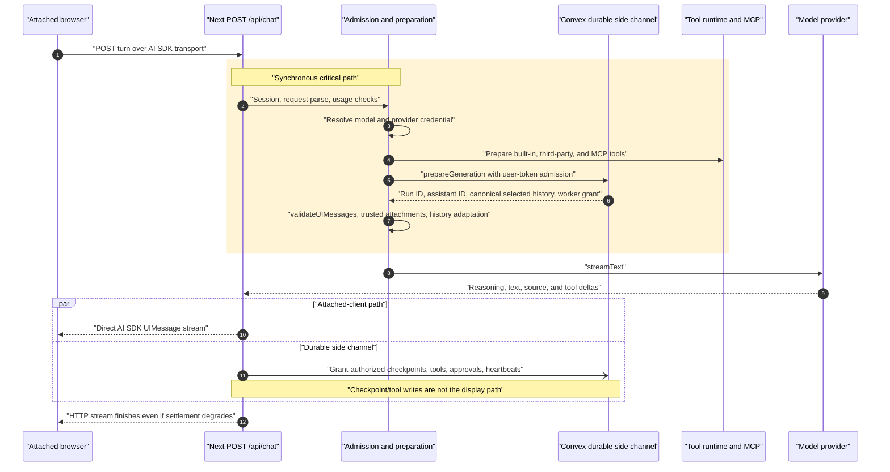
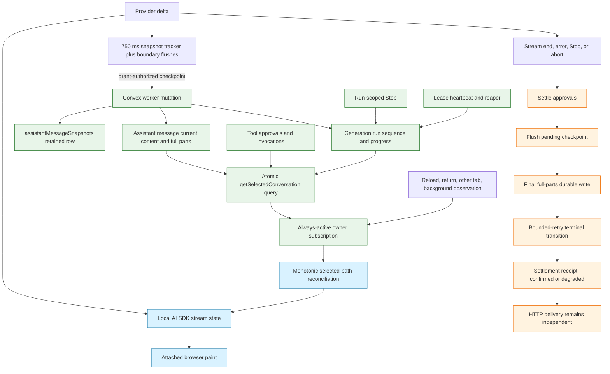

# Chat Responsiveness and Performance Implementation Plan

## 0. Document status

| Field           | Value                                                                                                                   |
| --------------- | ----------------------------------------------------------------------------------------------------------------------- |
| Status          | **Accepted — conservative scope** (2026-07-22): PR 0a → PR 1 → PR 0b (lean) → PR 2 → PR 3 (minimal) → PR 7a/7b. All other phases descoped to the ledger in section 6. |
| Reviewed commit | `d942ac9f23c844aef700332c5234581ee5ef1fb4`                                                                              |
| Review date     | 2026-07-22                                                                                                              |
| Attribution     | Codex planning agent, based on source inspection at the reviewed commit and the supplied independent benchmark findings |
| Scope           | AI chat responsiveness and performance; no implementation is authorized by this document alone                          |

Revised 2026-07-22 after an independent staff review at the same reviewed SHA: rollout-substrate corrections (correction 5 and section 9.2), PR 4 cache-status and SDK pinning-test fixes, PR 5/PR 7 accuracy scoping, and AGENTS.md ceremony reconciliation in PR 6.

Revised again 2026-07-22 after a second external review (source claims re-verified against the repository): PR 0 split into 0a/0b with a profiling-build correction and a concrete correlation transport; chat-switch/navigation instrumentation added to PR 0 and PR 9; PR 3 reduced to a minimal initial contract; PR 4 cache keyed by the actual derivation input; PR 5 production shadow limited to structural comparison; PR 6 legacy-probe transition decision made explicit; PR 7c usage-admission idempotency design made a blocking decision; PR 8 return path corrected to Convex-only and the registry lifted above `Chat` remounts.

**Reviewed commit** above identifies the *source* revision this plan inspected. The plan document itself first landed in `318b703c96535dc9ffea99cba0e2a0ee6bbae825`; later plan revisions are tracked by this file's own git history and do not imply re-inspection of newer source.

**Conservative-cut revision (2026-07-22, third revision).** With PR 0a, PR 1, and PR 0b already in flight, active scope was reduced to only measured/source-verified defects fixed by proven patterns: PR 0a, PR 1, PR 0b (lean — local/staging measurement kit; production sampling and cohort machinery dropped), PR 2 (throttle, no cohort experiment), PR 3 (minimal streaming-code contract, throttled-rehighlight preferred), and PR 7a/7b (duplicate-read removal, conditional Exa). PRs 4, 5, 6, 7c–7f, 8, and 9 were **descoped** — their full specifications live in this file's git history, and section 6's descope ledger records each item's reason and re-entry trigger.

This is a planning artifact. It does **not** approve application changes, schema changes, new dependencies, rollout, or removal of a feature flag. Each phase still requires normal review and, where this plan names an approval gate, explicit approval before implementation.

### Evidence vocabulary

- **Measured — independent micro-benchmark:** a number supplied with the refined findings. It is preserved here, but the underlying script, machine profile, warm-up policy, and raw samples are not present at the reviewed commit.
- **Source-inspected:** behavior verified in repository source or the installed dependency source at the reviewed commit.
- **Historical intent:** an ADR, gameplan, incident, or merged pull request. Historical text does not override current source.
- **Inferred:** a performance or operational consequence that follows from source structure but is not production telemetry.
- **Telemetry required:** a decision that must remain open until production-like measurement exists.

### Reviewed dependency versions

The declared ranges are in [`package.json` lines 30–90](https://github.com/darknightdesigner/not-a-wrapper/blob/d942ac9f23c844aef700332c5234581ee5ef1fb4/package.json#L30-L90); the resolved versions are from `bun.lock` at the reviewed commit.

| Package          |   Declared |  Resolved | Lock evidence                                                                                                                           |
| ---------------- | ---------: | --------: | --------------------------------------------------------------------------------------------------------------------------------------- |
| `ai`             |  `^7.0.22` |  `7.0.22` | [`bun.lock` line 852](https://github.com/darknightdesigner/not-a-wrapper/blob/d942ac9f23c844aef700332c5234581ee5ef1fb4/bun.lock#L852)   |
| `@ai-sdk/react`  |  `^4.0.23` |  `4.0.23` | [`bun.lock` line 116](https://github.com/darknightdesigner/not-a-wrapper/blob/d942ac9f23c844aef700332c5234581ee5ef1fb4/bun.lock#L116)   |
| `convex`         |  `^1.42.1` |  `1.42.1` | [`bun.lock` line 986](https://github.com/darknightdesigner/not-a-wrapper/blob/d942ac9f23c844aef700332c5234581ee5ef1fb4/bun.lock#L986)   |
| `react`          |  `^19.2.7` |  `19.2.7` | [`bun.lock` line 1754](https://github.com/darknightdesigner/not-a-wrapper/blob/d942ac9f23c844aef700332c5234581ee5ef1fb4/bun.lock#L1754) |
| `react-dom`      |  `^19.2.7` |  `19.2.7` | [`bun.lock` line 1758](https://github.com/darknightdesigner/not-a-wrapper/blob/d942ac9f23c844aef700332c5234581ee5ef1fb4/bun.lock#L1758) |
| `next`           | `^16.2.10` | `16.2.10` | [`bun.lock` line 1640](https://github.com/darknightdesigner/not-a-wrapper/blob/d942ac9f23c844aef700332c5234581ee5ef1fb4/bun.lock#L1640) |
| `shiki`          |   `^4.3.1` |   `4.3.1` | [`bun.lock` line 1868](https://github.com/darknightdesigner/not-a-wrapper/blob/d942ac9f23c844aef700332c5234581ee5ef1fb4/bun.lock#L1868) |
| `react-markdown` |  `^10.1.0` |  `10.1.0` | [`bun.lock` line 1764](https://github.com/darknightdesigner/not-a-wrapper/blob/d942ac9f23c844aef700332c5234581ee5ef1fb4/bun.lock#L1764) |
| `unified`        |  `^11.0.5` |  `11.0.5` | [`bun.lock` line 2030](https://github.com/darknightdesigner/not-a-wrapper/blob/d942ac9f23c844aef700332c5234581ee5ef1fb4/bun.lock#L2030) |
| `remark-parse`   |  `^11.0.0` |  `11.0.0` | [`bun.lock` line 1802](https://github.com/darknightdesigner/not-a-wrapper/blob/d942ac9f23c844aef700332c5234581ee5ef1fb4/bun.lock#L1802) |
| `remark-gfm`     |   `^4.0.1` |   `4.0.1` | [`bun.lock` line 1798](https://github.com/darknightdesigner/not-a-wrapper/blob/d942ac9f23c844aef700332c5234581ee5ef1fb4/bun.lock#L1798) |
| `remark-math`    |   `^6.0.0` |   `6.0.0` | [`bun.lock` line 1800](https://github.com/darknightdesigner/not-a-wrapper/blob/d942ac9f23c844aef700332c5234581ee5ef1fb4/bun.lock#L1800) |

### Related repository records

- Repository guidance: [`AGENTS.md` lines 9–58](https://github.com/darknightdesigner/not-a-wrapper/blob/d942ac9f23c844aef700332c5234581ee5ef1fb4/AGENTS.md#L9-L58), [lines 62–96](https://github.com/darknightdesigner/not-a-wrapper/blob/d942ac9f23c844aef700332c5234581ee5ef1fb4/AGENTS.md#L62-L96), and [lines 100–132](https://github.com/darknightdesigner/not-a-wrapper/blob/d942ac9f23c844aef700332c5234581ee5ef1fb4/AGENTS.md#L100-L132).
- Architecture terminology and ownership: [`CONTEXT.md` lines 25–71](https://github.com/darknightdesigner/not-a-wrapper/blob/d942ac9f23c844aef700332c5234581ee5ef1fb4/CONTEXT.md#L25-L71) and [lines 93–115](https://github.com/darknightdesigner/not-a-wrapper/blob/d942ac9f23c844aef700332c5234581ee5ef1fb4/CONTEXT.md#L93-L115).
- Current follow-ups: [`TODO.md` lines 3–22](https://github.com/darknightdesigner/not-a-wrapper/blob/d942ac9f23c844aef700332c5234581ee5ef1fb4/TODO.md#L3-L22); durable presentation rollout and automatic context management remain separate work.
- Selected-path authority: [ADR-0001](https://github.com/darknightdesigner/not-a-wrapper/blob/d942ac9f23c844aef700332c5234581ee5ef1fb4/docs/adr/0001-client-renders-server-selected-path.md).
- Bounded sidebar: [ADR-0005](https://github.com/darknightdesigner/not-a-wrapper/blob/d942ac9f23c844aef700332c5234581ee5ef1fb4/docs/adr/0005-bounded-chat-list-window.md).
- Request-scoped direct stream: [ADR-0006](https://github.com/darknightdesigner/not-a-wrapper/blob/d942ac9f23c844aef700332c5234581ee5ef1fb4/docs/adr/0006-chat-turn-runtime.md).
- No snapshot replay surface: [ADR-0008](https://github.com/darknightdesigner/not-a-wrapper/blob/d942ac9f23c844aef700332c5234581ee5ef1fb4/docs/adr/0008-no-stream-resume-read-surface.md).
- Durable runtime and HTTP trust boundary: [ADR-0009](https://github.com/darknightdesigner/not-a-wrapper/blob/d942ac9f23c844aef700332c5234581ee5ef1fb4/docs/adr/0009-durable-turn-runtime.md) and [ADR-0010](https://github.com/darknightdesigner/not-a-wrapper/blob/d942ac9f23c844aef700332c5234581ee5ef1fb4/docs/adr/0010-http-trust-boundary-hardening.md).
- Grant, settlement, and delivery independence: [ADR-0011](https://github.com/darknightdesigner/not-a-wrapper/blob/d942ac9f23c844aef700332c5234581ee5ef1fb4/docs/adr/0011-durable-turn-settlement.md).
- Atomic first turn and detachable streams: [ADR-0012](https://github.com/darknightdesigner/not-a-wrapper/blob/d942ac9f23c844aef700332c5234581ee5ef1fb4/docs/adr/0012-atomic-first-turn-creation.md) and [ADR-0013](https://github.com/darknightdesigner/not-a-wrapper/blob/d942ac9f23c844aef700332c5234581ee5ef1fb4/docs/adr/0013-back-navigation-detaches-the-stream.md).
- Durable-turn source of truth: [extension gameplan](https://github.com/darknightdesigner/not-a-wrapper/blob/d942ac9f23c844aef700332c5234581ee5ef1fb4/docs/gameplans/extend-the-existing-convex-native-durable-turn-architecture.md), [implementation notes](https://github.com/darknightdesigner/not-a-wrapper/blob/d942ac9f23c844aef700332c5234581ee5ef1fb4/docs/gameplans/durable-turn-implementation-notes-2026-07-19.md), and [2026-07-14 incident](https://github.com/darknightdesigner/not-a-wrapper/blob/d942ac9f23c844aef700332c5234581ee5ef1fb4/docs/chat-turn-token-expiry-orphaned-run-incident-2026-07-14.md).
- Historical pull requests: [#86](https://github.com/darknightdesigner/not-a-wrapper/pull/86), [#111](https://github.com/darknightdesigner/not-a-wrapper/pull/111), [#121](https://github.com/darknightdesigner/not-a-wrapper/pull/121), [#122](https://github.com/darknightdesigner/not-a-wrapper/pull/122), [#123](https://github.com/darknightdesigner/not-a-wrapper/pull/123), and [#124](https://github.com/darknightdesigner/not-a-wrapper/pull/124). Their final merge commits are ancestors of the reviewed SHA; current source, not PR prose, is authoritative.

### Current-branch corrections to the supplied findings

1. **The bounded sidebar is already default-on.** `ENABLE_PAGINATED_SIDEBAR` now falls back to `true` and the exact string `"false"` restores the legacy full-list path ([`lib/flags.ts` lines 11–26](https://github.com/darknightdesigner/not-a-wrapper/blob/d942ac9f23c844aef700332c5234581ee5ef1fb4/lib/flags.ts#L11-L26)). Soak verification and flag retirement are ordinary maintenance, not a plan phase (the long-history phase that owned them is descoped; see the section 6 ledger).
2. **Run-scoped Stop is no longer deferred.** PR #123 landed exact-run Stop, leases, reaping, atomic selected-conversation projection, approval-continuation guards, and settlement hardening. This plan treats all of them as protected invariants, not work to redesign.
3. **Snapshot rows are not a recovery read surface.** At this SHA, production source reads `assistantMessageSnapshots` only for a regeneration-existence probe and chat-owned deletion; recovery reads the assistant message document. That makes eliminating routine retained rows a viable preferred design after the probe is replaced, while preserving the final full-parts write itself.
4. **The repository comments that forbid reference memoization (“The AI SDK mutates part objects in place during streaming without changing array/object references”, `lib/chat-messages/assistant-turn.ts` lines 13–15; similar wording at `lib/chat-messages/turn-row.ts` lines 85–88) are contradicted at the message seam by the installed SDK.** `@ai-sdk/react@4.0.23` deep-clones the replaced active message while array slicing preserves prior message references. The derivation-cache phase that depended on this is descoped (section 6 ledger); the correction stands as recorded fact, the pinning-test requirement travels with the descoped item, and the repository comments stay unchanged until it re-enters.
5. **No experiment, cohort, or runtime feature-flag infrastructure exists at this SHA.** `lib/flags.ts` contains exactly two build-time-inlined `NEXT_PUBLIC_` env booleans; PostHog is used for analytics capture only (no feature-flag APIs are called anywhere), and a repo-wide search finds no experiment/cohort/variant machinery. Build-time env flags cannot express percentage cohorts, remote weight adjustment, or a no-deploy emergency override. PR 0 therefore owns selecting and documenting the flag/cohort seam before any phase’s rollout language can be executed, and section 9.2’s default progression is flag-off → staging → flag-on with monitored rollback; percentage-cohort experiments were removed entirely by the conservative cut — the seam decision is resolved as build-time env flags (PR 0 step 10).

### Source-inspection coverage

The following current-source areas were inspected directly at the reviewed SHA; links identify the line ranges carrying the performance or correctness implications used by this plan.

| Area                              | Reviewed source and material finding                                                                                                                                                                                                                                                                                                                                                                                                                                                                                                                                                                                                                                                                                                                                                                                                                                                                                                                                                                                                                                                                                                                                                                                                                                                                                                                                                                                                                                                                                                                                                                                                                                                                                                                                                                                                                                                                                                                                                                                                                                                                                                                                                                                                                                                                                                             |
| --------------------------------- | ------------------------------------------------------------------------------------------------------------------------------------------------------------------------------------------------------------------------------------------------------------------------------------------------------------------------------------------------------------------------------------------------------------------------------------------------------------------------------------------------------------------------------------------------------------------------------------------------------------------------------------------------------------------------------------------------------------------------------------------------------------------------------------------------------------------------------------------------------------------------------------------------------------------------------------------------------------------------------------------------------------------------------------------------------------------------------------------------------------------------------------------------------------------------------------------------------------------------------------------------------------------------------------------------------------------------------------------------------------------------------------------------------------------------------------------------------------------------------------------------------------------------------------------------------------------------------------------------------------------------------------------------------------------------------------------------------------------------------------------------------------------------------------------------------------------------------------------------------------------------------------------------------------------------------------------------------------------------------------------------------------------------------------------------------------------------------------------------------------------------------------------------------------------------------------------------------------------------------------------------------------------------------------------------------------------------------------------------ |
| Server request/stream             | [`app/api/chat/route.ts` 61–205](https://github.com/darknightdesigner/not-a-wrapper/blob/d942ac9f23c844aef700332c5234581ee5ef1fb4/app/api/chat/route.ts#L61-L205) (session, parse, serial usage flow); [`chat-turn-runtime.ts` 410–596](https://github.com/darknightdesigner/not-a-wrapper/blob/d942ac9f23c844aef700332c5234581ee5ef1fb4/app/api/chat/chat-turn-runtime.ts#L410-L596) and [1052–1127](https://github.com/darknightdesigner/not-a-wrapper/blob/d942ac9f23c844aef700332c5234581ee5ef1fb4/app/api/chat/chat-turn-runtime.ts#L1052-L1127) (credential/tools/durable prepare and direct `streamText`); [`durable-turn-runtime.ts` 584–658](https://github.com/darknightdesigner/not-a-wrapper/blob/d942ac9f23c844aef700332c5234581ee5ef1fb4/app/api/chat/durable-turn-runtime.ts#L584-L658) and [1495–1584](https://github.com/darknightdesigner/not-a-wrapper/blob/d942ac9f23c844aef700332c5234581ee5ef1fb4/app/api/chat/durable-turn-runtime.ts#L1495-L1584) (checkpoint cadence and settlement order); [`outcome-sinks.ts` 18–79](https://github.com/darknightdesigner/not-a-wrapper/blob/d942ac9f23c844aef700332c5234581ee5ef1fb4/app/api/chat/outcome-sinks.ts#L18-L79) (accepted lossy fire-and-forget audit sink).                                                                                                                                                                                                                                                                                                                                                                                                                                                                                                                                                                                                                                                                                                                                                                                                                                                                                                                                                                                                                                                                                                             |
| Admission/tools                   | [`execution-budget.ts` 1–138](https://github.com/darknightdesigner/not-a-wrapper/blob/d942ac9f23c844aef700332c5234581ee5ef1fb4/lib/chat-turn/execution-budget.ts#L1-L138) (deadline ordering); [`runtime.ts` 311–523](https://github.com/darknightdesigner/not-a-wrapper/blob/d942ac9f23c844aef700332c5234581ee5ef1fb4/lib/tools/runtime.ts#L311-L523) (unconditional Exa lookup before conditional tools and MCP load); [`policy.ts` 240–249](https://github.com/darknightdesigner/not-a-wrapper/blob/d942ac9f23c844aef700332c5234581ee5ef1fb4/lib/tools/policy.ts#L240-L249) (request policy dependency); [`load-tools.ts` 234–340](https://github.com/darknightdesigner/not-a-wrapper/blob/d942ac9f23c844aef700332c5234581ee5ef1fb4/lib/mcp/load-tools.ts#L234-L340) (three initial reads and connection lifecycle); [`user-keys.ts` 22–100](https://github.com/darknightdesigner/not-a-wrapper/blob/d942ac9f23c844aef700332c5234581ee5ef1fb4/lib/user-keys.ts#L22-L100) and [166–183](https://github.com/darknightdesigner/not-a-wrapper/blob/d942ac9f23c844aef700332c5234581ee5ef1fb4/lib/user-keys.ts#L166-L183) (duplicate provider and tool-key paths); [`lib/api.ts` 16–67](https://github.com/darknightdesigner/not-a-wrapper/blob/d942ac9f23c844aef700332c5234581ee5ef1fb4/lib/api.ts#L16-L67) (legacy client rate-limit/guest identity surface).                                                                                                                                                                                                                                                                                                                                                                                                                                                                                                                                                                                                                                                                                                                                                                                                                                                                                                                                                                                     |
| Client stream/orchestration       | [`use-chat-core.ts` 244–290](https://github.com/darknightdesigner/not-a-wrapper/blob/d942ac9f23c844aef700332c5234581ee5ef1fb4/app/components/chat/use-chat-core.ts#L244-L290) and [610–665](https://github.com/darknightdesigner/not-a-wrapper/blob/d942ac9f23c844aef700332c5234581ee5ef1fb4/app/components/chat/use-chat-core.ts#L610-L665) (detachable `Chat`, no throttle, still-active durable projection); [`use-detachable-chat-stream.ts` 129–235](https://github.com/darknightdesigner/not-a-wrapper/blob/d942ac9f23c844aef700332c5234581ee5ef1fb4/app/components/chat/use-detachable-chat-stream.ts#L129-L235) (WeakMap lifecycle/watchdog); [`use-generation-presentation-controller.ts` 72–319](https://github.com/darknightdesigner/not-a-wrapper/blob/d942ac9f23c844aef700332c5234581ee5ef1fb4/app/components/chat/use-generation-presentation-controller.ts#L72-L319) (local/deferred/exact-run Stop); [`chat.tsx` 130–500](https://github.com/darknightdesigner/not-a-wrapper/blob/d942ac9f23c844aef700332c5234581ee5ef1fb4/app/components/chat/chat.tsx#L130-L500) (Chat/Conversation/Composer ownership); [`conversation.tsx` 133–260](https://github.com/darknightdesigner/not-a-wrapper/blob/d942ac9f23c844aef700332c5234581ee5ef1fb4/app/components/chat/conversation.tsx#L133-L260), [`message.tsx` 1–98](https://github.com/darknightdesigner/not-a-wrapper/blob/d942ac9f23c844aef700332c5234581ee5ef1fb4/app/components/chat/message.tsx#L1-L98), [`message-assistant.tsx` 80–260](https://github.com/darknightdesigner/not-a-wrapper/blob/d942ac9f23c844aef700332c5234581ee5ef1fb4/app/components/chat/message-assistant.tsx#L80-L260), and [`use-activity-panel.ts` 200–300](https://github.com/darknightdesigner/not-a-wrapper/blob/d942ac9f23c844aef700332c5234581ee5ef1fb4/app/components/chat/use-activity-panel.ts#L200-L300) (row memo and duplicate view/phase work); [`thread-scroll.tsx` 75–265](https://github.com/darknightdesigner/not-a-wrapper/blob/d942ac9f23c844aef700332c5234581ee5ef1fb4/app/components/chat/thread-scroll.tsx#L75-L265) (scroll/pinning constraints); [`composer.tsx` 194–520](https://github.com/darknightdesigner/not-a-wrapper/blob/d942ac9f23c844aef700332c5234581ee5ef1fb4/app/components/chat-input/composer.tsx#L194-L520) (forwardRef, state, callbacks, imperative handle). |
| Rendering/derivation              | [`components/ui/message.tsx` 25–103](https://github.com/darknightdesigner/not-a-wrapper/blob/d942ac9f23c844aef700332c5234581ee5ef1fb4/components/ui/message.tsx#L25-L103), [`markdown.tsx` 56–294](https://github.com/darknightdesigner/not-a-wrapper/blob/d942ac9f23c844aef700332c5234581ee5ef1fb4/components/ui/markdown.tsx#L56-L294), [`code-block.tsx` 24–165](https://github.com/darknightdesigner/not-a-wrapper/blob/d942ac9f23c844aef700332c5234581ee5ef1fb4/components/ui/code-block.tsx#L24-L165), [`assistant-turn.ts` 12–24](https://github.com/darknightdesigner/not-a-wrapper/blob/d942ac9f23c844aef700332c5234581ee5ef1fb4/lib/chat-messages/assistant-turn.ts#L12-L24) and [181–249](https://github.com/darknightdesigner/not-a-wrapper/blob/d942ac9f23c844aef700332c5234581ee5ef1fb4/lib/chat-messages/assistant-turn.ts#L181-L249), [`turn-row.ts` 84–123](https://github.com/darknightdesigner/not-a-wrapper/blob/d942ac9f23c844aef700332c5234581ee5ef1fb4/lib/chat-messages/turn-row.ts#L84-L123), and [`parts.ts` 59–115](https://github.com/darknightdesigner/not-a-wrapper/blob/d942ac9f23c844aef700332c5234581ee5ef1fb4/lib/chat-messages/parts.ts#L59-L115).                                                                                                                                                                                                                                                                                                                                                                                                                                                                                                                                                                                                                                                                                                                                                                                                                                                                                                                                                                                                                                                                                                                                                            |
| Client persistence/reconciliation | [`messages/provider.tsx` 81–176](https://github.com/darknightdesigner/not-a-wrapper/blob/d942ac9f23c844aef700332c5234581ee5ef1fb4/lib/chat-store/messages/provider.tsx#L81-L176) (always-active atomic subscription and full mapping); [`selected-path.ts` 39–152](https://github.com/darknightdesigner/not-a-wrapper/blob/d942ac9f23c844aef700332c5234581ee5ef1fb4/lib/chat-store/turns/selected-path.ts#L39-L152) (monotonic adoption); [`chats/provider.tsx` 185–275](https://github.com/darknightdesigner/not-a-wrapper/blob/d942ac9f23c844aef700332c5234581ee5ef1fb4/lib/chat-store/chats/provider.tsx#L185-L275) and [621–652](https://github.com/darknightdesigner/not-a-wrapper/blob/d942ac9f23c844aef700332c5234581ee5ef1fb4/lib/chat-store/chats/provider.tsx#L621-L652) (bounded sidebar/default path); [`sidebar-chat-status.ts` 68–170](https://github.com/darknightdesigner/not-a-wrapper/blob/d942ac9f23c844aef700332c5234581ee5ef1fb4/lib/chat-store/status/sidebar-chat-status.ts#L68-L170) (local/durable status precedence).                                                                                                                                                                                                                                                                                                                                                                                                                                                                                                                                                                                                                                                                                                                                                                                                                                                                                                                                                                                                                                                                                                                                                                                                                                                                                                  |
| Convex projection/branching       | [`schema.ts` 139–263](https://github.com/darknightdesigner/not-a-wrapper/blob/d942ac9f23c844aef700332c5234581ee5ef1fb4/convex/schema.ts#L139-L263) (message/run/snapshot fields and indexes); [`messages.ts` 38–101](https://github.com/darknightdesigner/not-a-wrapper/blob/d942ac9f23c844aef700332c5234581ee5ef1fb4/convex/messages.ts#L38-L101) and [191–308](https://github.com/darknightdesigner/not-a-wrapper/blob/d942ac9f23c844aef700332c5234581ee5ef1fb4/convex/messages.ts#L191-L308) (full collect, branch decoration, atomic projection); [`message_branches.ts` 69–267](https://github.com/darknightdesigner/not-a-wrapper/blob/d942ac9f23c844aef700332c5234581ee5ef1fb4/convex/domain/message_branches.ts#L69-L267) (repeated context); [`message_branch_writes.ts` 116–189](https://github.com/darknightdesigner/not-a-wrapper/blob/d942ac9f23c844aef700332c5234581ee5ef1fb4/convex/domain/message_branch_writes.ts#L116-L189) and [239–359](https://github.com/darknightdesigner/not-a-wrapper/blob/d942ac9f23c844aef700332c5234581ee5ef1fb4/convex/domain/message_branch_writes.ts#L239-L359) (planned arrays and validation/repair); [`message_visibility.ts` 75–148](https://github.com/darknightdesigner/not-a-wrapper/blob/d942ac9f23c844aef700332c5234581ee5ef1fb4/convex/domain/message_visibility.ts#L75-L148) (terminal stubs/model history).                                                                                                                                                                                                                                                                                                                                                                                                                                                                                                                                                                                                                                                                                                                                                                                                                                                                                                                                                                           |
| Convex runtime/security/liveness  | [`chatRuntime.ts` 454–462](https://github.com/darknightdesigner/not-a-wrapper/blob/d942ac9f23c844aef700332c5234581ee5ef1fb4/convex/chatRuntime.ts#L454-L462), [1328–1580](https://github.com/darknightdesigner/not-a-wrapper/blob/d942ac9f23c844aef700332c5234581ee5ef1fb4/convex/chatRuntime.ts#L1328-L1580), and [1610–1692](https://github.com/darknightdesigner/not-a-wrapper/blob/d942ac9f23c844aef700332c5234581ee5ef1fb4/convex/chatRuntime.ts#L1610-L1692) (snapshot probe, prepare, retained write); [`chatRuntimeWorker.ts` 17–122](https://github.com/darknightdesigner/not-a-wrapper/blob/d942ac9f23c844aef700332c5234581ee5ef1fb4/convex/chatRuntimeWorker.ts#L17-L122) (grant-authorized wire); [`http.ts` 19–103](https://github.com/darknightdesigner/not-a-wrapper/blob/d942ac9f23c844aef700332c5234581ee5ef1fb4/convex/http.ts#L19-L103) (secret hashing/dispatch); [`generation_run_lifecycle.ts` 62–72](https://github.com/darknightdesigner/not-a-wrapper/blob/d942ac9f23c844aef700332c5234581ee5ef1fb4/convex/domain/generation_run_lifecycle.ts#L62-L72) (snapshot-existence fact); [`generation_run_liveness.ts` 4–102](https://github.com/darknightdesigner/not-a-wrapper/blob/d942ac9f23c844aef700332c5234581ee5ef1fb4/convex/domain/generation_run_liveness.ts#L4-L102) (writability/lease rules).                                                                                                                                                                                                                                                                                                                                                                                                                                                                                                                                                                                                                                                                                                                                                                                                                                                                                                                                                                                                                    |
| Deletion/cleanup                  | [`chat_owned_deletion.ts` 94–167](https://github.com/darknightdesigner/not-a-wrapper/blob/d942ac9f23c844aef700332c5234581ee5ef1fb4/convex/domain/chat_owned_deletion.ts#L94-L167) and [242–268](https://github.com/darknightdesigner/not-a-wrapper/blob/d942ac9f23c844aef700332c5234581ee5ef1fb4/convex/domain/chat_owned_deletion.ts#L242-L268) (bounded graph collection and leaf deletion, including snapshot rows). No separate post-settlement snapshot cleanup module exists at this SHA.                                                                                                                                                                                                                                                                                                                                                                                                                                                                                                                                                                                                                                                                                                                                                                                                                                                                                                                                                                                                                                                                                                                                                                                                                                                                                                                                                                                                                                                                                                                                                                                                                                                                                                                                                                                                                                                  |

## 1. Executive decision

Keep the existing boundary:

- The initiating browser displays the response from the direct AI SDK HTTP stream.
- Convex remains the durable side channel for canonical messages, runs, branch state, checkpoints, approvals, Stop, leases, reaping, background observation, and recovery.
- The selected-conversation subscription remains active and atomic while local output streams. Its updates are reconciled monotonically; they are not the attached token transport.
- Settlement remains delivery-independent: a delivered answer is not erased because terminal persistence, observability, or later cleanup fails.

The principal costs are independent and should be changed independently:

1. Repeated full branch-context construction in Convex projection and branch-write planning.
2. One React message notification per AI SDK message update because `useChat` has no throttle.
3. Full growing-code Shiki highlighting on each code delta.
4. Repeated assistant-turn derivation for settled history, including duplicate Activity-panel work.
5. Full accumulated-Markdown parsing on each text update.
6. Duplicate cumulative snapshot payload and retained-row amplification.
7. Serial, duplicated, and unconditional work before `streamText` starts.
8. Detached bindings retained until completion/watchdog, without an enumerable cap.
9. Unbounded selected-conversation reads whose production relevance is not yet measured.

Under the conservative cut, active scope addresses costs 1–3 and the duplicate-read portion of cost 7. Costs 4–6, the remainder of 7, and costs 8–9 are consciously left in place — each is either attackable indirectly by the throttle (4, 5), a storage rather than responsiveness cost (6), or still hypothetical (8, 9). See the descope ledger in section 6 for re-entry triggers.

### Ordered recommendation

| Order | Phase                                            | Reason for position                                                                                                              |
| ----: | ------------------------------------------------ | -------------------------------------------------------------------------------------------------------------------------------- |
|    0a | PR 0a — evidence preservation                    | Benchmarks and equivalence fixtures only; the sole prerequisite for PR 1, so the highest-confidence optimization is not delayed by instrumentation build-out.                    |
|     1 | PR 1 — single-pass branch context                | Largest source-verified backend algorithmic defect; semantics can be proven by equivalence tests. First production optimization. |
|    0b | PR 0b — runtime observability and rollout seam   | Browser harness, marks, spans, Convex counters, detached gauges, correlation scheme, and the env-flag seam documentation; prerequisite for PRs 2+ rollout language, not for PR 1.           |
|     2 | PR 2 — AI SDK throttle                           | Small isolated control point; the cheapest large reduction of the entire per-delta client pipeline. No cohort experiment — pick a value locally, keep the flag. |
|     3 | PR 3 — streaming code rendering (minimal)        | Removes the most extreme measured per-delta renderer cost while preserving settled output; throttled-rehighlight variant preferred for ChatGPT-fidelity parity. |
|     4 | PR 7a/7b — duplicate-read removal, conditional Exa | Source-verified redundancy removed by deletion, not new architecture. Small, certain, safe.                                     |

All other phases (original PRs 4, 5, 6, 7c–7f, 8, 9) are descoped — see the ledger at the end of section 6 for reasons and re-entry triggers. Their specifications remain in git history.

Out of scope: routing attached tokens through Convex; Convex-only streaming; Redis; wholesale `@convex-dev/agent` adoption; replacing grants, leases, reapers, Stop, approvals, supersession, or settlement; broad component-tree rewrites; generic virtualization; and context-window summarization from `TODO.md`.

## 2. Current architecture

### 2.1 Attached-client request and direct stream

`POST /api/chat` is a thin adapter around `ChatTurnRuntime`; the runtime prepares model, credential, tools, durable state, validated history, attachments, and model messages before it invokes `streamText` ([`route.ts` lines 61–205](https://github.com/darknightdesigner/not-a-wrapper/blob/d942ac9f23c844aef700332c5234581ee5ef1fb4/app/api/chat/route.ts#L61-L205), [`chat-turn-runtime.ts` lines 410–596](https://github.com/darknightdesigner/not-a-wrapper/blob/d942ac9f23c844aef700332c5234581ee5ef1fb4/app/api/chat/chat-turn-runtime.ts#L410-L596)). The response uses the standalone AI SDK converter and response helper, preserving the v7 project pattern.



Legend: solid request arrows are awaited critical-path operations; the open arrow to Convex represents asynchronous/background checkpoint work; the browser-facing stream is the attached-client path.

### 2.2 Durable checkpoints, settlement, and reactive projection

The durable runtime builds cumulative text and parts, throttles routine snapshots at approximately 750 ms, performs boundary/final flushes, and settles approvals before final full-parts persistence and terminal transition ([`durable-turn-runtime.ts` lines 584–658](https://github.com/darknightdesigner/not-a-wrapper/blob/d942ac9f23c844aef700332c5234581ee5ef1fb4/app/api/chat/durable-turn-runtime.ts#L584-L658), [ADR-0011](https://github.com/darknightdesigner/not-a-wrapper/blob/d942ac9f23c844aef700332c5234581ee5ef1fb4/docs/adr/0011-durable-turn-settlement.md)). Convex currently stores each accepted cumulative snapshot row and copies the same current content/parts into the assistant message before advancing `lastSnapshotSequence` ([`chatRuntime.ts` lines 1635–1690](https://github.com/darknightdesigner/not-a-wrapper/blob/d942ac9f23c844aef700332c5234581ee5ef1fb4/convex/chatRuntime.ts#L1635-L1690)).



The selected-conversation query deliberately reads message and run state in one transaction and redacts run linkage and pending approvals from non-owners ([`convex/messages.ts` lines 191–308](https://github.com/darknightdesigner/not-a-wrapper/blob/d942ac9f23c844aef700332c5234581ee5ef1fb4/convex/messages.ts#L191-L308)). The client subscription stays active for authenticated durable chats ([`messages/provider.tsx` lines 81–108](https://github.com/darknightdesigner/not-a-wrapper/blob/d942ac9f23c844aef700332c5234581ee5ef1fb4/lib/chat-store/messages/provider.tsx#L81-L108)); local reconciliation rejects lagging nonterminal snapshots that would truncate newer local output ([`selected-path.ts` lines 39–74](https://github.com/darknightdesigner/not-a-wrapper/blob/d942ac9f23c844aef700332c5234581ee5ef1fb4/lib/chat-store/turns/selected-path.ts#L39-L74)).

### 2.3 Current client rendering and detached ownership

- `useChat({ chat: detachableStream.chat })` has no throttle ([`use-chat-core.ts` lines 274–283](https://github.com/darknightdesigner/not-a-wrapper/blob/d942ac9f23c844aef700332c5234581ee5ef1fb4/app/components/chat/use-chat-core.ts#L274-L283)). Installed `@ai-sdk/react@4.0.23` passes `throttle` to the message callback even when a `Chat` instance is supplied.
- The Markdown splitter parses the entire accumulated string into mdast blocks whenever `children` changes ([`components/ui/markdown.tsx` lines 61–74](https://github.com/darknightdesigner/not-a-wrapper/blob/d942ac9f23c844aef700332c5234581ee5ef1fb4/components/ui/markdown.tsx#L61-L74), [lines 264–292](https://github.com/darknightdesigner/not-a-wrapper/blob/d942ac9f23c844aef700332c5234581ee5ef1fb4/components/ui/markdown.tsx#L264-L292)). Per-block render memoization already exists (`MemoizedMarkdownBlock` compares block content, lines 231–260), so unchanged prefix blocks skip re-rendering; the repeated cost is the full-string parse plus the tail block’s re-render.
- Each code change invokes Shiki over the complete block ([`components/ui/code-block.tsx` lines 105–165](https://github.com/darknightdesigner/not-a-wrapper/blob/d942ac9f23c844aef700332c5234581ee5ef1fb4/components/ui/code-block.tsx#L105-L165)).
- `Conversation` derives timestamp headers for the complete message list and derives each assistant view per render ([`conversation.tsx` lines 169–220](https://github.com/darknightdesigner/not-a-wrapper/blob/d942ac9f23c844aef700332c5234581ee5ef1fb4/app/components/chat/conversation.tsx#L169-L220)); the Activity-panel selector can derive the default/panel assistant again ([`use-activity-panel.ts` lines 234–270](https://github.com/darknightdesigner/not-a-wrapper/blob/d942ac9f23c844aef700332c5234581ee5ef1fb4/app/components/chat/use-activity-panel.ts#L234-L270)).
- Detached bindings remain live until completion or the execution-budget watchdog. Their lifecycle is stored in a non-enumerable `WeakMap`; there is no concurrent-binding count or LRU policy ([`use-detachable-chat-stream.ts` lines 129–235](https://github.com/darknightdesigner/not-a-wrapper/blob/d942ac9f23c844aef700332c5234581ee5ef1fb4/app/components/chat/use-detachable-chat-stream.ts#L129-L235)).

## 3. Performance evidence

### 3.1 Evidence table

| Finding                       | Evidence                                                                                                                                                                                                                                                                 | Class                                     | Interpretation                                                                                                                                                                                                                                                                                                                                                                                                 |
| ----------------------------- | ------------------------------------------------------------------------------------------------------------------------------------------------------------------------------------------------------------------------------------------------------------------------ | ----------------------------------------- | -------------------------------------------------------------------------------------------------------------------------------------------------------------------------------------------------------------------------------------------------------------------------------------------------------------------------------------------------------------------------------------------------------------- |
| Branch projection             | ~243 ms at 575 branched rows; ~1,020 ms at 1,150 rows. Shared-context equivalent ~0.8 ms and ~1.5 ms. Six fixtures plus 200 randomized trees were equivalent.                                                                                                            | Measured — independent micro-benchmark    | Strong algorithmic signal, not a production latency sample. Convert to repository-owned benchmark/property tests before changing behavior.                                                                                                                                                                                                                                                                     |
| Current branch implementation | `buildBranchContext` sorts/indexes, but each public helper reconstructs it; per-message decoration calls helpers that reconstruct it again.                                                                                                                              | Source-inspected                          | Confirms the benchmark’s suspected repeated-work mechanism ([`message_branches.ts` lines 69–168](https://github.com/darknightdesigner/not-a-wrapper/blob/d942ac9f23c844aef700332c5234581ee5ef1fb4/convex/domain/message_branches.ts#L69-L168), [lines 177–267](https://github.com/darknightdesigner/not-a-wrapper/blob/d942ac9f23c844aef700332c5234581ee5ef1fb4/convex/domain/message_branches.ts#L177-L267)). |
| Markdown splitter             | ~3.0 s cumulative CPU for ~12 KB at 50-character updates; ~10.8 s at 15-character updates; ~11–21 ms/update late in the latter run.                                                                                                                                      | Measured — independent micro-benchmark    | Supports incremental-tail parsing. Unchanged-block re-render is already memoized (`MemoizedMarkdownBlock`, content equality), so the recoverable cost is parser CPU; production effect depends on chunk rate, content shape, browser, and React scheduling.                                                                                                                                                                                                                                                                                         |
| Shiki                         | ~18.2 s cumulative highlight CPU for a streamed 400-line TypeScript block; ~45–90 ms/delta late; ~120 ms one settled 500-line highlight; ~429 ms highlighter initialization.                                                                                             | Measured — independent micro-benchmark    | Full-block work per delta is untenable for code-heavy streams. One settled highlight remains acceptable as the first target, subject to device telemetry.                                                                                                                                                                                                                                                      |
| SDK message update semantics  | Active replacement is `structuredClone(message)`; preceding/following entries are retained by array slice. Message subscription accepts a throttle.                                                                                                                      | Source-inspected installed dependency     | Negative finding against the repository’s in-place part-mutation comments (`assistant-turn.ts` lines 13–15, `turn-row.ts` lines 85–88). Settled message references can support a WeakMap cache at this pinned version; active messages still must not be cached.                                                                                                                                                                                                    |
| Snapshot cadence/payload      | Default routine interval is 750 ms; writer sends cumulative `textSnapshot` and `partsSnapshot`, inserts a retained row, patches the message, and advances the run. Boundary/final flushes already exist.                                                                 | Source-inspected                          | Keep cadence first; remove duplicate representation/retention before reducing recovery freshness.                                                                                                                                                                                                                                                                                                              |
| Admission work                | Usage check, BYOK-presence check, and increment are serial; the runtime fetches/decrypts the provider key again. Exa key resolution precedes the check for whether Exa-backed tools are needed. MCP performs three Convex reads before discovering zero enabled servers. | Source-inspected                          | Instrument, remove duplicates, add capability gates, consolidate usage atomically, then parallelize only independent nodes.                                                                                                                                                                                                                                                                                    |
| Long history                  | Selected-conversation reads all messages by chat order, then projects/decorates the selected path.                                                                                                                                                                       | Source-inspected                          | Backend work and response bytes can grow with the full chat. The workload distribution and actual Convex read cost are unknown.                                                                                                                                                                                                                                                                                |
| Detached streams              | Multiple detached `Chat` objects can consume simultaneously until completion/watchdog; no enumerable registry or cap exists.                                                                                                                                             | Source-inspected + inferred resource cost | Count and size first. Only authenticated durable bindings are safe candidates for local-consumption eviction.                                                                                                                                                                                                                                                                                                  |

### 3.2 Structured-clone negative finding

The installed distribution’s `ReactChatState.replaceMessage` creates a new messages array, deep-clones the replaced message, and retains untouched entries by reference (`node_modules/@ai-sdk/react/dist/index.js:187–203` in the reviewed install). `useChat` registers the messages callback with the passed throttle regardless of whether the caller supplied an existing `Chat` (`node_modules/@ai-sdk/react/dist/index.js:273–340`). The repository currently supplies an existing detachable `Chat` and omits `throttle`.

This observation is dependency-private behavior, not a stable public contract. The settled-derivation cache that would rely on it is descoped (section 6 ledger); if that item re-enters, its upgrade-safety pinning test — failing when settled references stop being retained, the active message stops being replaced, part objects mutate in place, or metadata objects mutate in place — is a blocking prerequisite.

### 3.3 Benchmark limitations

- The supplied micro-benchmarks have no checked-in script or raw result artifact at this SHA. CPU, runtime version, warm-up, sample count, garbage collection, and power state are unknown.
- The figures isolate algorithms. They do not include network delay, Convex scheduling, browser layout/paint, React concurrency, provider chunking, mobile thermal behavior, or production message shapes.
- The branch result has unusually large headroom and a clear source mechanism, so it is suitable as the first production optimization after repository reproduction.
- Markdown and Shiki results justify work elimination, but rollout decisions must use production-build browser traces on representative devices.
- No claim in this plan converts a micro-benchmark number into user-visible latency without the PR 0 marks and spans.

### 3.4 Recommendations validated against current source

| Finding                          | Current verdict                                                                                                                                                                    |
| -------------------------------- | ---------------------------------------------------------------------------------------------------------------------------------------------------------------------------------- |
| A. Single-pass branch projection | **Verified and prioritized.** Current helpers rebuild the same context repeatedly in both query decoration and mutation planning.                                                  |
| B. AI SDK message throttle       | **Verified.** Installed source supports throttling with an existing `Chat`; the app passes none.                                                                                   |
| C. Streaming Shiki cost          | **Verified mechanism.** The full code string is highlighted on every change.                                                                                                       |
| D. Full Markdown reparses        | **Verified mechanism, scope narrowed.** The full accumulated string is parsed on every change; unchanged-block re-render is already memoized, so the recoverable cost is parser CPU — attacked indirectly by PR 2's throttle; direct incremental parsing is descoped.                                                                                                     |
| E. Settled derivation cache      | **Revised from repository comment.** Installed SDK behavior supports settled-only reference caching, guarded by a pinned test and status key.                                      |
| F. Snapshot payload/retention    | **Verified, with stronger source result.** Snapshot rows have no recovery reader; prefer stopping routine row insertion after replacing the one existence probe.                   |
| G. Admission path                | **Verified.** Duplicate provider-key reads, unconditional Exa lookup, three usage operations, MCP request-path reads, and dynamic imports are present.                             |
| H. Long-history bounds           | **Partly already implemented.** Sidebar bounding is default-on; selected conversation/model history/public/search requirements remain distinct and unbounded where source says so. |
| I. Detached accumulation         | **Verified.** No count/cap exists; existing watchdog bounds time, not concurrent retained memory/connections.                                                                      |

### 3.5 Assumptions requiring measurement

- The branch micro-benchmark’s algorithmic win will materially reduce Convex query/mutation duration for real branched chats; the source mechanism is verified, but production branch-size distribution is not.
- Message notification throttling will reduce commit/input cost more than it increases visible-update latency; the value is selected by direct comparison against the 0 ms baseline.
- Plain-while-growing code will improve code-heavy streams on target devices; settled large-block Shiki cost may still need later work.
- Incremental Markdown’s conservative fallback rate will be low enough on real assistant output to retain the synthetic CPU win.
- Removing duplicate checkpoint payload/retained rows will materially reduce bytes/storage without changing observed reload staleness.
- Duplicate-query removal, capability gates, and safe overlap—not provider latency—are a material share of request-to-provider-start p50/p95.
- Concurrent detached durable bindings occur often enough to justify enforcement after instrumentation.
- Selected-conversation breadth remains a material problem after PR 1; this is deliberately unproven.

### 3.6 Decisions deferred until telemetry exists

- Final AI SDK throttle value.
- Whether the code-highlight inactivity delay remains 150 ms, changes, or is unnecessary once fence-close/settle behavior is measured.
- Local incremental Markdown versus an explicitly approved Streamdown migration.
- Any worker/chunking work for extremely large settled code/Markdown.
- Any checkpoint-cadence change, one-final-row retention, cleanup-state index, or hot/cold snapshot split.
- Which pre-stream operations merit concurrency or caching after duplicate/conditional work is removed.
- Authenticated-durable detached-binding cap/LRU value.
- Whether the descoped long-history item ever re-enters and, if so, which bounded-history schema an ADR selects.

## 4. Invariants and non-goals

### 4.1 Global invariants

Every phase must preserve the applicable subset below and must name its proof in the phase’s tests and rollout gates.

1. Authenticated durable generations survive navigation, reload, or initiating-client disconnection.
2. The initiating browser displays low-latency direct provider output; live attached tokens do not pass through Convex first.
3. Partial output survives Stop, provider failure, worker loss, request loss, or degraded terminal persistence wherever the current durable contract promises it.
4. Stop is scoped to an exact run and cannot stop a newer run.
5. A stopped, superseded, expired, or reaped worker cannot continue mutating run/message state.
6. Tool approvals are durable and race-safe across tabs.
7. Approval continuation is one-shot and cannot resurrect a stopped, superseded, expired, or already-continued run.
8. Branch selection, editing, regeneration, and selected-path derivation remain server-authoritative.
9. Lagging durable snapshots never truncate newer local output.
10. Public and non-owner viewers receive neither internal run identifiers nor pending approval data.
11. BYOK keys, execution grants, access tokens, attachment content, prompts, model output, and full tool payloads are not exposed through logs or telemetry.
12. Observability, analytics, checkpoint retention, or cleanup failure cannot erase an answer already delivered over the HTTP stream.
13. Guest/local-only chats remain intentional: send-only, local persistence, no Convex durable-run assumption, and no silent eviction of their sole stream.
14. Message and selected-run state exposed to the owner remains atomically consistent through `getSelectedConversation`.
15. Final full-parts persistence occurs before terminal settlement; approvals settle before the final flush; terminal retries remain bounded and idempotent.
16. Usage admission, credential resolution, durable run creation, canonical-message validation, attachment trust, and tool preparation keep their dependency and authorization ordering.
17. Chat-owned deletion still owns all durable rows that exist at deletion time, including historical snapshot rows.
18. The current direct-stream/durable-side-channel split and guest/durable selecting runtime remain intact.

### 4.2 Explicit non-goals and deferred alternatives

- No attached-token routing through Convex and no Convex-only token stream.
- No Redis or other hot-state service.
- No wholesale migration to `@convex-dev/agent`, even though it is already installed.
- No replacement of grant, lease, reaper, Stop, approval, supersession, continuation, or settlement architecture.
- No full hot/cold snapshot architecture before simpler payload/retention work and production telemetry.
- No skipping the complete selected-conversation subscription while a local stream is attached.
- No generic message-list virtualization before backend query/read bounds are understood.
- No web worker as the first Markdown or Shiki fix.
- No `smoothStream` as a substitute for eliminating parser/highlighter/render work.
- No full stable-history/live-tail component split before throttle, settled caching, and duplicate-work removal are measured.
- No automatic context summarization, semantic search, or model-context policy redesign in this performance plan.

## 5. Target architecture

The target removes repeated work while keeping the same ownership boundary.

```mermaid
flowchart LR
    subgraph Request["Request preparation (order unchanged; redundancy removed)"]
      S["Session, model, provider identity"] --> K["One credential resolution fact (7a)"]
      K --> AD["Existing serial usage admission (unchanged)"]
      AD --> DP["Durable prepareGeneration"]
      DP --> TP["Tool preparation with conditional Exa (7b)"]
      TP --> VAL["validateUIMessages"]
      VAL --> AT["Trusted attachment resolution"]
      AT --> MH["Adapt history and convert model messages"]
      MH --> ST["streamText"]
    end

    ST --> DS["Direct UIMessage HTTP stream"]
    DS --> TH["Configured message-notification throttle (PR 2)"]
    TH --> MD["Full Markdown parse per throttled update, stable block records (PR 3)"]
    MD --> CB["Terminal growing code: throttled or plain rendering; settled Shiki (PR 3)"]

    ST -. "750 ms plus boundaries" .-> CP["Checkpoint message and run state (unchanged)"]
    CP --> AP["Always-active atomic selected-conversation projection"]
    AP --> DS

    BC["One branch context per immutable message-array version (PR 1)"] --> AP
    BC --> BW["Server-authoritative branch writer"]
```



### Target ownership rules

| Concern                               | Target owner                                                                           |
| ------------------------------------- | -------------------------------------------------------------------------------------- |
| First visible live text               | Direct AI SDK HTTP stream and attached `Chat`                                          |
| React notification frequency          | Configured `useChat` throttle flag (PR 2)                                              |
| Settled assistant render derivation   | Pure per-render derivation, unchanged — caching descoped (section 6 ledger)            |
| Markdown block stability              | Full parse per throttled update with stable block records — incremental tail descoped  |
| Code highlight timing                 | Block-level streaming state; throttled or plain growing rendering, settled Shiki (PR 3)|
| Branch path and descriptors           | One canonical `BranchContext` implementation inside Convex execution                   |
| Current durable partial/final content | Assistant message plus generation-run sequence/progress                                |
| Historical snapshot rows              | Unchanged in active scope; payload/row reduction is descoped (section 6 ledger)        |
| Admission and provider start          | Current serial flow with one credential read (7a) and conditional Exa (7b) — reordering descoped |
| Background/reentry state              | Atomic Convex selected-conversation subscription                                       |
| Detached local resource retention     | Existing WeakMap lifecycle + watchdog, unchanged — registry/LRU descoped (section 6 ledger) |

## 6. Implementation phases

Each PR is independently deployable and reversible. “Likely files” are implementation guidance, not permission to change them. Tests listed under a phase are the narrow minimum; the cross-phase matrix in section 7 remains the release suite.

### PR 0 — Preserve evidence and add instrumentation

This phase lands as **two independently reviewable PRs** so instrumentation build-out cannot delay PR 1:

- **PR 0a — evidence preservation:** steps 1–2 (deterministic stream fixture, branch benchmark with randomized equivalence fixtures), the Markdown/Shiki benchmark reproduction, and the commands/environment recording from the measurement runbook. PR 1 depends on **PR 0a only**.
- **PR 0b — runtime observability and rollout substrate:** steps 3–8 and 10 (browser harness, client marks, server spans, Convex counters, detached gauges, secret-scrubbing corpus, correlation scheme, env-flag seam documentation) plus the rest of the runbook. PRs 2 onward depend on PR 0b.

Where later phases reference "PR 0", read: fixtures/benchmarks → PR 0a; marks, spans, counters, gauges, profiling harness, and the env-flag seam documentation → PR 0b.

| Field                     | Plan                                                                                                                                                                                                                                                                                                                                                                                                                                                                                                                                                                                             |
| ------------------------- | ------------------------------------------------------------------------------------------------------------------------------------------------------------------------------------------------------------------------------------------------------------------------------------------------------------------------------------------------------------------------------------------------------------------------------------------------------------------------------------------------------------------------------------------------------------------------------------------------ |
| Objective                 | Reproduce the supplied findings in repository-owned harnesses, create attribution-quality client, server, and Convex measurements without changing production behavior, and document the env-flag seam every later phase’s rollout language references.                                                                                                                                                                                                                                                                                                                                                                                                                       |
| Current verified behavior | No branch/render performance benchmark files are checked in. Existing PostHog, structured logging, Vitest, and secret-scrubbing seams exist, but there are no end-to-end chat responsiveness marks or counters for Markdown parses, Shiki calls, selected-conversation breadth, or detached bindings. Vitest is configured but has no bench script/config; `app/components/chat/use-chat-core.ai-sdk-seam.test.tsx` already exists and should be extended rather than recreated; no experiment/cohort/runtime-flag infrastructure exists anywhere in the repository (see correction 5).                                                                                                                                                                                                                                                                                            |
| Proposed behavior         | Same user-visible behavior; instrumentation is sampled, content-free, and off or low-rate by default. Deterministic mock streams drive repeatable browser and unit benchmarks.                                                                                                                                                                                                                                                                                                                                                                                                                   |
| Likely files              | New `benchmarks/chat-performance/branch-projection.bench.ts`, `benchmarks/chat-performance/render-stream.bench.tsx`, `benchmarks/chat-performance/fixtures.ts`; new `lib/observability/chat-performance.ts`; `app/api/chat/route.ts`; `app/api/chat/chat-turn-runtime.ts`; `app/api/chat/durable-turn-runtime.ts`; `app/components/chat/use-chat-core.ts`; `components/ui/markdown.tsx`; `components/ui/code-block.tsx`; `lib/chat-store/messages/provider.tsx`; `app/components/chat/use-detachable-chat-stream.ts`; focused tests and an operator measurement note under `docs/measurements/`. |
| Data/schema changes       | None. Do not persist prompt text, generated text, tool payloads, attachment metadata, keys, grants, tokens, or message/run IDs in performance events.                                                                                                                                                                                                                                                                                                                                                                                                                                            |
| Dependencies              | Existing Vitest, React Profiler/browser Performance APIs, PostHog, and structured logs only. No package changes; Vitest bench config/scripts must be added, and any CI job addition requires the explicit approval AGENTS.md mandates for CI changes.                                                                                                                                                                                                                                                                                                                                                                                                                                                                                 |
| Invariant focus           | All global invariants; especially secret/PII protection, answer delivery independence, atomic subscription, and unchanged guest behavior.                                                                                                                                                                                                                                                                                                                                                                                                                                                        |
| Correctness risks         | Instrumentation can accidentally retain content, add hot-path allocations, change timing, or create cardinality explosions. Deterministic mocks can overfit unrealistic chunk shapes.                                                                                                                                                                                                                                                                                                                                                                                                            |
| Performance hypothesis    | This PR should have statistically negligible overhead at the chosen sample rate; its value is measurement quality, not a speedup.                                                                                                                                                                                                                                                                                                                                                                                                                                                                |
| Feature flag              | `NEXT_PUBLIC_CHAT_PERF_INSTRUMENTATION` plus a server-side sample-rate env var. Both are build/deploy-time settings — changing them requires a redeploy; do not claim a live toggle. Default off outside designated measurement deployments.                                                                                                                                                                                                                                                                                                                                                                                                                                                          |
| Rollout                   | Local/CI harness → staging at 100% diagnostic sampling → production at a low content-free sample (start 5%, reduce if overhead is measurable).                                                                                                                                                                                                                                                                                                                                                                                                                                                   |
| Rollback                  | Disable both client and server flags. Benchmark files remain as non-production assets.                                                                                                                                                                                                                                                                                                                                                                                                                                                                                                           |
| Explicitly out of scope   | Throttling, branch algorithm changes, parser/highlighter changes, snapshot storage changes, admission reordering, and detached eviction.                                                                                                                                                                                                                                                                                                                                                                                                                                                         |

#### Detailed implementation steps

1. Add a deterministic provider/stream fixture that emits:
   - text at exactly 10, 30, and 100 chunks/second;
   - interleaved reasoning, text, sources, static/dynamic tool parts, approval requests, continuation, partial error, and Stop;
   - fixed 8–15 KB mixed Markdown and 250–500-line code payloads;
   - a monotonic chunk sequence so missing, duplicated, or reordered visible updates fail loudly.
2. Create the branch benchmark with deterministic 575-row and 1,150-row branched trees, the six supplied fixture classes reconstructed as named fixtures, and at least 200 seeded randomized trees. Run legacy and shared-context candidates in the same process after warm-up. Record runtime/OS/CPU, Bun/Node version, warm-up count, sample count, median, p95, and output hash.
3. Create a browser measurement harness that records content-free marks. Two build classes with different capabilities — do not conflate them:
   - **Normal production build** (also the only class eligible for user-traffic sampling): User Timing marks, first-visible paint, event-loop long tasks, Interaction to Next Paint/event-timing data when supported, and parse/highlight call counts/durations — never source strings or highlighted HTML.
   - **Production-optimized profiling build** (local/staging measurement only): React `<Profiler>` commit count/duration around `Chat`, `Conversation`, the live assistant row, Activity panel, and Composer, plus React performance tracks. React disables this instrumentation in ordinary production builds; enable it via the `react-dom/profiling` alias (Next.js `reactProductionProfiling`). The profiling build adds overhead and is **not** deployed as the ordinary production artifact; no production telemetry may depend on Profiler availability.
   - Turn marks: `chat_send_intent`, `optimistic_message_painted`, `request_dispatched`, `provider_start`, `first_chunk_received`, `first_visible_text`, `stream_terminal`, `durable_settlement_receipt`.
   - Navigation marks (chat-switch responsiveness is a primary goal and previously unmeasured): `chat_navigation_intent`, `chat_route_state_committed`, `first_thread_content_painted`, `authoritative_thread_content_received`, `navigation_cache_hit_or_miss`, and blank/skeleton duration. Segment recent-chat switch vs deep link, warm vs cold Convex subscription, and switching while another chat streams. These marks gate nothing by themselves; they establish whether a future navigation-cache/prefetch phase is ever warranted (any such phase is descoped and telemetry-gated — see the section 6 ledger).
4. Add server spans around session/request parsing, model/provider identity, credential resolution, usage read/admission/consume, durable prepare, tool preparation split by built-in/Exa/MCP, UI-message validation, attachments, history adaptation, model conversion, and `streamText` invocation.
5. Add counters/histograms for checkpoint attempts/accepted/stale/failed, serialized request bytes by field class, final flush, settlement receipt, and terminal degradation. Count only sizes and enums.
6. Capture selected-conversation executions through available Convex metrics and client response instrumentation: message documents observed, selected messages returned, serialized response bytes, client mapping duration, and query duration. Do not add application writes from a Convex query merely to measure the query.
7. Add detached-binding gauges: attached count, detached count, durable/guest class, age bucket, approximate retained bytes, completion/watchdog/eviction outcome. Approximate bytes from numeric lengths during existing walks or sampled serialization; never emit content.
8. Extend the secret-scrubbing test corpus with execution-grant, WorkOS token, provider key, MCP authorization header, attachment URL, prompt/output-like fields, and tool input/output examples. Event schemas should reject unknown string payload fields.
9. Write a measurement runbook with production-build commands, CPU-throttle setting, viewport, cache state, and trace export naming. Raw traces containing text stay local and are not attached to public issues.
10. Document the flag seam — **resolved by the conservative cut as build-time `NEXT_PUBLIC_`/server env flags with redeploy-to-change semantics**, matching the two flags that already exist in `lib/flags.ts`. Record the kill-switch latency (a redeploy) where each remaining phase's rollback row references it. Cohort/percentage machinery is explicitly not built: no active phase runs a cohort experiment, and a future descoped item re-entering scope must bring its own seam decision.

#### Metrics and acceptance criteria

- Reproduce the direction and output equivalence of the branch, Markdown, and Shiki findings. Exact historical numbers need not match an unknown machine.
- Measurement overhead is below noise in A/B local traces and introduces no >50 ms long task of its own. If that cannot be shown, reduce sampling or move work off the hot path before rollout.
- Every emitted event passes a schema allow-list; a test proves prompt/output/tool/key/grant/token fields are rejected or scrubbed.
- Marks can be correlated within one request using a random request-scoped correlation value, without logging a chat/message/run ID. Concrete transport: the client generates a `perfCorrelationId` (random UUID) when instrumentation is sampled, stamps its own marks with it, and sends it as an `x-chat-perf-id` request header; the route validates format/length, carries it through its spans, and drops invalid or absent values silently. The value is never persisted into chat/run/message documents and never reused across turns. (The server's existing `requestId` is generated after the request arrives and cannot correlate earlier client marks.) This identifier is ephemeral observability state — it is explicitly **not** a durable usage-admission idempotency key (see the descoped exactly-once admission item) and must never be used as one.
- No production behavior, network ordering, settlement receipt, or query return shape changes.

#### Automated tests

- Seed reproducibility and legacy/candidate output-hash equivalence for benchmarks.
- Fake-clock deterministic stream tests for exact chunk order and terminal conditions.
- Instrumentation-disabled zero-call tests and instrumentation-enabled schema/scrubber tests.
- Server-span tests asserting failure paths close spans and never attach exception payloads containing secrets/content.

#### Manual/browser validation

- Production build, desktop and mobile viewport, normal and 4× CPU slowdown.
- Confirm marks in a success, Stop, approval/continuation, partial error, reload, and navigation flow.
- Inspect network events and logs for content/key/token leakage.
- Compare an instrumentation-off and instrumentation-on trace before enabling production sampling.

### PR 1 — Single-pass branch context

| Field                     | Plan                                                                                                                                                                                                                                                                                                                     |
| ------------------------- | ------------------------------------------------------------------------------------------------------------------------------------------------------------------------------------------------------------------------------------------------------------------------------------------------------------------------ |
| Objective                 | Build one canonical branch context per immutable message-array version and use it for selected path, effective parents, siblings, descriptors, next indexes, and normalization.                                                                                                                                          |
| Current verified behavior | `BranchContext` and `buildBranchContext` are private. Exported helpers rebuild/sort repeatedly; `getBranchInfoForMessage` rebuilds through both parent and sibling helpers. Query decoration invokes it per selected message. Branch-write planning also calls rebuilding helpers across normalization/selection passes. |
| Proposed behavior         | A reusable immutable `BranchContext` is constructed once per query input and once per mutation planning array version. Context-aware primitives are canonical; compatibility wrappers construct a context and delegate temporarily. No second branch algorithm exists.                                                   |
| Likely files              | `convex/domain/message_branches.ts`; `convex/domain/message_branch_writes.ts`; `convex/messages.ts`; `convex/chatRuntime.ts`; `convex/domain/message_branch_writes.test.ts`; `convex/messages.test.ts`; new `convex/domain/message_branches.property.test.ts`; PR 0 branch benchmark.                                    |
| Data/schema changes       | None. No stored branch fields or branch semantics change.                                                                                                                                                                                                                                                                |
| Dependencies              | PR 0a benchmark/property fixtures only — PR 0b instrumentation is not a prerequisite. No dependency additions.                                                                                                                                                                                                           |
| Invariant focus           | Server-authoritative selection/edit/regeneration; legacy rows missing explicit branch metadata; atomic first turn; selected-path token; post-write validation/repair; public visibility.                                                                                                                                 |
| Correctness risks         | Reusing a context after a planned array changes; changing legacy implicit-parent semantics; sorting/tie-break drift; exposing mutable maps; allowing wrappers and context APIs to diverge.                                                                                                                               |
| Performance hypothesis    | Replacing repeated sort/index work with one O(n log n) build plus O(n) traversal/decoration reduces the 1,150-row benchmark from ~1 s to single-digit milliseconds.                                                                                                                                                      |
| Feature flag              | Server-side `CHAT_SINGLE_PASS_BRANCH_CONTEXT`; default off for staging shadow comparison, then on. Keep wrappers for rollback during the soak.                                                                                                                                                                           |
| Rollout                   | Tests/benchmark → shadow dual-compute in a non-reactive internal harness → staged enable per section 9.2. Do not dual-apply mutations; compare planned patches before enabling the candidate writer.                                                                                                                                   |
| Rollback                  | Flip consumers to compatibility wrappers/legacy implementation while retaining the new tests. Remove the legacy body only after a full soak and flag retirement.                                                                                                                                                         |
| Explicitly out of scope   | Bounded-history schema, branch materialization, client branch derivation, message virtualization, and any change to selected-path ownership.                                                                                                                                                                             |

#### API and context lifecycle

Prefer one exported factory and context-bound operations:

```ts
type BranchContext = Readonly<{
  sortedMessages: readonly ChatMessage[]
  effectiveParentById: ReadonlyMap<Id<"messages">, Id<"messages"> | undefined>
  childrenByParentAndRole: ReadonlyMap<string, readonly ChatMessage[]>
}>

createBranchContext(messages)
getSelectedPathMessages(context)
getEffectiveParentId(context, message)
getSiblingMessages(context, parentId, role)
getNextBranchIndex(context, parentId, role)
getBranchInfoForMessage(context, message)
getSelectedPathBranchNormalizationPatches(context, options)
```

Public array-based helpers may remain for one release, but each must be a one-line adapter that calls the same context primitive. They are migration aids, not an alternate implementation.

#### Detailed implementation steps

1. Make the context factory the only place that sorts messages, computes legacy effective parents, groups children, orders siblings, and builds ID lookup maps. Freeze the public shape at the type boundary; do not expose mutation methods.
2. Preserve exact current sort order: `orderId`, `createdAt`, stringified `_id`; sibling order additionally respects `branchIndex` with missing indexes last.
3. Replace `withBranchMetadata` in `convex/messages.ts` with one context build, selected-path traversal, visibility normalization, and descriptor decoration from that same context.
4. Use the same context for model-history selection in `chatRuntime.ts`; do not alter validation or persistence ordering.
5. Refactor branch-write planning around **array versions**:
   - build once for the loaded array;
   - produce a planned immutable array/patch set;
   - rebuild exactly once when normalization or a simulated insertion creates a new logical version;
   - never reuse a context after any branch field in its source array changes;
   - retain the deliberate reload → normalize → reachability assert → repair pass in `finish()`.
6. Compute missing branch indexes for a sibling group in one pass rather than rebuilding after each sibling patch. The result must match the current sequential assignment exactly.
7. Add a temporary test-only legacy adapter copied from the pre-change code. Property tests call both implementations; production exports call only the canonical new implementation.
8. Shadow read-only projection for a sampled subset of requests, compare a stable serialization of selected IDs, parent IDs, branch indexes, selected flags, sibling order, and descriptors, then discard the shadow result. Run the shadow in a separate non-reactive internal query or an operator harness, not inside the hot reactive `getSelectedConversation` path: a sampled shadow inside a reactive query re-runs on every invalidation and adds CPU exactly where this phase is removing it.
9. After full rollout, remove the legacy test implementation only if permanent fixtures fully encode its accepted behavior; keep array-wrapper compatibility until all internal consumers use contexts.

#### Metrics and acceptance criteria

- Exact output equivalence over named fixtures and at least 200 seeded randomized trees, including malformed cycles, duplicate/missing selection flags, explicit root siblings, missing parent metadata, mixed roles, tied order values, and legacy linear rows.
- 1,150-row benchmark under approximately **5 ms p95** in the repository benchmark environment after warm-up; 575-row result reported alongside it.
- Sampled shadow mismatch count is zero before mutation consumers are enabled.
- Selected-conversation query duration and documents/bytes do not regress at 10, 100, and 500 messages.
- No change to branch-write patch set, touched-message `updatedAt` behavior, selected-path token acceptance, or public-view result.

#### Automated tests

- Property/equivalence tests for all context operations, not only final selected IDs.
- Existing message-branch writer tests for select/edit/regenerate/first turn/post-write repair.
- Query tests for owner/public/non-owner redaction and legacy rows.
- Benchmark gate reported in CI or a dedicated non-blocking performance job; make the 5 ms p95 release gate blocking in the controlled benchmark environment, not on noisy shared runners.

#### Manual/browser validation

- Create several user-edit and assistant-regeneration branches, switch siblings, reload, edit a deep historical prompt, regenerate a prior answer, and send from the selected leaf.
- Verify branch controls, model history, public share, and multiple tabs show identical selected paths.
- Exercise one legacy fixture loaded without explicit parent/index/selected fields.

### PR 2 — AI SDK throttle

Conservative scope: the original four-cohort dose-response experiment is dropped — pre-launch traffic cannot distinguish cohorts, and the decision is cheap to make by direct side-by-side comparison. Select the value locally, ship it behind a flag, keep `0` as the rollback.

| Field                     | Plan                                                                                                                                                                                                                                        |
| ------------------------- | ------------------------------------------------------------------------------------------------------------------------------------------------------------------------------------------------------------------------------------------ |
| Objective                 | Select a message-notification throttle that materially reduces React work without unacceptable first-visible-text or approval/tool latency.                                                                                                |
| Current verified behavior | `useChat({ chat: detachableStream.chat })` subscribes with no throttle. Installed `@ai-sdk/react@4.0.23` applies `throttle` to the messages callback even with the supplied `Chat`; status/error subscriptions remain separate.             |
| Proposed behavior         | Compare 0/32/50/100 ms locally against the deterministic streams and by eye in production builds; pick one value (expected 32–50 ms) and pass it to `useChat`. No other rendering optimization lands in this PR.                            |
| Likely files              | New `lib/chat-performance/message-throttle.ts` (value constant + flag resolution); `app/components/chat/use-chat-core.ts`; existing `app/components/chat/use-chat-core.ai-sdk-seam.test.tsx` (extend — it already exists at this SHA); `app/components/chat/use-chat-core.test.tsx`; PR 0 telemetry module and measurement note. |
| Data/schema changes       | None.                                                                                                                                                                                                                                       |
| Dependencies              | PR 0a deterministic streams; installed SDK behavior test. PR 0b marks useful for before/after, not blocking.                                                                                                                                |
| Invariant focus           | First visible direct output; complete ordered message parts; approvals and one-shot continuation; terminal status; Stop; local/durable reconciliation; guest behavior.                                                                      |
| Correctness risks         | A trailing update could be lost on finish/unmount; approval UI may be delayed; high throttle may make text visibly bursty; SDK upgrade may alter semantics.                                                                                 |
| Performance hypothesis    | 32–100 ms notification batching reduces message notifications and React commits roughly in proportion to provider chunk frequency, with first-visible-text delay bounded near the chosen interval.                                         |
| Feature flag              | `NEXT_PUBLIC_CHAT_MESSAGE_THROTTLE` carrying the milliseconds; `0` disables (build-time seam — changing it is a redeploy, not a live toggle; document that latency before rollout).                                                         |
| Rollout                   | Local comparison → staging → flag on in production per section 9.2, monitored against rollback triggers.                                                                                                                                    |
| Rollback                  | Set the flag to `0`; no migration or cache cleanup required.                                                                                                                                                                                |
| Explicitly out of scope   | Markdown, Shiki, Composer changes, snapshot cadence, `smoothStream`, component-tree changes, and any cohort/experiment infrastructure.                                                                                                      |

#### Configuration

1. Resolve the throttle once per mount from the flag; do not change it during an active subscription.
2. Pass the resolved number directly to `useChat({ chat: detachableStream.chat, throttle: throttleMs })`. Do not wrap the AI SDK stream or alter provider chunking.
3. During local selection, treat `100 ms` as a stress comparator, not a candidate; `50 ms` has no privileged status over `32 ms` — judge by streaming texture (burstiness) and Composer keypress responsiveness side by side.

#### Metrics and acceptance criteria

- Per compared value: raw message callback opportunities if observable at the Chat seam, delivered message notifications, React commits and total duration, first-chunk-to-visible-text, input event delay/INP, long-task count/duration, approval-visible latency, tool-state-visible latency, terminal-visible latency, missing/duplicate part count, and Stop convergence.
- The selected value must materially reduce delivered message notifications and React commits versus 0 ms in the local/harness comparison; record the observed reduction in the measurement note.
- p95 first-chunk-to-visible-text must not exceed the configured interval plus the 0 ms baseline’s measurement/render allowance. Any unexplained excess is a rollback.
- No lost final message update, approval request, tool result, source part, error, or terminal status across deterministic streams.
- Composer keypress responsiveness and long tasks improve or remain neutral; a smoother visual cadence alone is insufficient.

#### Automated tests

- Installed-SDK seam test proving an existing `Chat` receives the throttle and status/error subscriptions remain immediate.
- Fake-timer tests at 0/32/50/100 ms for first update, coalesced middle updates, final trailing update, unmount/remount, Stop, error, approval, and continuation.
- Flag resolution tests: configured value applied, `0` disables, value stable for the life of a subscription.
- Stream fixture asserts final UIMessage deep equality with the 0 ms baseline for every compared value.

#### Manual/browser validation

- Compare side-by-side production builds at 0/32/50/100 ms during selection (0 ms plus the chosen value thereafter) under 10/30/100 chunks per second and 4× CPU slowdown.
- Type continuously in Composer during a code-heavy and mixed-tool response.
- Approve/deny from current tab and another tab; Stop during reasoning, text, and tool execution.
- Navigate away/back and reload during a durable run; repeat for a guest chat.

### PR 3 — Streaming code rendering

| Field                     | Plan                                                                                                                                                                                                                                                                                |
| ------------------------- | ----------------------------------------------------------------------------------------------------------------------------------------------------------------------------------------------------------------------------------------------------------------------------------- |
| Objective                 | Eliminate full-block Shiki work on each growing-code delta while preserving the settled code-block experience.                                                                                                                                                                      |
| Current verified behavior | `CodeBlockCode` calls `codeToHtml` for the complete code string whenever `code`, language, or theme changes. The Markdown/message boundary does not carry streaming/block stability into the code renderer.                                                                         |
| Proposed behavior         | Minimal initial contract: the terminal Markdown block of a streaming message renders as escaped plain code while growing; a short inactivity debounce highlights it if deltas pause; non-terminal and settled blocks highlight normally; unknown/plain languages normalize to `text`. A later delta immediately returns the terminal block to plain mode. **Preferred variant to evaluate first: throttled re-highlighting** — keep highlighting the growing terminal block but at most once per ~300 ms — because plain-then-pop visibly diverges from ChatGPT, which highlights live, and ChatGPT fidelity is a standing product goal; plain-while-growing is the fallback if throttled highlighting still measures too hot. Fence-close classification (highlighting the instant a fence closes rather than one debounce later) is a **deferred UX enhancement**, not part of this PR. |
| Likely files              | `app/components/chat/message-assistant.tsx`; `components/ui/message.tsx`; `components/ui/markdown.tsx`; `components/ui/code-block.tsx`; `components/ui/markdown.test.tsx`; new `components/ui/code-block.test.tsx`; visual fixtures/screenshots. (`lib/markdown/fence-state.ts` is deferred — see scope note below.)                                                                                                                                                                                               |
| Data/schema changes       | None.                                                                                                                                                                                                                                                                               |
| Dependencies              | PR 0 Shiki counters and deterministic code streams. Independent of PR 2’s selected result.                                                                                                                                                                                          |
| Invariant focus           | Exact visible text, copy output, code language label, sticky header, theme switching, unknown-language fallback, links/tables/KaTeX outside code, Stop/error partial output.                                                                                                        |
| Correctness risks         | Stale highlighted HTML after a new delta; incorrectly classifying a fence as closed; XSS from the plain path; theme changes not re-highlighting; unsupported language exceptions; debounce firing after unmount.                                                                    |
| Performance hypothesis    | Shiki calls during one continuously growing fenced block fall from O(chunks) to O(stability boundaries), eliminating the measured 45–90 ms late-delta work.                                                                                                                         |
| Feature flag              | `NEXT_PUBLIC_STREAMING_CODE_RENDER_MODE=legacy \| throttled-highlight \| plain-while-growing`; default legacy until visual/correctness checks pass. Debounce/throttle intervals are separately named constants for measurement, not public product settings.                        |
| Rollout                   | Local deterministic/visual gates → production build on staging with the behavior flag off → flag on in production → soak per section 9.2, monitoring highlight counts, duration, long tasks, and rendering errors.                                                                 |
| Rollback                  | Switch render mode to `legacy`; no persisted state changes.                                                                                                                                                                                                                         |
| Explicitly out of scope   | Web workers, chunked Shiki, changing syntax themes, loading a new highlighter, Markdown-tail parsing, solving extremely large settled blocks, and a CommonMark fence-closure classifier (deferred; see scope note).                                                                 |

**Scope note (second-review reduction).** A custom fence-state parser is a second Markdown-semantics implementation. The measured problem — full-block Shiki work on every growing-code delta — is eliminated by the minimal contract alone: only the terminal block of a streaming message can grow; every non-terminal block is definitionally complete and highlights normally; the inactivity debounce covers slow-emission pauses. The marginal value of fence-close detection is ~one debounce interval of highlight latency on the terminal block. Evaluate **throttled re-highlighting first** (highlight the growing block at most every ~300 ms — same proven pattern, preserves ChatGPT's highlight-while-streaming look, and PR 2's throttle has already cut the delta rate); fall back to plain-while-growing only if throttled highlighting still produces unacceptable long tasks on the 250–500-line fixtures. Add fence-close classification only if later measurement justifies it (descoped with PR 5 — see the section 6 ledger).

#### Detailed implementation steps

1. Thread `AssistantTurnRenderStatus`/message-live state from `Conversation` through `MessageAssistant` → `MessageContent` → `Markdown` without changing how status is derived.
2. Change the Markdown block model from bare strings to stable records carrying text, identity, source offsets, and `stability: stable | growing`. For this PR, all completed earlier blocks are stable; only a terminal ambiguous block can be growing. (A re-entered incremental-Markdown item would build on these records.)
3. Stability rule (no fence parsing): a code block is `growing` iff it is the **terminal** block of the parsed block list **and** the message render state is live (`submitted`/`streaming`). Everything else — non-terminal blocks, any block of a settled/aborted/failed message — is `stable`. No CommonMark fence-closure classifier is built in this PR.
4. `CodeBlockCode` behavior:
   - growing: render the current code as React text inside `<code>` (escaped by React), preserving wrapper, header, label, copy button, scrolling, and typography;
   - inactivity: after a measured short delay (initial experimental value 150 ms), highlight the latest captured code if still current;
   - new delta: cancel pending work, invalidate stale async completion by generation token, and return to plain code;
   - stable/settled: highlight once for the current `(code, normalizedLanguage, theme)` tuple;
   - unmount: clear timers and ignore late promises.
5. Normalize language before Shiki: empty, `plain`, `plaintext`, `text`, `txt`, or unsupported IDs use `text`; map only explicit tested aliases. Query loaded/supported languages rather than using exception handling as normal control flow.
6. Keep current light/dark themes, sanitized HTML insertion path, copy semantics (raw code, never highlighted HTML), sticky header, language label, and error fallback.
7. Count Shiki initialization separately from highlight duration. Do not eagerly initialize on page load without evidence that it improves first settled highlight more than it harms startup.

#### Metrics and acceptance criteria

- **No full-block highlight for every incoming delta.** A 400-line continuously streamed fence should produce plain renders during growth and at most boundary/debounce/settle highlights.
- Exact copied code and final rendered text match legacy for supported, plaintext, missing, and unknown language IDs.
- No unsanitized HTML path is introduced; `<script>`-like code displays as text.
- Long-task count and Shiki cumulative duration materially decrease on 250–500-line fixtures; set the release percentage from PR 0 variance.
- Theme switch, a block becoming non-terminal, Stop, error, and final settle all produce the correct highlighted or safe fallback state.

#### Automated tests

- Fake-timer call-count tests for growing, idle, re-growth, block-becomes-non-terminal, settle, theme change, unmount, and out-of-order highlighter promise completion.
- Terminal-block stability fixtures: a fence followed by prose (block becomes non-terminal and highlights), multiple fences in one message, an unclosed terminal fence at Stop/error, and nested/longer inner backtick sequences rendered as plain text while growing.
- Language normalization and unknown-language fallback tests.
- XSS/escaping, copy-text, sticky-header structure, and theme snapshot tests.

#### Manual/browser validation

- Stream 250- and 500-line TypeScript, JSON, shell, plaintext, and unknown-language blocks at all three chunk rates.
- Switch theme mid-stream and after settle; copy during growth and after highlight.
- Validate code inside mixed Markdown with tables, links, math, and multiple fences on desktop/mobile and 4× CPU slowdown.
- Profile highlighter initialization and one settled 500-line block. Record a future worker/chunking issue only if settled p95 remains harmful.

### PR 7 — Duplicate provider-key read removal (7a) and conditional Exa resolution (7b)

Conservative scope: of the original PR 7 admission program, only these two sub-PRs survive the conservative cut — both fix source-verified redundancy by deletion rather than new architecture. The descoped sub-PRs (7c atomic usage admission, 7d parallel prepare, 7e MCP caching, 7f cold-import surgery) are recorded in the descope ledger below with their re-entry triggers; their full specifications remain in this file's git history.

| Field                     | Plan                                                                                                                                                                                                                                                                                                                                                                                     |
| ------------------------- | ------------------------------------------------------------------------------------------------------------------------------------------------------------------------------------------------------------------------------------------------------------------------------------------------------------------------------------------------------------------------------------------ |
| Objective                 | Remove the duplicate provider-key read on every request and stop resolving the Exa key when no Exa-backed tool can be exposed. No ordering, concurrency, or admission-semantics change.                                                                                                                                                                                                  |
| Current verified behavior | Credential is read twice per request: `hasUserKey` (admission, existence-only) then `getEffectiveProviderApiKey` (runtime, decrypting), both in `lib/user-keys.ts`. Tool preparation resolves Exa unconditionally through the generic `getEffectiveToolKeyWithMode("exa", …)` before any capability check.                                                                               |
| Proposed behavior         | Credential resolution returns one typed fact consumed by both admission and model creation; Exa is resolved only when at least one Exa-backed search/extraction tool can survive capability policy. The preparation order otherwise stays serial and unchanged.                                                                                                                          |
| Likely files              | `lib/user-keys.ts`; `app/api/chat/api.ts`; `app/api/chat/chat-turn-runtime.ts`; `lib/tools/runtime.ts`; `lib/tools/policy.ts`; focused credential/tool-policy tests.                                                                                                                                                                                                                     |
| Data/schema changes       | None.                                                                                                                                                                                                                                                                                                                                                                                    |
| Dependencies              | None required. PR 0b spans are useful for before/after read counts but do not block either sub-PR.                                                                                                                                                                                                                                                                                       |
| Invariant focus           | Auth/trust boundary, BYOK secrecy/source attribution, missing-key error behavior, tool policy/budgets and naming governance, guest/auth policy parity.                                                                                                                                                                                                                                   |
| Correctness risks         | Changing missing-key error status/codes; source-attribution drift (BYOK vs platform vs env); capability-policy drift that silently narrows or broadens the tool set.                                                                                                                                                                                                                     |
| Performance hypothesis    | One fewer Convex round trip per admitted request (7a); zero Exa reads on requests that cannot expose an Exa tool (7b). Small, certain wins with no new failure modes.                                                                                                                                                                                                                    |
| Feature flag              | `CHAT_CREDENTIAL_SINGLE_READ`, `CHAT_CONDITIONAL_EXA` — one per sub-PR.                                                                                                                                                                                                                                                                                                                  |
| Rollout                   | Tests → staging → flag on in production per section 9.2. No cohorts.                                                                                                                                                                                                                                                                                                                     |
| Rollback                  | Disable the affected flag; legacy read path retained through soak.                                                                                                                                                                                                                                                                                                                       |
| Explicitly out of scope   | Reordering admission, atomic usage consolidation, parallel durable/tool preparation, MCP read changes, dynamic-import changes, and any provider/tool policy change.                                                                                                                                                                                                                      |

#### PR 7a — Remove duplicate provider-key reads

1. Make credential resolution return one typed fact: `{ provider, apiKey?, source?, hasUserCredential }`. Today's duplicate sites are `hasUserKey` (admission, existence-only) and `getEffectiveProviderApiKey` (runtime, decrypting) in `lib/user-keys.ts`; delete the deprecated always-`null` `getUserKey` stub in passing.
2. Resolve/decrypt once after provider identity. Use the same fact for missing-key admission and model creation; never pass the key to client code, telemetry, error objects, or durable state.
3. Preserve platform-free-model behavior and the exact provider strategy/env-var source.
4. Keep authentication and model authorization separate from key lookup; a resolved key is not proof of user/chat ownership.
5. Tests compare authenticated BYOK, authenticated platform key, missing key, free model, guest allowed model, decrypt failure, and token failure with current status/code behavior.

**Gate:** provider-key Convex reads per admitted request drop from two to one with no missing-key/error or source-attribution drift.

#### PR 7b — Conditional Exa resolution

1. Derive capability facts before secret lookup: selected model's built-in provider tools, request search toggle, content-extraction availability, policy constraints, and authenticated/BYOK mode.
2. Resolve Exa only when at least one Exa-backed search or extraction tool can survive capability policy. Do not resolve it merely because tool runtime exists.
3. Ensure built-in provider search does not pay for Exa, and content extraction still resolves Exa when search UI is off but extraction can be selected by a tool path.
4. Preserve request-local/platform tool budgets and tool naming governance.

**Gate:** zero Exa key reads when no Exa-backed tool can be exposed; identical final tool set and policy decisions for all enabled cases.

### Descoped phases — conservative-cut ledger (2026-07-22)

Standard applied: implement only defects that are **measured or source-verified** and whose fixes are **boring, widely proven patterns** — no novel machinery, no dependence on undocumented third-party behavior, no problems that are still hypothetical, no correctness proofs that require production telemetry the product cannot yet generate.

The items below were removed from active scope under that standard. **Full specifications, including several corrected designs worth reusing, remain in this file's git history at the revision before this cut.** Re-entry requires the named trigger plus a fresh review; nothing in the active scope depends on any descoped item.

| Descoped item | Why it failed the standard | Re-entry trigger and design pointer |
| --- | --- | --- |
| **PR 4 — settled derivation caching** | Memoization is proven, but this cache's invalidation contract rests on an undocumented `@ai-sdk/react` internal (clone-and-replace semantics) held in place by a single pinning test — a bet on someone else's implementation detail. | Post-PR 2/3 profiling shows settled-row derivation is still a top streaming cost. Reuse the derivation-input-keyed design (`AssistantViewStatus` key, eligibility separate from key, metadata pinning test) recorded in history. |
| **PR 5 — incremental Markdown** | A custom incremental parser is a second implementation of Markdown semantics with a famous boundary-bug class. PR 2's throttle attacks the same cost (parse count) at near-zero risk. | Parser CPU remains a dominant trace cost after PR 2 at the chosen throttle value. The adversarial corpus and structural-shadow design in history remain the starting point; Streamdown comparison still requires separate dependency approval. |
| **PR 6 — snapshot payload simplification and cleanup** | Contains the plan's only irreversible act (row deletion) adjacent to settlement ordering, and improves storage/write amplification rather than responsiveness. Nothing worsens by deferring it. | Real-traffic byte/row telemetry shows material Convex cost. **Standing rule preserved from the original design: the `lastSnapshotSequence > 0` probe replacement and the recorded legacy-transition decision MUST precede or accompany the first row deletion, whenever that happens.** |
| **PR 7c — exactly-once usage admission** | New persisted machinery (admission table, regeneration nonce, retention cleanup) to prevent a rare free-tier retry miscount on a product with no live billing. Foundation-laying, not evidence-responsive. | Paid tiers/billing go live. Reuse the admission-identity design in history (client turn identity anchored on the existing `clientMessageId` dedup precedent in `message_branch_writes.ts`). |
| **PR 7d — parallel durable/tool preparation** | Concurrency for an unmeasured p95 win, priced in the plan's largest partial-failure matrix (orphan runs, leaked MCP clients, consumed quota). | PR 0b spans on real traffic prove durable-prepare and tool-prep are both nontrivial and additive. |
| **PR 7e — MCP manifest caching / lazy connection** | Caching adjacent to auth/SSRF-sensitive state without span evidence. | Spans show MCP reads dominate provider start for MCP users. Start with the no-enabled-server negative fast path only. |
| **PR 7f — cold-start import surgery** | Bundle/import restructuring justified only by intuition until cold/warm spans exist. | PR 0b cold-start spans identify dominant imports. |
| **PR 8 — detached-stream registry/LRU** | A browser-global registry with sign-out/HMR/multi-surface lifecycle, built for navigation storms no one has observed; the existing watchdog already bounds the failure. | Observed memory pressure, or detached-binding gauges (if 0b ships them) showing sustained high concurrent bindings. The corrected design in history is mandatory reading: the registry must live above `Chat` remounts, and the return path is Convex-only — `adopt()` cannot reattach. |
| **PR 9 — long-history bounds** | Was already telemetry-gated; the gate has never fired. Removing it from active scope changes nothing operationally. | Its original go/no-go budgets (selected-conversation duration/documents/bytes, client mapping cost) breached in production telemetry after PR 1. The four-candidate ADR comparison in history stands. |

Navigation/chat-switch marks in PR 0b remain in scope (they are cheap and inform whether a future navigation-cache phase is ever warranted); any such phase is itself telemetry-gated and starts from the options recorded in history.

## 7. Cross-phase benchmark and validation matrix

PR 0 owns the harness; every later phase records before/after results against the same fixture IDs and environment metadata. Correctness cells are blocking. Performance cells are blocking only where section 8 sets a threshold or the phase establishes one from PR 0 variance.

### 7.1 Deterministic stream scenarios

| Scenario                                 | Required assertions                                                               | Primary metrics                                                | Phases exercised    |
| ---------------------------------------- | --------------------------------------------------------------------------------- | -------------------------------------------------------------- | ------------------- |
| Plain text, 10 chunks/s                  | Ordered exact final text; first/final update; no duplicate/missing delta          | first-visible text, notifications, commits, input delay        | 0, 2                |
| Plain text, 30 chunks/s                  | Same as above; throttle trailing update                                           | notifications/commits, commit duration                         | 0, 2                |
| Plain text, 100 chunks/s                 | Same as above under stress                                                        | long tasks, INP/event delay, commits                           | 0, 2                |
| 8–15 KB mixed Markdown                   | Exact final DOM; stable block prefix; links/tables/math                           | parse count/bytes/duration, commits, long tasks                | 0, 2, 3       |
| 250–500-line code block                  | Exact text/copy/final highlight; safe growing plain mode                          | Shiki calls/init/duration, long tasks                          | 0, 2, 3          |
| Interleaved reasoning/text/sources/tools | Part chronology, row/panel agreement, source/tool result visibility               | notifications, derivations, commits                            | 0, 2             |
| Approval and continuation                | Durable approval visible; one-shot continuation; no resurrection                  | approval-visible latency, duplicate continuation/failure count | 0, 2, 7       |
| Error after partial output               | Partial direct content retained; durable failed/stub behavior                     | first text, terminal visibility, settlement receipt            | 0, 2, 3, 7    |
| Stop during reasoning                    | Exact-run Stop; no false preserved-answer claim                                   | Stop latency/failures, terminal projection                     | all relevant phases |
| Stop during text                         | Partial content survives and settles aborted                                      | snapshot bytes/count, Stop convergence                         | 2, 3, 7    |
| Stop during tool step                    | Tool/approval/run guards prevent later mutation                                   | tool lifecycle failures, stale worker writes                   | 2, 7          |
| Reload during generation                 | Direct stream may be gone; Convex state remains monotonic and eventually terminal | reload staleness, selected query, settlement                   | 1, 2       |
| Navigation during generation             | Detached origin callbacks and durable execution remain correct                    | detached count/bytes, return latency                           | 0, 2          |
| Multiple simultaneous tabs               | Approval/Stop/branch races remain authoritative                                   | OCC retries/conflicts, duplicate actions                       | 1, 2, 7    |

### 7.2 History and branch fixtures

| Fixture                                      | Required coverage                                                                          |
| -------------------------------------------- | ------------------------------------------------------------------------------------------ |
| 10 messages                                  | Common-case baseline; no optimization regresses small chats.                               |
| 100 messages                                 | Medium history; historical derivation/timestamp stability and selected-query metrics.      |
| 500 messages                                 | Stress response bytes, mapping, and rendering at scale.                     |
| 575 branched rows                            | Preserve supplied branch benchmark comparison and exact descriptors.                       |
| 1,150 branched rows                          | PR 1 blocking p95 gate and exact equivalence.                                              |
| Deep selected path with many hidden siblings | Parent/sibling lookup stress.                              |
| Wide sibling set                             | Branch-index assignment, descriptor order, selection mutation.                             |
| Legacy linear rows                           | Missing `parentMessageId`, `branchIndex`, and `selected`; exact implicit-parent semantics. |
| Mixed legacy/explicit rows                   | Normalization patches and post-write repair.                                               |
| Malformed/cycle fixtures                     | Existing termination/fallback behavior; no infinite traversal.                             |

### 7.3 Environment matrix

| Dimension        | Values                                                                            |
| ---------------- | --------------------------------------------------------------------------------- |
| Build            | Production build required for performance; development build only for diagnostics |
| CPU              | Normal desktop; Chrome 4× CPU slowdown                                            |
| Viewport         | Normal desktop; representative mobile viewport                                    |
| Tabs             | Single tab; multiple tabs with same and different chats                           |
| Convex           | Connected; disconnected/reconnecting; delayed reactive update                     |
| Server           | Warm execution; cold execution where reproducible                                 |
| Cache            | Warm/cold Shiki; warm/cold server module imports; MCP none/one/multiple           |
| Identity         | Guest/local; authenticated platform credential; authenticated BYOK                |
| Stream ownership | Attached; detached; evicted durable; watchdog; return-to-chat                     |

### 7.4 Metric definitions

| Metric                        | Start                               | End / calculation                                                    | Privacy rule                           |
| ----------------------------- | ----------------------------------- | -------------------------------------------------------------------- | -------------------------------------- |
| Send-to-optimistic-paint      | Composer accepts turn               | user optimistic row painted                                          | timing only                            |
| Request-to-provider-start     | request received/validated boundary | immediately before `streamText` provider consumption begins          | request-scoped random correlation only |
| Provider-start-to-first-chunk | provider start                      | first UI stream chunk received by server/client as separately marked | no chunk content                       |
| First-chunk-to-visible-text   | first client chunk                  | first nonempty assistant text paint                                  | length bucket only                     |
| React commits/duration        | Profiler root mount                 | stream terminal                                                      | component enum, duration/count         |
| Long tasks/input delay        | browser Performance APIs            | per turn/window                                                      | duration/count only                    |
| Markdown parses               | parser invocation                   | count, bytes parsed, duration, fallback reason                       | byte count, never source               |
| Shiki work                    | initialization/highlight call       | count, language enum, line/byte bucket, duration                     | no code/HTML                           |
| Snapshot operations           | tracker/wire/mutation               | attempts, accepted/stale/lost/failed, payload bytes, retained rows   | no parts/text                          |
| Selected conversation         | reactive execution/client receipt   | documents read, selected count, bytes, duration, mapping duration    | count/bytes only                       |
| OCC conflicts/retries         | mutation start                      | conflict/retry outcome                                               | operation enum only                    |
| Detached resources            | detach/terminal/evict               | count, age, estimated bytes, outcome                                 | durable/guest enum only                |
| Settlement degradation        | settle start                        | confirmed/degraded and reason enum                                   | scrubbed reason code                   |
| Stop/approval failures        | user/server intent                  | authoritative result                                                 | run-free operation/outcome enum        |

## 8. Acceptance criteria

### 8.1 Phase gates

1. **PR 0 — evidence:** deterministic fixtures are reproducible; instrumentation emits no prompt/output/tool/key/token/grant data; enabled overhead is below measurement noise or is reduced before production use.
2. **PR 1 — branch projection:** the 1,150-row benchmark remains under approximately **5 ms p95** in the documented repository benchmark environment after warm-up, with exact legacy/candidate output equivalence. Sampled production shadow mismatches are zero.
3. **PR 2 — throttling:** the selected candidate materially reduces message notifications and React commits versus 0 ms; p95 first-visible delay is bounded by the selected interval plus measured control/render allowance; no approval/tool/source/final/terminal update is lost. The value is selected by direct comparison against the 0 ms baseline and recorded in the measurement note.
4. **PR 3 — streaming Shiki:** no full-block highlight occurs for every incoming delta. Growing code remains safe/copyable; closed/idle/settled code reaches the correct highlighted or plaintext fallback state.
5. **PR 7a/7b — duplicate reads and conditional Exa:** provider-key Convex reads per admitted request drop from two to one with no missing-key/error or source-attribution drift; zero Exa key reads when no Exa-backed tool can be exposed, with an identical final tool set and policy decisions in all enabled cases.

Descoped phases have no active gates; their historical gates travel with their specifications in git history.

### 8.2 Universal correctness gate

Every phase must show zero regression across:

- direct attached output and final exact UIMessage;
- Stop during reasoning, text, and tool work;
- reload, navigation, disconnection, return, and multiple tabs;
- approval request, approve/deny/expiry, one-shot continuation, and supersession;
- branch selection, edit, regeneration, selected-path token, and legacy rows;
- guest/local-only sends and persistence;
- public/non-owner redaction;
- BYOK/grant/token/tool-payload secrecy;
- worker loss, checkpoint failure, terminal retry/degradation, and reaping;
- full-parts-before-terminal settlement ordering and answer-delivery independence.

Where no honest numeric threshold exists—notification/commit reduction, parser reduction, snapshot-byte reduction, admission gain, detached cap, and long-history go/no-go—PR 0 must first establish variance/distribution and the implementing PR must record an approved gate before rollout. The plan deliberately does not invent those numbers.

## 9. Rollout strategy

### 9.1 Flag principles

- One behavioral flag per independent change. Do not couple the throttle, streaming-code rendering, single credential read, or conditional Exa under one flag.
- Preserve the legacy path through each phase’s soak. Remove a flag only in a later cleanup after rollback evidence is no longer needed.
- Shadow only pure/read-only work or compare planned mutation patches before applying either. Never double-write branch mutations, usage consumption, snapshots, approvals, or settlement for measurement.

### 9.2 Default progression

The repository has no percentage-cohort infrastructure, and pre-launch traffic may not distinguish cohorts. The default progression is therefore:

1. Local deterministic and focused automated gates.
2. Production build on staging; 100% instrumentation, behavior flag off.
3. Behavior flag on in production, monitored against the phase’s rollback triggers, with the legacy path retained behind the flag.
4. Soak, then separately remove legacy path/flag and update ADR/CONTEXT comments.

No active phase uses percentage cohorts; the conservative cut removed the only dose-response experiment. Any phase table or historical text naming explicit percentages is shorthand for the staged progression above.

### 9.3 Correctness rollback triggers

Rollback immediately for any:

- missing, duplicated, reordered, or stale visible part;
- approval/continuation race regression or hidden pending approval;
- Stop affecting the wrong/newer run;
- branch path/descriptor mismatch or edit/regeneration drift;
- public/internal data leak or secret/content telemetry leak;
- answer loss caused by settlement/cleanup/observability;
- increased orphan/reaped runs, invalid terminal transition, or worker writes after loss of authority;
- guest stream eviction or local persistence regression;
- final full-parts/terminal ordering failure.

### 9.4 Performance rollback triggers

- p95 first-visible text exceeds the phase’s bounded allowance.
- Long-task or input-delay distribution materially worsens on target devices.
- A throttle makes approval/tool/terminal UI miss its bounded delay.
- Markdown fallback/mismatch rate or Shiki error rate exceeds the predeclared gate.
- Server request-to-provider-start, Convex query duration/documents, checkpoint bytes, or detached memory regresses beyond PR 0 variance without a compensating approved benefit.
- Cold-start or bundle regressions erase a warm-path admission gain.

### 9.5 Telemetry comparison without sensitive content

Compare flag state, build SHA, browser/device bucket, warm/cold enum, authenticated/guest enum, capability enum, history/message/byte buckets, chunk-rate bucket, counts, durations, and outcome codes. Do not capture prompts, answers, code, Markdown, URLs, file names, attachment URLs, tool inputs/outputs, model reasoning, message/chat/run IDs, provider keys, tokens, or grants. Use existing analytics identities only inside the analytics system; performance payloads carry a random request correlation token and flag state.

## 10. Alternatives considered

| Alternative                                                    | Decision now         | Why rejected or deferred                                                                                                                                                                                                                                                                                                                                                     | Evidence required to revisit                                                                                                                                                         |
| -------------------------------------------------------------- | -------------------- | ---------------------------------------------------------------------------------------------------------------------------------------------------------------------------------------------------------------------------------------------------------------------------------------------------------------------------------------------------------------------------- | ------------------------------------------------------------------------------------------------------------------------------------------------------------------------------------ |
| Convex-only streaming                                          | Reject               | Adds a durable round trip before attached display, conflicts with the direct-stream boundary, and couples visible latency to persistence. Current direct delivery already survives degraded settlement by design.                                                                                                                                                            | A proven product requirement that all viewers need the same resumable token stream, plus measured direct-stream failure that cannot be solved within current recovery semantics.     |
| Route attached tokens through Convex                           | Reject               | Violates the explicit low-latency invariant and turns checkpoint cadence/storage into the display path.                                                                                                                                                                                                                                                                      | Same as above, with an ADR superseding 0006/0008/0011 and latency/durability evidence.                                                                                               |
| Wholesale `@convex-dev/agent`                                  | Reject               | The repository already has grants, runs, branch authority, approvals, Stop, leases, reaper, settlement, direct streaming, and guest behavior. Replacement is far beyond a performance fix and would re-open correctness already hardened. See [Convex Agent](https://github.com/get-convex/agent) and [Convex streaming guidance](https://docs.convex.dev/agents/streaming). | A separate product/architecture proposal showing a required capability, migration/rollback plan, and superior measured reliability/cost—not only API convenience.                    |
| Redis or another hot-state service                             | Reject               | Introduces a second operational authority and consistency domain with no measured need; does not remove current client parser/render work.                                                                                                                                                                                                                                   | Convex or direct-stream limits proven in production after simpler optimizations, with an ownership/consistency ADR and operational budget.                                           |
| Streamdown migration                                           | Descoped with PR 5   | It may provide streaming-oriented memoization, but current renderer has custom remark/rehype plugins, link behavior, code headers/copy/sticky UI, tables, and KaTeX. A dependency/package change requires approval.                                                                                                                                                          | Only alongside re-entry of the descoped incremental-Markdown item (section 6 ledger), with explicit dependency approval and its historical compatibility gates.                   |
| Web-worker Markdown parsing                                    | Defer                | Serialization, ownership, cancellation, and DOM handoff add complexity. Local unstable-tail parsing removes the larger repeated-work cause first.                                                                                                                                                                                                                            | Main-thread parser p95/long tasks remain unacceptable after PR 2's throttle (and any re-entered incremental parsing), especially on low-end mobile, and worker transfer overhead is measured favorable.                                  |
| Web-worker Shiki                                               | Defer                | Avoiding per-delta highlighting is the primary fix; one settled highlight is simpler and currently ~120 ms in the supplied desktop benchmark.                                                                                                                                                                                                                                | Settled or throttled large-block highlight causes unacceptable p95 long tasks/input delay after PR 3 on target devices.                                                                           |
| Generic message-list virtualization                            | Defer                | Backend queries still read/map full histories; variable-height Markdown, selection, branch controls, scroll anchors, Activity panel, and streaming make virtualization correctness expensive.                                                                                                                                                                                | PR 1 metrics and future history telemetry show DOM/layout, not backend/mapping, is the remaining dominant cost for common history lengths.                                                                    |
| Full hot/cold snapshot split                                   | Defer                | Current rows are not a recovery surface. Stopping routine row retention and cleaning legacy rows is simpler than building two active stores.                                                                                                                                                                                                                                 | The descoped snapshot item (section 6 ledger) re-enters and production needs both high-frequency recovery history and long-term audit snapshots, with retention/access telemetry proving one message document is insufficient. |
| Skip selected-conversation subscription while locally attached | Reject               | Would lose atomic server branch/run/approval facts, multi-tab authority, and monotonic durable convergence. The subscription is not merely a token replay feed.                                                                                                                                                                                                              | No foreseeable performance-only evidence; revisiting requires a replacement that preserves every atomic projection invariant.                                                        |
| `smoothStream`                                                 | Reject as solution   | Changes presentation/chunk cadence but does not eliminate full Markdown parses, full Shiki calls, historical derivations, or backend projection work. It can also confound throttle attribution.                                                                                                                                                                             | A separate UX experiment after work elimination, with measured benefit and no correctness/latency masking.                                                                           |
| Full stable-history/live-tail component split                  | Defer                | High structural risk across Activity panel, branch controls, scrolling, memo gates, and status. Throttle plus settled caching targets the same churn more narrowly.                                                                                                                                                                                                          | Profiling after PRs 2–3 shows historical React reconciliation remains a dominant common-case cost that cannot be fixed locally.                                                      |
| Materialized selected path now                                 | Defer                | Chooses a write-amplifying schema without chat-length/branch workload data.                                                                                                                                                                                                                                                                                                  | The descoped long-history item's go metrics (section 6 ledger) and its ADR comparison favor it over indexed parent traversal/ordinals/live-tail pagination.                                                                             |

Relevant primary references used as implementation support, not architectural substitutes: [AI SDK `useChat`](https://ai-sdk.dev/docs/reference/ai-sdk-ui/use-chat), [`streamText`](https://ai-sdk.dev/docs/reference/ai-sdk-core/stream-text), [UI stream protocol](https://ai-sdk.dev/docs/ai-sdk-ui/stream-protocol), [Convex best practices](https://docs.convex.dev/understanding/best-practices), [pagination](https://docs.convex.dev/database/pagination), [indexes](https://docs.convex.dev/database/reading-data/indexes/), [realtime](https://docs.convex.dev/realtime), [React Profiler](https://react.dev/reference/react/Profiler), [React performance tracks](https://react.dev/reference/dev-tools/react-performance-tracks), and [Chrome Performance tooling](https://developer.chrome.com/docs/devtools/performance).

## 11. Open questions

Only decisions that materially block an active phase are listed. Questions attached to descoped phases moved to the section 6 ledger and re-enter with their items.

| Open question                                                                                                                           | Decision blocked                                          | Evidence needed                                                                                                                                                                     | Owner / resolving phase   |
| ----------------------------------------------------------------------------------------------------------------------------------------- | ---------------------------------------------------------- | ------------------------------------------------------------------------------------------------------------------------------------------------------------------------------------ | -------------------------- |
| What benchmark machine/runtime produced the supplied branch/Markdown/Shiki numbers, and are the original scripts/raw samples available? | Exact baseline comparability, not PR 1's algorithm choice | Original scripts, fixture definitions, warm-up/sample policy, runtime/CPU/OS. If unavailable, PR 0a establishes a new documented baseline and preserves only directional comparison. | Performance owner, PR 0a  |
| What reduction is "material" for message notifications/commits (PR 2) and Shiki work/long tasks (PR 3)?                                 | Recorded selection gates for PRs 2 and 3                  | PR 0a harness variance on the deterministic streams plus side-by-side production-build comparison.                                                                                   | Owner in each PR          |
| Throttled-rehighlight vs plain-while-growing for PR 3                                                                                    | PR 3 variant selection                                    | Long-task/highlight-duration measurements on the 250–500-line fixtures at the PR 2 throttle, plus visual comparison against ChatGPT's streaming highlight behavior.                  | Frontend owner, PR 3      |

No open question blocks PR 1, which depends on PR 0a only. The flag-seam question from earlier revisions is resolved by the conservative cut: build-time env flags with redeploy-to-change semantics (PR 0 step 10).

## 12. File-change map

Active phases only. Files touched exclusively by descoped phases are intentionally absent; their rows live in git history with their specifications.

| Phase   | File                                                     | Expected change                                                                 | Risk   | Tests                                      |
| ------- | -------------------------------------------------------- | -------------------------------------------------------------------------------- | ------ | ------------------------------------------ |
| 0a      | `benchmarks/chat-performance/branch-projection.bench.ts` | Permanent 575/1,150-row benchmark and seeded equivalence harness                | Low    | Reproducibility/output hash                |
| 0a      | `benchmarks/chat-performance/render-stream.bench.tsx`    | Deterministic streaming renderer benchmark                                      | Medium | Exact stream/final UIMessage               |
| 0a      | `benchmarks/chat-performance/fixtures.ts`                | Shared Markdown/code/tool/approval/history fixtures                             | Low    | Fixture hash/snapshot                      |
| 0b      | `lib/observability/chat-performance.ts`                  | Content-free marks/events/sampling schema                                       | Medium | Schema allow-list, disabled path, scrubber |
| 0b      | `lib/observability/chat-performance-client.ts`           | Per-turn correlation id, turn marks, navigation/chat-switch marks               | Medium | One-shot header, disabled no-op            |
| 0b      | `app/components/layout/sidebar/sidebar-row.tsx`          | Navigation-intent mark on chat-row click                                        | Low    | No behavior change                         |
| 0b      | `docs/chat-performance-rollout-seam.md`                  | Step 10 seam decision record (env flags, redeploy kill switch)                  | Low    | Link/check review                          |
| 0b      | `lib/flags.ts`                                           | New env flags; document the env-flag seam (correction 5 resolved as env flags)  | Low    | Flag defaults/parse behavior               |
| 0b      | `app/api/chat/route.ts`                                  | Request/admission span boundaries; `x-chat-perf-id` validation                  | Medium | Route success/error/secret tests           |
| 0b, 7a  | `app/api/chat/chat-turn-runtime.ts`                      | Preparation spans; consume the single credential fact                           | High   | Credential matrix, span failure paths      |
| 0b      | `app/api/chat/durable-turn-runtime.ts`                   | Checkpoint metrics only — no payload change                                     | Medium | Metrics content-free tests                 |
| 0b, 2   | `app/components/chat/use-chat-core.ts`                   | Client marks; throttle value pass-through                                       | Medium | SDK seam, Stop/approval/reconcile          |
| 0b      | `app/components/chat/use-detachable-chat-stream.ts`      | Detached gauges only — no registry, no eviction                                 | Medium | Gauge content-free/overhead tests          |
| 0b, 3   | `components/ui/markdown.tsx`                             | Parse counters; block records with terminal-block stability                     | Medium | Block model/status threading               |
| 0b, 3   | `components/ui/code-block.tsx`                           | Highlight counters; throttled-highlight / plain-while-growing modes             | Medium | Timers/races/languages/XSS/copy/theme      |
| 1       | `convex/domain/message_branches.ts`                      | Export canonical context and context-bound operations                           | High   | Property/equivalence/benchmark             |
| 1       | `convex/domain/message_branch_writes.ts`                 | One context per planned array version                                           | High   | Select/edit/regenerate/repair patches      |
| 1       | `convex/messages.ts`                                     | Single-pass atomic projection                                                   | High   | Owner/public/redaction/legacy/atomicity    |
| 1       | `convex/chatRuntime.ts`                                  | Reuse context in prepare/history selection                                      | High   | prepare/selected-token/model history       |
| 1       | `convex/lib/runtime_flags.ts`                            | `CHAT_SINGLE_PASS_BRANCH_CONTEXT` call-time env getter                          | Low    | On/off same-output tests                   |
| 1       | `convex/branchContextShadow.ts`                          | Hand-invoked internal shadow compare (counts/hashes only, non-reactive)         | Low    | Serialization stability                    |
| 2       | `lib/chat-performance/message-throttle.ts`               | Throttle value constant and flag resolution                                     | Low    | Value/0-disable/stability                  |
| 2       | `app/components/chat/use-chat-core.ai-sdk-seam.test.tsx` | Extend existing seam test: pin throttle with supplied `Chat`                    | Low    | Fake timers/final update                   |
| 3       | `app/components/chat/message-assistant.tsx`              | Pass live render status to Markdown                                             | Medium | Status/Stop/error rendering                |
| 3       | `components/ui/message.tsx`                              | Carry Markdown streaming metadata                                               | Low    | Prop/default behavior                      |
| 7a      | `lib/user-keys.ts`                                       | One credential-resolution fact; delete deprecated `getUserKey` stub             | High   | BYOK/platform/free/missing/decrypt         |
| 7a      | `app/api/chat/api.ts`                                    | Consume the resolved credential fact for admission                              | High   | auth/usage/public errors                   |
| 7b      | `lib/tools/runtime.ts`                                   | Conditional Exa resolution                                                      | High   | Tool set/policy equivalence                |
| 7b      | `lib/tools/policy.ts`                                    | Preserve policy inputs under the capability check                               | Medium | Capability/budget/approval                 |
| all     | `docs/measurements/*` and affected ADR/CONTEXT/TODO      | Record baselines, decisions, rollout, and retired stale comments                | Low    | Link/check review                          |

## 13. Definition of done

### Code and architecture

- [ ] The phase is implemented behind its own rollback mechanism; no unrelated optimization is bundled.
- [ ] Direct attached streaming and the Convex durable side channel retain their existing ownership boundary.
- [ ] Applicable invariants in section 4 are mapped to code/tests in the PR description.
- [ ] No new dependency, schema change, auth-critical change, or CI change occurs without its required explicit approval.
- [ ] No long-lived duplicate branch/parser/lifecycle implementation remains after compatibility retirement.
- [ ] Final full-parts persistence and settlement ordering are unchanged unless a separately approved ADR explicitly supersedes them.

### Tests and benchmarks

- [ ] Focused automated tests pass for the phase and failure/race paths.
- [ ] Deterministic stream matrix passes at 10/30/100 chunks per second.
- [ ] 10/100/500-message and branched/legacy fixtures pass.
- [ ] Benchmark environment, commands, warm-up, samples, median, p95, and raw artifact location are recorded.
- [ ] Output/final-DOM/UIMessage equivalence is proven where work elimination changes an algorithm.
- [ ] AI SDK upgrade-safety tests pass for the throttle assumption (settled-reference pinning travels with the descoped derivation-cache item).

### Observability and security

- [ ] Success, fallback, mismatch, failure, and rollback signals exist before rollout.
- [ ] Telemetry schema is content-free and secret-scrubbing tests cover BYOK keys, tokens, grants, MCP auth, tool payloads, prompts, outputs, and attachments.
- [ ] Instrumentation overhead and event cardinality are within the approved budget.
- [ ] Observability and cleanup failure cannot change response delivery or settlement receipt.
- [ ] Public/non-owner views remain free of run IDs and pending approval data.

### Browser and durability QA

- [ ] Production-build desktop, 4× CPU slowdown, and mobile viewport checks pass.
- [ ] Single-tab and multi-tab flows pass with Convex connected and disconnected/reconnecting.
- [ ] Stop during reasoning/text/tool, approval/continuation, error after partial output, reload, navigation, return, supersession, branch selection, edit, and regeneration pass.
- [ ] Guest/local-only and authenticated durable behavior are both explicitly verified.
- [ ] Warm/cold server and Shiki/MCP cases are measured where applicable.

### Rollout and cleanup

- [ ] The section 9.2 staged progression (local gates → staging → flag on → soak) completed with recorded gates.
- [ ] Correctness and performance rollback triggers were reviewed before exposure.
- [ ] Rollback was exercised in staging and remains available through the soak.
- [ ] ADRs, `CONTEXT.md`, implementation notes, and stale comments are updated after behavior is approved and shipped.
- [ ] Temporary shadow computations, debug counters, experiment variants, legacy adapters, and feature flags are removed only after the approved rollback window.
- [ ] Descoped items stay descoped: nothing from the section 6 ledger is implemented unless its recorded trigger fired and a fresh review re-admitted it.
