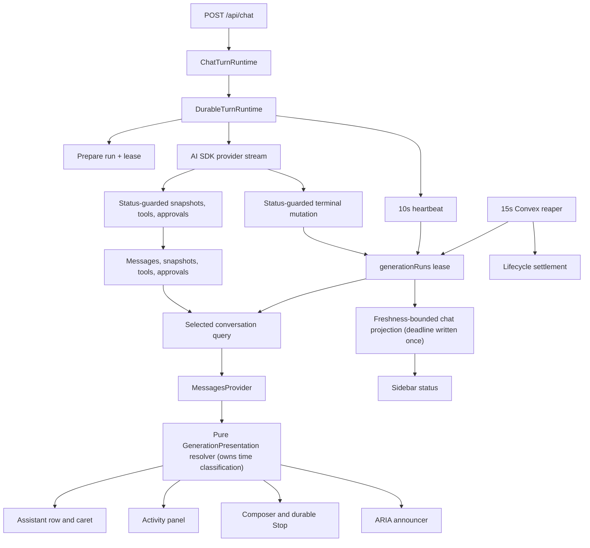

# Extend the existing Convex-native durable-turn architecture

The research report’s architecture remains materially valid against the current branch. The plan below refines it into an implementation contract; no files were changed.

## 1. Executive implementation decision

**[Proposed]** Extend the existing Convex-native durable-turn architecture:

- Continue using Assistant snapshots and selected-message subscriptions for durable content.
- Make `generationRuns` the sole durable liveness and control authority.
- Add a 10-second worker heartbeat and a 45-second lease; guard all worker writes by run identity, linkage, and worker-writable status (no fencing generation — see §10).
- Reconcile expired runs every 15 seconds through a Convex cron.
- Return the selected message path and its linked current run in one atomic Convex query, exposing raw durable facts; the client resolver owns all time-based classification.
- Derive one pure `GenerationPresentation` consumed by the Assistant row, Activity panel, composer, announcer, and sidebar.
- Add an authenticated, idempotent, explicitly run-scoped durable Stop mutation.
- Treat approval as a durable lease-free pause with its own expiry.
- Preserve partial output and honestly fail runs whose worker disappears. Do not attempt execution resumption.
- Keep the lifecycle’s failed-over-completed convergence: the response envelope’s completion signal fires for errored streams too, and both commit orders must converge to failed.

This intentionally does not add Redis, a replay service, resumable SSE, or another job system.

---

## 3. Design principles and invariants

1. **[Proposed] Content is not liveness.** Snapshots show persisted output only.
2. **[Proposed] Liveness is server-recorded, client-classified.** A run is live only if it owns `chat.statusRunId`, links to the selected Assistant message, has an active status, and its lease deadline has not passed. The server stores the deadline; **only the client resolver compares it to a clock** (Convex queries do not re-run on wall-clock time).
3. **[Proposed] First terminal outcome wins, with one deliberate exception.** `fail` may overwrite `completed` — the response envelope’s completion write races the stream `onError` on an errored stream, and both orders must converge to failed. `fail`/`complete` never overwrite `aborted` (a user Stop is settled). If completion never commits at all, the run remains active and the reaper later fails it.
4. **[Proposed] All worker writes are status-guarded.** Terminal settlement, Stop, supersession, and reaping make the previous worker read-only via absorbing terminal statuses; heartbeats additionally require a worker-executing status. No fencing generation is needed because no run is ever handed to a second worker (see §10).
5. **[Proposed] Control operations target explicit identities.** Stop targets `(chatId, runId)`, never “the active run.”
6. **[Proposed] Re-entry is observation only.** Mounting a chat never submits or resumes a model request. This includes SDK auto-send: adopted approval-responded parts from the server must not arm `sendAutomaticallyWhen` (§10, §11).
7. **[Proposed] Local transport has immediate precedence only when it matches the selected run.**
8. **[Proposed] Approval has no worker lease.** It is a durable pause with its own expiry. The pausing worker’s write era continues through its envelope finalize (final flush, completion downgrade) and ends at terminal settlement.
9. **[Proposed] One projection supplies selected content and run state.** It carries raw durable facts; capabilities and freshness are derived client-side.
10. **[Proposed] Frozen historical rows never become live merely because a raw part says `streaming`.**
11. **[Proposed] Connectivity affects presentation and capability, not durable lifecycle truth.**
12. **[Proposed] Partial content survives failure, Stop, supersession, and stale recovery.**
13. **[Proposed] A durable terminal for the locally attached run also cuts the local transport.** Otherwise a remote Stop leaves live chunks flowing under a stopped banner until the worker aborts.

---

## 4. Proposed architecture



**[Proposed] Responsibility boundaries:**

- `generation_run_lifecycle.ts`: allowable lifecycle transitions, first-terminal-wins plus the failed-over-completed convergence.
- New `generation_run_liveness.ts`: pure worker-writability, lease, ownership, and projection predicates. Note: the existing `isActiveGenerationRunStatus` includes `awaiting_approval`, so this module must define a distinct `isWorkerExecutingStatus` (`queued | running | streaming`) for heartbeats, while content writes remain legal on any non-terminal status.
- `chatRuntime.ts`: transactional enforcement and persistence.
- `DurableTurnRuntime`: heartbeat ownership and guarded worker calls.
- Selected-conversation query: atomic server projection of raw facts.
- New `run-presentation.ts`: pure cross-client presentation and capability resolution, **including all lease/expiry classification** against an injected clock with skew grace.
- Existing Assistant phase algebra: visual phase within the resolved execution state.

The HTTP stream remains request-bound (`route.ts` exports `maxDuration = 60`, so every legitimate run ends within 60 seconds). The lease proves that the current worker is alive; it does not make a dead worker resumable.

---

## 5. Data model and indexes

### `generationRuns`

| Field | Type | Stage | Purpose |
|---|---|---:|---|
| `heartbeatAt` | optional number | 1 | Last successful server-timestamped heartbeat |
| `leaseExpiresAt` | optional number | 1 | Stored expiry used by indexed reaping and client classification |
| `lastSnapshotSequence` | optional number | 1 | Reject stale snapshots before insertion |
| `lastProgressAt` | optional number | 1 | Latest accepted content/tool/approval progress; not liveness |
| `terminalReason` | optional union | 1 | `completed`, `user_stop`, `superseded`, `provider_error`, `lease_expired`, `approval_expired`, `request_aborted` |
| `stopRequestedAt` | optional number | 1 | Audit and optimistic reconciliation |
| `stopRequestedBy` | optional user ID | 1 | Authorized Stop actor |
| `supersededByRunId` | optional run ID | 1 | Explicit supersession relation |
| `continuationRunId` | optional run ID | 7 | Makes approval continuation idempotent |
| `continuedFromRunId` | optional run ID | 7 | Audits the new run created from approval |

**[Removed] `leaseGeneration`.** No run is ever reassigned to a second worker (approval continuation creates a *new* run; there is no lease takeover). Every event that would invalidate a fence — Stop, supersession, completion, failure, lease-expiry reaping — also changes `run.status` in the same transaction, so status guards reject every write a fence would reject. The fence added schema and plumbing through nine mutation types while guarding nothing, and incrementing it at approval creation rejected the same worker’s own final flush and completion downgrade. Reintroduce a fencing generation only if worker takeover ever ships.

**[Proposed]** Keep `heartbeatAt` separate from `lastProgressAt`. Silent model waits and long-running tools need heartbeats even with no content.

**[Proposed]** Store `leaseExpiresAt`. With a fixed TTL an index on `[status, heartbeatAt]` would be equally efficient; storing the expiry is still preferred because a TTL change never reinterprets old rows, and the client classifies against one explicit server-authored deadline.

**[Proposed]** Do not add `stop_requested` to the lifecycle enum. `stopping` is a client presentation while the Stop mutation is pending; the mutation terminalizes the run atomically.

**[Proposed]** Do not add `terminal_write_recovery`. If the terminal mutation never committed, Convex cannot prove the provider’s true outcome. The honest durable result is `failed/lease_expired`, accompanied by terminal-write-failure telemetry.

Indexes:

```text
generationRuns.by_status_lease_expires = [status, leaseExpiresAt]
generationRuns.by_status              = existing index (one-off cleanup scans)
```

> **Optional-field ordering caveat (load-bearing).** Convex orders `undefined < null < all other values`, and documents missing an indexed field are indexed as `undefined`. A range like `.eq("status","streaming").lt("leaseExpiresAt", now)` therefore **matches documents with no lease fields**. Every reaper scan must bound the range with `.gt("leaseExpiresAt", undefined)` (the docs-endorsed exclusion pattern) or explicitly require the field in the transactional re-read. The same applies to the approval-expiry index below.

### `toolApprovalRequests`

Add:

- `expiresAt?: number`

(`resolvedAt` and `resolvedByUserId` **already exist**; the `expired` status literal already exists but is never written today.)

Index:

```text
toolApprovalRequests.by_status_expires = [status, expiresAt]
```

Initial expiry: **24 hours**, operationally configurable. Backfill `expiresAt` on any pending rows before enabling the approval reaper, or the `undefined`-first ordering expires them instantly.

### `chats`

Add:

- `liveRunFreshUntil?: number`

**[Revised] Written once, not per heartbeat:**

- at prepare: `startedAt + maxDuration (60s) + slack` — a hard ceiling no legitimate run can exceed;
- at approval pause: the approval `expiresAt`;
- cleared at terminal transitions (alongside `liveRunStatus`).

A per-heartbeat mirror would re-execute every subscribed chat-list query for every viewer every 10 seconds per active run, purely to shave ~30 seconds off a staleness window the reaper already bounds. The once-written deadline gives the sidebar a freshness ceiling with zero recurring chat-doc writes; the reaper remains the precise settlement path.

### `messages`

No new liveness fields. Existing `generationRunId` remains the linkage. Message status is content/lifecycle display state, not liveness authority.

### Compatibility

Per the repository’s explicit pre-launch policy (AGENTS.md “The Database Is Disposable”):

- Fields deploy as optional (Convex schema requirement for existing rows), but new writes populate them **immediately** — no dual-write era.
- Development data that conflicts is wiped.
- Production contains at most smoke-test rows: settle any active-looking legacy rows with a **one-off** age-thresholded pass over `by_status` (`updatedAt` older than `maxDuration + slack`), or set `CONVEX_PROD_DB_DISPOSABLE` for one deploy.
- There is **no** standing compatibility reaper, no `legacy-unverified` projection state, and no telemetry-gated contraction phase. The main reaper’s `undefined` exclusion (above) already guarantees it can never touch a lease-less row.

---

## 6. Authoritative liveness model

### Lease policy

- Heartbeat cadence: **10 seconds**.
- Lease duration: **45 seconds**.
- Reaper cadence: **15 seconds**.
- Heartbeat retry: tolerate two consecutive **transport** failures; retry with bounded jitter. A transport failure (mutation did not commit) is retried; an explicit `{kind: "lost"}` rejection (run settled) aborts immediately and is never retried — the runtime must distinguish the two.
- On the third transport failure — or when the last confirmed lease approaches expiry — the runtime aborts local provider consumption and stops all worker writes.

This allows 4.5 heartbeat intervals of slack while bounding a zombie UI to roughly 60 seconds after worker death: 45-second expiry plus one 15-second reconciliation interval. Since `maxDuration = 60` bounds every run, the absolute worst case (worker dies at the 60-second platform kill) converges within ~2 minutes of turn start.

Convex cron jobs support second-level intervals and skip (never queue) a tick while the previous run of the same cron is still executing, which fits the bounded reaper design. [Convex cron documentation](https://docs.convex.dev/scheduling/cron-jobs). The reaper is an internal **mutation** (transactional, exactly-once per invocation) — never an action (at-most-once, silently droppable).

### Lease lifecycle

1. `prepareGeneration` creates the run with `heartbeatAt = now` and `leaseExpiresAt = now + 45s`, and writes `chat.liveRunFreshUntil = now + 60s + slack` once.
2. `DurableTurnRuntime` starts a recursive, non-overlapping heartbeat loop immediately after prepare succeeds.
3. The heartbeat mutation uses server `Date.now()`, never a client timestamp.
4. It validates:
   - exact run;
   - **worker-executing status** (`queued | running | streaming` — not `awaiting_approval`, not terminal);
   - run/message/chat linkage;
   - `chat.statusRunId === runId`.
5. A successful heartbeat extends the run’s `heartbeatAt`/`leaseExpiresAt` only. It does **not** touch the chat doc.
6. Completion, failure, abort, Stop, supersession, and reaping clear the lease fields as part of their terminal transaction. The approval pause clears them when the run enters `awaiting_approval`.
7. Heartbeat results are a three-way discriminant the runtime must branch on:
   - `{kind: "renewed"}` — continue;
   - `{kind: "paused"}` — run is `awaiting_approval`; stop the heartbeat loop, do **not** abort (the envelope finalize is still legitimate);
   - `{kind: "lost", …}` — run settled; abort provider consumption and stop emitting durable writes.

### Worker-write guards (replaces the fence)

Two predicates, both pure and owned by `generation_run_liveness.ts`:

- `isWorkerExecutingStatus` = `queued | running | streaming` — required by **heartbeats** only.
- Non-terminal (`!isTerminalGenerationRunStatus`) — required by **content writes** (snapshots, tool invocations, approval creation). This deliberately includes `awaiting_approval`: after the approval request persists, the same worker still performs its final snapshot flush and the completion downgrade inside `finalize`, and those writes must land (this matches today’s snapshot guard, which only rejects terminal runs).

### Long waits and tools

The heartbeat is independent of snapshot production and continues during:

- provider latency before the first token;
- reasoning with no persisted delta;
- long tool execution;
- image generation;
- idle periods between steps.

### Awaiting approval

- Approval creation persists the pending approval (with `expiresAt`), transitions the run to `awaiting_approval` via the existing lifecycle signal, clears the lease fields, and stamps `chat.liveRunFreshUntil = approval.expiresAt`.
- The pausing worker’s era is **not** over at approval creation: the envelope finalize still flushes the last snapshot (the tracker throttles at 750 ms, so a content tail routinely exists) and applies the completion→awaiting_approval downgrade that clears `activeStreamId`. Both remain legal because content writes are guarded by non-terminal status, and the completion downgrade remains legal on `awaiting_approval` exactly as today.
- Liveness comes from a pending unexpired approval, not a heartbeat.
- Approval continuation creates a new run. It does not reacquire the old paused worker’s role.

### Reaper

`convex/crons.ts` invokes bounded internal mutations:

- every 15 seconds for expired running/streaming leases, scanning `by_status_lease_expires` with `.gt("leaseExpiresAt", undefined).lt("leaseExpiresAt", now)`;
- every minute for expired approvals, scanning `by_status_expires` with the same `undefined` exclusion;
- maximum 100 candidates per status per invocation, repeated by the next scheduled run if needed.

Each candidate is transactionally re-read and validated: still the same status, `leaseExpiresAt` present and still expired, still linked. If valid:

- lifecycle transitions to `failed`;
- `terminalReason = lease_expired` (or `approval_expired`);
- partial Assistant content remains;
- lease fields clear;
- pending approvals and active tool records settle;
- chat projection clears only if the run still owns `statusRunId`;
- structured reaper telemetry is emitted.

A heartbeat and reaper mutation cannot create an inconsistent partial result: Convex retries transactional conflicts, so one observes the other’s committed state.

**Deploy-boundary rule:** enable the reaper only after every in-flight run started by a pre-heartbeat deploy has drained (> 60 seconds after the heartbeat deploy). With the `undefined` exclusion this is belt-and-suspenders, but it costs nothing.

---

## 7. Selected-conversation projection

### Contract

Use `selectedRun`, not `activeRun`, because the UI needs the current linked terminal reason during convergence (`statusRunId` is deliberately kept after a terminal transition):

```ts
type SelectedConversationProjection = {
  selectedMessages: UIMessageLike[]

  selectedRun: {
    runId: Id<"generationRuns">
    assistantMessageId: Id<"messages">
    status: GenerationRunStatus
    terminalReason?: TerminalReason

    leaseExpiresAt?: number
    lastSnapshotSequence?: number
    lastProgressAt?: number

    activeToolNames: string[]
    pendingApproval?: PendingApprovalProjection // includes expiresAt
  } | null
}
```

**[Revised] No server-computed `freshness`, `controllable`, `stoppable`, or capability booleans.** Convex query results are computed at a logical timestamp and re-execute only when data they read changes. If the worker dies, nothing writes until the reaper fires — a server-classified `"fresh-worker"` result would keep being served unchanged for up to a minute, and an `"expired"` classification would be unreachable through the subscription. The projection carries raw durable facts; the pure client resolver (§8) classifies them against an injected clock. Server-side derivation is retained only for non-temporal facts: ownership, chat/run linkage, selected-path membership.

### Query rules

**[Proposed]** Add `messages.getSelectedConversation` and make it the authenticated client’s primary selected-message subscription.

Within one Convex query transaction:

1. Authenticate and load the chat.
2. Compute the selected visible message path using the existing server-side helper (`getSelectedPathMessages`; `getForChat` already does this).
3. Read `chat.statusRunId` directly.
4. Return a run only if:
   - it belongs to the chat and owner;
   - its `assistantMessageId` is on the selected path;
   - the linked message points back to the same run;
   - it still owns the chat status slot.
5. Load active tool names and pending approval only for that validated run.
6. Return terminal current-run metadata (status + `terminalReason`) rather than pretending it remains active; the resolver treats terminal statuses as settled.
7. Return `selectedRun: null` for public or non-owner viewers. Guest/local chats never reach this query (they have no runs); the provider keeps its persistence-mode gating.

This replaces the owner’s current `getForChat` subscription. It must not wrap that query with an independent run subscription because that would reintroduce torn combinations.

The public-chat query remains separate and never exposes run IDs, lease times, model/provider control metadata, or approval capabilities.

> **Read-amplification note.** `getForChat` already collects **all** messages of the chat per execution. Folding the run doc into the same query means every 10-second heartbeat re-executes that collect for each open viewer, in addition to every snapshot write (~750 ms while streaming). This is acceptable — streaming already dominates — but it is the measured cost of atomicity and belongs in the §15 write/read-volume telemetry.

---

## 8. Presentation state machine

### Resolver inputs

New pure module: `lib/chat-runs/run-presentation.ts`.

Inputs:

- local AI SDK transport status;
- `isSubmitting`;
- locally attached Assistant message ID;
- selected messages and selected Assistant ID;
- `selectedRun` (raw facts, §7);
- pending Stop run ID;
- Convex connection state;
- last projection receipt time;
- current time (injected);
- clock-skew grace (constant, initially **5 seconds**).

The resolver owns lease classification: a run is *fresh* iff `now < leaseExpiresAt + skewGrace`; a pending approval is *unexpired* iff `now < approval.expiresAt + skewGrace`. `leaseExpiresAt` is server-authored, so skew only shifts the boundary by clock drift; the durable reaper remains authoritative.

`useConvexConnectionState()` exposes `isWebSocketConnected`, retry counters, and in-flight request state suitable for presentation — not durable lifecycle decisions. Verified present in the installed `convex@1.42.1`. [Convex React API](https://docs.convex.dev/api/modules/react).

### Local/run matching

- Before prepare is reflected, local `submitted` renders immediately without waiting for a heartbeat.
- Once the selected run appears, match it to the local stream through the selected Assistant message ID (the durable runtime streams the durable `assistantMessageId` as the message identity, so this match is exact).
- Cache `attachedRunId` only after this match.
- Never match solely by “last run in chat.”
- If a terminal projection arrives during hydration, terminal state wins immediately.
- **When the resolver yields a terminal (or stopping) presentation for the locally attached run, it also triggers local `stop()`** — otherwise a remote Stop leaves live transport chunks flowing and re-diverging under a stopped banner until the worker aborts (up to one heartbeat interval later).

### Precedence

1. Durable terminal result.
2. Durable pending approval.
3. Locally pending Stop.
4. Matching local attached stream.
5. Fresh durable background run (client-classified).
6. Expired or unverifiable active-looking run.
7. Settled.

### Complete state table

Freshness in this table is always the **client-derived** classification above.

| State | Authority | Freshness | Row / Activity | Caret | Stop | Edit/regenerate | Approval | Exit |
|---|---|---|---|---:|---|---|---|---|
| `local-submitted` | local transport | none required yet | “Starting…” / submitted | No | Local Stop; durable when run appears | Disabled | No | Local stream, run projection, error |
| `local-streaming` | matched local + run | local immediate | Existing phase; source=`local` | When responding with content | Local + durable | Disabled | As persisted | Terminal, approval, Stop |
| `background-streaming` | selected run | fresh lease (client-classified) | “Generating in background”; durable reasoning/tool phase | Only active responding text | Durable Stop | Disabled | No unless paused | Terminal, stale, approval |
| `awaiting-approval` | pending approval | unexpired approval (client-classified) | Existing approval UI | No | Durable Stop | Disabled | Enabled for authorized owner | Approved, denied, expired, stopped |
| `stopping` | local pending mutation | last-known run | “Stopping…”; no animated generation timer; local transport cut | No | Disabled/retry state | Disabled | Disabled | Mutation result or reconnect |
| `possibly-stale` | active-looking projection | expired/unverifiable | Preserve partial content; “Checking generation status” | No | Available online for exact run; queue intent offline | Disabled | Only if valid pending approval | Reaper, reconnect, Stop |
| `completed` | durable terminal | n/a | Settled; empty-output fallback if needed | No | No | Existing settled policy | No | New generation |
| `stopped` | `aborted/user_stop` | n/a | Partial content + stopped treatment | No | No | Existing stopped policy | No | New generation |
| `failed` | durable failed | n/a | Partial content + retry affordance | No | No | Regenerate/retry per existing rules | No | Retry |
| `superseded` | durable aborted/superseded | n/a | Historical partial row, never live | No | No | Historical rules | No | None |
| `settled` | no current linked run | n/a | Existing settled row | No | No | Existing settled policy | No | New generation |

Guest/local chats bypass the durable branches entirely: `selectedRun` is always `null`, and the resolver reduces to the current local-only behavior.

### Assistant phase integration

Keep the existing phase kinds. Replace `AssistantTurnRenderStatus` with:

```ts
type AssistantExecution = {
  active: boolean
  source: "local" | "background" | "none"
  presentation: GenerationPresentation
}
```

`deriveAssistantTurnPhase(view, { execution, isLast })` then chooses thinking, image, tooling, responding, approval, or settled using durable evidence.

Rules:

- No content + fresh run: submitted/thinking, with “Generating in background” after re-entry.
- Reasoning active: thinking phase if durable reasoning part is active and the run is fresh.
- Tool active: tooling phase even without Assistant text.
- Image tool active: existing generating-image phase.
- Some text + fresh run: responding with caret.
- Stop pending: no active phase animation.
- Lease deadline passed: settled visual content plus restrained recovery status.
- Disconnected: preserve the last known phase only through a 15-second presentation grace and no later than the known lease expiry.
- Empty completed response: terminal empty-output fallback, never a loader.
- Partial failed/stopped/superseded response: preserve content and show the appropriate terminal treatment.

Historical rows remain settled unless they are the selected run’s linked Assistant message.

---

## 9. Durable Stop and control semantics

Add:

```ts
stopGenerationRun({
  chatId,
  runId,
}): {
  outcome: "stopped" | "already-terminal" | "not-current"
  status: GenerationRunStatus
  terminalReason?: TerminalReason
}
```

**[Removed] `expectedLeaseGeneration`.** There is no fence (§5), and a returning client can never know a current generation anyway; a precondition it can only ever omit is dead weight.

### Transaction

1. Authenticate ownership.
2. Load explicit run and chat.
3. Verify run belongs to chat.
4. If already terminal, return its canonical result.
5. If it no longer owns `chat.statusRunId`, return `not-current`; never stop the newer owner. (Because `statusRunId` transfers only at a newer prepare, which supersedes active runs transactionally, a run that lost the slot is already terminal or is an `awaiting_approval` run the next prepare’s deny-pending pass closes — `not-current` can never orphan a live run.)
6. Apply lifecycle abort with `terminalReason = user_stop`.
7. Record Stop audit fields.
8. Clear lease fields and stream ownership.
9. Preserve partial message content and move its status to the existing aborted representation.
10. Deny or expire pending approvals for that run.
11. Settle active tool invocations without erasing completed evidence.
12. Clear chat live projection (and `liveRunFreshUntil`) only if the run still owns it.
13. Return the canonical terminal outcome.

### Client orchestration

- Attached initiating client:
  1. set local `stopping`;
  2. call local AI SDK `stop()` promptly;
  3. invoke the durable mutation;
  4. reconcile from the projection.
- Returning client:
  1. set local `stopping`;
  2. invoke the durable mutation only.
- Attached client observing a **remote** Stop (or any durable terminal) for its run: the resolver’s terminal side effect calls local `stop()` (§8) — convergence must not wait for the worker to notice.
- Offline:
  - retain one run-scoped Stop intent;
  - disable repeat activation;
  - announce “Stop will be sent when reconnected”;
  - retry exactly that `(chatId, runId)` after reconnect;
  - discard it if a newer run owns the chat.

### Races

- Two Stops: first wins; second returns `already-terminal`.
- Completion/failure versus Stop: the first committed terminal transition wins; `aborted` is absorbing (neither `complete` nor `fail` may repaint it — existing lifecycle rule).
- Approval creation versus Stop: one transaction wins; if approval wins, Stop can subsequently abort it. If Stop wins, the approval creation is rejected by the terminal-status guard.
- Approval response versus Stop: the first lifecycle transition wins; continuation creation is conditional on the old run still being awaiting approval and lacking `continuationRunId`.
- New generation versus Stop: explicit current-run ownership prevents Stop from touching the newer run.
- Snapshot/heartbeat versus Stop: Stop terminalizes the run; delayed worker writes are rejected by the status guards and return `lost`.
- Provider cancellation is eventually operational. Convex terminal state is immediate product truth even if the remote provider continues briefly.

---

## 10. Backend lifecycle changes

### Lifecycle algebra

Update `generation_run_lifecycle.ts`:

- Keep the existing status enum.
- Add terminal reason to lifecycle results.
- **Keep the failed-over-completed convergence.** The AI SDK envelope’s `onEnd` fires for errored streams with `isAborted: false`, so on an errored stream both a fire-and-forget `fail` (stream `onError` → `noteStreamError`) and an awaited spurious `complete` (envelope → `finalize`) are emitted in nondeterministic order. Strict first-terminal-wins would durably mislabel the run `completed` whenever the completion serializes first, hiding the failure and its retry affordance; the existing regression test (`converges to failed in both orders of the onError/envelope-finish race`) pins this. `aborted` remains absorbing against both.
  - *Considered and rejected for now:* adopting strict first-terminal-wins by suppressing the spurious completion at the source (track `streamErrored` in the turn closure; `finalize` issues an awaited `fail` instead of `complete`; make the failure write awaited/retried). This is a valid future cleanup but is runtime surgery orthogonal to this plan; do not remove the lifecycle exception before it lands.
- Make every other terminal state absorbing.
- Add explicit signals:
  - `stop`;
  - `lease-expired`;
  - `approval-expired`;
  - retain `supersede`, `complete`, `fail`, `abort`, approval signals.
- Return a discriminated result: `applied`, `already-terminal`, or `invalid-transition`.

### Guard matrix (replaces the fencing matrix)

| Write | Required guards |
|---|---|
| Heartbeat | run ID, **worker-executing status** (`queued/running/streaming`), message link, current chat owner (`statusRunId`) |
| Snapshot | run ID, **non-terminal status** (includes `awaiting_approval` — the pausing worker’s final flush must land), message link, sequence greater than `lastSnapshotSequence`; reject before insert |
| Tool invocation | run ID, non-terminal status, message link, monotonic per-tool transition (adds the terminal guard `recordToolInvocationsForChat` lacks today) |
| Approval creation | run ID, active status (existing lifecycle `approval-requested` rule), stable approval ID; sets `expiresAt`; clears lease; stamps `liveRunFreshUntil` |
| Completion (incl. awaiting_approval downgrade) | run ID, active status per existing lifecycle (`awaiting_approval` legal), message/chat link; terminal lifecycle |
| Failure/abort | run ID; terminal lifecycle (failed-over-completed per above) |
| Stop | authenticated control write; explicit current run |
| Supersession | control write; old run identity; terminal lifecycle; set `supersededByRunId` |
| Sidebar projection | only the `chat.statusRunId` owner may change status/freshness |
| Reaper | indexed expiry with `undefined` exclusion, transactional re-read, current owner, lease fields present and still expired |

All worker methods return an explicit discriminated result (`applied` / `paused` / `lost`). Expected rejections must no longer disappear inside fire-and-forget logging.

### Snapshot sequencing

- Worker sequence begins at the value returned by prepare (0 for every new run; runs are never handed to a second worker).
- `updateAssistantSnapshot` rejects `sequence <= lastSnapshotSequence` **before** inserting a snapshot (today the row is inserted first and only adoption is guarded).
- A valid snapshot updates the Assistant message, run sequence, and `lastProgressAt`.
- It does not renew the heartbeat.

### Approval resolution and continuation

- Approval resolution mutations transition **only** `pending → approved|denied` and return the canonical decision. (Today `approveToolCall`/`denyToolCall` patch unconditionally; a late deny can overwrite an earlier approve.) A conflicting second decision returns the already-resolved result; the client renders “Already resolved.”
- Continuation is dispatched by the client’s `useChat` auto-send (`sendAutomaticallyWhen: lastAssistantMessageIsCompleteWithApprovalResponses`), so idempotency must be enforced at three layers:
  1. **Server:** the continuation prepare checks `continuationRunId` on the paused run inside the transaction; the first continuation creates the new run and records both relation fields; a second attempt is rejected with a **typed conflict result**.
  2. **Route:** the typed conflict maps to a structured 409-style response the client recognizes.
  3. **Client:** only the tab that locally called `addToolApprovalResponse` may auto-send. Approval-responded parts adopted from the server (another tab resolved) must not arm `sendAutomaticallyWhen` — gate auto-send on a local “this client resolved it” flag, and verify the SDK does not evaluate the predicate on `setMessages` hydration (pin this with a test; if it does, strip/normalize adopted approval state before hydration). A tab whose continuation POST loses the race swallows the conflict without marking anything failed or repainting durable state; it simply observes the winner’s run through the projection.

### Runtime terminal convergence

- Keep the heartbeat active while the runtime makes bounded terminal-mutation retries.
- If terminal settlement succeeds, stop heartbeat.
- If retries are exhausted, emit `terminal_mutation_failed`, stop heartbeat, and let lease expiry converge to durable failure.
- A heartbeat `{kind: "paused"}` (approval pause) stops the loop without aborting; only `{kind: "lost"}` aborts provider consumption.
- Never keep heartbeat alive indefinitely after provider execution ends.

---

## 11. Frontend integration

### Messages provider and selected path

- Change `MessagesProvider` to consume `getSelectedConversation`, preserving its existing persistence-mode gating (guest/local chats never subscribe).
- Expose `{messages, selectedRun}` from one context value.
- Continue using `selected-path.ts` to reconcile durable content into `useChat`.
- Require incoming server content to match the selected run/message linkage.
- Keep adoption monotonic: server-side sequence guards already prevent stale snapshots from reaching the projection; client adoption keeps its growth/terminal-override rules and never truncates newer local content.

### `use-chat-core.ts`

- Consume `selectedRun` and Convex connection state.
- Track the selected Assistant message ID associated with local submission.
- Hydrate `attachedRunId` only from a matching projection.
- Compute `GenerationPresentation` through the pure resolver.
- Replace the returned local-only Stop function with the orchestrated local-plus-durable Stop.
- Call local `stop()` when the resolver reports a durable terminal/stopping state for the attached run (§8).
- Do not call `sendMessage` on mount or re-entry, **including via SDK auto-send from adopted approval parts** (§10).
- Harden approval response and continuation idempotency per §10.

### Conversation and Assistant row

- Replace `generationActive` and local-only row status overrides with the resolved presentation.
- Suppress editing, regeneration, branch changes, footer actions, and message replacement while local/background/stopping/stale.
- Show caret only for fresh local/background responding with content.
- Preserve terminal banners and partial content.

### Activity panel

- Feed it the same `AssistantExecution`; do not add another loader.
- Follow the fresh selected run after re-entry.
- Preserve a user-selected historical Activity item rather than forcing it back to latest.
- Use existing local timer behavior for attached streams.
- After re-entry, show indeterminate active wording rather than inventing elapsed reasoning time from `startedAt`.
- When stale or disconnected beyond grace, freeze timers and remove live animation.
- Completed durable reasoning duration remains available from existing persisted evidence.

### Composer and accessibility announcer

- Composer primary action depends on `presentation.stoppable` (a resolver output, not a projection field), not AI SDK status alone.
- A returning client sees Stop for a fresh controllable run.
- Extend the existing `ChatStatusAnnouncer`/`ChatAnnouncerOutlet` regions (do not add a new live region):
  - “Generating response.”
  - “Generating in background.”
  - “Approval required.”
  - “Stopping generation.”
  - “Generation status is temporarily unavailable.”
  - “Generation stopped.”
  - “Generation failed.”
- Use polite `aria-live` for progress and assertive output only for actionable errors.
- Stop and approval controls remain actual keyboard-operable buttons with visible focus.
- Reduced-motion mode suppresses shimmer/pulse without removing status text.

### Sidebar

- Derive status from `liveRunStatus + liveRunFreshUntil` (the once-written deadline, §5).
- Add `stale` to the sidebar derivation, or map it to an existing non-animated recovery indicator if product prefers fewer visual states.
- An expired deadline never renders a streaming spinner.
- Terminal/unread/error precedence remains consistent with current behavior.

### Connectivity

- Connected + fresh: normal background state.
- Reconnecting: retain last known state for up to 15 seconds and never beyond the known lease expiry.
- Offline: show an offline qualifier; do not mutate durable status.
- After grace/expiry: `possibly-stale`, no caret or live timer.
- Reconnected terminal: terminal result wins (and cuts an attached local stream).
- Reconnected newer run: discard cached old run and pending old Stop.
- Reconnected expired run: stale until reaper settles.
- Offline Stop: queue an exact run-scoped intent; never send it against a new owner.

---

## 12. File-by-file change map

| File | Responsibility and planned change | Dependencies | Tests |
|---|---|---|---|
| `convex/schema.ts` | Add optional lease, progress, terminal-reason, Stop, supersession, continuation, approval-expiry, and chat freshness fields; add indexes | None | Schema/type generation, Convex lifecycle tests |
| `convex/domain/generation_run_lifecycle.ts` | Terminal reasons; Stop/expiry signals; keep failed-over-completed; discriminated results | Schema types | Existing lifecycle tests (both-orders convergence retained) |
| `convex/domain/generation_run_liveness.ts` **new** | Pure worker-executing/non-terminal predicates, lease math, ownership, projection predicates | Lifecycle/status types | New pure unit suite |
| `convex/chatRuntime.ts` | Prepare lease + freshness deadline, heartbeat, guarded writes (incl. terminal guard on tool writes), durable Stop, approval pending-only resolution + typed continuation conflict, supersession metadata, reaper helpers, atomic selected-run projection | Schema and domain helpers | `chatRuntime.test.ts` |
| `convex/crons.ts` **new** | Register stale-run and approval-expiry reconciliation (internal mutations, `undefined`-excluding ranges) | Internal mutations | Cron/reaper integration tests |
| `convex/messages.ts` | Add atomic selected-conversation query; reuse server-side selected-path helper; public redaction | Runtime projection helpers | Query authorization/projection tests |
| `app/api/chat/durable-turn-runtime.ts` | Own heartbeat loop with renewed/paused/lost branching; abort on ownership loss; terminal retry/cleanup | Convex mutations | Existing runtime and internals suites |
| `app/api/chat/chat-turn-runtime.ts` | Compose worker-loss abort signal with request/provider signals; terminal-failure telemetry; map continuation conflict to a typed response | Durable runtime | Runtime and AI SDK seam tests |
| `app/api/chat/route.ts` | No architectural ownership change; pass through runtime behavior | Chat runtime | Existing route/runtime tests |
| `lib/chat-runs/run-presentation.ts` **new** | Pure presentation, capability, connection-grace, lease/skew classification resolver | Projection types | Dedicated table tests |
| `lib/chat-store/turns/selected-path.ts` | Require matching selected run/message; preserve monotonic adoption | Projection context | Existing selected-path tests |
| Messages provider module | Subscribe to selected messages and run atomically; expose connection/projection; preserve guest gating | New query | Provider tests |
| `app/components/chat/use-chat-core.ts` | Match local stream to run, resolve presentation, durable Stop, terminal→local-stop side effect, reconnect intent, approval/continuation gating | Provider and resolver | Existing hook suites |
| `app/components/chat/conversation.tsx` | Replace local-only row liveness; suppress actions; pass execution state | Resolver | Existing conversation tests |
| `lib/chat-messages/assistant-turn.ts` | Consume `AssistantExecution`; retain phase kinds | Resolver types | Existing phase tests |
| `lib/chat-messages/assistant-activity.ts` | Use fresh execution state for live reasoning/tools; stale and terminal copy | Assistant phase | Activity unit tests |
| `app/components/chat/message-assistant.tsx` | Phase-driven caret/action behavior | Conversation/phase | Component tests |
| `app/components/chat/use-activity-panel.ts` | Background selection, timer policy, stale/disconnect behavior | Execution state | Existing panel tests |
| `app/components/chat-input/composer.tsx` | Presentation-driven Stop/action state | Stop handler | Existing composer tests |
| `app/components/chat/chat-announcer.tsx` | Announce background/stale/terminal transitions via the existing regions | Presentation | A11y tests |
| `lib/chat-store/status/sidebar-chat-status.ts` | Freshness-bounded streaming/awaiting/stale derivation | Chat mirror fields | Existing status tests |
| `app/components/layout/sidebar/sidebar-item-status.tsx` | Accessible stale/background/approval labels without indefinite animation | Sidebar state | Component tests |

`generation_run_liveness.ts` is justified because worker-writability, lease math, and ownership checks are shared by prepare, heartbeat, snapshots, tools, approvals, Stop, terminal writes, queries, and reaping — and because the required `isWorkerExecutingStatus` predicate deliberately differs from the existing `isActiveGenerationRunStatus` (which includes `awaiting_approval`). Keeping them pure prevents transactional handlers from drifting.

`run-presentation.ts` is justified because at least six frontend surfaces otherwise reproduce subtly different local/background/stale booleans, and because it is the **only** place time-based classification may live (§7).

---

## 13. Race-condition walkthrough

Test IDs map to the verification suites in §14.

| # | Start / competing operations | Authoritative transition | Content and UI | Final state / guard / test |
|---:|---|---|---|---|
| 1 | Text streaming; navigate away | No lifecycle change; heartbeat continues | Snapshots continue; return shows background response/caret | Completed or active; fresh lease; B1 |
| 2 | Reasoning streaming; navigate | Same | Durable reasoning remains thinking; no fabricated timer | Active/terminal; lease + phase evidence; B4 |
| 3 | Active tool, no text; navigate | Same | Tool Activity shown after return | Active/terminal; tool record + fresh lease; B5 |
| 4 | Return before next snapshot | Run query shows fresh run | Existing partial content or empty “Generating in background” | Active; liveness independent of content; R1 |
| 5 | Snapshot exists; terminal pending | Fresh active run | Partial content active until terminal commits | Terminal later; atomic projection; R2 |
| 6 | Terminal commits during hydration | Terminal precedence | Any local/background loader disappears immediately | Terminal; pure resolver precedence; R3/B13 |
| 7 | Stop commits before navigation | `aborted/user_stop` | Partial content preserved; return shows stopped | Terminal; absorbing lifecycle; C1 |
| 8 | Navigate then Stop | Explicit durable Stop | Returning page moves stopping→stopped | Terminal; run-scoped mutation; B8 |
| 9 | Client disconnects, worker lives | Heartbeat continues | Background snapshots remain visible | Normal terminal; server stream consumption + lease; B1 |
| 10 | Worker dies while streaming | Lease expires; reaper fails run | Partial content, stale recovery, then failed | `failed/lease_expired`; indexed reaper; B11 |
| 11 | New generation starts | Old run superseded; new run claims chat | Old partial row settles; new row becomes live | Old aborted/superseded, new active; status owner; C2 |
| 12 | Old snapshot arrives after new run | Rejected | No insert/adoption/repaint | New run unchanged; terminal-status guard + owner + sequence; C3 |
| 13 | Old completion arrives after new run | Rejected/already terminal | New row remains active | Old superseded; absorbing lifecycle; C4 |
| 14 | Two tabs observe one run | Same atomic projection | Both show identical background state | One durable truth; query projection; R4/B7 |
| 15 | Two tabs Stop | First terminal mutation wins | Both converge to stopped | `aborted/user_stop`; idempotent Stop; C5/B9 |
| 16 | Stop races approval response | First valid lifecycle transition wins | No approval can resurrect stopped run | Stopped or continued once; approval/Stop guards; C6 |
| 17 | Two tabs submit approval | First pending→resolved wins | Second sees canonical resolution/new continuation | Exactly one continuation; pending-only guard + continuationRunId; C7 |
| 18 | One tab regenerates | New run supersedes old | Other tab atomically adopts new owner/path | Old superseded, new active; statusRunId; B10 |
| 19 | Await approval, reload, continue | Lease-free pause; one continuation | Approval remains actionable; new run starts once | Old completed/aborted per policy, new active; C8/B6 |
| 20 | Approval expires unattended | Approval reaper expires/settles run | On return shows expired/failed terminal, no action | `failed/approval_expired`; expiry index; C9 |
| 21 | Tool active, no Assistant text | Fresh lease + active tool | Tool Activity and background status, no caret | Active/terminal; projection tool evidence; R5 |
| 22 | Completes with no visible content | Completion wins | Empty-response terminal fallback, no loader | Completed; terminal precedence; R6 |
| 23 | Convex temporarily disconnects | No durable transition | Brief retained state + offline badge, then stale | Durable run unchanged; grace bounded by lease; R7/B12 |
| 24 | Reconnect after completion | Terminal projection wins | Loader/stale state clears | Completed; atomic re-query; R8 |
| 25 | Provider ends; terminal mutation fails | Heartbeat stops after retries; reaper wins | Partial content becomes stale, then failed | `failed/lease_expired`; terminal retry + reaper; D1/B14 |
| 26 | One/two heartbeat transport failures | Lease remains last-confirmed | Active until expiry; no immediate false failure | Healthy if renewal recovers; retry budget; D2 |
| 27 | Worker’s run settled (Stop/supersede/reap); worker emits chunks | Every write rejected by terminal-status guard; runtime aborts on `lost` | No new durable content or liveness | Existing winner remains; absorbing status; D3 |
| 28 | Reaper races valid heartbeat | Convex transaction conflict/retry | No premature failure if heartbeat renews first | Renewed or reaped consistently; expiry re-read; C10 |
| 29 | Public/non-owner opens chat | Run projection denied/null | Selected public content only; no controls/runtime data | No leak; authorization and public contract; C11 |
| 30 | Run terminal, message says streaming | Terminal run dominates | Settled terminal UI, no caret/spinner | Terminal; resolver ignores raw message liveness; R9 |
| 31 | Stream errors; envelope completion races `onError` failure (both orders) | Converges to **failed** via the retained lifecycle exception | Failed banner + retry; never a silent “completed” partial | `failed/provider_error`; failed-over-completed rule; C12 (extends the existing regression test) |
| 32 | Approval request persists; same worker’s final flush + completion downgrade follow | Both accepted (non-terminal guard includes `awaiting_approval`) | Pre-approval content tail preserved on re-entry; `activeStreamId` cleared | `awaiting_approval`; content-write guard; C13 |
| 33 | Two tabs auto-continue after approval (SDK auto-send) | First continuation prepare wins; second gets typed conflict | Loser swallows conflict; no failed repaint; observes winner’s run | Exactly one continuation; continuationRunId + client gating; C14/R12 |
| 34 | Remote Stop while attached tab still streams locally | Durable terminal; resolver cuts local transport | No content growth or flicker under stopped banner | Stopped; terminal→local-stop side effect; R10 |
| 35 | Client clock skewed vs `leaseExpiresAt` | None (presentation only) | Skew grace prevents false `possibly-stale`; reaper remains authority | Unchanged durable state; skew grace; R11 |
| 36 | Deploy-boundary run without lease fields, still streaming | Main reaper never matches it (`undefined` exclusion); one-off age sweep settles truly dead rows | No mid-stream false failure | Guarded range + drain rule; C15 |
| 37 | Heartbeat transport failure vs explicit `lost` rejection | Retry budget for transport; immediate abort on `lost`; loop stop on `paused` | No abort on a healthy blip; no zombie writes after loss | Discriminated heartbeat result; D4 |

---

## 14. Verification strategy

All automated coverage below runs on infrastructure the repository already has: vitest (`node` default), the per-file jsdom pragma convention for DOM tests, and the existing `convex-test`-based suites (`chatRuntime.test.ts`, lifecycle tests). A browser/E2E harness does **not** currently exist (no Playwright, no `@vitest/browser`); building one is separately scoped follow-on work (§17, optional PR 9) and is not a gate for this plan.

### Pure unit tests

Add table-driven tests for:

- every presentation precedence pair;
- local submission before run hydration;
- matching and mismatching Assistant IDs;
- lease boundary at `expiresAt - 1`, `expiresAt`, `expiresAt + 1`, and around the skew grace;
- connection grace bounded by known lease expiry;
- terminal dominance over local streaming and stopping, including the local-stop side effect for the attached run;
- pending approval dominance;
- stale behavior and action availability;
- caret visibility;
- Assistant phase with local/background/stale evidence;
- frozen historical raw parts;
- sidebar freshness (once-written deadline) and precedence;
- guest mode (`selectedRun: null`) reduces to current local-only behavior.

Use injected `now`; no fake real-time sleeps.

### Convex tests

Extend `convex/chatRuntime.test.ts` and lifecycle tests:

- prepare initializes lease fields and the chat freshness deadline;
- heartbeat renews only worker-executing statuses; returns `paused` on `awaiting_approval` and `lost` on terminal;
- Stop is idempotent and returns canonical outcomes; `not-current` never touches the newer owner;
- stale snapshot rejected **before** insertion; lower sequence rejected;
- tool/approval writes rejected after terminal (new guard on tool writes);
- snapshot flush and completion downgrade accepted on `awaiting_approval` (race #32);
- completion versus Stop in both commit orders; **completion versus failure in both commit orders converges to failed** (retain and extend the existing regression test — do not delete it);
- supersession prevents all old writes;
- reaper and heartbeat in both commit orders;
- reaper range never matches documents with missing `leaseExpiresAt`/`expiresAt` (race #36);
- old run cannot clear new chat projection;
- pending approval expiry;
- approval resolution transitions only `pending`; conflicting decision returns canonical result;
- two continuation prepares create exactly one continuation; the second returns the typed conflict;
- public/non-owner projection redaction.

### Runtime integration tests

Extend both durable runtime suites:

- heartbeat starts after prepare and does not overlap;
- heartbeat continues without snapshots;
- heartbeat cleanup on completion, approval pause (`paused` stops the loop without aborting), abort, and provider error;
- two transient heartbeat transport failures recover; an explicit `lost` aborts immediately and is not retried;
- ownership-loss response aborts provider consumption;
- terminal mutation retries while heartbeat remains active;
- retry exhaustion stops heartbeat and permits reaping;
- local request abort and durable Stop use distinct signals;
- no unhandled fire-and-forget rejection.

### React integration tests

(Existing per-file jsdom convention.)

- remount with fresh background run;
- remount before first content;
- remount with expired lease;
- approval reload; adopted approval-responded parts do **not** trigger auto-send (pin the SDK behavior — race #33);
- background reasoning/tool/image Activity;
- action suppression and caret;
- durable Stop from an unattached client;
- remote Stop cuts the attached tab’s local transport (race #34);
- Stop intent while offline and safe reconnect;
- terminal projection arriving during hydration;
- newer run replacing a cached old run;
- aria-live transition assertions;
- reduced-motion presentation.

### Browser verification (manual checklist now; automated later)

Until the E2E harness exists (optional PR 9), the fifteen end-to-end flows below are a written manual checklist executed before enabling the presentation flag, using a deliberately slow model/prompt:

| Scenario | UI check | Data check (Convex dashboard) |
|---|---|---|
| Navigate away/return mid-text | Background label, partial text, Stop | Fresh run and increasing snapshots |
| Reload mid-text | Same content and background caret | Same run ID |
| Reload before first token | “Generating in background,” no fake text | Fresh run, no snapshot required |
| Reload during reasoning | Thinking Activity, no invented elapsed time | Reasoning snapshot |
| Reload during tool | Tool label without Assistant text | Active tool record |
| Reload during approval | Approval controls restored; content tail present | Pending approval, no lease |
| Second tab | Both tabs show same run | One run only |
| Stop from tab two | Both settle stopped; tab one’s stream cut | Run aborted, lease cleared |
| Simultaneous Stop | One outcome, no error loop | One terminal transition |
| Newer generation | Old settles, new becomes live | Old superseded, new owner |
| Worker death (kill dev server mid-stream) | Stale then failed | Lease-expired reason |
| Convex disconnection (offline toggle) | Offline qualifier then stale | Durable state unchanged |
| Complete during hydration | No zombie loader | Terminal run/message |
| Approve in two tabs | One continuation; loser shows no error repaint | One continuation run |
| Terminal zombie sweep | No spinner after any terminal | Chat projection cleared |

When the harness is built, these become automated with deterministic provider barriers (`beforeFirstToken`, `afterReasoning`, `toolStarted`, `beforeSnapshot`, `beforeTerminal`, `terminalMutationFailure`, `heartbeatReject`, `workerDeath`) and semantic waits — no arbitrary sleeps.

---

## 15. Observability and operational readiness

Emit structured events, without content payloads, for the writes that verify the invariants:

- `run_heartbeat_rejected` — explicit `lost`/`paused` outcomes (`run_heartbeat_failed` for transport failures)
- `run_snapshot_stale_rejected`
- `run_stale_reaped`
- `run_terminal_mutation_failed`
- `run_stop_won` / `run_stop_lost`
- `run_continuation_conflict`
- `run_projection_message_mismatch`

Dimension events with run/chat/request IDs, status, terminal reason, and mutation result kind. Track heartbeat write volume and combined-projection re-execution volume (§7 read-amplification). Alert on: any active run older than two maximum request durations, sustained terminal-write failures, reaper volume above baseline, and projection mismatch above zero after rollout stabilization.

Never log prompts, response text, reasoning, attachments, tool inputs, tool outputs, API keys, or approval arguments.

---

## 16. Migration and rollout

Simplified per the pre-launch disposable-database policy (§5 Compatibility). All backend additions are additive; the only user-visible switch is the presentation flag.

| Phase | Entry | Exit | Rollback | Telemetry |
|---|---|---|---|---|
| 1. Schema + lifecycle/liveness modules | Current tests green | Fields deploy; new writes populate them; dev data wiped/settled; one-off prod settle run | Old code ignores optional fields | Schema errors, index readiness |
| 2. Heartbeat + guarded writes, UI off | Phase 1 deployed | New runs renew; guarded writes green | Disable heartbeat flag while retaining fields | Renewal rate, cost, rejected writes |
| 3. Reaper | Heartbeats stable; > 60 s since phase-2 deploy (drain rule) | Injected dead runs converge; no healthy-run false positives | Disable cron; fields remain | Reaper age/volume, false positives |
| 4. Atomic projection | Reaper stable | Query matches old selected path and run owner | Client stays on old query | Message parity, projection mismatch |
| 5. Background UI flag | Projection mismatch near zero | Manual browser checklist (§14) passes for internal cohort | Disable flag; backend remains | Background/stale entries, zombie indicators |
| 6. Durable Stop | Guarded writes proven | Cross-tab Stop scenarios pass | Hide returning-client Stop; keep mutation unused | Stop wins/losses/latency |
| 7. Approval/continuation hardening | Durable Stop stable | Duplicate decisions/continuations eliminated; conflict path exercised | Retain old continuation path behind flag | Conflicts, duplicate prevention |

### Rollback behavior

Turning off the presentation flag returns the app to current local-only conversation liveness while preserving durable safety. Do not roll back schema fields or indexes during incident response.

---

## 17. Work breakdown

### PR 1 — Lifecycle and schema foundation

**Goal:** Establish additive data structures and pure invariants.

- Files: schema, lifecycle module, new liveness module.
- Dependencies: none.
- Behavior: no visible UI change.
- Acceptance: terminal states absorbing (with the failed-over-completed convergence retained and re-pinned); worker-writability and lease predicates table-tested; schema deploys over existing rows.
- Tests: schema/type generation, lifecycle and liveness units.
- Risks: validator/index mistakes.
- Complexity: **M**.

### PR 2 — Guarded worker runtime and heartbeat

**Goal:** Make every worker-originated write ownership-aware via status guards.

- Files: `chatRuntime.ts`, durable/chat turn runtimes.
- Dependency: PR 1.
- Behavior: new runs acquire and renew leases; settled runs are read-only to their old worker; tool writes gain the missing terminal guard; approval pause returns `paused` without aborting finalize.
- Acceptance: heartbeat survives silent waits; approval-pause flush and downgrade land (race #32); ownership loss aborts provider consumption; transport-vs-lost classification correct.
- Tests: runtime plus Convex concurrency tests.
- Risks: extra writes, premature lease loss, cleanup leaks.
- Complexity: **L** (was XL with the fence; status guards remove the cross-cutting plumbing).

### PR 3 — Stale-run and approval reconciliation

**Goal:** Guarantee convergence without a connected client.

- Files: new `convex/crons.ts`, runtime reconciliation helpers.
- Dependency: PR 2.
- Behavior: expired workers fail with partial content preserved; approvals expire separately.
- Acceptance: indexed bounded scans with `undefined` exclusion, idempotent reaping, no healthy-run false positives, deploy-boundary drain rule documented.
- Tests: reaper/heartbeat races, `undefined`-exclusion tests.
- Risks: cron write load, incorrect expiry boundaries.
- Complexity: **M**.

### PR 4 — Atomic selected-conversation projection

**Goal:** Eliminate torn content/run subscriptions.

- Files: `convex/messages.ts`, provider, selected-path code.
- Dependencies: PRs 1–3.
- Behavior: owner receives selected messages and linked run atomically; public viewers and guests do not.
- Acceptance: parity with current selected path; mismatch returns no run; no time-derived fields in the wire contract.
- Tests: query authorization, branches, terminal/current/newer-run transitions.
- Risks: query fan-out and tool/approval read cost (§7 note).
- Complexity: **L**.

### PR 5 — Pure presentation and Assistant integration

**Goal:** Establish one local/background/stale state machine.

- Files: new resolver, `assistant-turn.ts`, `assistant-activity.ts`, conversation and Assistant row.
- Dependency: PR 4.
- Behavior: re-entry shows truthful background progress; stale rows stop animating; client-side lease classification with skew grace; guest mode unchanged.
- Acceptance: full precedence table passes; historical rows cannot become live; terminal for the attached run cuts local transport.
- Tests: resolver, phase, row, caret, action tests.
- Risks: subtle precedence regressions.
- Complexity: **L**.

### PR 6 — Durable Stop and composer orchestration

**Goal:** Let attached and returning clients stop the exact run safely.

- Files: `chatRuntime.ts`, `use-chat-core.ts`, composer, announcer.
- Dependencies: PRs 2 and 5.
- Behavior: local Stop remains prompt; durable Stop converges all tabs; remote Stop cuts the attached tab’s stream.
- Acceptance: two-tab Stop, completion race, offline intent, newer-run protection.
- Tests: lifecycle, hook, composer tests.
- Risks: local/durable ordering and reconnect intent.
- Complexity: **L**.

### PR 7 — Activity, sidebar, connectivity, and accessibility

**Goal:** Make all surfaces consume the same presentation truth.

- Files: Activity hook, sidebar derivation/component, announcer, connection integration.
- Dependencies: PRs 4–6.
- Behavior: background tools/reasoning remain visible; sidebar has no stale spinner (once-written deadline); offline semantics are accessible.
- Acceptance: Activity history selection preserved; timers freeze correctly; reduced-motion and keyboard checks pass.
- Tests: Activity, sidebar, a11y, reconnect integration.
- Risks: visible-product wording.
- Complexity: **L**.

### PR 8 — Approval and continuation hardening

**Goal:** Eliminate duplicate decisions/continuations across tabs.

- Files: approval mutations (pending-only resolution), prepare/continuation path (typed conflict), route mapping, client auto-send gating.
- Dependencies: PRs 2, 5, 6.
- Behavior: exactly one continuation across tabs; adopted approval parts never auto-send; losing POST swallowed cleanly.
- Acceptance: conflict tests green; SDK auto-send behavior pinned by test.
- Tests: full approval concurrency suite.
- Risks: behavior changes around existing approval semantics; SDK predicate evaluation on hydration must be verified, not assumed.
- Complexity: **M**.

### PR 9 (optional, separately scoped) — Browser/E2E harness

**Goal:** Automate the §14 manual checklist.

- Scope: Playwright (or vitest browser mode), deterministic fake-provider barriers, test-only control endpoints, Convex test deployment wiring, multi-tab orchestration.
- Dependencies: none of PRs 1–8 depend on it; it converts the manual checklist into CI coverage.
- Complexity: **XL** — this is new infrastructure, not incremental test work, and is deliberately not a rollout gate.

---

## 18. Do not “clean this up” later

Guardrails — each of these looks like a simplification target and is not:

1. **`fail` may overwrite `completed`.** The envelope’s `onEnd` fires for errored streams; both commit orders of the onError/envelope race must converge to failed (pinned by an existing regression test). `aborted` stays absorbing. Strict first-terminal-wins is only safe after the runtime suppresses the spurious completion at the source.
2. **There is no `leaseGeneration` — deliberately.** Status guards subsume a fence because no run is ever handed to a second worker. Reintroduce a fencing generation only if worker takeover ships.
3. **Freshness is classified client-side only.** Convex queries re-run on data changes, not wall-clock time; a server-computed `freshness` cannot expire between writes.
4. **`liveRunFreshUntil` is written once at prepare/pause,** never per heartbeat — a per-heartbeat mirror re-executes every chat-list subscription every 10 s per active run.
5. **The approval worker’s era ends at its envelope finalize, not at approval creation.** Content writes stay legal on `awaiting_approval` so the final snapshot flush and completion downgrade land.
6. **Reaper ranges must exclude `undefined`** (`undefined < now` in Convex index order), or lease-less rows are falsely reaped.

Also settled, one line each: no Redis/broker and no resumable SSE (Convex owns state and subscriptions; AI SDK resume treats client aborts as disconnects); message status is never liveness; heartbeat stays independent of snapshots (silent waits; Stop propagation ≤10 s); lease expiry is stored and server-authored; no `stop_requested` status (Stop terminalizes atomically); Stop targets an explicit run ID; approval pauses are lease-free with their own expiry; the selected projection is one atomic query, never independent subscriptions; existing Assistant phase kinds are kept; a stale worker becomes `failed`, never fake-completed; no execution takeover; compatibility machinery stays collapsed per the pre-launch disposable-database policy; the browser/E2E harness is optional follow-on, never a rollout gate.

---

## 19. Open questions

### Blocking implementation

None, provided the architecture and initial timing policy are accepted.

A resumable provider job would become a separate product requirement if surviving request/process death without interruption is mandatory. This plan deliberately guarantees truthful recovery, not resumed execution.

### Must be verified early in implementation (not product decisions)

- Whether the AI SDK evaluates `sendAutomaticallyWhen` on `setMessages` hydration (drives the §10 client gating design; pin with a test either way).
- The exact typed shape of the continuation-conflict response and its `useChat` error-path handling.

### Product decisions

- Final stale copy: recommended “Checking generation status.”
- Whether a stale online run offers “Stop” only or both “Stop” and “Retry after recovery.”
- Whether superseded partial rows show an explicit label or simply settle historically.
- Approval lifetime: recommended 24 hours.
- Whether empty completed responses expose retry immediately.
- Exact sidebar stale visual; it must be non-animated and accessible.

---

## 20. Definition of done

- [ ] Selected durable content and selected-run state come from one Convex query carrying raw facts only (no time-derived fields).
- [ ] Reopening or reloading never submits another model request — including SDK auto-send from adopted approval parts.
- [ ] A matching fresh run displays background progress without trusting message status.
- [ ] Before the first token, a returning client sees truthful background generation.
- [ ] Reasoning, tools, images, and partial text retain existing Assistant/Activity semantics.
- [ ] Historical frozen parts cannot keep a row live.
- [ ] Every worker-originated mutation is guarded by run identity, linkage, and the correct status predicate, and returns an explicit result (tool writes gain the terminal guard they lack today).
- [ ] Stale snapshots are rejected before persistence.
- [ ] The approval-pause worker’s final flush and completion downgrade land; the pre-approval content tail survives re-entry.
- [ ] Heartbeat operates independently of snapshot production, distinguishes transport failure from `paused`/`lost`, and stops cleanly on both.
- [ ] Worker death converges automatically through the indexed reaper; the reaper can never match a document with missing lease/expiry fields.
- [ ] The onError/envelope-completion race converges to failed in both commit orders (existing regression test retained and extended).
- [ ] Approval pauses use approval expiry rather than a worker lease.
- [ ] Terminal states are absorbing (with the deliberate failed-over-completed exception).
- [ ] Durable Stop is authenticated, run-scoped, idempotent, and safe across tabs.
- [ ] An old tab cannot stop or clear a newer generation.
- [ ] A durable terminal for the locally attached run also aborts the local transport — no growth or flicker under a stopped banner.
- [ ] Approval resolution transitions only `pending`; duplicate responses cannot create duplicate continuation runs; the losing continuation POST is swallowed without a false failure.
- [ ] Sidebar streaming/awaiting status is freshness-bounded by the once-written deadline; an expired deadline never renders a spinner.
- [ ] No terminal, stopped, failed, superseded, or expired run leaves a zombie loader.
- [ ] Offline/reconnect presentation does not become durable liveness authority; lease classification uses the clock-skew grace.
- [ ] Stop and approval are keyboard-accessible and announced through the existing announcer regions.
- [ ] Reduced-motion users receive equivalent status without animation.
- [ ] Public/non-owner viewers receive no run-control metadata; guest chats are unaffected.
- [ ] All 37 race scenarios have deterministic coverage at the unit/Convex/runtime/React layers; the 15 browser flows pass the manual checklist before the presentation flag is enabled (automated later by the optional harness PR).
- [ ] Runtime, reaper, Stop, projection mismatch, continuation-conflict, and stale-write telemetry are deployed before full UI enablement.
- [ ] No private prompt, reasoning, response, tool, credential, or approval content appears in logs.
- [ ] The final rollout proves that navigating away, reloading, opening a second tab, stopping remotely, losing a worker, and reconnecting all converge to the same durable presentation.
