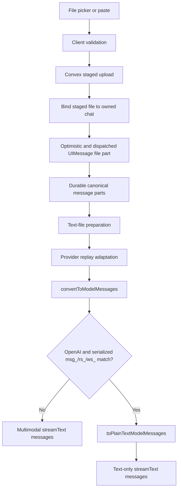

# OpenAI image attachment loss after web-search replay

> Resolved on 2026-08-01: model-bound replay now projects historical
> provider-executed activity before validation and fails closed if the projected
> history violates the target registry. The plaintext fallback described below
> was removed, so supported files, images, text, and citations are preserved.
> The remainder of this document is retained as historical investigation
> evidence.
>
> Review addendum (2026-08-01, live-verified): removing the fallback alone
> regressed every same-provider OpenAI follow-up turn — history text/reasoning
> parts persist `providerMetadata.openai.itemId` (msg_/rs_), which the
> Responses serializer turns into server-side `item_reference` lookups under
> the default `store: true`, and the API 400s (`invalid_value` on `input`).
> The completing fix lives in the OpenAI history adapter
> (`app/api/chat/adapters/openai.ts`): strip BOTH `providerMetadata` and
> `callProviderMetadata` from every history part so OpenAI replay is always
> self-contained. Regression coverage:
> `app/api/chat/provider-request-replay-matrix.test.ts` ("replays
> same-provider OpenAI text/reasoning history as content, never
> item_reference lookups").

| Field | Value |
| --- | --- |
| Investigation date | 2026-07-15 |
| Repository | `not-a-wrapper` |
| Branch | `darknight/park-row` |
| Commit inspected | `b718601b6b2c1a2aa3cd2b9218958f6a59f542e7` (`Remove dormant Composer controls`) |
| Worktree state | Dirty before investigation; all pre-existing changes were treated as user-owned |
| Status | Failure mechanism confirmed by current source and a redacted focused runtime probe |
| Runtime change | None. This report and one inline TODO are the only requested changes |
| Live provider control | Not completed: the running local app opened as an unauthenticated guest, where uploads and GPT-5.5 are unavailable |

## Evidence labels

- **Verified** means directly observed in the current source, installed package source/types, a focused runtime probe, or focused tests.
- **Strong inference** means the conclusion follows from verified boundaries but was not observed in a live OpenAI request during this investigation.
- **Unresolved** means the current evidence cannot distinguish the remaining possibilities.

## Scope

This investigation traces how an authenticated image attachment becomes a UI message, durable history, an AI SDK `ModelMessage`, and finally a `streamText` request. It focuses on the reported sequence: an OpenAI web-search turn followed by a GPT-5.5 vision turn.

No runtime fix, dependency change, schema change, test change, logging change, provider request, database mutation, commit, push, or pull request was made. The only code annotation added is the requested TODO at the confirmed fallback chokepoint.

## Executive summary

The initial hypothesis is **confirmed and refined**.

The image is uploaded, bound to the chat, stored as a canonical user `file` part, rendered by the UI, preserved by provider adaptation, and converted by AI SDK 7 into a valid model `file` part. The image is lost later, in OpenAI-specific replay hardening:

1. OpenAI Responses web search emits a `web_search_call` item whose ID has a `ws_...` prefix. The installed `@ai-sdk/openai` provider maps that item ID to the UI tool part's `toolCallId`.
2. Both the legacy OpenAI adapter and the replay-compiler path preserve that `toolCallId`. They strip `callProviderMetadata`, but they do not remove or safely reconstruct the `ws_...` identifier.
3. `convertToModelMessages` preserves the latest user's image and also emits the historical tool call/result with the same `ws_...` tool-call ID.
4. `hasProviderLinkedResponseIds` serializes the **entire** converted message array and searches for any `msg_`, `rs_`, or `ws_` token.
5. For `resolvedProvider === "openai"`, a match replaces the whole converted request with `toPlainTextModelMessages(adapterResult.messages)`.
6. That helper retains only `text` UI parts. It removes every image and PDF `file` part, including files on the **latest user message**, before `streamText` receives the messages.

The primary root cause is therefore a combination of:

- incomplete OpenAI replay normalization, which allows a provider-linked `ws_...` identifier to survive as a tool-call ID;
- over-broad identifier detection, which scans serialized content rather than known structural fields and can false-positive on ordinary text; and
- an overly destructive safety fallback, which flattens the entire conversation and erases valid current multimodal input along with unsafe historical replay artifacts.

`HISTORY_REPLAY_COMPILER_V1` does not prevent the failure. The probe reproduced the same image loss with the compiler disabled and enabled.

The UI/model contradiction is expected under this bug: the UI renders the canonical file part, while the server sends a later, derived text-only message array to the model.

## User-visible symptom

After a GPT-5.5 web-search turn, a user attaches an image and asks the model to describe it. The chat row displays the image, but the assistant responds as though no image was provided. Later image turns in the same selected conversation can fail the same way.

## Expected versus actual behavior

| Boundary | Expected | Actual |
| --- | --- | --- |
| Composer | Admit an image only for a model catalogued with vision support | GPT-5.5 has `vision: true`; the picker is enabled |
| Durable message | Store text and image as canonical user parts | The user message retains both parts |
| Provider adaptation | Remove unsafe replay artifacts without changing valid user input | The image survives, but historical `ws_...` survives too |
| AI SDK conversion | Produce user text plus a model file part | It does |
| OpenAI replay hardening | Prevent unsafe provider-linked replay while preserving the current request | It replaces all messages with text-only content |
| `streamText` | Receive the latest user image | It receives only strings after fallback |

## Reproduction and controls

### Reported live reproduction

The supplied sequence is consistent with the confirmed transformation:

1. Start a GPT-5.5 conversation.
2. Complete a provider-native web-search turn.
3. Send an image in a later user turn.
4. The historical search contributes a `ws_...` tool-call ID.
5. The latest image reaches `convertToModelMessages` but is erased by the OpenAI fallback.

This investigation did not have the affected conversation ID, provider trace, or server log, so it cannot prove that the reported individual conversation contained a particular `ws_...` value. The current provider source, repository fixtures, and focused probe establish that this is the normal shape of an OpenAI web-search turn and that this shape deterministically activates the failing branch.

### Fresh-chat control

**Verified by focused runtime transformation:** a fresh GPT-5.5 user message containing text plus an `image/png` file converts to text plus a model `file` part, `hasProviderLinkedResponseIds` returns `false`, and the final message shape remains multimodal.

**Live browser attempt:** the already-running local app at `http://localhost:3000` opened as an unauthenticated guest. The UI stated that login is required to add files and use more models; the selected guest model was GPT-5 Mini. No credentials were supplied, so the investigation did not log in, mutate a chat, upload a file, or make a paid provider request. A live GPT-5.5 control response remains unresolved.

### After-search control

**Verified by focused runtime transformation:** adding a canonical OpenAI `tool-web_search` part with a `ws_...` tool-call ID before the same image message produces:

- an adapted UI history that still contains the image and `ws_...`;
- converted model messages that still contain the image and `ws_...`;
- `hasProviderLinkedResponseIds === true`;
- a fallback and final `streamText.messages` shape containing strings only.

## End-to-end attachment and request flow



### 1. Model capability and picker admission

GPT-5.5 is catalogued as OpenAI, `vision: true`, `tools: true`, and `webSearch: true` in `lib/models/data/openai.ts:3-35`. The Composer derives file-upload availability from `Boolean(selectModelConfig?.vision)` in `app/components/chat-input/composer.tsx:203-240`; the Add-files control is disabled for a model without that capability.

This is a user-interface admission gate. The wire parser validates required top-level fields but does not independently enforce the selected model's vision capability (`lib/chat-messages/chat-turn-contract.ts:82-159`). A crafted caller could still send file parts to a text-only model. That is outside the observed regression, but it means “appropriately gated” is verified for the normal UI path, not as a server-side security invariant.

### 2. Selection, validation, upload, and staged state

`useFilePickerState` deduplicates selected files, checks the daily allowance, validates each file, creates an uploading `PendingAttachment`, and starts the upload (`app/components/chat/use-file-upload.ts:149-239`). Validation checks size, detected MIME type, and safe text fallback rules (`lib/file/validation.ts:1-84`).

`uploadStagedFile` obtains a Convex upload URL, uploads the binary, stores user-owned staged metadata, and returns a same-origin preview URL plus `attachmentId` (`lib/file-handling.ts:85-123`). The pending attachment becomes `ready` with `{name, contentType, url, attachmentId}` (`app/components/chat/use-file-upload.ts:76-145`; `app/components/chat-input/pending-attachment.ts:123-149`).

### 3. Composer handoff and chat binding

The Composer refuses to send while any submitted attachment is not ready, assembles the turn payload, locks the submitted snapshot, and hands it to the turn controller (`app/components/chat-input/composer.tsx:293-324`; `app/components/chat-input/pending-attachment.ts:175-200`).

The controller requires an `attachmentId` for every submitted attachment and calls `attachStagedFiles` before dispatch (`lib/chat-turn/chat-turn-controller.ts:274-291`). Convex validates the complete set before patching any row, verifies user/chat ownership and storage readiness, binds each row to the chat, and returns canonical storage metadata (`convex/files.ts:282-324`).

### 4. Optimistic and dispatched UI message

`convertAttachmentsToFiles` maps attachment metadata to AI SDK file parts with `type`, `filename`, `mediaType`, `url`, and optional `attachmentId` (`lib/ai/message-conversion.ts:6-30`). The controller constructs one optimistic user message from text plus those file parts, renders it immediately, dispatches the same message through AI SDK transport, and persists the same message (`lib/chat-turn/chat-turn-controller.ts:293-333`).

The request body contract carries `UIMessage[]` (`lib/chat-messages/chat-turn-contract.ts:82-85`). The route parser checks that `messages` is an array and that `chatId` and `model` are non-empty; deeper AI SDK validation occurs later (`lib/chat-messages/chat-turn-contract.ts:117-159`; `app/api/chat/chat-turn-runtime.ts:530-535`).

### 5. Durable canonical-history reconstruction

For durable chats, the API runtime extracts the latest user message and sends its parts to `prepareGeneration` (`app/api/chat/durable-turn-runtime.ts:675-720`). Convex writes those exact parts to the durable user message (`convex/chatRuntime.ts:653-679`; `convex/domain/message_branch_writes.ts:344-374`), projects the selected model-history path, and returns it (`convex/chatRuntime.ts:1299-1313`; `convex/domain/message_visibility.ts:119-147`).

The API maps stored messages back to UI messages with `partsMode: "stored"`, so canonical runtime history uses the stored file part rather than rebuilding from display-only legacy fields (`app/api/chat/durable-turn-runtime.ts:219-235`, `745-775`; `lib/chat-messages/ui-message-adapter.ts:50-86`).

### 6. Why the UI can still display the image

The message subscription maps the same durable stored message to a display UI message (`lib/chat-store/messages/provider.tsx:90-96`). Conversation rendering extracts `file` parts as attachments (`app/components/chat/conversation.tsx:49-61`), and `MessageUser` renders image attachments from their URL (`app/components/chat/message-user.tsx:200-237`).

Nothing in the later server replay fallback mutates the durable row or the browser's already-rendered UI message. It only replaces the local `modelMessages` variable used for the provider request. The visible chat and the model input therefore diverge without any rendering defect.

### 7. Text-file preparation

The runtime first validates canonical messages, owner-verifies text attachment references, and calls `prepareTextFilePartsForModelInput` (`app/api/chat/chat-turn-runtime.ts:530-555`; `convex/files.ts:356-395`). That helper converts trusted `text/plain` file parts to bounded prompt text but leaves non-text file parts, including images and PDFs, unchanged (`app/api/chat/text-file-parts.ts:290-450`; `app/api/chat/text-file-parts.test.ts:558-592`).

This ordering matters: a trusted text attachment can survive the later fallback only because it has already become a text part. Images and PDFs are still file parts and are removed.

### 8. Provider replay normalization and adaptation

With `HISTORY_REPLAY_COMPILER_V1` disabled, `adaptHistoryForProvider` calls the provider adapter directly. With it enabled, the path is normalize -> compile -> provider adapter, with a legacy-adapter catch fallback (`app/api/chat/adapters/index.ts:107-163`).

For OpenAI:

- replay normalization copies `part.toolCallId` into the normalized tool exchange (`app/api/chat/replay/normalize.ts:174-235`);
- the OpenAI replay compiler copies that value back to the compiled `tool-web_search` part (`app/api/chat/replay/compilers/openai.ts:65-90`);
- the OpenAI adapter strips `callProviderMetadata` but preserves the part and its `toolCallId` when it considers the reasoning/tool/result block complete (`app/api/chat/adapters/openai.ts:180-355`).

The compiler therefore changes replay structure but does not neutralize an existing `ws_...` ID.

### 9. AI SDK conversion

The route calls `convertToModelMessages(adapterResult.messages, {tools, ignoreIncompleteToolCalls: true})` (`app/api/chat/chat-turn-runtime.ts:687-694`). In installed `ai@7.0.22`, a user UI file becomes a model file with URL data. A provider-executed tool UI part becomes assistant `tool-call` and `tool-result` parts carrying its `toolCallId` (installed source map for `ai/src/ui/convert-to-model-messages.ts`; declaration at `node_modules/ai/dist/index.d.ts:5662-5677`).

The focused probe verified both outputs in the same converted array: latest user `{type: "file", mediaType: "image/png", data: {type: "url"}}` and historical `{type: "tool-call", toolCallId: "ws_<redacted>"}` / `{type: "tool-result", toolCallId: "ws_<redacted>"}`.

### 10. Origin of the `ws_...` ID

The installed OpenAI provider maps a Responses `web_search_call` item's `id` to both the emitted tool call and result `toolCallId` (`node_modules/@ai-sdk/openai/src/responses/openai-responses-language-model.ts:867-885`, `1536-1552`). OpenAI's official web-search example shows the same response shape and `ws_...` prefix.

The repository also contains fixtures with `ws_...` tool-call IDs, but existing adapter tests stop at adaptation. They do not run the route's post-conversion detector and fallback with a later file-bearing user message (`app/api/chat/adapters/__tests__/fixtures.ts:273-339`; `app/api/chat/adapters/__tests__/openai.test.ts:151-176`).

### 11. Detection, fallback, and final request

`hasProviderLinkedResponseIds` runs `JSON.stringify(modelMessages)` and tests the entire serialization with `/\b(?:msg|rs|ws)_[a-zA-Z0-9]+\b/` (`app/api/chat/utils.ts:149-163`). This detects the structural web-search tool-call ID, but it also detects matching text in prompts, assistant text, filenames, URLs, tool input/output, or any other serialized field.

For OpenAI only, a match replaces all converted model messages with `toPlainTextModelMessages(adapterResult.messages)` (`app/api/chat/chat-turn-runtime.ts:696-717`). That helper:

- keeps only system, user, and assistant roles;
- filters every message to parts whose type is exactly `text`;
- joins that text into a string;
- discards files, reasoning, sources, step markers, tool calls/results, data parts, custom parts, and any future non-text part (`app/api/chat/utils.ts:165-195`).

The resulting variable is passed unchanged as `streamText({ messages: modelMessages })` (`app/api/chat/chat-turn-runtime.ts:960-967`). The focused probe captured that final boundary as text-only.

## Focused runtime probe

The probe imported the current repository adapters and utilities, the actual installed `validateUIMessages` and `convertToModelMessages`, and `openai.tools.webSearch`. It used synthetic messages and redacted URLs; it did not read or emit credentials, signed URLs, user prompts, filenames, or attachment contents and made no network request.

### Boundary summary: OpenAI after web search

The same result occurred with the replay compiler off and on.

| Boundary | Redacted shape |
| --- | --- |
| Canonical `UIMessage[]` | `user[text] -> assistant[step-start, reasoning, tool-web_search(ws_*), text] -> user[text, file(image/png)]` |
| Provider-adapted `UIMessage[]` | `user[text] -> assistant[reasoning, tool-web_search(ws_*), text] -> user[text, file(image/png)]` |
| `convertToModelMessages` | `user[text] -> assistant[reasoning, tool-call(ws_*), tool-result(ws_*), text] -> user[text, file(image/png,url)]` |
| `hasProviderLinkedResponseIds` | `true` |
| `toPlainTextModelMessages` | `user[string] -> assistant[string] -> user[string]` |
| Final `streamText.messages` | `user[string] -> assistant[string] -> user[string]` |

### Boundary summary: fresh image control

| Boundary | Redacted shape |
| --- | --- |
| Canonical `UIMessage[]` | `user[text, file(image/png)]` |
| `convertToModelMessages` | `user[text, file(image/png,url)]` |
| `hasProviderLinkedResponseIds` | `false` |
| Final `streamText.messages` | `user[text, file(image/png,url)]` |

### Second image after the failed turn

The probe added an assistant text response after the first image turn and then a second user image. The older `ws_...` remained in canonical history. Conversion contained both image parts, detection returned `true`, and fallback removed both. The defect therefore persists for every later OpenAI request whose selected history still contains the matching identifier.

### False-positive probe

A text-only model message containing the ordinary literal `ws_example123` made `hasProviderLinkedResponseIds` return `true`. This proves the detector is not limited to structural provider linkage.

### Text, image, and PDF probe

The probe prepared a trusted `text/plain` part plus `image/png` and `application/pdf` parts. Before fallback, the prepared UI message contained:

```text
text prompt + derived text attachment content + image file + PDF file
```

After fallback, only the prompt and derived text attachment content remained. The image and PDF were removed. Thus the fallback is destructive to every non-text part, not specifically images.

## Confirmed root cause

### Primary failure mechanism — verified

The immediate cause of the missing image is the assignment:

```ts
modelMessages = toPlainTextModelMessages(adapterResult.messages)
```

after serialized `ws_...` detection. It acts on the entire adapted UI history rather than isolating unsafe historical assistant replay artifacts. Because it is executed after successful SDK conversion, it erases a valid latest-user file that was already ready for provider input.

### Trigger — verified

An earlier OpenAI provider-native web-search turn normally produces a `web_search_call.id` used as `toolCallId`; the official and installed provider shapes use the `ws_...` prefix. That ID survives both current adaptation modes and activates the branch.

### Contributing defect: incomplete replay normalization — verified

The adapters remove `callProviderMetadata` but retain the provider-owned tool-call identifier. The replay compiler likewise retains an existing ID. The replay stage therefore claims to make history safe without fully deciding whether the provider-owned hosted-tool item should be referenced, reconstructed, or flattened to ordinary continuity text.

### Contributing defect: over-broad scan — verified

The detector scans serialized values, not provider-link fields. It has false positives and makes behavior depend on arbitrary text. This is independently incorrect, although narrowing the detector alone would not fix the real structural `ws_...` case.

### Contributing defect: fallback blast radius — verified

The fallback removes non-text parts from every user message, including the current turn. Replay safety concerns arise from historical assistant reasoning/tool artifacts; current owner-validated user files are not part of that pairing problem.

## Scenario matrix

| Scenario | Evidence | Result | Confidence |
| --- | --- | --- | --- |
| GPT-5.5, image in fresh chat | Redacted installed-SDK probe | Image reaches final model-message shape; detector false | Verified transformation; live response unresolved |
| GPT-5.5, image after OpenAI web search | Redacted installed-SDK probe | `ws_...` triggers fallback; latest image absent from final messages | Verified |
| Second image after first failed image turn | Redacted installed-SDK probe | Historical `ws_...` retriggers fallback; old and new images removed | Verified |
| OpenAI, replay compiler disabled | Probe through legacy adapter | Failure reproduced | Verified |
| OpenAI, replay compiler enabled | Probe through normalize/compile/adapter | Failure reproduced | Verified |
| Anthropic vision target after OpenAI search | Cross-provider adapter/conversion probe | Search replay becomes safe continuity content; image remains; OpenAI fallback gate is not applicable | Verified at transformation boundary; live provider response unresolved |
| Google vision target after OpenAI search | Cross-provider adapter/conversion probe | Image remains; a `ws_...` may remain converted, but runtime fallback is OpenAI-only | Verified at transformation boundary; provider-wire acceptance unresolved |
| Text-only model selected in UI | Source trace | Add-files control is disabled because `vision` is false/absent | Verified normal UI admission |
| Crafted text-only-model request with file parts | Source trace | No equivalent server capability gate was located | Unresolved provider outcome; separate hardening opportunity |
| Trusted text attachment through fallback | Text-file and fallback probe | Survives as derived text | Verified |
| Image attachment through fallback | Fallback probe | Removed | Verified |
| PDF/file attachment through fallback | Fallback probe | Removed | Verified |
| Ordinary text containing `ws_example123` | Detector probe | False-positive fallback trigger for OpenAI | Verified |

## Affected surface

### Models

The bug is not specific to GPT-5.5's vision implementation. GPT-5.5 is the reported model and is confirmed to support image input, but any OpenAI-routed model receiving non-text user content can be affected when selected history causes the detector to match.

### Providers

The destructive fallback is explicitly gated to `resolvedProvider === "openai"`. It is not executed for Anthropic, Google, xAI, Mistral, OpenRouter, or other provider IDs. Those providers have their own replay-adapter risks, but they do not traverse this exact branch.

OpenRouter models whose underlying vendor is OpenAI are still routed with `resolvedProvider === "openrouter"`, so this exact runtime gate does not apply. Their replay behavior should be covered separately before generalizing an OpenAI fix to OpenAI-compatible transports.

### Message types

- **Removed:** image/PDF/other file parts, reasoning, sources, tool parts, data parts, custom parts, step markers, tool-role messages.
- **Retained:** text UI parts on system/user/assistant messages.
- **Conditionally retained:** trusted `text/plain` attachments, because the earlier preparation stage has already converted them into text.
- **Scope:** historical and latest user messages are both flattened.

### Conversation sequences

Any selected OpenAI conversation history that serializes a matching `msg_...`, `rs_...`, or `ws_...` token can trigger the fallback on every later turn. Web search is a direct, normal producer of `ws_...`; ordinary user or assistant text can also false-positive.

## Existing coverage and the missing regression

Existing tests establish many individual seams:

- Composer and controller tests verify attachment handoff and optimistic file parts.
- Convex file tests verify ownership, staged binding, and trusted text-file lookup.
- durable UI-message adapter tests verify exact stored-part preservation.
- text-file tests verify images/PDFs are unchanged while trusted text files become text.
- replay and adapter suites exercise OpenAI web-search shapes and provider metadata stripping.
- utility tests verify identifier detection and plain-text conversion independently.
- the real-AI-SDK seam suite verifies the runtime can drive `streamText` callbacks.

What is missing is the composition that matters:

```text
OpenAI web-search history with ws_* toolCallId
  + later user image file part
  + provider adaptation (compiler off and on)
  + convertToModelMessages
  + post-conversion fallback
  + captured streamText.messages
```

`app/api/chat/utils.test.ts:106-147` currently confirms detection and text flattening separately, but never asserts that a file must survive. Adapter tests assert that tool parts are preserved or metadata is stripped, but do not pass their output through the route fallback. `app/api/chat/chat-turn-runtime.test.ts` mocks `convertToModelMessages` to return `[]`, so it cannot expose this interaction.

The focused existing suites run during this investigation passed: 6 files, 66 tests.

## Security and privacy considerations

1. **Do not log messages or serialized detector input.** Model messages can contain prompts, tool input/output, filenames, signed storage URLs, provider metadata, and file contents.
2. **Preserve only already-admitted user files.** A multimodal fallback should operate after canonical validation and retain only file parts from authenticated, owner-bound durable messages. It must not make arbitrary client URLs newly trusted.
3. **Keep text-file trust checks.** Text content should continue to be fetched only from the owner-verified Convex attachment set with byte, count, and time limits.
4. **Do not expose provider identifiers.** Telemetry needs only a boolean/category such as `provider_linked_id_detected_structurally`, never the identifier value.
5. **Avoid URL-bearing snapshots.** Probe and test diagnostics should summarize role/part type/media-type and URL/reference kind, replacing actual URLs and names with redacted markers.
6. **Provider transmission is separate from UI access.** Preserving a file in model input sends its URL/content to the selected provider as intended. A fix must not expand that transmission to files that were display-only or not part of the selected canonical path.

## Ranked remediation options

The ranking evaluates the required options against the confirmed mechanism. Options 6 and 7 are required companions, not substitutes for a correctness fix.

| Rank | Option | Correctness | Provider compatibility and replay safety | Security | Complexity | Regression risk |
| --- | --- | --- | --- | --- | --- | --- |
| 1 | **Provider-aware reconstruction of safe text and user file content (option 5), with an invariant that the latest user message is preserved (option 4)** | Directly removes unsafe assistant replay artifacts while retaining current and historical valid user multimodal input | Can be scoped to OpenAI Responses semantics; avoids inventing provider item references | Can reuse canonical validation and owner-bound files; must never accept new URLs | Medium | Medium, controlled by a boundary-focused matrix |
| 2 | **Normalize hosted-tool replay before model conversion (option 1)** | Removes the trigger at its source if OpenAI web-search exchanges are deliberately downgraded to continuity text or reconstructed with complete safe semantics | Strong when provider-specific; dangerous if it merely renames IDs while leaving provider-executed tool results that become invalid references | Good if outputs are minimized to bounded continuity text | Medium-high | Medium-high because tool/reasoning replay behavior changes |
| 3 | **Make the fallback preserve valid user file parts and flatten only unsafe assistant reasoning/tool artifacts (option 3)** | Fixes the observed image/PDF loss even when normalization misses a case | OpenAI-only fallback can preserve supported user files without replaying provider artifacts | Requires explicit role and canonical-file checks | Medium | Low-medium; smallest complete repair at current chokepoint |
| 4 | **Latest-user-message exception (option 4) as a standalone guard** | Guarantees the current image is not erased and fixes the reported turn | Does not solve historical multimodal follow-ups or unsafe replay normalization | Narrowly preserves already-validated current files | Low | Low, but leaves architectural debt |
| 5 | **Narrow detection to structural provider-linked fields (option 2)** | Eliminates text/filename/URL false positives | Still detects the genuine structural `ws_...` case, so the destructive fallback would continue without another fix | Reduces accidental behavior based on user content | Low-medium | Low; necessary defense-in-depth, not sufficient |
| 6 | **Regression tests for search -> vision (option 6)** | Prevents recurrence and proves both compiler modes, latest/history files, and false positives | Provider-specific fixtures plus one runtime seam test give good coverage without live API dependence | Synthetic/redacted fixtures avoid secrets | Low-medium | Very low |
| 7 | **Safe part-count telemetry (option 7)** | Detects future part loss but does not fix it | Provider-agnostic summaries can compare canonical/adapted/converted/final boundaries | Safe only if values, names, URLs, prompts, and IDs are never logged | Low | Low if cardinality is bounded |

### Option-specific cautions

#### 1. Normalize or remove provider-linked identifiers before conversion

Blindly changing `ws_...` to a local ID is not enough. The installed OpenAI provider treats provider-executed tool results specially and can turn their ID into an item reference. A synthetic or stripped ID can therefore trade the current fallback for an invalid-reference error. The replay compiler must decide the semantics of the entire hosted-tool exchange, not only mutate a string.

The safe variant is to convert historical hosted web-search output to bounded text continuity when complete provider replay cannot be proven, or to reconstruct the exact OpenAI item set with structural metadata the provider supports.

#### 2. Structural detection

Inspect only fields that can actually carry provider linkage, such as OpenAI `providerOptions.*.itemId`, reasoning item IDs, and hosted-tool item IDs. Do not inspect arbitrary message text or URLs. The detector should return a category/count, not the ID.

Structural detection improves correctness and observability but must be paired with a non-destructive response to a true match.

#### 3. File-preserving fallback

A replacement for `toPlainTextModelMessages` can safely keep:

- user text parts;
- user image/PDF file parts that already passed canonical validation;
- previously derived trusted text-file prompt text;
- assistant visible text continuity.

It should drop assistant reasoning, source, tool, custom, data, and provider metadata unless a provider-aware reconstruction explicitly supports them. This aligns the fallback's blast radius with the actual replay risk.

#### 4. Latest-user exception

At minimum, build the latest user model message from the already-converted output and append/replace it after flattening historical content. This creates a critical invariant: historical replay hardening may reduce history fidelity, but it cannot erase new user input.

This is a valuable safety belt even after a deeper reconstruction exists. Alone, it does not support “compare this second image with the first” because historical images remain absent.

#### 5. Provider-aware safe reconstruction

This is the most maintainable end state. It gives each role/part type an explicit policy and can be tested as a pure boundary:

- user text/file -> preserve;
- assistant visible text -> preserve;
- provider-linked reasoning/tool replay -> reconstruct only when complete and supported, otherwise downgrade/drop;
- sources/data/custom -> include only through an explicit provider policy;
- tool role -> include only with a complete replayable pair.

It is preferred over a global “plain text” escape hatch because it preserves product capabilities unrelated to the unsafe artifact.

#### 6. Regression coverage

Add, during implementation:

1. pure tests for structural detector false positives;
2. fallback-policy tests for text, image, PDF, data, reasoning, sources, and tools;
3. adapter+compiler matrix tests with `ws_...` and compiler off/on;
4. one `chat-turn-runtime` seam test that captures the exact `messages` passed to injected `streamText`;
5. fresh-image and second-image controls;
6. at least one non-OpenAI vision provider and one text-only UI-admission test.

#### 7. Safe telemetry

Emit bounded numeric summaries only, for example:

```text
provider
model family or allowlisted model ID
compiler enabled
fallback/reconstruction mode
message count before/after
part counts by coarse type before/after
latest-user file count before/after
historical-user file count before/after
provider-linked structural category count
```

Never emit message objects, text, tool payloads, IDs, filenames, MIME parameters, URLs, attachment IDs, or provider payloads.

## Recommended fix

Implement a provider-aware OpenAI replay-safe reconstruction at the current chokepoint, with a hard latest-user preservation invariant, then move the same policy earlier into replay compilation once its semantics are covered.

Concretely, the future change should:

1. Replace `toPlainTextModelMessages(adapterResult.messages)` with an OpenAI-specific safe reconstruction that preserves canonical user text and supported file parts, preserves assistant visible text, and drops or safely downgrades unsafe assistant reasoning/tool replay.
2. Preserve the latest converted user message verbatim (after validation/text-file preparation) as an invariant, even if historical reconstruction degrades.
3. Change provider-linked detection from serialized regex scanning to structural inspection and return reason categories.
4. Teach OpenAI replay normalization/compiler policy that a provider-executed web-search exchange without provably complete replay metadata should become bounded continuity text rather than a half-normalized hosted-tool item.
5. Add the regression and telemetry coverage described above.

This is preferred over identifier stripping alone because rekeying a hosted-tool exchange can create invalid provider item references. It is preferred over a latest-message exception alone because users may refer to earlier images or PDFs. It is preferred over keeping the global plain-text fallback because replay safety should not silently erase valid user input.

## Future validation plan

### Automated

1. Run the exact boundary matrix with compiler disabled and enabled.
2. Assert that no unsafe provider-linked assistant artifact reaches the OpenAI provider input after reconstruction.
3. Assert that latest and historical user image/PDF files remain when supported.
4. Assert that trusted text files remain bounded derived text and forged text URLs remain rejected.
5. Assert ordinary text containing `msg_`, `rs_`, or `ws_` does not change behavior.
6. Capture injected `streamText.messages` in a route-runtime test rather than testing helpers only.
7. Run existing adapter, replay, text-file, controller, and real-AI-SDK seam suites.

### Live smoke tests

Using a dedicated test chat, non-sensitive fixture images, and a test provider account:

1. GPT-5.5 fresh image -> model correctly describes a unique synthetic feature.
2. GPT-5.5 web search -> image -> same description succeeds.
3. Send a second distinct image -> model distinguishes it from the first.
4. Repeat with replay compiler off and on.
5. Repeat with one Anthropic or Google vision model.
6. Verify a text-only model cannot admit the attachment through the normal UI and decide separately whether the API must reject crafted file parts.
7. Inspect safe telemetry counts and confirm no content/URL/ID is emitted.

### Negative replay tests

1. Incomplete OpenAI reasoning/tool pairs still cannot cause a provider pairing error.
2. Cross-provider historical tool output is downgraded safely.
3. Provider item IDs in structural metadata do not leak or become arbitrary references.
4. A file-bearing latest message is never removed by any history fallback.

## Observability recommendations

The current `replay_plaintext_fallback_activated` event reports activation but not whether user capabilities were lost. Add a safe, bounded summary around adaptation, conversion, and final reconstruction:

- coarse part counts by role and part class;
- latest-user and historical-user file counts before/after;
- whether a structural provider-linked artifact was detected and its category;
- which reconstruction policy ran;
- compiler enabled state;
- whether the latest-user preservation invariant passed.

If `latest_user_file_count_before > 0` and `latest_user_file_count_after === 0`, capture a high-severity correctness signal without any message or attachment values. The request should fail closed or use the latest-user preservation path rather than silently call the model without the file.

## Residual risks and unresolved questions

1. **Affected live conversation evidence:** no affected chat/run ID or server log was available, so the exact historical part responsible in the reported conversation was not inspected.
2. **Live GPT-5.5 response:** the local browser was unauthenticated; no end-to-end provider response control or reproduction was made.
3. **Original safety failure:** the comments say the fallback prevents Responses pairing invariant failures, but this investigation did not recover the original failing provider payload or prove which `msg_`, `rs_`, or `ws_` structures are safe to replay. A fix must retain negative pairing tests.
4. **Historical hosted web-search replay:** it remains to be decided whether same-provider stored `ws_...` items should be referenced, reconstructed, or always downgraded to text. That decision depends on OpenAI store/conversation semantics and must be tested against the installed provider behavior.
5. **Google cross-provider replay:** the transformation probe preserved a `ws_...` tool ID for Google without invoking the OpenAI-only fallback. No live Google request was made to prove provider-wire acceptance.
6. **Server capability gate:** the normal UI gates attachments on `vision`, but no server-side selected-model/file compatibility rejection was located.
7. **Signed URL lifetime:** current canonical file URLs must remain fetchable by the provider for the duration of the request. This investigation did not test URL expiry behavior because the failing probe used redacted synthetic URLs and stopped before network I/O.

## Installed versions and primary references

### Repository versions

| Package | Declared | Locked/installed |
| --- | --- | --- |
| `ai` | `^7.0.22` | `7.0.22` |
| `@ai-sdk/openai` | `^4.0.11` | `4.0.11` |
| `@ai-sdk/provider` | `^4.0.3` | `4.0.3` |
| `@ai-sdk/provider-utils` | `^5.0.7` | `5.0.7` |
| `@ai-sdk/react` | `^4.0.23` | `4.0.23` |

Evidence: `package.json:30-52`, `bun.lock:95-118`, `bun.lock:852`, and installed package manifests/types/source.

### Official sources

- [AI SDK `convertToModelMessages`](https://ai-sdk.dev/docs/reference/ai-sdk-ui/convert-to-model-messages) — UI-to-model conversion boundary and multimodal support.
- [AI SDK OpenAI provider](https://ai-sdk.dev/providers/ai-sdk-providers/openai) — Responses API default and `openai.tools.webSearch`.
- [OpenAI GPT-5.5 model](https://developers.openai.com/api/docs/models/gpt-5.5) — text/image input and web-search support.
- [OpenAI images and vision](https://developers.openai.com/api/docs/guides/images-vision) — URL, data URL, and file-ID image inputs.
- [OpenAI web search](https://developers.openai.com/api/docs/guides/tools-web-search) — `web_search_call` response item and `ws_...` identifier shape.

## Investigation validation performed

- Redacted runtime transformation probe across canonical, adapted, converted, detector, fallback, and final message boundaries.
- Fresh-image control and after-search reproduction with compiler disabled and enabled.
- Second-image, Anthropic, Google, false-positive, and text/image/PDF probes.
- Focused existing tests: `app/api/chat/utils.test.ts`, OpenAI adapter tests, replay normalization/matrix tests, text-file tests, and Chat turn controller tests.
- Result: 6 test files passed; 66 tests passed.
- No live provider request, secret access, database mutation, file upload, or user-content logging.
